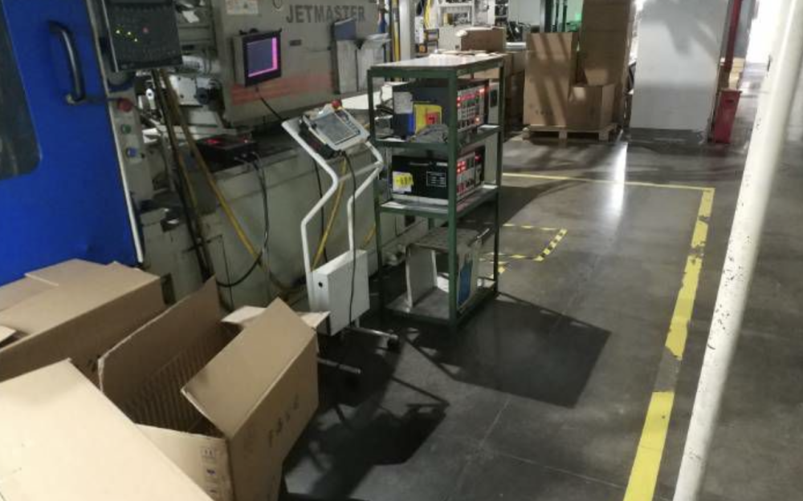

# 国考在即！35岁打工人回忆考公上岸史：有房贷没存款，一年考8次

本文来源：时代财经 作者：王莹岭

国考明天开考。

根据工作安排，经研究，中央机关及其直属机构2023年度考试录用公务员笔试定于2023年1月7日、8日举行。12月16日，#国考重启#话题曾迅速登上微博热搜第一，当天阅读次数达6.6亿，讨论次数6.8万。

11月28日，国家公务员局发布公告，根据当前新冠肺炎疫情情况和防控工作需要，原计划于12月3日、4日举行的中央机关及其直属机构2023年度考试录用公务员笔试延期举行。

今年本就是一次“拥挤”的国考，总报名人数突破250万人，比去年增加了50万人，再创历史新高。而招聘人数仅3.71万人，平均录取比例达70∶1，最热岗位报录比甚至达5872:1。

有人欢喜有人忧，但对于年龄逼近35岁的“大龄”考生来说，更是难上加难。

35岁，一直是一个无法言说的年龄，似乎人一旦到了这个年龄就失去了更多的选择权。职场上如此，考公亦是如此。

35岁是大多数地区报考年龄的最上限，对临近这道关卡的人来说，他们的每一次出击，或许都是拼尽全力的“孤注一掷”、负重前行。

对于33岁的职场“宝妈”张伊来说，如果到了35岁她还没能“上岸”，她渴望的稳定工作、改善生活的可能、对孩子高质量的陪伴将永远对她关上大门；杨文宇34岁时才决定考公，面对最后的机会，即使背着房贷，他也选择“破釜沉舟”从电子厂辞职备考……所幸他们最终都“上岸”了。

以下是他们的故事。

_图片来源：图虫创意_

为了考编，她成为“藏起来”的妈妈

今年，33岁的张伊终于考编上岸。

2018年，28岁的张伊开始同时准备考公务员和事业编。在这条长达5年的战线里，她经历了辞职、再就业、结婚、生子、哺乳，如今孩子已快满两岁。如果不是这次上岸，她给自己划定的终点是35岁，“直到我不能考了，才会放弃”。

35岁，似乎是职场人心里的一道分水岭。对于张伊而言，35岁是一道更严格的门槛，如果到了35岁她还没能“上岸”，她渴望的稳定工作、改善生活的可能、对孩子高质量的陪伴将永远对她关上大门。

2013年大学毕业后，张伊进入重庆当地的一家区级媒体工作，成为一名记者，工作内容丰富多彩，薪水一个月六七千。2018年，她所在的媒体面临改革改版，薪资福利骤降，最低的时候只有两三千，“我和几个公务员朋友聊天，她们的工资都在一万以上，差距太大了。”于是，她决定辞职备考公务员。

张伊是“月光族”，工作5年时间几乎没存下钱，辞职备考期间，她以“啃老”为经济来源。父母每月给她两三千作为她的生活费、报班、买资料的费用，“我心理压力很大，别人28岁时都开始反哺父母了，而我还在伸手要钱。”

扛不住心理上的愧疚感，脱产备考一年半后，2019年7月，张伊找了份事业单位的“劳务派遣”工作，决定边工作边备考。新单位里，除了她，其他人都是在编人员，“大家做着一样的工作，但是他们的工资却比我高3倍”，这更坚定了张伊考公、考编的心，她白天认真工作，晚上下班回家后就开始看书备考。

然而结婚生子却打乱了她的步调。

2019年9月张伊结婚，次年5月怀孕。怀孕三个月后，随之而来的是妊娠剧吐，“连喝一口水我都会狂吐不止，吐到只剩苦胆，经常都只能躺在床上下不来，吃不下东西只能到医院去输营养液，根本没有精力备考。”

2021年2月，张伊的女儿出生，老公在异地工作。作为“新手妈妈”，张伊忙得焦头烂额，“我本来以为休产假能轻松一点，但实际上太累了，喂奶、带小孩太繁琐，我一天连两三个小时都睡不够，备考的书更是一个字都没看。”

三个月后，张伊结束产假开始上班，也开始了每天“背奶”的生活。为了孩子，她的“奶包”里面总是放着两块又重又大的冰块，一米六的她背起来十分吃力。直到2021年12月断奶，张伊的备考生活才算开始。

但面对家庭和需要陪伴的女儿，张伊觉得自己是自私的。

“我女儿属于高需求的孩子，只要她看到你在，一定会让你陪她，不然就会哭。晚上11点能走出她的房间，都算是幸运的。”往往要到了夜深人静，张伊才感觉时间是属于自己的，她会从12点学习到凌晨两点，而第二天清晨6点她又得继续起床、上班。

周末对于张伊来说则是更难得的完整学习时间，为了保证学习质量，她不得不选择“藏起来”，不被女儿发现，“一旦她知道我在家里，她‘撞破脑袋’也会来找我陪她玩。”

周六早晨，外婆先把孩子抱到阳台上，张伊就收拾好学习资料，趁机离开自己睡觉的卧室，到另一个女儿不常进的房间，把门关好开始学习，“有时我想上厕所，我妈妈也是把孩子抱到阳台上去，或者带出去玩，我才能出房间。”中午，张伊会在女儿面前短暂“现身”。

“躲”一天下来，张伊能保证七个小时的学习时间。“有时女儿很聪明，她能感觉到我在家，会拍门来找我，而我就躲在房间里大气都不敢出。”也有实在“瞒不住”的时候，外婆会给张伊发微信，她便把桌上的东西都收拾干净，自己躲在窗帘后面，外婆再打开房门给孩子看：“妈妈真的不在”，孩子这才罢休。

这样的“躲藏游戏”虽是不得已，对张伊来说却是极大的煎熬。“有时候好心疼我女儿，其他孩子都有妈妈陪，她却没有。有时候我也会抽出半天时间来陪她，但是陪她的时候，我一直感觉心里面有块大石头。”

为了考试，张伊让自己藏在房间里，更是把自己对“母职”的期待和要求给暂时隐匿了。

多年来，考公考编就是张伊心中的“大石头”，无论做什么事，都似乎绕不开它。“这些年，我只能围着考试转，很多事情都停滞不前，所以我都差点抑郁了。”张伊说，她想好好健身，也想深造、考研，更想给孩子像样的启蒙教育、高质量的陪伴，但是都分不出精力，“包括想烫个头发、简单打扮一下自己，我都做不到。”

成年人的生活不可能是“单线程任务”，张伊感觉力不从心，年纪一年比一年长，她感到自己的记忆力、反应力都在渐渐衰退，精力也跟不上了，脱发、胃疼，身体问题接踵而至，“很多次我都差点放弃考试了。”

但张伊更怕放弃后会后悔，“我很怕到时候时代再淘汰我，如果我现在不累一点，将来会以10倍的压力再返还给我，让我更累，所以我必须要往前面冲。”

不管是公务员还是事业编，只要遇到考试机会，张伊就会报名，仅今年就考了8次事业编考试，终于在9月的一次事业编笔试中以第七名的成绩进入了面试。

张伊报考的岗位共招3人，有9个人进入面试，她是倒数第二，忐忑不已。利用国庆七天假期，张伊斥资万元报了个7天的线下面试培训班，每天早上8点上课，直到晚上10点才回家，哄孩子入睡后，她又自己对着镜子练到凌晨3点。最后，她以面试第一的成绩“逆袭”上岸，终于给长达五年的考编生涯画上了句号。

“知道考上那一刻，我开心了几秒，然后就大哭了一场，觉得自己这么多年实在是太苦了，居然坚持下来了。”张伊说，她的心情很复杂，心里的“大石头”终于落地了，自己紧绷多年的“弦”，也终于可以放松下来。

有人问张伊，这个年纪考上事业编，意味着已经快35岁了，在单位却还是个“新人”，或许其他人这个年纪时已经早就站稳脚跟了，会不会有落差？

张伊说，“我只是求稳，如果有年轻人是我的领导，我也不会觉得有什么。刚毕业的时候，我意气风发，幻想着能在事业上有一番作为，有了娃以后只想陪着她好好成长，其他别无所求了。”

35岁的他搭上“末班车”

和张伊不同，杨文宇直到34岁才决定考公，面对仅剩的几次考试机会，他的每一次尝试都是“孤注一掷”。去年，35岁的他搭上“末班车”，上岸重庆市的公务员。

在考公前，杨文宇是工厂车间的工艺工程师，在电子厂工作了近10年。一直以来，家里人都希望他能像叔叔一样进入体制内，但杨文宇自己有些“倔强”，对公务员并不感兴趣。

2020年，杨文宇感到考公热潮空前地高涨，34岁的他觉得“最后的机会”再不抓住恐怕就没有了，“马上就35岁了，觉得我还是要完成之前别人对我的期待，向他们证明一下，我还是可以的。”

之所以想靠考公来“证明自己”，杨文宇说，他只是一个普通的工程师，在职场上没有太多可以发挥的空间，因此想通过考公，换一条赛道。

2020年7月和8月，他分别报了两次省考，一次四川，一次重庆。因为是机械工程类专业，他只能报考“三不限”的岗位，但这类岗位往往报考人数多、竞争大，也发挥不出自己的专业优势。最终，杨文宇以笔试第三和第十的成绩进入了面试。

8月份，杨文宇选择“背水一战”，辞职离开了电子厂，“我觉得以自己的表达能力，好歹应该能进一个，就辞掉了工作。现在想起来还是有点过于‘自信’了，毕竟34岁了，再找工作也不太好找，还背着2000元一个月的房贷。”

造化弄人，四川省考的岗位招一个人，杨文宇总分第二，而重庆省考的岗位招六个人，杨文宇第八。第一次考公，以惜败告终，直到当年12月，杨文宇都没能找到工作，“4个月没有工作，家里人也很不理解我，我的压力非常大。”

在2020年的最后一个月，杨文宇进入了一家注塑工厂工作。这家工厂开在较为偏远的县城，杨文宇不得不离开家，“宿舍又窄又昏暗，我实在忍受不了，就在旁边的农村租了一个房子，一个月300块。”

杨文宇的工作是主要是控制流水线的效率和成本，“要观察流水线的流程有没有出现问题，看流水线怎么架设合理？看怎么提升工人的效率？总之要从各个方面去减少成本。上班的时候基本要满载运转，中间没有什么休息时间”

_杨文宇曾经的工作环境（受访者供图）_

每天早上，工厂8:00开工，杨文宇7:40就要到工厂，“早上起来有一段路要走二十分钟，我会边走边看题，能看个400道题。”午休的30分钟、上厕所的10分钟、甚至注塑机正在调试启动的几分钟，都是杨文宇见缝插针的学习时间，“下班后如果不加班，我会花最快的时间回到我住的地方，点个外卖，然后就开始做题，从8点做到晚上1点。”

2021年2月份，迎来新年，杨文宇回忆，过年的时候他都“卷”在备考里，“初一到初七，我有四天都在用App刷题。”3月27日考试前，杨文宇把粉笔和华图两个App上的2万题和3万题全部刷完，还把近年的所有申论真题全部做过了一遍。

这一次，杨文宇以笔试第一的成绩进入面试，“哪怕这次分很高，但还是觉得已经是最后的机会了，要确保万无一失。”

杨文宇再次辞职，“这次我又‘破釜沉舟’了，而这次是35岁，没有工作、没有存款、有的只有房贷。”走到这一步，杨文宇知道自己已经没有了退路。

35岁的他，面对最后一次机会，只能硬着头皮走下去。他找到自己的同学借了2万块，花了一万多，报名了为期10天的面试培训班。

杨文宇始终认为，到了这个年纪，考的还是“三不限”岗位，考公对他来说就是一场“努力”的比拼，他不断告诉自己：“对于你想得到的东西，你有多想得到它？你愿意拿什么去换？”5月15日，面试如期而至，杨文宇终于以面试第二、总分第一的成绩“上岸”。

但“上岸”似乎没有想象中开心，“很多人说考上乡镇公务员只有考上的第一天是开心的，我考上的是区直属公务员，但也只在回到家之前是高兴的。”回家后，杨文宇的“成功上岸”似乎没有得到妻子相应的鼓励和认可，他感到有些失望。

现在，入职一年多，这份工作本身带给杨文宇的感受，正在慢慢抹平当初的失望，“排除‘别人的认可’这些因素的话，现在的收入和工作内容都比之前都有所改善，我还是很满足的，毕竟这也是我花了那么多心血，才得到的结果。”

（应采访对象要求，文中张伊、杨文宇为化名）

