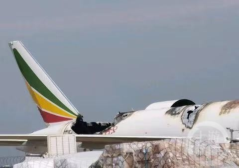
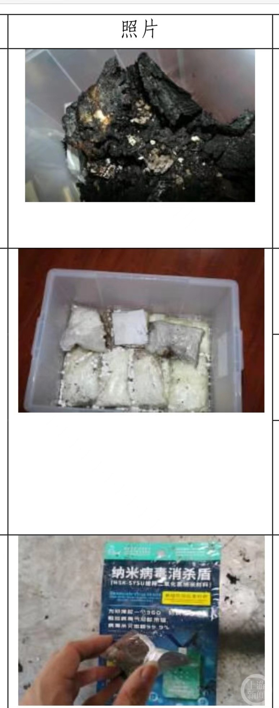
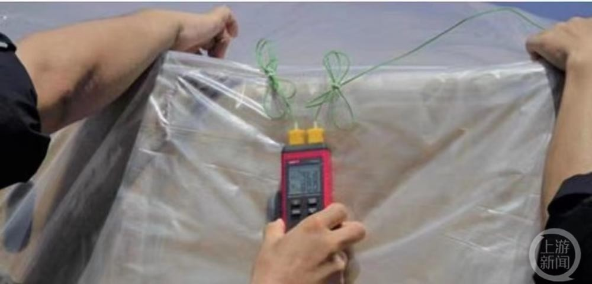

# 埃塞航旗下波音货机浦东机场起火报废原因查明：货主瞒报托运的消毒片自燃

2020年7月22日，埃塞俄比亚航空公司（以下简称埃塞航）一架执行国际货运航班的波音777全货机，在上海浦东机场306号机位完成货物装载、机门关闭等待离港时，货机机组发现货舱出现火警，主货舱出现了可见烟雾并出现明火，随后机组在地面宣布了航空器最高遇险信号“MAYDAY”。经过近三小时的扑救，这架编号为ET-
ARH的波音777F全货机明火才被扑灭，相关消息在当天成为各大媒体关注焦点。

_▲埃塞航飞机机身严重受损。
图片来源/受访者供图_

**价值23亿元的飞机起飞前起火**

美国波音公司推出的777-200机型是波音777家族中第一个机型，首架机在1990年发布。埃塞俄比亚航空这架B777-200LR是波音777-200的远程机型，2006年投入使用时是当时世界上航程最长的客机，航程达到了17500多公里，能够连续飞行18小时。按照阿联酋航空与波音公司近年一笔订单的价格计算，单架波音777-200LR货机的价格为3.4亿美元，约合人民币23亿元。

2020年7月22日，埃塞航公司的波音B777-200LR全货机ET-
ARH在执行了比利时布鲁塞尔至上海浦东的货运航班后，停靠在浦东机场306号机位。飞机在过站短停期间，完成卸货及装货工作并更换了5名机组人员后，准备执行下一段ET3739航班从上海浦东经重庆飞往埃塞俄比亚首都亚的斯亚贝巴，航班预计将在北京时间当天14点30分起飞。因为货物装载的关系，ET3739航班在当天15点左右才完成装机并关闭货舱门，飞机上装载了从全国各地汇集而来的货物69.3吨，准备通过这架飞机运往非洲、南美洲等地，货物在装载过程中没有出现异常。

当天15点14分04秒，险情开始出现，ET3739机组用英文向浦东机场放行频率报告了飞机主货舱出现了火警，需要消防车辆。5分钟后的15点19分，机组再次联系了地面管制，催促消防车尽速到来。15点21分32秒，埃塞航ET3739航班机组在浦东机场地面发出了民用航空器遇险的最高等级呼救信号“MAYDAY”，称飞机出现起火需要消防救援。15点25分，浦东机场消防车到达306机位，但消防报告现场未发现冒烟和明火。飞机左前登机门和货舱门随后相继被打开，机组也陆续撤离飞机，15点35分飞机主货舱出现明火，现场的消防车开始出水灭火。

埃塞航此次货机起火救援中，不仅浦东机场消防参与了灭火救援工作，上海市消防救援总队接警后先后调派总队、浦东支队全勤指挥部以及川沙、祝桥、申江、川展、金桥、龙阳等20个消防站，各类作战、指挥、通信等执勤车辆38辆、200余名消防指战员应援处置。三小时后的18点14分，现场火情才得到控制。

上游新闻记者注意到，整个救援期间，繁忙的上海浦东机场在16点40分宣布关闭，近两个小时后的18点30分才全部恢复运行，事件造成本场16个进港航班备降，34个航班延误。

_▲燃烧中的埃塞航货机。
图片来源/央视新闻_

**飞机故障锂电池起火等原因被排除**

现场应急处置结束以后，埃塞航货机起火事件随即转入了事故调查阶段。根据中国民航局的授权，民航华东局等负责了此事的具体调查。调查组现场勘查发现，飞机过火区域仅限于埃塞航B777-200LR/ET-
ARH号机，机身上半部多处烧穿，主货舱内部严重烧损。下半部机身主体结构及设备有过烟情况，虽外观保持完好，但可能存在热损伤。飞机外侧机翼区域、发动机区域、起落架区域等机身部位均未见明显过火、过烟痕迹。

调查中，调查组首先对起火的波音777-200LR全货机ET-
ARH进行了调查，截至事发时这架2014年9月出厂的货机，共完成了4286次飞行起落，总飞行时间为26740小时，航班起飞前埃塞航的随机机务人员完成了飞机的短停检查，结果正常没有保留故障，飞机事发前约一个月完成的定期检查均正常。事发当天浦东机场现场视频监控显示，从主货舱报火警至主货舱门开启有浓烟冒出期间，机身相关部件没有烟雾溢出。机组人员也反映，除烟雾报警外未发现有其它警告或故障信息，飞机自身故障引发自燃的怀疑被排除。

上游新闻记者注意到，近年来国内外曾发生过多起锂电池自燃导致航空器发生火警的情况，埃塞航起火事件发生之后，也有部分舆论质疑是否是因为货机搭载的含有锂电池货物发生了自燃。调查组调查货物装载情况时，货运仓单信息显示，埃塞航起火客机上共载有货物近70吨，主要装载了口罩、体温计、防护服等防疫物资，其中4票货物含有锂电池电子产品，没有申报其他危险品货物。

调查组发现，4票含有锂电池的货物分别为收款机、网孔式雾化器、车载式硬盘录像设备和洁面仪。经现场勘验，事发现场发现的50个网孔式雾化器、15台海信收款机，与运单的品名、数量、位置一致。工作人员对每台设备逐一检查后也发现，网孔式雾化器基本完好，仅部分外包装塑料盒熔融；15
台海信收款机中仅2台烧损较为严重，经拆解金属外壳受热变色呈外重内轻，内部电路板基本完好，锂电池相关物品等起火均确认为外火所致，锂电池起火导致飞机自燃的怀疑被排除。

调查组的目光再次回到了现场上，首先需要解决的问题是飞机起火位置的认定。现场勘查显示，飞机主货舱PR位的货物烧损塌落最为严重，该位置对应的机身壳体结构燃烧位置最低，机尾压力隔框燃烧痕迹、APU馈线烧损缺失位置均指向PR位置起火。调查人员结合监控视频蒙皮最早变色部位和货舱烟雾探测控制器显示的最早故障区域，综合判定起火点位于主货舱右侧PR位置处。

调查组进一步调查发现，PR位置装载的货物共包含6票，运单中记载的货物包括了抗体检测试剂盒、含有锂电池的收款机、含有二氧化氯的纳米缓释洁净材料、医用面罩和花茶等。在排除了锂电池收款机起火的怀疑之后，含有二氧化氯纳米缓释洁净材料成为了调查的重点。

**二氧化氯纳米缓释材料从何而来？**

_▲报告认为最大起火原因是二氧化氯制品自燃。
图片来源/事故调查报告_

上游新闻记者获得的材料显示，含有二氧化氯的货物由浙江某地的徐某购买并托运，货物主要用于防疫消毒，在国内采购后准备通过空运运往南美洲某国。2020年6月22日，货主徐某与国内的供应商签订了二氧化氯消毒机和含有二氧化氯的消毒用品“消毒盾”购买合同，随后委托他人支付了货款，约定该票货物以快递方式发送给收货人。航空货物运输统计显示，涉及二氧化氯的货物共96箱，包括了共10000小包消毒粉剂及100袋二氧化氯消毒片剂的混合包装等。

货主提供的上海化工研究院作出的货物鉴定证书显示，涉事的纳米缓释洁净材料
(含1%二氧化氯吸附于纳米材料上)为“非限制性货物”，纳米缓释洁净材料(粉末颗粒)为“危险品”，危险性为“氧化剂(主)，腐蚀性(次)” 。

调查组在确认了起火部位、起火点等信息之后，运用排除法对人为破坏、夹带火种、锂电池起火、航空器电气起火等方面进行了调查，排除了以上起火原因后根据事发现场航空器燃烧残骸状态，对起火点位置装载的货物进行了排查，对可疑货物进行了实验验证，确定了起火物品为二氧化氯消毒片剂。

用于防疫消毒的二氧化氯片剂，为何又会在飞机货舱中起火燃烧？调查人员发现，浦东机场的气象资料显示，事发当天上海的气温最高超过34度，国内航空货站普遍使用露天堆放方式，经实验显示，货物累积的货板内部最高环境温度可以达到近80度，起火点PR货板处发现的二氧化氯消毒片剂在高温、受潮的条件下，具有自燃危险性。

调查人员进行的根模拟实验证实，在和2020年7月22日事发当天相似的气象条件下，堆垛内部的温度远高于环境温度，薄膜内侧会出现结露现象，同时因为散热不利，具备发生自燃的充分条件。调查组判断，这起货运飞机地面起火的最大可能是由于机载的二氧化氯消毒片剂自燃引发火灾。

_▲模拟实验证实，堆放在露天的货物堆垛内部温度最高可以达到80摄氏度。
图片来源/事故调查报告_

**物流托运瞒报多因素叠加终酿大祸**

上游新闻记者梳理发现，埃塞航货机上发生自燃的二氧化氯制品在托运前已经被专业机构鉴定为了“危险品”，但为何又畅通无阻送上飞机呢？

调查显示，相关货物在托运过程中，货主向托运单位浙江捷通提供的货物品名为“智能喷雾机、二氧化氯消毒盾、二氧化氯消毒剂、
包装袋和封口机”，捷通公司明知该票货物包含的化工品对应有两份鉴定证书，鉴定结论分别为“非限制性货物”和“危险品”，捷通公司与货主方面经办人王某沟通后，决定仅采用鉴定结论为“非限制性货物”的样品名称“纳米缓释洁净材料(含1%二氧化氯吸附于纳米材料上)”开展后续委托业务，仅申报了货物品名为“纳米缓释洁净材料(含
1%二氧化氯吸附于纳米材料上)”，未如实申报货物中实际包含的危险品消毒粉剂、二氧化氯消毒片剂等，“该行为涉嫌瞒报货物品名，以非危险品品名托运危险品。”

调查组进一步发现，最大可能发生自燃的相关二氧化氯制品在事发前两天进行进场安检时，安检人员曾关注到了货物中有疑似化工品的颗粒状物质，据此也向开箱员发出了指令，要求核对化工品运输文件。开箱安检人员随后对货物外包装唛头和运输文件进行了核对，确认该件货物品名和运输文件一致，经核对唛头、图像、运输文件一致后，安检人员对该箱货物放行。

对于浦东机场货运安检的工作是否涉及违规，调查组回查了含有二氧化氯货物通过X光机的图像，图像显示相关可疑区域与纳米缓释洁净材料《货物运输条件鉴定书》中“样品外观”一栏描述的颗粒状吻合，机场货物安检的操作符合《民用航空安全检查工作手册》
要求。

经过完整、细致工作，调查组认定埃塞航波音777货机浦东机场起火事故中，最大可能的起火原因为主货舱中装载的二氧化氯消毒片剂在高温、潮湿环境中自燃，引发火灾。没有造成油箱爆炸、航空器解体以及人员伤亡等灾害性后果。此外，事件中还存在浦东机场机坪管制人员没有将紧急状态、货舱起火等信息进行准确、完整传递、埃塞俄比亚航空机组没有按手册处置货舱门、没有执行应急撤离情绪等情况，航空器存在更多的风险隐患。

调查报告根据相关结论，建议国际民航组织进一步研究、细化不同含量二氧化氯消毒用品航空运输条件，建议浦东机场进一步加强信息传递过程中使用标准用语的培训，确保应急处置信息传递准确、顺畅。对于埃塞俄比亚航空，调查报告则建议该公司提升机组应急处置能力，确保飞行机组操作手册、公司运行类手册中各项程序能够正确完成。

上游新闻了解到，针对埃塞俄比亚航空波音777货机的损失赔偿情况，中国民航局和埃塞俄比亚航空尚未对外界披露相关信息。

上游新闻记者 胡磊 实习生 陈彦羲

编辑 杨波

责编 王蓉 范永松

审核 冯飞

