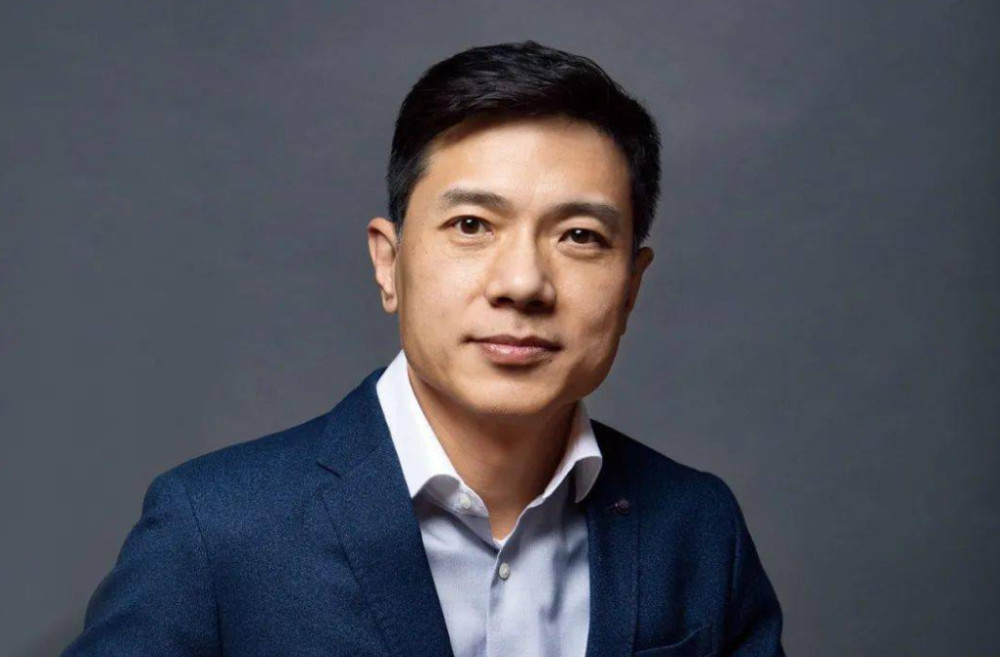

# 李彦宏内部反思：“马化腾说的问题，百度也都有”

文 | 李安琪

编辑 | 苏建勋、杨轩

岁末年初，科技公司的“一把手们”迎来集体反思时刻，前有马化腾直言“腾讯内部贪腐触目惊心”；后有刘强东痛斥“京东中高层拿PPT骗自己”。

这波反思潮也在近日涌向百度。

1月3日晨间，一篇题为“简单之约：谈机会谈挑战，新思考新要求”的文章发布在百度内网，其内容取自2022年12月末，李彦宏面向全体员工的一场内部直播，执掌百度人力资源体系的百度集团资深副总裁崔珊珊主持了这场直播。

“简单之约”，是百度管理层与全体员工沟通公司理念与战略的固定机制，由员工提问，高层答疑，每季度举行一次。

相比马化腾的犀利批判，李彦宏言辞显得和缓许多，但也直指了不少公司内部管理、业务上的问题。

直播中，有员工问及Robin（李彦宏）是否关注到马化腾的内部讲话。此前马化腾在2022年内部员工大会上，谈及了业务部门改革表面、追求大数字营收、内部贪腐“触目惊心”等问题。

“腾讯的那些问题，百度也都有。”李彦宏答道，崔珊珊也补充：反腐的例子百度也经常看到，也是“吓死人”。

对于百度与腾讯两家公司的处境，李彦宏也给出了较为公允的对比：“我们没有视频号这样的明星产品，这其实是我们跟腾讯在过去一年的差距……我们的研发强度、研发占整个收入的比例是比腾讯高的。我们信这个，虽然也觉得现在亏钱亏得很厉害，但相信末来会有相应的回报。”

在这份7000字的文稿综述中，李彦宏既有对资本、组织等宏观问题的复盘，比如对业务指标的考核转变、高管理念的传导变形；也对AIGC的商业化、疫情下的搜索产品、“端到端”战略等具体业务挑战提出了思考。

复杂纷扰的2022年终于过去，对于未来，李彦宏认为“干事儿”的时机已然到来：“长期来讲，我还是挺乐观的。我们的民族就是有这样的特点，只要有机会，就会充分地抓住这个机会去提升自己、发展自己。”

**短期说‘亏是因为高速成长’可以，但长期不行**

2022年，“降本增效”是互联网公司集体强调的主题，表面上看这是个财务问题，实际却与公司战略的执行效率息息相关。李彦宏也曾在总监级以上会议说过，很多人对商业的本质理解并不深。

“很多新业务都在亏钱，时间长了以后，大家觉得亏钱是理所应当的，不会想这个业务再过三年能赚钱、还是再过五年能赚钱、还是再过一百年也不会赚钱。”

直白来说，李彦宏直指的问题核心，在于百度长期对“赚钱”定义仅仅围绕在收入，最直接的体现，就是百度的新业务设置年度OKR的时候，往往只写了收入增长的目标，而不注重质量。

不能只看收入，要看利润，更要看投入产出比——在公开信中，李彦宏多次强调财务指标的健康性。他连续指出：

“一个明星业务、一个高增长业务，仔细一看，自研产品只占收入的20%多，70%多的东西都是转售。那跟贸易公司有什么区别呢？”

“我们那么多人在做研发，一万多工程师，研发投入占收入的20%多，跟业绩实际获得的效果却有这么大的反差，这个问题有多少人意识到？有多少人意识到了其实这个收入质量不高？”

在李彦宏看来，比收入更有质量的判断，实际上是毛利、运营利润、现金流等标准。早期做搜索业务时，也需要在总营收减去获取流量的成本，才能算出毛利。

“短期说‘亏是因为高速成长’是行的，但是长期是不行的。”李彦宏总结道。

**从CEO到一线员工，业务理解“层层递减”**

对于大公司因为层级不够扁平、汇报线过长导致的理念变形问题，李彦宏也用了不少篇幅进行反思。

李彦宏指出，（理念变形的问题）内部并非没有看到，也能跟VP、总监等对齐理念。但是当以OKR形式将目标与动作逐层传递与分解时，依旧会出现变形的情况。

“大家在那儿玩命地打，公司要GMV我就做GMV ，公司要DAU我就做DAU，公司要收入就想办法把流水变成收入。有时候我们对于业务的理解变成了〝层层递减”。”

李彦宏进一步对高层理念的落地窘境进行剖析：公司可能有5、6个层级，传到最基层、一线员工的时候，员工根本不理解“我为什么要干这个事，或者他虽然理解了，但是不觉得“这东西跟我有什么关系”。这就导致越往下做，就越在做短期的事。

“这不是我们想要的东西，这是很糟糕的，尤其是当我们愿意花很多钱去投入的时候。高层愿意为长期结果投入，今年不赚钱可以，三年不赚钱可以，五年不賺钱也OK，但我希望你七年之后赚钱。可实际上当我们在执行的时候，有人去看七年后的事情吗？”

李彦宏鼓励员工，站在更高的角度去思考问题。做事情除了满足OKR之外，应该跳出这个范围，看看设置的目标对业务的长期成长、长期健康有没有作用。

**AIGC商业化，虽难必做**

当然，内网直播谈及的内容也并非全部都是对员工提要求。李彦宏也谈到了AI领域新的技术进展，尤其是近期屡次出圈的AIGC和ChatGPT。

他表示，这些都是AI技术发展到一定地步后产生的新机会。“技术能做到这一步了，但是它会变成什么样的产品，产品能满足什么样的需求，这个链条上还有很多不确定性。”

这个事情很难，但百度必须要做。此前，百度在其移动生态大会上发布了多个跟AIGC相关的应用，包括AI自动生成文字、图片，图片转换成视频等。

**2023年，要达成“1”个目标**

此外，李彦宏还表示，随着2022年末国家“抓经济”的信号再现，对宏观环境高度敏感的互联网、高科技等公司能干事儿的时机己经到来，要抢机会、讲创新。

对于新一年的目标，李彦宏表示，过往在年初制定OKR时，他一般会设一个比团队报的更高的，然后把内部的多个业务用“或”而不是“和”来连接起来。“只要有一个业务跑出来，我就觉得做得不错。跑出来的标准，就是我能说服我自己，这东西确实做得太好了。”

不过他表示，2022年其OKR“或”出来的结果还是个0。“希望2023年“或”出来一个“1”，也就是至少能有一个高成长、有创新的业务。”

**下附百度2022Q4“简单之约：谈机会谈挑战，新思考新要求”李彦宏对话全文（略经36氪编辑）：**

**Robin：**
2022年是大家非常想不到的一年。年初参加两会的时候，当时规划说今年GDP会涨5.5%，也在说疫情会不会过去，或者防控措施会不会有变化。憋了一整年，到最后年底突然一下子放开了。从原来的动态清零到现在的放开，对每个人的生活、工作、学习、社交等都有非常大的影响，感觉很不一样。

当人们生活在这种强烈的不确定性中时，确实会很焦虑。实际上我们这种互联网公司也好、高科技公司也好，对于宏观环境的感知敏感度是很高的，外界发生什么，很快就会有所反应。不管是我们的DAU、时长还是收入等，都对宏观环境高度敏感。所以我们对过去一年发生的变化，体会真的特别深。

在我看来，这些都是人生经历。我活了50多岁，说实话也觉得2022年是一个特殊的年份，一生中有这么一种经历也挺难得。发生了没想到的事情，再想办法去应对，再进一步能够找到其中可以做得更好的地方
，对于人的成长也是有好处的。

**珊珊：**
再来看看对2023年的展望，也给大家看几张图，第一张是12月6号的中央政治局会议，第二张是12月15到16号的中央经济工作会议。一句话来概括会议内容，就是〝明年是全力抓经济的一年”，第三张是总监群内分享过的一篇文章，讲的是有个人去了趟东南亚，看到那边有不少机会。在这种宏观形势下，Robin对宏观形势有怎样的判断，觉得可能有哪些机会？

Robin：我其实非常推崇我们中华民族的文化。中国人是很想干事儿的，非常勤奋、努力。中央经常说我们的经济韧性十足；这其中有一个非常关键的因素，就是中国的民族文化就是“我想干事儿、
想赚钱、想生活得更好，哪伯吃点苦”。一旦有机会 ，很多人真的会冲上去。

**能干事儿的时机己经到来**

**Robin：**
过去这一年宏观经济的变化，以及12月中央又重新要抓经济的信号，我相信其实给很多人松了綁，可以去干事儿了。昨天我也看到群里有转一篇文章，讲江苏省要把过年一年失去的时间抢回来，鼓励工厂开工，鼓动大家春节的时候别回家了；哪怕回家了，政府来出钱，让工厂可以用大巴车把你接回来：甚至如果你原来在别的城市打工，会鼓励你到我这个城市来打工。一旦有机会，整个地方上为了活力，会有各种各样的“招儿”。

所以长期来讲
，我还是挺乐观的。我们的民族就是有这样的特点，只要有机会，就会充分地抓住这个机会去提升自己、发展自己。在今年往期的简单之约中，我都提醒大家说情况不乐观，宏观环境很不好
，希望大家要准备过苦日子等等。但是不乐观也好，有挑战也好，都不表明没有机会。怡怡相反，随着环境的变化，我们还是能够看到不少机会的
，无论是对于中国的机会，还是对于百度的机会 ，或者是对于我们每一位同学的机会，都有非常多让人期待的地方。

**面对挑战，要抢机会、讲创新**

**珊珊：** 从整个宏观角度来说有很多机会，具体对于百度有没有哪些机会？

**Robin ：**
既有机会，也有挑战。过去这几次简单之约，包括媒体发言等等，我更多地是跟大家讲有多大的挑战，遇到了多少困难。但更重要的是，我们还是要抢机会、讲创新。

增长从哪来？从创新来，创新驱动增长。过去这几百年，不光是中国，整个世界的增长全部都是因为创新、因为效率的提升。以前讲“发展就是硬道理”
，发展就是增长。有创新，很多矛盾就解;决了；但是没有增长的话，各种名样的矛盾就会显现出来。

对于百度来说也是一样的。我们这几年说实话过得比较苦，无论是宏观环境、财报还是业务的增长性，其实都不是那么光鲜。遇到不利的外部环境，我们的DAU、时长、收入的增长速度、市场份额等，都遇到了各种各样的挑战。但我们也一直在讲，百度这样的公司，还是依然非常看重技术投入和创新的
，希望通过创新带动我们的增长。把技术变成市场需要，就是属于百度的机会。

**Part 2 多元问题，答疑解惑**

**Topic1 谈要求**

Q1：上个礼拜马化腾在腾讯员工大会的对内讲话在网上传得很广，主题是降本增效，也放了不少“狠话”，比如“降本增效要形成习惯”“留给某此业务的时间不多了”“你活都活不下去了，周未还休闲地打球”，还有强调
“视频号是整个公司的希望”，想问向Robin有没有关注到，你怎么看？

Q2：看到第三季度财报中也有明确提出
“有效的降本增效带来了公司运营效率的提升”，感觉今年很多要求都放在了效率提升上。明年公司在运营效率上还会有什么样的导向？对员工来说，有什么要求？

**腾讯有的问题，我们也有**

**Robin ：**
我相信很多同学都认真地看了马化腾的内部讲话，我觉得他说的腾讯的那些问题，百度也都有。其实我们日常的工作管理，很多都是在处理和解决这样的问题。因为大家都处在一个行业，所以面临同样的问题、同样的宏观环境。历史也都差不多，也都是有二十多年历史的公司。

**珊珊：** 确实看着心有戚戚，比如“反腐的时候你是没看见，要是看见你们会吓死”，我们这儿也经常看到，也是“吓死人”。

**Robin：**
对，真是想不到会有人敢这么干。但我们也是零容忍，一旦发现这种事情就去处理，不会妥协。马化腾说的那些问题，百度也都有，我们也在试图积极地去解决这些问题。但是说实话，我们没有视频号这样的明星产品，这其实是我们跟腾讯在过去一年相比的一个差距，我们也要去面对这样的情况和现实。当然，我们更加注重技术的投入，更加注重第二增长曲线、第三增长曲线。我们在第二、第三增长曲线上的投入，不管是在百度收入中的占比、还是利润占比都可能更大一些，我们的研发强度、研发占整个收入的比例是比腾讯高的。我们信这个，虽然也觉得现在亏钱亏得很厉害，但相信末来它会有相应的回报。

**重申商业本质，细究收入质量**

**Robin：** 实行“降本增效”理念的过程中
，我说一说我碰到的一些问题，以及一些自己没有想到的情况。我在10月份总监会上也讲过，很多人对商业的本质理解是不深的。由于我们很多新业务都在亏钱，所以时间长了以后，大家觉得亏钱是理所应当的
，不会去想这个业务是再过三年能赚钱、还是再过五年能赚钱、还是再过一百年也不会赚钱。

这些新业务在设置OKR的时候
，最长的维度就是年度，年度OKR里写收入的增长目标是多少。可是这个收入是怎么来的，质量怎么样？这个问题，不要说普通的员工，即使是很高级别的管理者思考得也不多。我们的一个明星业务、一个高增长业务，仔细一看，自研产品只占收入的20%多，70%多的东西都是转售。那你跟贸易公司有什么区别呢？贸易也是从这儿买回来，从那儿卖出去。我们那么多人在做研发，一万多的工程师，研发投入占收入的20%多，跟我们业绩实际获得的效果却有这么大的反差，这个问题有多少人意识到？有多少人意识到了其实这个收入质量不高？

**毛利、运营利润、现金流是更有质量的信息**

**Robin ：** 如果不看收入，应该看什么？上次总监会我讲过，比收入更加有质量的东西，实际上是gross profit，不是毛利率，是毛利。

公司在大概二十年前，就有gross
profit的概念。我们早年做搜索业务，有一部分收入来自联盟，联盟的流量是其实是买来的，挣的钱要和这些流量的伙伴来进行分成。所以不管是对整个公司的考核，还是对相应业务负责人的考核
，我在说收入的时候，都叫做revenue net of TAC ( TrafficAcquisition Cost
，流量获取成本）。因为你加上买量的成本算出来的收入，不能说明什么，把买流量的成本减去之后的收入，才更说明我们这个搜索业务的本质。

但是到后来做各种各样新业务的时候，大家慢慢忘了，为什么我要做这个新业务，为什么我一年要亏10亿、50亿去做这个东西。gross
profit是一个质量高的信息，比它质量更高的是operating profit，也就是你的运营利润是多少。你虽然有gross
profit，但是把你的研发和各种费用一减掉，可能还是亏的。短期说“亏是因为高速成长”是行的，但是长期来讲是不行的，从运营水平上也要能够有profit
，这才是一个好的业务。这些标准，我们早期的搜索业务都是满足的。正是由于它太满足，以至于我们每一级的员工、每一级的管理者早就忘了这件事情。

**珊珊：** 或许因为有些年互联网就是这样的，都亏，但是仍然可以被估出值。

**Robin ：**
要看到这背后为什么亏还能被估值——因为相信你有一天会赚。这些业务即便是收入能够转化成它的毛利，由于大多数的互联网业务都是这种业务，所以我们早就忘了收入到底是什么意思，以及为什么要关注gross
profit、 为什么要转成gross profit.

其实operating profit也不是最后一步，最后一步是cash
flow，即使账面上有这么多收入，但实际上那些钱没收回来，都是客户欠你的钱，过两天客户倒闭了或者赖账，那还是不行。很多to
B公司不是没有profit也不是没有operating profit，而是没有cash flow，没有现金流。

**“层层递减”不可取，提高站位看长期**

**Robin：** 我们对这套逻辑不熟悉 ，大家在那儿玩命地打，公司要GMV我就做GMV
，公司要DAU我就做DAU，公司要收入我就想办法把流水变成收入。有时候我们对于业务的理解变成了〝层层递减”。

当我把这些理念去跟我们的VP、总监对齐的时候，他们也同意，但是当落到一个总监的OKR里头的时候
，有些人的OKR里可能会有收入，有些可能连收入都不体现，OKR里只写时长需要增长到多少。这样当他再往下传递的时候，下一级就变成说“老板要的多少时长，其他的我们不管”。

我们这个公司可能有五级甚至六级，传到最基层、传到真正干活的一线员工的时候，他根本不理解“我为什么要干这个事，或者他虽然理解了，但是不觉得
“这东西跟我有什么关系”。这就导致大家越往下做，就越在做短期的事，做了很长时间后突然回头说“哦，有可能做错了”。这不是我们想要的东西，这是很糟糕的，尤其是当我们愿意花很多钱去投入的时候。高层愿意为长期的结果去投入，你今年不赚钱可以，三年不赚钱可以，五年不賺钱也OK，但我希望你七年之后赚钱。可实际上当我们在执行的时候，有人去看七年后的事情吗？

我希望我们每一级的人，尤其是当你想要往更高级别走的时候，你要站在一个更高的角度去思考这个问题。我们现在用的是OKR
，但是一旦分解下去，大家就去看那些数，不管是O里的数，还是KR里的数。甚至有时不管O是什么，如果O里没数，就不看O只看KR，只去完成一个数，很多时候都变成了这样。但更多的时候，我们做事情除了满足所谓的OKR，也应该跳出这些数，去看一看我拿来的这个数，对于业务长期的成长、长期的健康性到底有没有用，是有正面作用还是有负面作用。

**反复对齐，对抗惯性**

**珊珊：** 今年ACG、IDG的员工，其实是可以看到业务的负责人实际上是被要求了毛利的提升的。

**Robin：**
对，这个话已经说了很多遍了，但是要把大家这种做事的惯性或者思维的惯性改过来，真的是不容易。我在会议室里，不知道对同一批人说过了多少遍，我说明年我不看收入了，就看毛利，但下次开会，他们又照样跟我说我们的收入是这样，别人的收入是那样，我们对比下来是怎样。

我每遇到一次这样的情况，就会再讲一遍，同一批人可能得讲个五六遍之后，这种惯性才能够改过来。你问他懂不懂这些道理，都懂
，实际做，却是说“过去都是这么做的呀，所以我现在还这么做呀”。Human
nature就是这样，“习惯了〞。所以今天我们又花这么多力气在这对齐，讲一遍可能还不够，但总比不讲要强。

**Topic 2 谈战略**

Q3：“新十条”发布以后，百度上线了疫情指数，用信息流动对抗未知恐惧。京通小程序的上线，百度也是首发。这些贴合热点的迅速反应，体现了我们的社会责任。想问问Robin在后疫情时代，百度怎样进一步体现责任和担当，还可以贡献哪方面的价值，什么是属于我们的机会？

**让人们平等便捷地获取信息，找到所求，是一件了不起的事**

**珊珊：** "新十条”发布后，像是每天的新增发病数字，卫健委发布的跟大家的切身感受完全对不上，而我们的疫情指数当时还是很管用的。

**Robin：**
这种时候恰恰是百度能够发挥作用的时候。我那几天其实挺兴奋的，我们的数据、我们的服务能够让更多的人更及时地看到真相，获得他们在其他地方不能获得的信息，这是件很伟大的事情。我们以前的使命也是这么说的，“让人们平等便捷地获取信息，找到所求”，这种作用在一个充满巨大不确定性的环境中
，越发显得重要。

搜索其实是无数人用他们的行为，告诉我们现在的情况是什么样子。如果我们能够把这样的情况綜合起来，并且呈现给每一个人，他就没有那么慌了，不是他的周边有多特殊，而是整个大环境就是这个样子。尤其当他看到一些预测，说到了多少天后趋势就会平静下来，那他就会觉得说，“我可能不需要囤一年的食物吧”。历史上出现过好多次这样的情形，在大家比较懵圈、不知道该怎么办、不知道下一步会发生什么的时候，我们尽量让大家获得及时准确的信息。

一般出现这种情况
，对百度来说其实没什么钱赚，就是流量涨、收入降。但我觉得不光是我，每一个参与到这个工作的人、每一个百度人，都会觉得我们能在这个时候起到这样的作用，能够被别人所依赖，是一件很了不起的事情。

**当別人很依赖你时，机会总会有的**

**Robin ：** 当别人很依赖你的时候，机会总会有的。整个搜索业务这么多年，最本质的东西，就是当别人想知道什么是事实
，当别人想知道对方说的是对还是错的时候，他来百度一下，他说“百度说的是这样的，所以我信”。

HCG的同学那些天也一直在做需求，当时面对的是“需求太多，做不过来”，因为很多人在找药、找医生。但大家不管多忙多累，都在坚持工作，因为有太多人需要我们。这种感觉也挺好。

Q4：最近一段时间，AI领域也有很多进展，比如AI作画，AI对话 (
ChatGPT)，AI写作，Robin怎么看待这些AI应用方向，百度未来又会在这些方向有什么规划或部署？

**Robin ：** 很多人问过我这个问题，不光是周边同行业同领域的朋友，好多不同领域、跨界的人都在问我怎么看ChatGPT。
我很高兴这么一个我们天天在琢磨的技术方向，能够引起这么大的與论场，能自让这么多人关注 ，确实是挺不容易的。

无论是AIGC，还是ChatGPT，都是新东西，都是AI技术发展到一定地步后产生的新机会，虽然现在这个机会还不是那么清晰。技术能做到这一步了，但是它会变成什么样的产品，这个产品能满足什么样的需求，在这个链条上还有很多不确定性。所以一方面，我们很兴奋，另一方面，我们也觉得责任挺大的。作为一个公司、一个商业机构，我们有这么酷的技术，那我们能不能把它变成人人需要的产品？这一步其实才是最难的，也是最伟大、最能够产生影响力的。

**四种类型的创新**

**Robin ：** 我最近在看一些有创新的资料，它总结了四种类型的创新。

第一种是从左到右的创新。从科学、从基础理论开始推演，一步步变成技术，技术再变成产品，产品再推向市场。

第二种是从右到左的创新。产生了一个需求，再往回推，看能不能做一个demo、做一个产品；产品再往回推，看能不能实现这样的技术；技术再往回推，看技术背后的理论到底是什么，能不能实现这样的事情。

第三种是manufacture with the innovation。
也就是你生产的产品不断扩大制造规模的过程当中，自然而然产生出来的那些创新。我认为中国作为制造业大国，在这种创新上是有优势的，比如生产新品，比如说台积电，大家以前觉得是个代工，现在发现门槛很高、不容易，这种创新就是生产制造带出来的创新。

第四种是机构式的创新。整个机构就是一个创新机器，它的目的或者说作用就是想尽一切办法去产生各种各样的创新。

在百度，这几类创新我们多多少少都沾点边。但是怎么真正产生出来大的创新，怎么让我们的机制能够更高效地产出创新，这是一个非常有意义的课题，也是我最近在琢磨研究的事。

**AIGC商业化，虽难必做**

珊珊：如果说AIGC，你对百度有什么期望的话，你是希望我们能够率先在商业化上摸索出来？

Robin
：当然。创新不是说一个技术过去没有，真正的创新是说，这个过去没有的技术到底产生了什么样的社会影响，而这个影响一定得通过产品、通过商业化应用才能够产生，这一步其实是最难的，但也是我们必须要去做的事情。

**Topic3 谈导向**

Q5.总监会讲到的“端到端优化”，占篇幅挺多，但不太好懂。怎么理解这里的“端到端”？怎么定义“端”？落到具体业务上，怎么做是
“真端到端”，怎么做是“假端到端”。

**讲透“端到端”，平台化or纵向整合**

**Robin ：**
这个概念确实比较难理解，因为它涉及到战略层面的思考和发展理念的问题。“端到端”并不是放之四海皆准的，有些公司就非常明确地说，“我就做平台，不做端到端，我更相信横向分工〞。

其实，不光是在IT产业，我们看汽车产业，也是这样的。在汽车领域，早期的福特就是做端到端的，什么零件都做，只不过它是用流水线把效率提升了。最后颠覆福特的是一种横向的、精细化的分工。丰田就说，“很多东西我都不做，我都靠供应商，供应商去做汽车配件的话，会比我自己做成本更低、效率更高。”最終依靠这个颠覆了福特。在IT领域，苹果是在做明显的
“端到端”，什么都做，所以它做出来的手机最高端、体验最好。而安卓的理念就完全不一样，他的理念就是：手机做不出来或者卖不出去都OK，我照样是一个非常成功的平台。

所以，当我们在讲 “端到端”的时候，其实是在思考：从整个百度大的业务线条上来看，我们到底是走平台化道路，还是走纵向整合的道路。

**规模足够大，“端到端”的效率才最高**

**Robin ：** 我们要搞清楚，一定要有足够的规模，“端到端”才是效率最高的。如果你这个业务很小，其实不一定要做“端到端”，效率也不一定是最高的。

不管是针对MEG、ACG还是IDG的业务，大家在思考
“端到端”的时候，一定要想：我能不能把规模做得足够大？在规模足够大的情况下，我们把芯片层、框架层、模型层和应用层串联起来之后，有意为这个东西做优化，最終达成效率的提升。如果我能够给每个客户节约50万，但需要的研发投入是5000万。这就意味着，如果客户数目小于100个，就不划算了
，还不如不做这种 “端到端”的优化。

Q7、对于即将到来的新一年，Robin有什么期许，或是想要达成的小目标？

**2023小目标：“或”出一个“1”**

**Robin ：** 每年我们制定的OKR ，我也需要跟董事会有一个汇报。一般是在年初会设定一些目标。针对这个目标
，我的做法通常是不想求全，不是说我们现在有四五个业务，每个业务我要达到什么KPI，我一般不这么设。

尤其是对于新业务，不管团队给我的指标是什么，我都会设一个比团队报给我的高不少的指标，然后把多个业务用“或”而不是“和” 来连接起来。我报给董事会的时候会说
“我有三个或四个新业务，只要有一个业务跑出来，我就觉得我做得不错。”这个“跑出来”的标准，就是我能说服我自己，这东西确实做得太好了。

我可以告诉大家，2022年这样“或”出来的结果还是个0。所以你问我2023年有什么小目标，我希望2023年“或”出来一个“1”，也就是我们至少能有一个高成长、有创新的业务，真正的above
and beyond our expectation。 如果它的发展真的比我们想象得都要快很多、好很多，我们一定会carry
over它到明年甚至更长的时间。

**珊珊：** 这种做法像是一个谨慎理性的乐观主义者的做法。

**Robin ：** 设目标是这样 ，有机会，但不容易。

