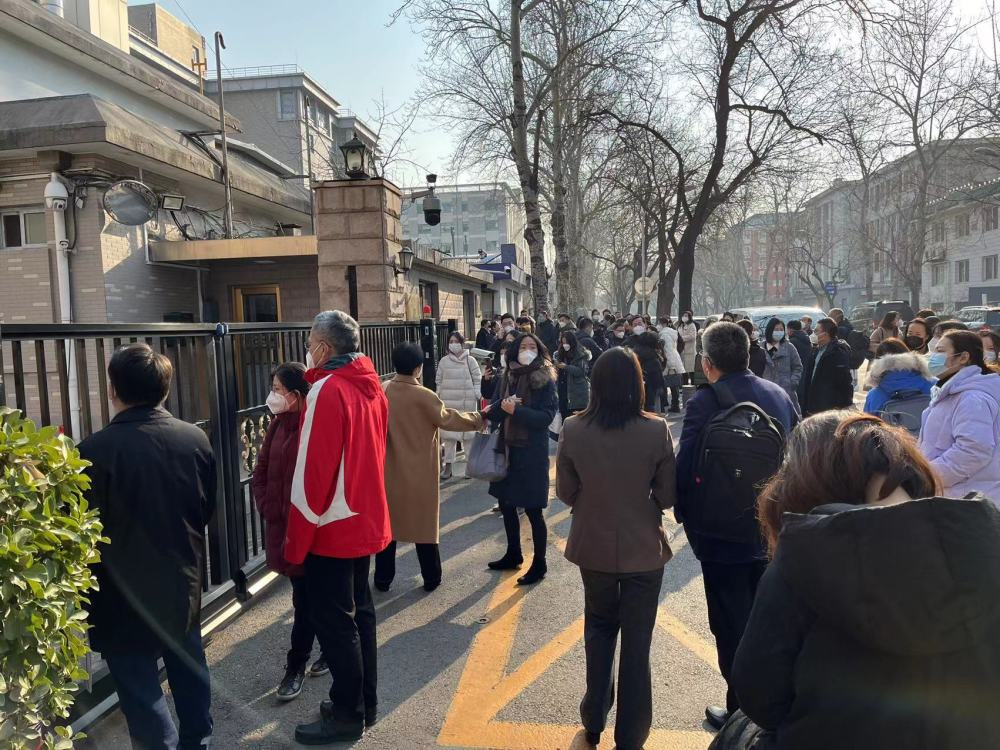

# 直击医保谈判现场｜企业谈判成功后表态：价格还可以

新京报贝壳财经快讯（记者丁爽 李云琦
）1月5日，2022国家医保谈判在北京西城区人大会议中心举行。5日上午，一家湖南企业谈判代表开心地对新京报贝壳财经记者表示，此次谈判成功，“价格还可以”。

_1月5日下午，参与下午医保谈判的企业正在等待入场。新京报贝壳财经记者
丁爽 摄_

据贝壳财经记者在现场了解，5日上午共有10家左右企业参与医保谈判，当天上午8点半企业陆续入场，9点30分谈判开始。上午9点左右，会议中心门口就聚集了等待消息的媒体，还有第二天参与谈判与不参与本次医保谈判的医药企业人员在观察情况。临近上午10点，开始陆续有企业从会议中心走出，有企业表情较为凝重，少数企业表情轻松。

据上述湖南药企谈判代表透露，公司此次为第一次参加医保谈判，此次进入国谈的是旗下二类创新药物。关于今年医保谈判的降价是否温和，其表示“价格还可以”。

大部分走出现场的代表不愿意透露企业名称。一位走出会议中心的企业代表对记者表示，自家企业的医保谈判已经结束，有谈成的药品。

1月5日下午1点，参与下午医保谈判的企业在会议中心门前等待入场。在场的企业代表三三两两地聚在一起闲聊，相对上午，此时气氛显得比较轻松。

据了解，此次国家医保谈判中，344个药品通过初步形式审查，通过比例为70%。与2021年（474个药品271个通过）相比，申报和通过初步形式审查的药品数量都有一定增加。通过率方面，目录外药品比例为60%，目录内药品比例为91%。

根据《2022年国家基本医疗保险、工伤保险和生育保险药品目录调整通过形式审查的申报药品名单》，此次医保谈判中通过形式审查的申报药品包括新上市品种、适应症或功能主治发生重大变化的药品、纳入《新型冠状病毒肺炎诊疗方案(试行第九版)》的药品、纳入《国家基本药物目录(2018
年版)》的药品、受鼓励的儿童药品或仿制药、适应症中包含有卫生健 康委《第一批罕见病目录》所收录罕见病的药品。

医保药品目录调整分为企业申报、形式审查、专家评审、谈判竞价等环节，形式审查只是其中之一。通过形式审查，表明该药品有资格进入下一步的专家评审环节。只有顺利通过目录调整的所有环节，才能最终被纳入国家医保药品目录。

编辑 陈莉 校对 陈荻雁

