# LPL春季赛赛程出炉！FPX和WE打响揭幕战，年前WBG大战TES收尾

随着转会期的结束，S13赛季已经拉开了序幕，就在7号中午，LPL官方发布了S13赛季春季赛的正式赛程，一起来看看具体的安排是什么吧！

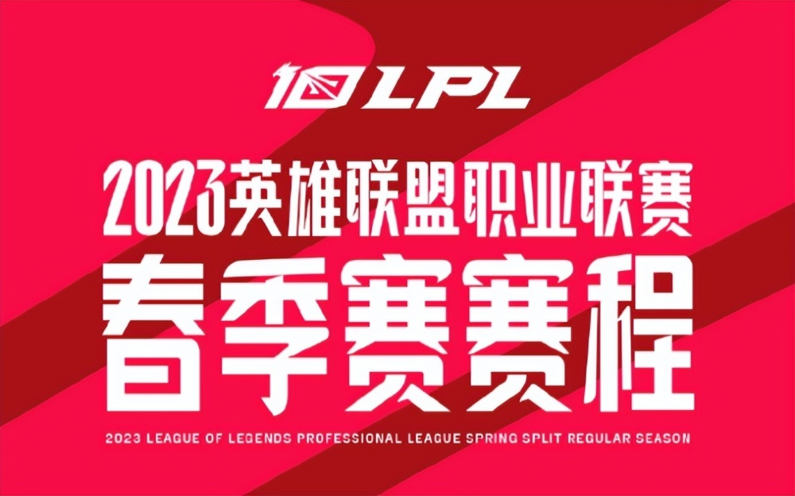

具体的开赛日期是1月14号，也就是下周六，打响揭幕战的是FPX和WE，比赛将在14号下午15点开打，周六和周日一天打3场，第一天比较精彩的对决是14号晚上19点的BLG大战JDG，JDG新阵容第一天就将亮相，而且对手还是刚刚拿到德杯冠军的BLG，期待值拉满。

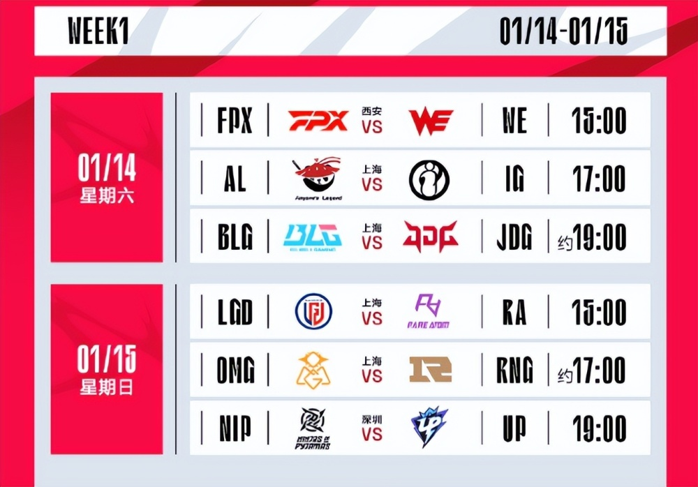

周末也是3场比赛，最大的看点应该是OMG和RNG的对决，RNG在更换中单后表现如何，让人备受期待。

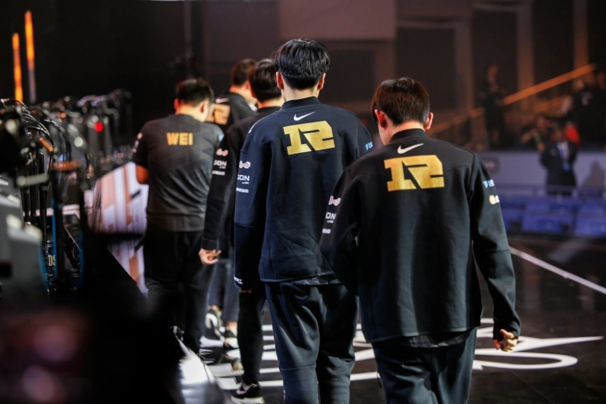

春节前只有2周的比赛，并且2周都没有打满，第一周只打双休日两天，第二周只打3天，然后就是春节假期。不过在年前还是有很多看点十足的比赛，比如说16号WE和EDG的对决，两队新阵容的较量，以及年前最后一场WBG和TES的强强交手，这场比赛的输家应该会在整个过年期间，一直被清算。

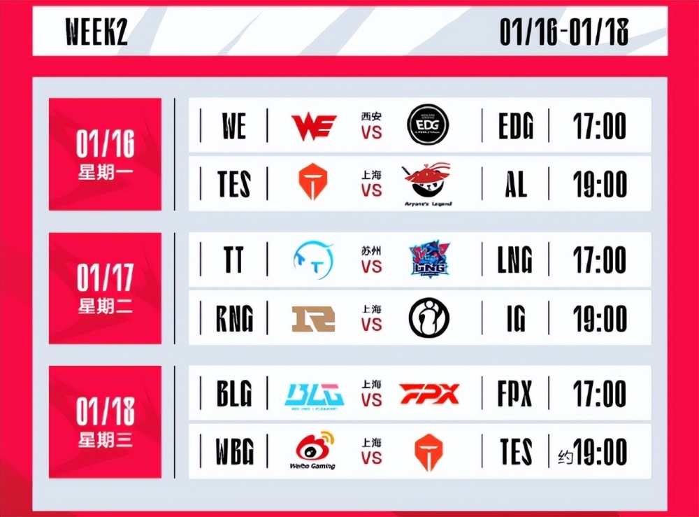

第三周的比赛安排如下，目前看起来比较重要的比赛有1号RNG和LNG的对决，以及4号BLG在微博杯结束后，再次挑战WBG，还有5号最后一场EDG和RNG的豪门大战。

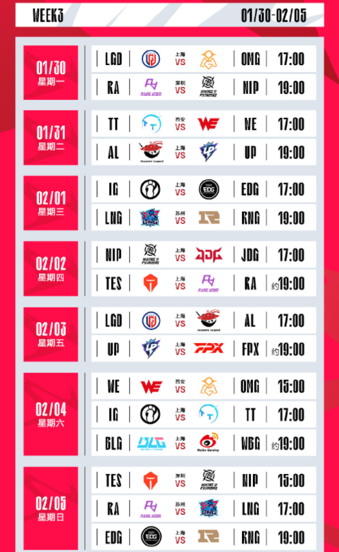

第四周的比赛安排如下，看点是9号RNG和JDG的对决，11号JDG大战WBG，以及12号BLG和EDG的比赛。

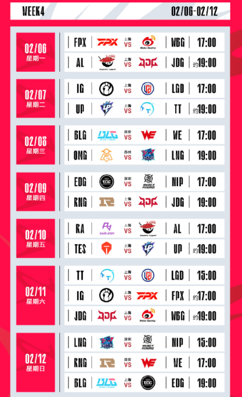

第五周的赛场安排如下，贝塔推荐的看点是15号JDG和EDG的比赛以及19号EDG和TES的比赛。

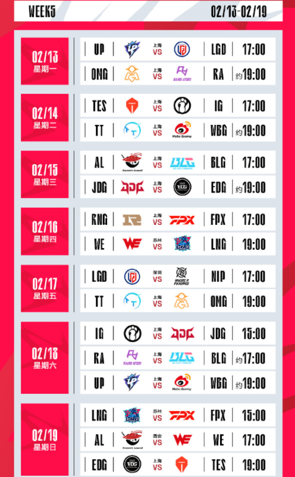

第六周赛程安排如下，最大看点应该是22号LNG和BLG的比赛，以及25号JDG和TES的强强对决，还有周末WBG大战LNG。

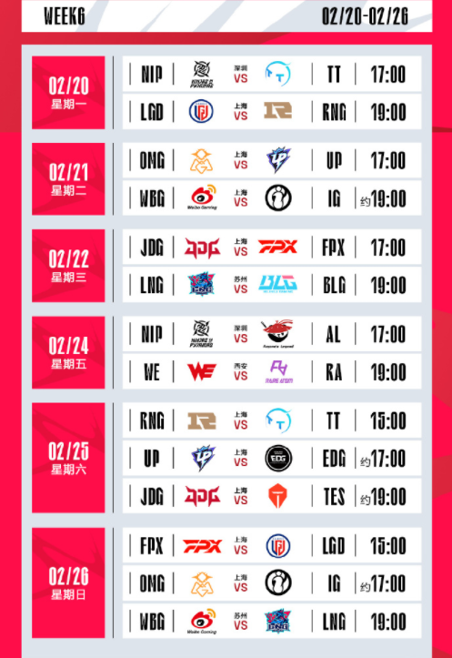

第七周周六的比赛直接拉满，周六先看TES大战RNG，然后是EDG和LNG的对决，scout大战老东家，这两场都是话题度满满的比赛。

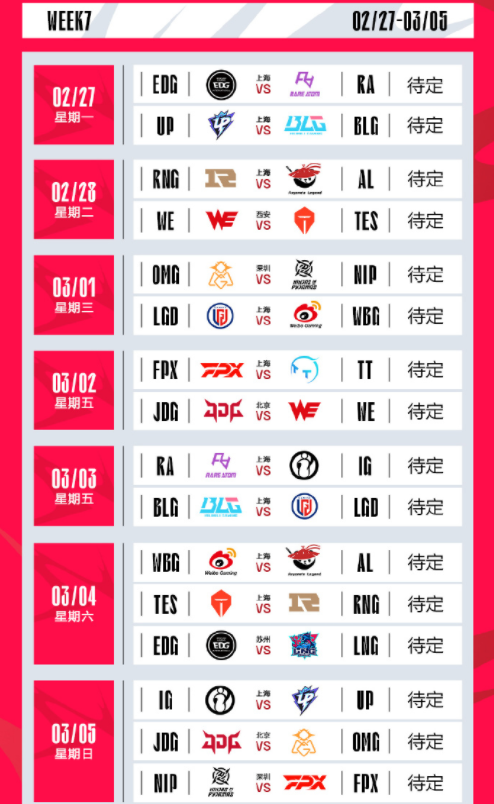

第八周这时候应该是在竞争季后赛名额的关键时刻了，比较重要的比赛有6号RNG和BLG的对决，7号EDG和WBG的比赛，以及7号TES和LNG的大战，而这一周双休日有WBG和RNG的比赛，以及LNG和JDG的比赛。

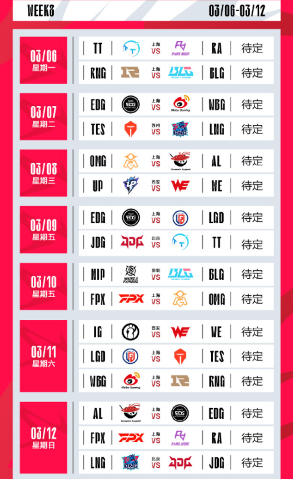

第九周开始周末的比赛由3场调整为2场，比赛场次减少，重点需要关注的比赛应该是周六TES和BLG的大战。

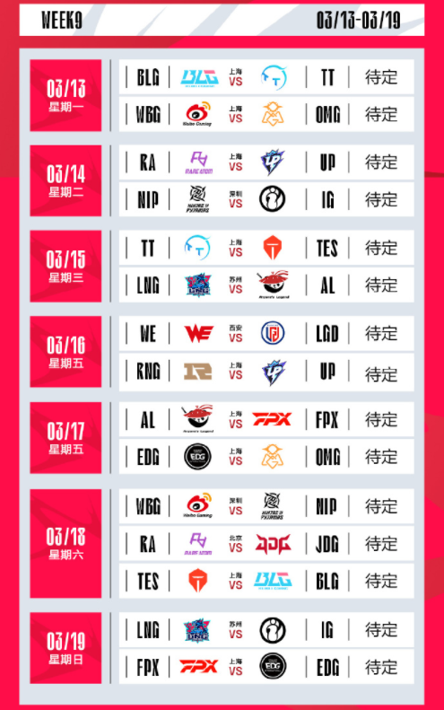

常规赛最后一周的赛场安排如下，最后的收官战由WBG和RA两队带来，整个春季赛常规赛从1月14日，一直打到3月26号，季后赛应该是安排在4月中上旬。

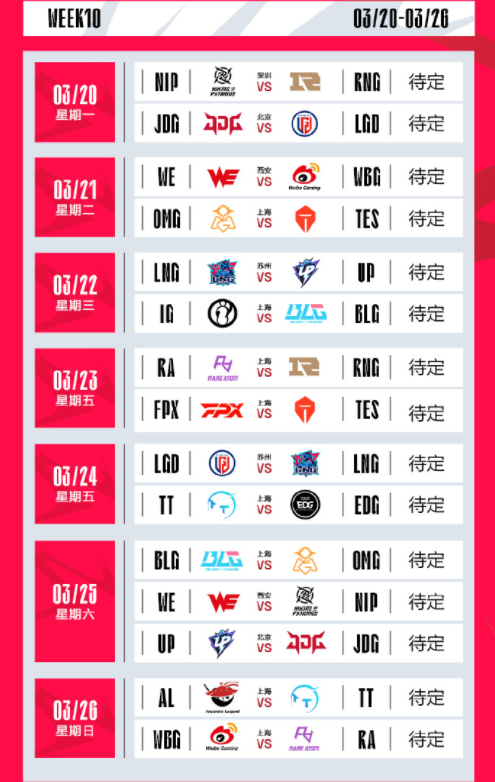

另外LPL官方也透露了春季赛开始，上海和苏州主场将会开启线下观众观赛的模式，后续的售票公告也会发布，所以想要去看比赛的观众们也可以行动起来了，期待新赛季春季赛可以足够精彩吧！

那么，对于这波赛程安排，你们有什么想说的吗？欢迎在评论区留言探讨。

