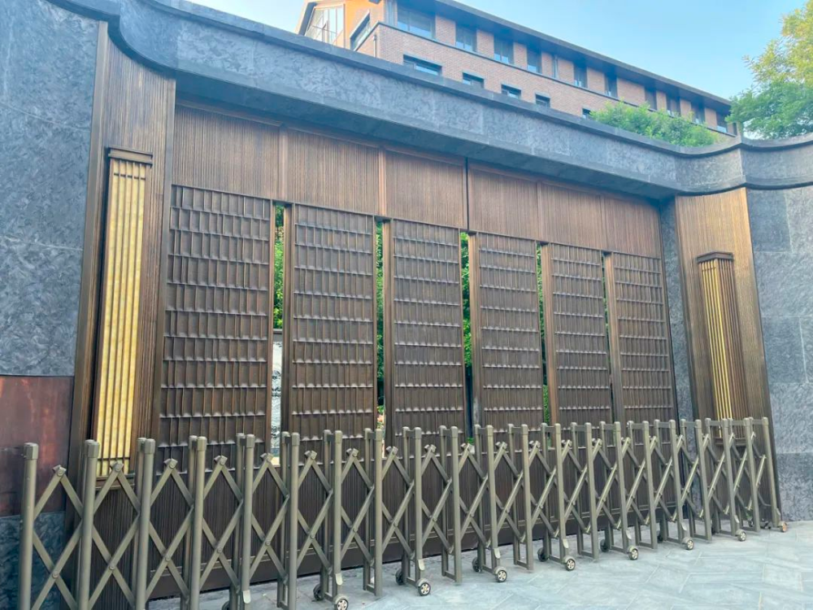
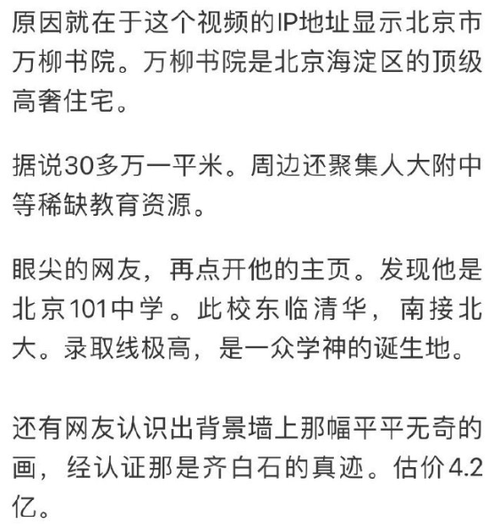
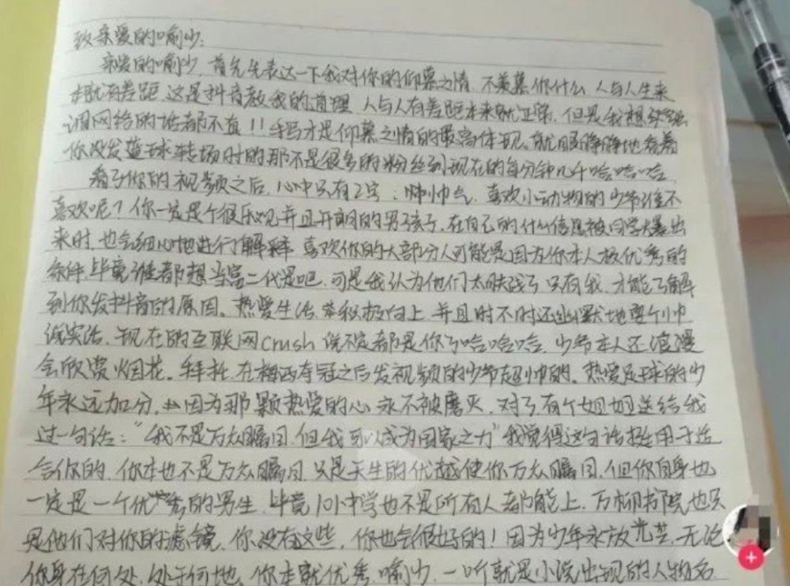
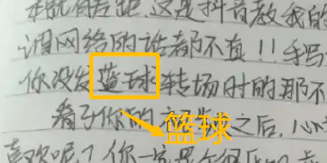
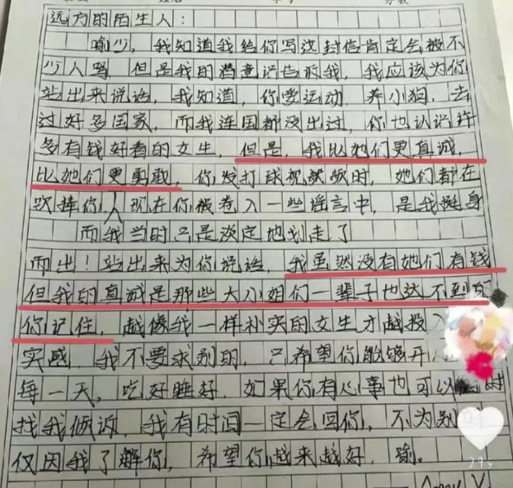
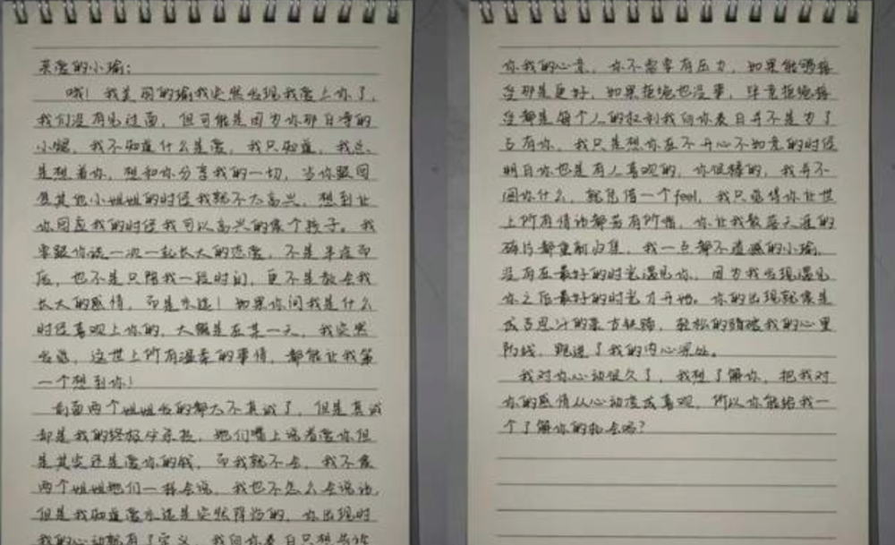
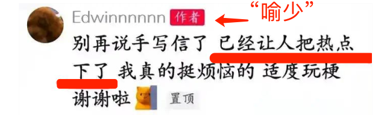
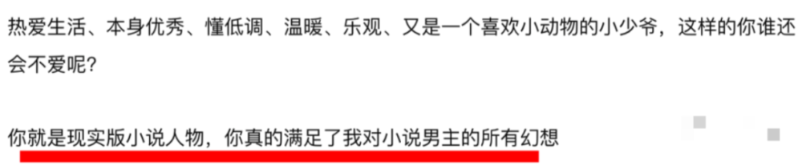
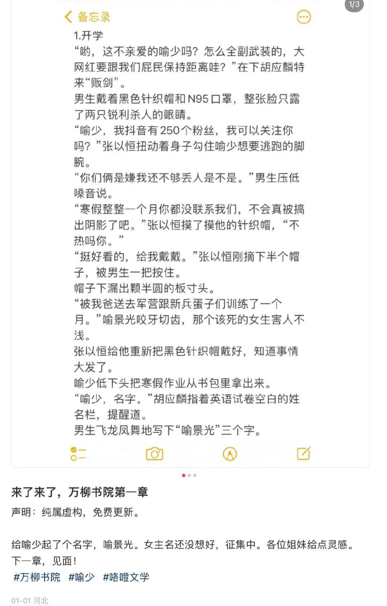
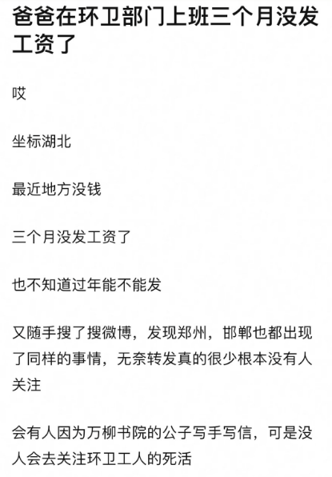

# “老奴”给“万柳少爷”打赏了20万，骑共享单车的我看哭了

​小白我初看到“万柳书院”这四个字，我还以为是个什么新晋的男团。

毕竟短视频里带这个tag的，不都是几个小哥哥在吃吃喝喝，或者唱跳rap篮球。

虽然水平都不咋地。

虽然他歌喉比新闻哥好的有限，眼神宛如加班到深夜后对世界失去希望的新闻妹，但直播间里粉丝可是真的猛啊。

开播7分钟，这个“万柳书院2号少爷”，就收到了20万的礼物。

7分钟，20万，要是咱高低得当场给大伙磕几个，磕完估计还是心虚。

可万柳少爷不得，非常淡定地说着感谢。

无奈礼物太多，即使只是偶尔的双手合十，也是很累的。

这种魔幻现实主义的2023年限定版，是怎么出现的？

奥秘，就在“万柳书院”的高墙里。

所谓万柳书院，是一个坐落在北京海淀的小区。

宇宙中心也不过如此，价格还用说吗？

去年这儿有两套房被法拍，一套八千八百万，一套一个多亿。

一平米将近40万。

可能是被开头的内容迷昏了头脑，我甚至觉得这价格也就那样，40万嘛，咱少爷14分钟就能挣回来。

按照他7分钟20万的速度，（8800万÷20万）×7分钟 ÷60≈51小时。

辛苦直播个51小时，每天8小时的话也就不到一星期，不就挣回一套了吗。

洒洒水啦。

那问题来了，这少爷是咋火的？

其实新闻哥前几天就写过了，有个男孩发了几段不露脸的篮球视频。

运球平平无奇，可眼尖的网友一下就识破了隐藏内容，介不是俺们牛马可望不可及的圣殿，万柳书院吗！

再挖，大少爷游戏里的一杆大枪，就顶一个打工人的年薪。

经过网友的自我脑补和颅内高潮，“喻少”的粉丝从几千直冲140万。

注意，这个打篮球的“喻少”是万柳书院一号少爷，和文章开头的二号少爷不是一个人。

一号少爷还是高中生，始终没有露脸，似乎是招架不住汹涌的爱意，把视频删光了神隐。

据说是被家里人没收了手机。

感觉像是王夫人怕晴雯带坏了宝玉。

啊不，应该是怕焦大带坏了宝玉。

其实小白我并没有对网友自称“老奴”多反感，谁没在网上发过癫。

看豪宅视频时出现保姆间，我也会在弹幕上刷：“这就是我的房间吗？”

跟风调侃而已，哪个正常人会真情实感地把自己当成老奴？

我总是低估现实的多样性，是没有人跑到万柳书院说老奴要见少爷，可有人真情实感地给少爷手写示爱小作文。

虽然但是，“篮球”咋还能写成“蓝球”。

很快，争宠的第二封出现了。

这次的称呼变了，从亲爱的喻少，变成了远方的陌生人。

第三封第四封也接踵而至，争奇斗艳，誓要把对方狠狠踩下去。

真的，实在不行追几个爱豆演员调理一下吧……

指望手写几句话就会被大少爷看中，还不如去买几张彩票，那个几率大点。

我试着用追星的经历去理解她们。

我喜欢一个爱豆，是因为ta满足了我对异性/同性的幻想、满足对陪伴的幻想、满足对CP的幻想……

而万柳书院的少爷，也许是满足了她们对霸总或高干文里男主角的幻想。

她们示爱的不是“喻少”，而是内心想象出来的那个完美的ta。

还别说，真的有人给“喻少”写小说了。

谢谢，已看完，脚趾抠出了20个万柳书院。

我要是“喻少”的朋友，必天天在他面前朗诵。

也许“喻少”应该感谢，杀出来的二号少爷转走了全部注意力。

作为他的邻居，“喻少”不露的脸，都被二号少爷狠狠地露回来了。

本以为参观万柳书院是尽头，没想到少爷施展起钞能力，从北方贯穿南方。

他给网红包吃包住包机票，带人去自己广州的大别野跨年。

一套行云流水，又把被“喻少”伤透心的孩子荡漾起来。

然后就出现了开头的那幕，我最不理解的场景。

二号少爷开直播，粉丝直接打赏了几十万。

明明已经见识到人家有多富，还把钱刷给零花钱比你一辈子工资都高的人。

我不理解。

当然，若这钱是自己挣的，想怎么花就怎么花，我觉得不应该指责。

况且给有钱人打钱又不是啥新鲜事了，随便一搜一大把，今天是这个品牌的公子出宫了，明天是那个公司的小姐下凡了，快让老奴来接驾，都别和我抢。

我只是想感叹。

互联网本来是抹平差异的地方，如今公子小姐入局，大家才发现，原来就算是标榜草根的短视频赛道，他们只是用一个豪宅的定位就能吸到百万粉丝。

遮遮掩掩拍一段自己的家，就能吸引一大批自称老奴的粉丝。

一个镜头昭告天下我有钱，就能坐等更多的钱找上门来。

真是秦始皇摸着电门吃花椒，赢到麻中麻啊！

我知道评论里的朋友会说什么：这种视频毒害青少年，应该封，封封封封封封封。

可什么事都一禁就能解决的吗？

看不到不代表不存在，视频有人看，必然是有喜欢看的人。

比起“媚富”“慕强”这种大而空泛的口号式指责，我更愿意相信，他们是沉溺在虚幻的想象世界中无法自拔。

沉浸于追逐这种与自己相隔甚远，又不能对自己有什么实质影响的事情，给各种以为的高大上的东西加盖自己认为的性质。

至于为什么不愿意转头去看真实的世界，可能是因为太过刺眼了吧。

