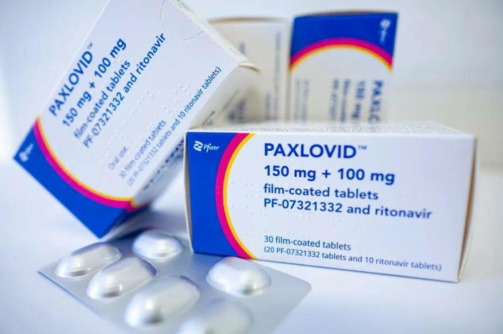

# 医保谈判第三天，辉瑞谈了四个多钟头

国家医保谈判进入到第三天。与首日的“人头攒动”相比，6日、7日的全国人大会议中心现场人较少，但仍有药企人员与媒体驻足等待。

**7日下午13点10分左右，上午场的最后一组企业谈判人员离场，对谈判结果避而不谈。有现场人士认出，该谈判人员来自辉瑞。**
公开资料显示，辉瑞本次通过形式审查名单的共有七款药物，涵盖一款抗感染类药物、一款治疗特应性皮炎用药、四款抗肿瘤药物，还有备受关注的新冠治疗药物Paxlovid。除了辉瑞，艾力斯董事长杜锦豪携工作人员现身谈判现场并表示，“国家对企业的支持还是挺大的”。

现场消息显示，7日到场药企或包括贝达药业、辉瑞制药、复星医药、渤健、恒瑞医药、艾力斯、诺华、罗氏、真实生物、百济神州、翰森制药等。

**有的打探竞品消息，有的称“降太多了”**

医保谈判现场是药企与国家医保局之间的量价博弈。7日下午，有企业未见其人先闻其笑声，也有谈了神经类药品的企业代表出来后直言“谈了20分钟，谈得很好，大家都希望能进(医保目录)”，并在门口合照。

有企业代表出场后与等待的同事击掌，也有企业快步离开。
**6日，在记者询问其谈判情况时，有药企表示“降太多了”。有药企则称“谈了两轮，一共一个多小时，降幅不好说。”**

同时，医保谈判现场也是药企与药企的博弈。一位中药企业的工作人员向记者打听照片中的人物是否已谈判结束离场，她对中新经纬表示，他们的行业竞争对手6日上午进行谈判，而自己公司的同类药品还没有上市，所以提前来打探消息。

亦有券商分析师到场，在接受媒体采访时表示，通过出场药企的神态、动作可以构成信息，形成对本次医保谈判降幅的预期。

本次医保谈判中，“天价抗癌药”CAR-T的生产企业药明巨诺也受到市场高度关注。因为CAR-
T产品瑞基奥仑赛注射液挂网价为129万元一针，加之2021年医保谈判时，竞品复星凯特的阿基仑赛注射液出现在国家医保目录调整初审名单后，未出现在医保谈判现场，药明巨诺是本次医保谈判名副其实的明星药企。

有消息称，药明巨诺疑似出现，但中新经纬未在现场找到药明巨诺谈判团。

**辉瑞现身，新冠治疗药物能降价多少？**

**在上午大部分药企谈判结束离场后，中午1点时，辉瑞仍在场内。**
有现场消息称，与6日相同，辉瑞全球生物制药商业集团中国区副总裁、市场准入负责人钱云也出现在了谈判现场。在辉瑞团队离场时，记者向其询问谈判情况，对方避而不谈，转头离开。

公开消息显示，辉瑞本次通过形式审查名单的共有七款药物，涵盖一款抗感染类药物、一款治疗特应性皮炎用药、四款抗肿瘤药物，还有备受关注的新冠治疗药物Paxlovid。

_Paxlovid资料图_

公开消息显示，辉瑞的新冠治疗药物Paxlovid在2022年2月经国家药监局附条件批准，已经被临时纳入医保，目前医保支付价格已经由此前的2300元/盒降至1890元/盒。目前，Paxlovid已在多地社区中心可以开具，但总体供应较为紧张。

在本次国家医保谈判中，辉瑞“神药”能降价多少，能否实现全球最低价是本次谈判最大的看点之一。不过，从7日早上出场药企情况来看，或进行的是肿瘤药物谈判，Paxlovid是否已谈判结束暂未可知，而具体降幅及谈判结果要等此后国家医保局官宣。

在国家医保目录调整初审名单中，共有三款新冠治疗药物在列，除了辉瑞新冠口服药Paxlovid，还有新冠口服药阿兹夫定、以及清肺排毒颗粒。

据悉，真实生物的阿兹夫定片治疗新冠的适应症在2022年7月才获批，此次国家医保谈判只涉及治疗艾滋病的适应症，新冠适应症并未包含在其中。

而备受关注的新冠特效中和抗体“安巴韦单抗/罗米司韦单抗”主动放弃了国家医保谈判。这也意味着，该药将无缘现场谈判/竞价环节。

国家医保局曾指出，按照基本医保有关规定，凡被列入新冠肺炎诊疗方案的药品，可以临时性纳入医保支付范围。在2022年8月，国家卫生健康委已经印发通知将阿兹夫定片纳入新型冠状病毒肺炎诊疗方案，因此参保患者使用该药时医保基金可按规定予以支付。

1月7日，多部门联合发布《关于实施“乙类乙管”后优化新型冠状病毒感染患者治疗费用医疗保障相关政策的通知》，其中明确，新型冠状病毒感染诊疗方案中新型冠状病毒治疗药品延续医保临时支付政策，先行执行至2023年3月31日。

**六款PD-1抗肿瘤药谈判**

PD-1/PD-L1方面，此次共计6款国产药物参与谈判，包括既往已进入医保目录的恒瑞医药的注射用卡瑞利珠单抗、君实生物的特瑞普利单抗、百济神州的替雷利珠单抗、信达生物的信迪利单抗，本次将谈判新增适应症。此外，复宏汉霖、康宁杰瑞/思路迪/先声药业两款新获批PD-1/PD-L1参与此轮谈判。

就谈判药品续约规则来看，根据《医保药品目录调整工作方案》“修订完善谈判药品续约规则”要求，核心的分类依据为产品销售额与医保基金实际支出/预算影响预估值的比值。本次针对谈判药品(含谈判续约药品)采取了纳入常规目录管理、简易续约、重新谈判三种续约方式。

对于新增适应症的品种，若按照简易续约程序，降幅或最多25%。

根据德邦证券研报，综合来看，已纳入医保的4款国产PD-1单抗市场份额不断提升，尤其是百济神州的替雷利珠单抗单三季度销售实现反超，跃居中国第一。随着后续各大适应症纳入医保及产品降价，国产PD-1将进一步扩大国内市场份额。

而对于本次最新走入谈判桌的康方生物而言，作为首个国产双抗、全球第一个获批上市的基于PD-1的双特异性抗体，康方生物的PD-1/CTLA4双抗卡度尼利于2022年6月获批上市，其上市弥补了二三线宫颈癌靶向治疗的需求。目前该药的价格为13220元/125毫克/瓶。

康方生物方面曾透露，“康方生物正在积极参与国家和地方各类的医疗保障体系，并采取患者救助方案，年治疗费用不高于19.8万元人民币。”

**四款罕见病药折戟再战**

中新经纬梳理发现，在本次的医保初步审查名单中，有19种罕见病用药通过2022年的初步形式审查。其中，就去年纳入医保的超高值罕见病药品SMA和法布雷病适应症而言，罗氏制药公司(下称罗氏)治疗SMA的利司扑兰口服溶液用散，赛诺菲治疗法布雷病的注射用阿加糖酶β也通过了形式审查。

从现场消息看，1月7日，罗氏现身医保谈判现场，赛诺菲是否到场暂未得知。今年这两款同适应症药物医保谈判价格是否参考上一次国家医保谈判？

以诺西那生纳为例，2021年12月的“灵魂砍价”现场仍历历在目。渤健的诺西那生钠注射液于2019年4月28日在中国上市，用于治疗5qSMA(脊髓性肌萎缩症的主要类型)。但在进入医保前，一剂诺西那生钠注射液价格高达70万元，而该药进入新版医保药品目录的价格已低至3.3万元每针的“地板价”。福建省医保局药械采购监管处处长张劲妮在谈判现场的一句“每一个小群体都不应该被放弃”也成为2021年的年度热点。根据渤健生物公众号消息，诺西那生纳是首个被纳入国家医保目录的高值罕见病药物。

对于渤健而言，其推进诺西那生钠注射液进入医保较为急迫。公开资料显示，目前，已有药企开始布局诺西那生纳的仿制药。华西证券此前研报分析称，诺西那生钠或将成为药企奥锐特首个推出的小核酸原料药，诺西那生纳的原研专利将于2025年到期，奥锐特诺西那生钠研发已进展到中试阶段。

而罗氏的利司扑兰口服溶液用散(商品名：艾满欣)于2021年6月上市，该品种为儿童罕见病治疗药品，适应症为2月龄及以上患者的脊髓性肌萎缩症(SMA)。

在面临同适应症药物已纳入医保、此后或将有仿制药的竞争压力下，罗氏制药在2022年推动了利司扑兰口服溶液用散价格下调，被业界普遍视为是为医保谈判作准备。

2022年6月，据山东省药械采购平台，利司扑兰口服溶液用散的价格正式下调降至每瓶14500元。有媒体测算称，若以最大使用剂量患者(2岁及以上且体重20公斤以上)计算，利司扑兰年治疗负担将低于45万元，低体重患者经济负担更低，年治疗费用较最大剂量至多可节约2/3。

上次医保谈判未进又再度启航的不只罗氏，还有赛诺菲治疗法布雷病的注射用阿加糖酶β、渤健治疗复发型多发性硬化的富马酸二甲酯肠溶胶囊、武田治疗预防性遗传性血管性水肿(HAE)的拉那利尤单抗注射液。

除了外企角逐罕见病药物外，在国家医保目录调整初审名单中，有媒体整理称，有7家中国企业的身影，涉及5家上市公司，包括北海康城、李氏大药厂、万邦德、翰森制药、百济神州；共有9款药物通过初审，包括五款进口药品和四款国产药品。

其中，北海康成与韩国绿十字药企合作，获得了艾度硫酸酯酶β注射液(商品名海芮思)大中华区独占许可，该药物于2020年9月获批上市，用于治疗黏多糖贮积症II型患者。

从商业化进程来看，北海康城在2022年半年报中表示，在中国，海芮思已进入由5个省份和42个城市的政府认可的商业保险计划，即惠民保。

翰森制药2022年3月公告称，伊奈利珠单抗注射液用于治疗AQP4抗体阳性的NMOSD成人患者，获得国家药监局药品注册批件。中新经纬注意到，翰森制药在推动创新药物进入医保方面较为积极。在其2022年半年报中披露，截至2022年6月30日，翰森制药共有六款创新药上市获批，其中五款进入国家医保目录，同时，翰森制药表示，创新药业务因进入医保而获益。

南开大学卫生经济与医疗保障研究中心主任朱铭来对中新经纬分析称，罕见病有三个特点：发病率很低、医疗费用开支大、用药的价值在于延长生存期。罕见病患者需要终身服药，成本很高。研发成本巨大、医疗费用开支大、疗效不确定性等，决定了罕见病药和其他药物并没有可比性，所以罕见病药纳入医保是单独申报的，相当于给予罕见病药一个“快速通道”。

同时，越来越多的罕见病药被纳入医保，对于医保局和罕见病药物研发企业来说，也面临着如何合理定价的问题。朱铭来表示，早年的国家医保谈判，创新药企在药物专利期已经将研发成本赚回来了，在纳入医保目录时，降价对于药企来说比较容易接受。但现在的国家医保谈判，包括罕见病药物在内的创新类药物，往往是今年开发出来，经过药监部门审批上市，明年就开始医保谈判。

“一方面，降价让更多人能够用上好药，另一方面，应该给企业留出利润空间，鼓励创新药物的研发。这两件事情是要平衡的，在杀价的同时要留有一定余地。”朱铭来说。

**来源：中新经纬**

