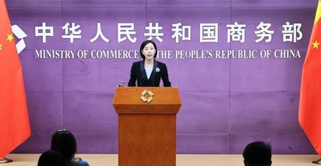

# 商务部：不少外资表示已开始制定集团高层访华日程，积极推动重启项目

中国美国商会等多家外国在华商会近日对中国的重新开放表示欢迎。

**对此，中国商务部发言人束珏婷对第一财经记者表示：“不少外资企业表示，已经开始制定集团高层访华日程，积极推动重启相关项目，并寻求新的投资机会。”**

她表示：“下一步，我们将一如既往扩大外资市场准入，落实好外资企业国民待遇，加大外商投资合法权益保护力度，为外商来华投资创造更多便利条件，努力营造市场化、法治化、国际化一流营商环境，共享中国开放发展机遇。”

**中国主动优化调整疫情防控措施受到外资普遍欢迎**

我国将于1月8日起对新冠病毒感染实施“乙类乙管”。

据新华社报道，国家卫生健康委26日发布公告，将新型冠状病毒肺炎更名为新型冠状病毒感染。根据公告，经国务院批准，自2023年1月8日起，解除对新型冠状病毒感染采取的《中华人民共和国传染病防治法》规定的甲类传染病预防、控制措施；新型冠状病毒感染不再纳入《中华人民共和国国境卫生检疫法》规定的检疫传染病管理。

国务院联防联控机制综合组当日印发《关于对新型冠状病毒感染实施“乙类乙管”的总体方案》。方案指出，综合评估病毒变异、疫情形势和我国防控基础等因素，我国已具备将新型冠状病毒感染由“乙类甲管”调整为“乙类乙管”的基本条件。

根据方案，2023年1月8日起，对新型冠状病毒感染实施“乙类乙管”。依据传染病防治法，对新冠病毒感染者不再实行隔离措施，不再判定密切接触者；不再划定高低风险区；对新冠病毒感染者实施分级分类收治并适时调整医疗保障政策；检测策略调整为“愿检尽检”；调整疫情信息发布频次和内容。依据国境卫生检疫法，不再对入境人员和货物等采取检疫传染病管理措施。

束珏婷对第一财经记者表示：“疫情发生以来，中国政府始终坚持人民至上、生命至上，因时因势优化调整防控措施，高效统筹疫情防控和经济社会发展。在此过程中，商务部持续关注外资企业在华经营状况，充分发挥外贸外资协调机制重点外资项目工作专班作用，与外资企业和外国商协会开展有针对性的常态化交流，积极协调解决疫情对外资企业经营造成的困难和问题，全力保障外资企业生产经营。”

**她表示，近期，外资专班就新冠疫情防控“二十条”、“新十条”、实施“乙类乙管”等措施向有关外资企业和多家外国商协会开展了“一对一”走访了解。中国主动优化调整疫情防控措施，受到了外资企业和在华外国商协会的普遍欢迎，表示优化措施“非常及时，令人振奋”，“解决了外籍人员来华的大难题”，使其“在华发展预期更加稳定”。**

此前，中国美国商会主席华刚林（Colm Rafferty）在接受媒体采访时表示，中国取消对入境旅客的隔离将为正常商务旅行的恢复扫清道路。

**外贸经营管理领域重大改革举措**

近期，商务部取消了对外贸经营者备案登记制度，进一步便利了外贸企业。

对此，束珏婷介绍说，2022年12月30日，十三届全国人大常委会第三十八次会议经表决，通过了关于修改对外贸易法的决定，删去《中华人民共和国对外贸易法》第九条关于对外贸易经营者备案登记的规定。这是外贸经营管理领域重大改革举措，是中国政府坚定推进贸易自由化便利化的重要制度创新。

她表示，外贸经营权是国家赋予外贸经营者的一项基本权利。2004年以来，我国外贸经营权管理长期采取备案登记制，相关市场主体只需完成备案登记即可成为对外贸易经营主体。为进一步优化营商环境，2019年10月，第十三届全国人大常委会第十四次会议通过决定，授权国务院在自贸试验区暂时调整适用对外贸易法第九条，取消对外贸易经营者备案登记，试点三年。

**她表示：“通过对三年试点实践经验进行全面总结评估，我们认为在全国范围取消对外贸易经营者备案登记的条件和时机已经成熟。取消备案登记，将有利于进一步优化营商环境，释放外贸创新活力，推进贸易高质量发展和高水平对外开放。”**

“目前，商务部正在按照党中央、国务院决策部署，指导各地方商务主管部门做好取消备案登记后的工作衔接。我们将继续加强部门协作和信息共享，及时掌握外贸企业生产经营情况，强化外贸形势分析，完善外贸政策措施，不断提升贸易便利化水平，推动外贸高质量发展。”束珏婷称。

中国世界贸易组织研究会副会长霍建国接受第一财经记者采访时表示，我国对外贸易经营权的变化与放开显示了一种进步。这将更有利于企业进一步开展贸易经营，促进外贸发展，同时也是和国际接轨的一种制度型开放。

