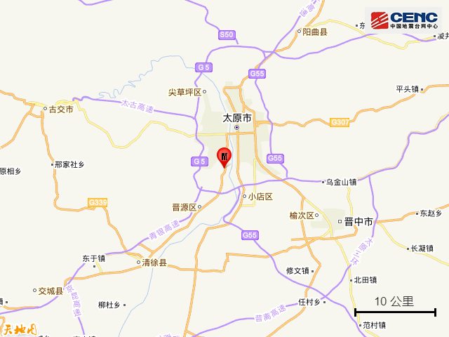
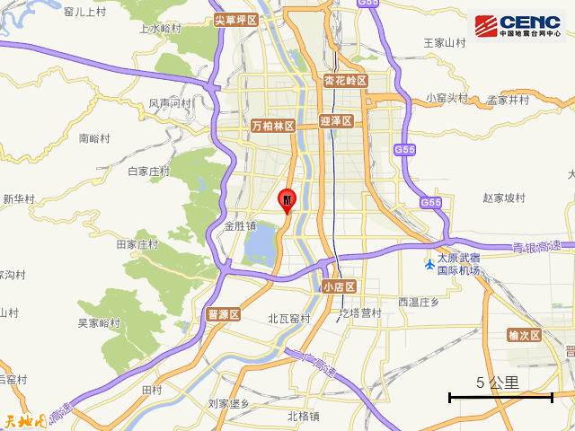
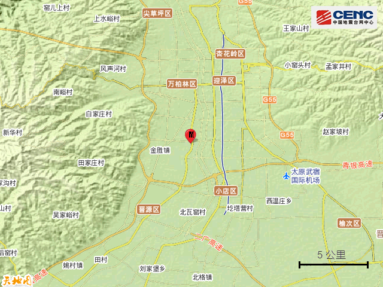
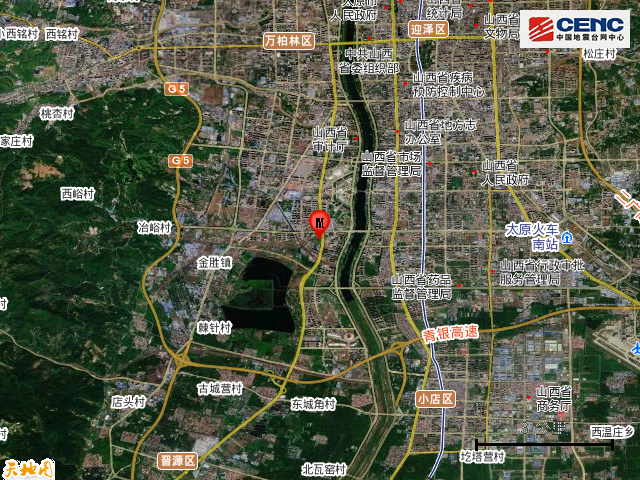
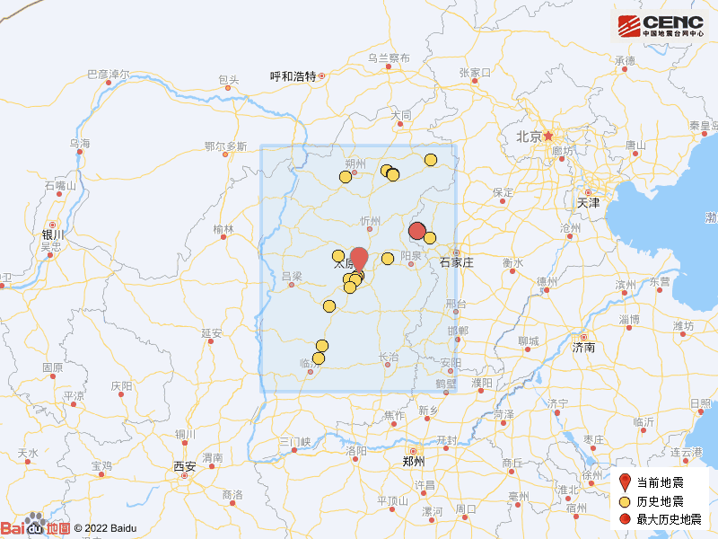

# 山西太原市晋源区发生3.1级地震

据中国地震台网正式测定，1月8日23时48分在山西太原市晋源区发生3.1级地震，震源深度10千米，震中位于北纬37.79度，东经112.52度。

震中5公里范围内平均海拔约777米。

根据中国地震台网速报目录，震中周边200公里内近5年来发生3级以上地震共19次，最大地震是2022年10月3日在河北石家庄市平山县发生的4.3级地震（距离本次震中123公里），历史地震分布如图。

