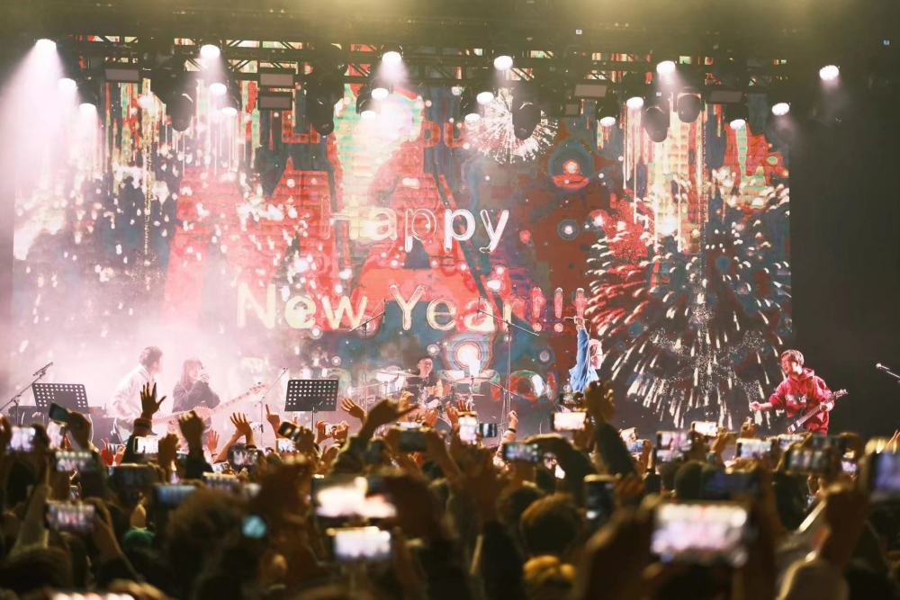

# 线下演出回暖，观众报复性赶场，工作人员：一天上班16小时

本文来源：时代财经 作者：张雪梅

_图源：广州Maolivehouse永庆坊店_

半天时间官宣，一天批文，一天卖票，一场1月8日的老狼专场演出就被直接敲定。“真是极限操作了，狼哥一瓶下肚说干就干。”某livehouse工作人员感慨道。

这样说演就演的情况在过去三年并非易事，艺人、主办方承担着随时喊停的风险，观众则时常遭遇演出取消的无奈。因此，在防疫政策调整后，线下演出链条上的各方迅速有所动作，多场演出官宣，观众也开始“报复性赶场”。

去年12月23日到今年1月2日，11天时间里，阳康的陈琦看了6场演出，为了喜欢的寸铁等乐队，在珠海的她专程4次过去广州，“憋了3个月，很久没pogo（一种摇滚现场最普遍的舞蹈），都快忘记颈椎错位的感觉了。”她表示。

随着薛之谦、曾轶可、詹雯婷等歌手线下演唱会提上日程，崔健、郑钧、汪苏泷等加盟多个音乐节，线下演出的复苏趋势十分明显。时代财经根据大麦网发布的演出统计，12月底-1月初约有50场音乐巡演启动。北京文旅局数据也显示，元旦期间，北京各大剧院演出303场，线下演出场次恢复至2019年水平，其中，脱口秀演出达到106场。

与此同时，黄牛们开始蠢蠢欲动。一周前，王一博、张艺兴等流量艺人加盟的2023年东方卫视跨年演唱会内场名额高达2万多元。黄牛冯昭也在朋友圈庆祝线下演出复苏，她最早出售各类演出门票，疫情期间兼职卖电影票、体检卡等，最近终于回归主场。她对时代财经表示：“过去三年很多演出快开始都会因为疫情原因被临时叫停，现在调整后活动逐渐增加，买票人数在上升，也带动了经济收入。”

**多场演出官宣，乐迷一次性买7张票**

晚上11点多，莫莉才看完一场live准备回家，这是她阳康后看的第一场演出，“去年12月一直在群里云看live，1月开始参与线下，现场氛围真的有种回到疫情前的感觉。”

莫莉是一个千人乐迷群的群主，建群初衷是为了帮助乐迷找到志同道合的伙伴，“当时随手一发没想到会被那么多人关注到，刚开始只认识了十几个人，后来慢慢发展到一千多人，都是喜欢看演出的玩家，一个人去看比较孤单，大家身边可能也没有那么多喜欢同乐队或者时间方便的朋友。”

她告诉时代财经，疫情对于北京来说影响较大，限制比较多，很多场地无法营业，2022年下半年好转后还开放了座席观看，就是为了限制人流和距离。疫情爆发前，她至少1~2个月会看一场演出，疫情后基本半年一次。

莫莉强调，疫情防控措施优化后，群里的乐迷基本上都开始报复性看演出，“之前是没得看，现在因为演出增加，不少乐队的排期撞档，乐迷甚至要忍痛舍弃一些场次，我这个月也买了7场演出的票。”

2022年12月9日，文化和旅游部对相关疫情防控工作指南再次进行调整更新，服务营业场所、娱乐场所、剧院等演出场所、剧本娱乐经营场所均不再要求提供核酸检测阴性证明、查验健康码、开展落地检。

随着防疫政策优化，演唱会、音乐节、livehouse、脱口秀、话剧等线下演出全线回暖。去年12月7日，北京顺义大剧院全面恢复线下演出活动，次日，北京天桥艺术中心宣布正式全面恢复营业，舞蹈诗剧《只此青绿》、舞绘《千里江山图》等演出将相继登台。

与此同时，陈粒、黄明昊、曾轶可等歌手演唱会，以及笑果脱口秀城市漫游均在巡演中，其中，黄明昊演唱会为今年内地第一场体育馆级别的演唱会。千灯湖国潮音乐节、宝藏音乐节等多个音乐节回归，崔健、郑钧、痛仰、气运联盟等歌手、乐队亮相，livehouse也颇有回到疫情前盛况。

Bad
Sweetheart乐队的贺铭洋告诉时代财经，线下回暖的趋势，在刚宣布防疫政策调整的时候，就有比较明显的市场表现，“当时我们上海专场开票后，大概十分钟就全部卖光了。”去年12月，坏甜心乐队在北京、上海、杭州等城市开启巡演，其中，上海与杭州为专场演出。在贺铭洋看来，观众的观演情绪一直都在。

**档期排到8月，员工一天工作16小时**

作为线下演出链条上的关键一环，演职人员对回暖趋势的感受较为明显，相较大型演唱会、音乐节等需要更多准备的线下演出形式，时长更短、场地要求不高的脱口秀和livehouse最先开始恢复正常运转。

2023年元旦，某一线城市的脱口秀演员小杨有一些忙碌，“很多俱乐部都增加了脱口秀演出场次，票卖得也很好，观众上座率相较之前有所增加。”

对他而言，更多的转变来自于心态，他告诉时代财经：“最重要的是演得舒服了，知道演出不会因为别的原因被取消，准备的东西会有一个结果，演员心里有底也更有奔头。此外，俱乐部在卖票的时候也会更大胆一点，有底气租用大的场地，出票也自然增多了。”

对于脱口秀演员而言，另一个感受到复苏的信号来自于行业活动的恢复。元旦期间，辽宁脱口秀厂牌冷厂喜剧的演员们就组团去北京参加了第二届即兴戏剧节，演员之一的小峰哥将其称之为奇妙的跨年夜。他对时代财经称：“回到大连后，厂牌已经开始制定2023年的演出计划了，春节之后每天都有演出，也会在现有演出的同一时间段增加场次。”

livehouse工作人员则从工作时长最直观地感受到线下的复苏。

_图源：广州Maolivehouse永庆坊店_

目前，广州Maolivehouse永庆坊店的演出恢复至一天2~3场，员工灵芝向时代财经透露：“之前最多一天一场，现在基本已经恢复到疫情前的水平。演职人员工作时间也延长了，第一场演出早上10点就要进场，最后一场到凌晨2、3点才结束。”此外，他表示，永庆坊店的演出档期已经排到了8月，目前只有部分工作日场次有空，周末已经全部订满。

2023年，暌违近3年的大型演唱会将会全面回归，根据网传名单显示，王嘉尔2023年国内巡演已在报批中，即将官宣；第二个季度开始，周杰伦、陈奕迅、五月天、林俊杰等歌手将开启内地演唱会。时代财经注意到，社交平台上，不少黄牛已经开始接单周杰伦和张韶涵演唱会的预定订单。

值得注意的是，随着场地人数限制放开，音乐节的票价也有所回落。去年7月仙人掌音乐节999元-2999元的票价曾遭致骂声一片，彼时某音乐节工作人员告诉时代财经：“票价与疫情的关系较大，在防疫政策要求下，可能主办方获批的只有5000到10000人入场，相比过去2万到4万的规模而言，观众人数下降，所以上涨票价进行平衡。”

1月，崔健、郑钧等亮相的宝藏音乐节三日预售票价为588元，痛仰、赵雷、气运联盟、马頔等加盟的大麓青年音乐节双日票880元，较2022年有所回落。

不过，贺铭洋也对之后的市场形势表达了担忧，“2023年预计会有一些境外的乐队来到内地演出，可能会对中小型乐队产生一定的冲击，从乐队的职业化程度、演奏技术作品的成熟度以及音乐工业的完整度来看，境外的乐队还是比较有优势。”

但可以预见的是，无论是国内歌手、乐队、脱口秀演员等回归正常演出状态，还是外国演出团队来华竞争，线下演出市场已经进入井喷待定状态。

（应受访者要求，文中陈琦、冯昭、莫莉为化名）

