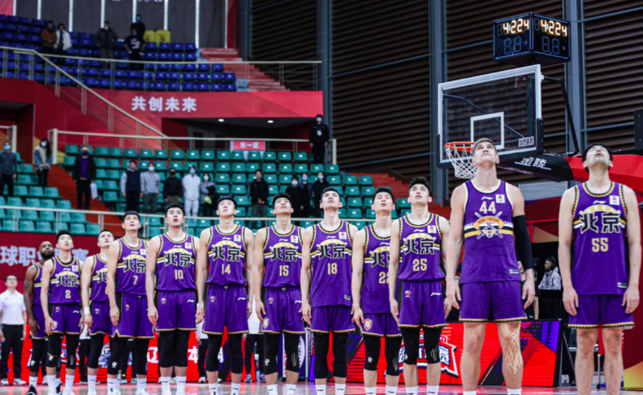
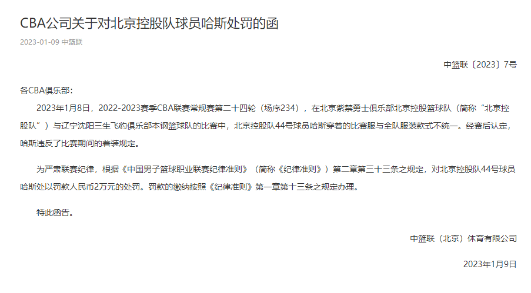
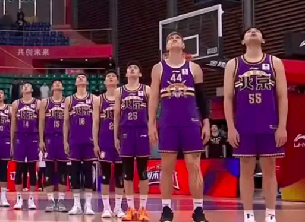
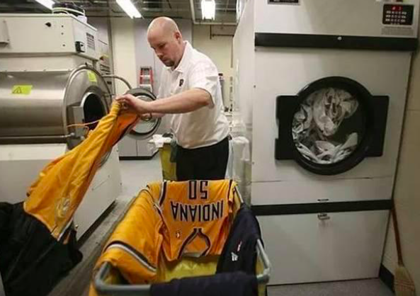

# CBA再开罚单：北控外援因穿错球衣被罚款2万

北京时间1月9日，CBA再开罚单，北控外援哈斯因为着装问题，被罚款人民币2万元。

根据CBA官方的通告，在北控跟辽宁的比赛中，哈斯穿着的比赛服与全队服装款式不统一。经赛后认定，哈斯违反了比赛期间的着装规定。

CBA官方决定，“为严肃联赛纪律，根据《中国男子篮球职业联赛纪律准则》（简称《纪律准则》）第二章第三十三条之规定，对北京控股队44号球员哈斯处以罚款人民币2万元的处罚。罚款的缴纳按照《纪律准则》第一章第十三条之规定办理。”

根据CBA官方的罚单，这是北控自己的问题，并不是装备商服装没有提供到位。确实，在职业联赛中，球衣不一致是相当业余的行为，众所周知，在NBA都有装备经理这一行，负责球员的穿着装备的问题，比赛开始之前，他们要为每一位球员配置好球衣、球鞋以及其他穿着打扮的装备，全部都装在一个箱子里，送到每一位球员的面前。比赛结束后，装备经理也要负责清洗球衣、球鞋以及其他装备。不得不说，CBA在这一方面实在落后。

