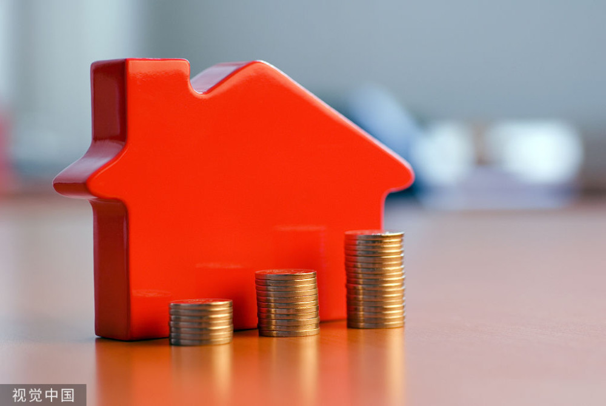

# 事关首套房贷！央行、银保监会最新通知，如何解读？

近日，人民银行、银保监会发布通知，决定建立首套住房贷款利率政策动态调整机制。新建商品住宅销售价格环比和同比连续3个月均下降的城市，可阶段性维持、下调或取消当地首套住房贷款利率政策下限。

首套房贷利率政策动态调整机制的具体内容是啥？该机制意味着什么？“买首套房要大力支持；买二套房要合理支持；买三套以上的原则上不支持”，如何理解这三句政策？现在是买房的好时机吗？会如何影响房企？一起来看本期快问快答↓↓↓

**Q：首套房贷利率政策动态调整机制的具体内容是啥？**

A：人民银行、银保监会在《关于阶段性调整差别化住房信贷政策的通知》中明确，自2022年第四季度起，各城市政府可于每季度末月，以上季度末月至本季度第二个月为评估期，对当地新建商品住宅销售价格变化情况进行动态评估。对于评估期内新建商品住宅销售价格环比和同比连续3个月均下降的城市，阶段性放宽首套住房商业性个人住房贷款利率下限。地方政府按照因城施策原则，可自主决定自下一个季度起，阶段性维持、下调或取消当地首套住房商业性个人住房贷款利率下限。人民银行分支机构、银保监会派出机构指导省级市场利率定价自律机制配合实施。

《通知》明确，对于采取阶段性下调或取消当地首套住房商业性个人住房贷款利率下限的城市，如果后续评估期内新建商品住宅销售价格环比和同比连续3个月均上涨，应自下一个季度起，恢复执行全国统一的首套住房商业性个人住房贷款利率下限。其他情形和二套住房商业性个人住房贷款利率政策下限按现行规定执行。

**Q：该机制意味着什么？**

A：业内专家认为，住房贷款利率政策与新建住房价格走势挂钩、动态调整，有利于支持城市政府科学评估当地商品住宅销售价格变化情况，“因城施策”用足用好政策工具箱，更好地支持刚性住房需求，形成支持房地产市场平稳健康运行的长效机制。

对于首套住房贷款利率政策动态调整机制的建立，仲量联行大中华区首席经济学家、研究部总监庞溟表示，建立首套住房贷款利率政策动态调整机制，说明在坚持“房住不炒”的大方向下，包括首套住房贷款利率政策在内的各项房地产调控措施更为注重科学客观、灵活机动、接续生效。在明确评判标准和操作细节的基础上促进政策优化调整的规范化、常态化、体系化，有利于夯实城市政府主体责任和明晰核心政策目标，丰富“因城施策”“一城一策”的政策工具箱深度、广度和覆盖面，有利于支持刚性住房需求充分有序释放，有利于通过建设长效机制来促进房地产市场平稳理性运行和良性健康发展。

**Q：“买首套房要大力支持；买二套房要合理支持；买三套以上的原则上不支持”，如何理解这三句政策？**

A：这表明，2023年将继续重点支持刚性和改善性住房需求。对于购买首套房的，首付比、首套利率该降的，都要降下来。以旧换新、以小换大、生育多子女家庭都要给予政策支持。与此同时，“房子是用来住的、不是用来炒的”定位不会改变，政策将不给投机炒房者重新入市留空间。

**Q：现在是买房的好时机吗？**

A：2022年以来，各地针对需求端不断出台调控措施，从限购、限贷、限售等政策的调整松绑，到降低首付和房贷利率，再到税费减免等，政策力度不断加大，出台鼓励刚性和改善性住房需求政策的城市日益增多。随着这些政策的落地见效，购房者对于市场的信心逐步恢复，有利于市场企稳回升。预计2023年，刚性和改善性住房需求将迎来更多优惠政策。

对于2023年的房地产市场，中国民生银行首席经济学家温彬认为，在政策支持下，2023年或有更多城市跟进调整房贷利率下限。2022年以来，房地产市场总体疲弱，销售、投资、融资等主要指标经历环比短暂回暖后持续下探。政策从供需两端不断加大支持力度，尤其是年末房企融资端的“三箭齐发”对市场信心有较大提振。但2022年一系列需求侧政策的主要落脚点在于放松准入条件和降低购房成本，但受疫情、就业、收入和房价预期下行等因素影响，居民信心仍显不足，加杠杆意愿并不强烈。市场需求的真正回暖还有赖于防控政策优化后疫情态势的进一步平稳，以及政策层面对刚需和改善性购房需求给予更大支持力度，进而带动居民购房意愿、购房能力的全面提升。

**Q：会如何影响房企？**

A：保交楼是2022年房地产市场的一个关键词，已售逾期的商品房如果一直难以交付，将有损购房者的权益，也极大影响购房者对于市场的信心。从政策性银行的专项借款，到金融系统以信贷、债券、股权“三箭齐发”释放资金支持房地产项目和房地产企业，将明显改善房企融资环境，有利于扭转房企资金链吃紧的状况。已售逾期难交付项目的逐步交付，有望使消费者重拾对市场的信心。

记者：亢舒 陈果静

策划：王玥 高珊珊

监制：代明

审核：张倩

编辑：唐一路（见习）

