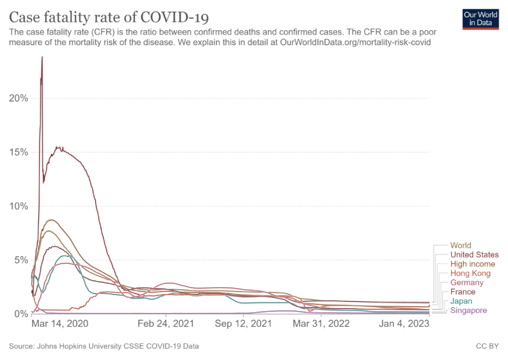
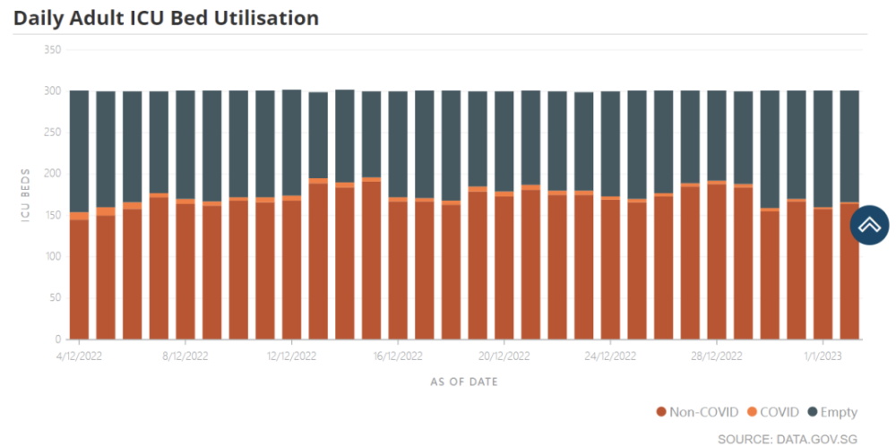
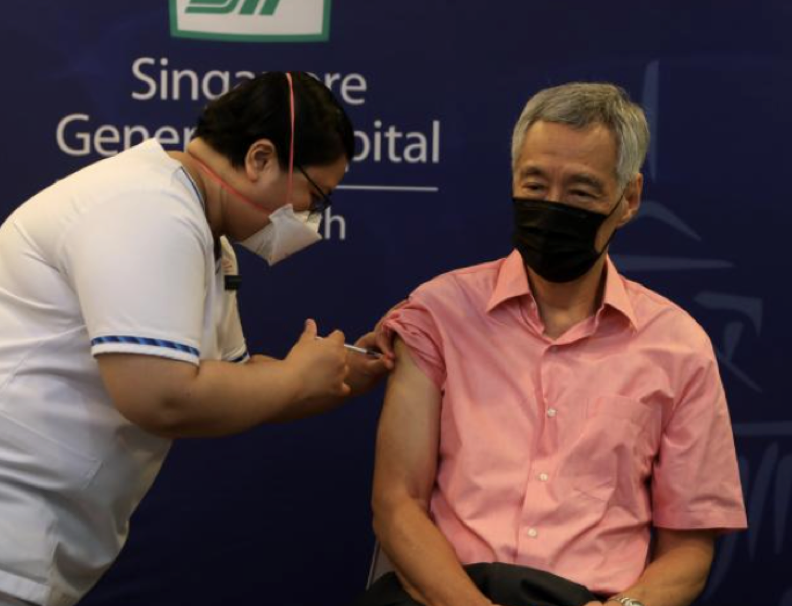
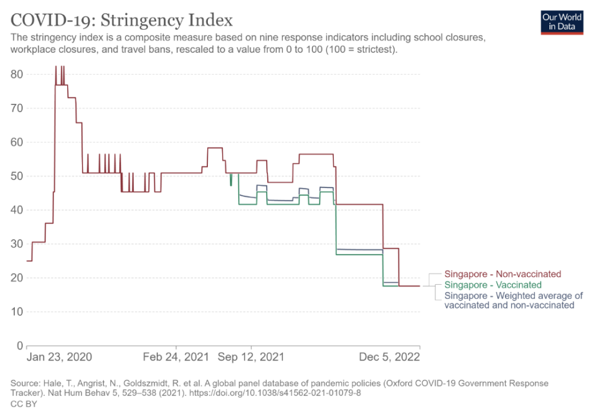

# 作为新冠病死率最低的国家之一，它做对了什么？

作为早期从清零转向共存的国家，新加坡曾经多次面临疫情高峰，但现在仍是全球新冠死亡率最低的国家之一。

据世界卫生组织最近一期的国别报告，新加坡累计新冠病例218万余人，1707人死于新冠，病死率只有0.0783%[1]。截至2022年6月的统计显示，新加坡在新冠大流行期间超额死亡率只增加了万分之2.49[2]。

根据霍普金斯大学新冠数据库的数据，过去三年中，世界新冠平均病死率为1.13%，高收入国家平均病死率为0.86%，香港特别行政区病死率为0.45%，日本为0.20%，新加坡的病死率几乎是最低的。而且纵观整个大流行三年，新加坡基本上一直保持着较低的病死率。

2022年8月29日起，除非搭乘公共交通或者进入医疗设施，新加坡政府不再要求民众戴口罩。10月10日起，所有疫苗接种差异化管理措施被解除，500人以上的活动、夜店ktv、餐饮场所都不需要检查疫苗接种情况[3]。

放开口罩和疫苗限制后，新加坡现在的日常生活几乎和疫情前无异，新加坡政府还计划在春节后解除所有新冠限制措施，彻底实现同新冠共存。

近期新加坡的疫情数据依旧平稳。新加坡卫生部的数据显示，9月22日至11月22日，新加坡新冠感染者的死亡率为：获得最低限度保护的人群（三针mRNA/亚蛋白疫苗或四针科兴疫苗）的总体死亡率为0.024%；在此基础上，过去一年接种加强针的人群的总体死亡率为0.025%（加强针优先照顾老年人和重病风险较高的弱势群体）；未接种任何疫苗人群的总体死亡率为0.067%[4]。

从清零转向共存，新加坡平稳过渡的经验值得借鉴。

**1 每一步都和民众坦诚沟通**

“关键在沟通，新加坡政府每走一步都会和民众透明地沟通。”谈及新加坡抗疫取得的成就时，新加坡眼董事长许振义这样回答。

透明、坦诚是新加坡在疫情期间始终坚持的沟通原则。疫情之初，新加坡总理李显龙要求，把内阁每天收到的详细疫情报告，包括电子表格和数据页都在卫生部网站上公布。

时任卫生部长甘金龙表示，新加坡政府坚持“尽可能透明。我们知道的就是你们将知道的，我们告诉你的就是我们知道的。回答问题时，我们坦诚相待。如果我们不知道就说不知道，我们会去找出答案。”

在信息透明的环境下，民众了解新冠信息几乎没有门槛。打开新加坡卫生部网站，民众可以直接看到过去28天全国感染人数、死亡率、需要吸氧及ICU患者比率。

点开“更多统计数据”，民众能看到本地和外来毒株基因测序的结果，了解国内各类毒株所占的比例，XBB、BQ.1、BF.7这些毒株占比多少，根本不需要猜。民众还能看到过去一个月ICU病房使用率，包括新冠病人、非新冠病人和空置的比率，直观感受到疫情的严重程度[5]。

想去医院，各大医院的床位占用率、入院所需的等候时间都能随手查到。如果担心疫苗有副作用，可以去新加坡卫生科学局（HSA）看月度疫苗的安全报告[6]。

疫苗安全报告极为全面，从皮疹、眼睑肿胀、麻木、脉管炎、头晕及胸痛这类普通不良反应，到过敏和心肌炎等严重不良反应都有记录。并且区分了mRNA疫苗、亚蛋白疫苗、灭活疫苗，以及疫苗前两针和加强针的不良反应率[7]。

新加坡政府的信息服务同样非常周到。这几年在新加坡国立大学读书的梁同学，对这点印象深刻。即使不关心新闻，每天Gov.sg消息平台仍会给他按时推送疫情消息，学校会发邮件分享疫情政策。组屋电梯里几乎没有商业广告，都在轮播疫情的公益广告。“感觉信息是主动来找你的。”

连信息公布的时间都是沟通后的结果。疫情之初政府在深夜公布病例数，这让民众极为焦虑，白天开始传播各种小道消息。了解到这点后，政府把公布时间提前。

疫情严重时，卫生部每天都会公开详尽的疫情信息更新。在疫情最紧张的时间段，卫生部几乎每周都会召开新闻发布会，由卫生部长和其他官员向民众分享疫情进展。

许振义提到，在XBB疫情之初，新加坡卫生部曾估计高峰感染会达到25000人。这个预测数据披露出来这几个，引起部分民众对政府无法继续压制疫情的不满，以及政府会重新收紧防疫措施的担忧。但政府没有选择隐瞒这些预测结果。

“这种透明度加强了公众对医疗系统的信任，即使事情没有按预期进行，它也是公开和诚实的。”许振义说。

信任是抗疫成败的关键。《柳叶刀》2022年初的一项研究发现，一国的新冠感染率和死亡率不能用经济水平、政治制度、国家能力、社会不平等甚至医疗保健水平来解释，最有解释力的因素是社会对政府的信任[8]。

帮助新加坡政府赢得信任的，还有他们沟通上的技巧和诚恳的态度。

新加坡曾是坚定执行清零政策的国家，被多家媒体誉为抗疫典范。要想转向共存，转变民众心理是重要的一环。

第一步是提出路线图。2021年6月24日，联合领导抗疫跨部门工作小组三位领导联名发表了《与冠病共处，如常生活》，提出新冠可能成为地方性流行病，要转向和新冠共存[9]。

转向的关键是疫苗接种。新加坡政府计划到7月初，三分之二的居民要接种至少一针疫苗。2021年8月9日之前，三分之二的居民要接种两针。

共存后的新常态有如下特点：轻症患者不住院、不大规模追踪密接者、监测重点从病例数转向重病人数，插管人数和ICU人数、恢复大型活动、开放边界。

疫情会以什么样的方式结束，新常态下的生活方式是什么样的，向新常态转变的关键因素和时间点是什么？看完这篇文章，民众已经对这几个问题有了大致的预期，不会被突然的开放打得措手不及。

之后，卫生部长宣布从2021年8月10日开始正式分四阶段迈向“与新冠病毒共存”的新常态。在这份路线图里，每一阶段持续多久，会放开什么样的限制都有清晰的规划[10]。

新加坡政府改变民众态的第二步是，引导公众的注意力，改变关注的重点。

在宣布共存前，新加坡就开始了宣传上的准备。根据《金融时报》专栏的说法，宣布共存前新加坡，已经将关注重点逐渐从感染数转为关注重症感染者。

《联合早报》每日疫情图表在2021年6月10日后增加了“ICU&输氧病例人数图”。卫生部公开的新冠监测图表显示大部分病人都是轻症或无症状，自然引导民众去关注重症情况。财政部长黄循财公开表示“新加坡要调整，只关注重症病人[11]。”

在提出共存路线图不久，新加坡爆发了大规模的聚集性疫情。但新加坡没有采取清零时期常用的半封城措施，只是部分收紧防疫措施，这让不少习惯封锁的民众感到焦虑。卫生部长王乙康则在随后部长声明中表示，由于德尔塔病例的传染性，清零是不可能也不可持续的。

王乙康将解释的重点放在重症率上，以缓解民众对感染数激增的恐惧。“过去几周每日感染人数急剧上升，但需要吸氧或入住加护病房（ICU）的重症患者人数仍然相对较少...我们已经成功削弱了感染与重症之间的联系[12]。”

第三点是诚恳的态度。翻看这两年的新加坡抗疫新闻，尤其是高级官员的讲话，谅解、坦白、感谢、辛苦都是高频词。

放开后，新加坡不出意外地赢来了第一波爆发。这波爆发来势凶猛，新加坡被迫停止放开，再次收紧防疫措施。

在疫情高峰时，李显龙出面安定民众情绪。他承认之前预计不足，并且坦陈目前的压力。“由于德尔塔变种病毒的传染性非常强，病例的增幅比我们所预期的高出了许多...未来几个月会是艰难的。我预计在接下来几周，本地的每日病例仍会持续增加。我们的医疗体系将继续承受压力[13]。”

这不是李显龙坦言的唯一错误。许振义回忆，李显龙承认抗疫过程中犯了三个错误，第一是没有尽早强制大家戴口罩，第二是过去对入境旅客的隔离太宽松，导致病例外流，第三是2020年新加坡客工宿舍疫情管控没有做足。

许振义表示，承认眼前的困境和决策的失误，也是赢回认同的方式。“他承认犯错，获得民众谅解的可能就高一点。另外，知错能改，以后犯错机会的可能就会少一些，你会对他稍微多点信心”。

**2 我们将会有控制地开放，我们不想来个大爆炸**

新加坡政府在沟通上取得了良好的成效，但这只是民众心理层面的建设，如果没有充实的物资准备，在现实的压力面前这些心理准备只会瓦解。

李显龙在2022年4月的一次演讲中表示，应对新冠危机，新加坡学到的重要一课是提前计划。他说，“无论眼前的问题有多紧迫，都要提前预测和计划。在整个新冠过程中，我们总是要提前考虑几步，并为不同的突发事件做准备。”

“在我们每天有几十个病例，每天做几百个PCR测试的时候，我们开始考虑当我们有几百个病例，每天需要做几千个PCR测试的时候会发生什么。”李显龙说，"这些应急计划和行动必须提前做好。如果我们等到病例真正激增时才采取行动，那就太晚了[14]。"

2020年疫情之初，新加坡民众也曾经在超市抢购方便面、卫生纸、消毒液，在线上抢购口罩。但从清零转向共存这段时间里，药品、抗原、血氧仪之类抢手的防疫物资，却没有抢购断货一类的情况出现。

许振义也表示，疫情之初口罩和消毒液曾经缺货。但在他的印象里退烧药、特效药、疫苗从来没有缺货，只是特效药需要医生处方，会分配给危重病人。

这要归功于政府的准备工作。在正式放开前一个多月，新加坡政府控股的淡马锡基金开始为所有家庭发放免费血氧仪。各家的邮箱都收到了带兑换券的传单，居民可以在一个月内去各网点兑换血氧仪，出了问题可以更换。血氧仪的说明书不仅说明了用法和指标，还专门提到了“沉默性肺炎”的风险[15]。

新加坡政府还在2021年8月到9月向每个家庭分发了6套抗原，并在10月到12月期间又分发了10套抗原。需要居家隔离自测抗原的密接人员还可以凭身份证件，从新加坡上百个24小时营业的售货机上领取3套抗原[16]。

转向开放前后，疫苗是新加坡抗疫的重点。新加坡的疫苗防线构筑很及时，2021年9月2日，已经有80%的民众实现完全接种，83%的人至少打过一针。脆弱人群的保护尤其到位，70岁及以上老年人口覆盖率达到84%，60-69岁老年人口覆盖率达到90%[17]。

9月中旬，新加坡开始推动加强针接种，首先是推荐60岁以上老年人接种。为了推进加强针的接种，李显龙公开接种加强针，并说“冠病疫苗专家团已建议像我这样的60岁及以上人士、乐龄护理设施住户及有免疫缺陷者接种多一剂疫苗[18]。”

截至10月7日，已经有大约72%的60岁及以上老年人已经预约或接种了加强针。在10月4日和9日，加强针的接种范围逐步扩大到50-59、30-49岁的成年人[19]。

绝大多数人都接种了mRNA疫苗，科兴疫苗占比不到2%。虽然新加坡承认科兴疫苗，但新冠疫苗接种委员会还是建议优先接种mRNA和亚蛋白疫苗，因为它们保护力更强[20]。

新加坡能快速推动疫苗接种，也是建立在前期的准备上。

在世界各国围绕疫苗的争夺战中，新加坡抢在了最前头。早在2020年6月，新加坡就抢先下订单，甚至出溢价购买了莫德纳疫苗，当时各类疫苗还没有完成临床实验。2020年8月，新加坡又和科兴及辉瑞达成协议，12月辉瑞疫苗就到达新加坡。后续新加坡政府还在和其他公司协商，购买其他疫苗作为备份和应急之用[21]。

许振义表示，新加坡政府曾经承认，抢先下单疫苗是新加坡政府下的赌注，冒着部分疫苗研发不成功或者交付失败的风险，但好处是可以第一时间拿到疫苗，为新加坡民众接种。

李显龙曾在演讲中表示，为了实现确保疫苗供应的承诺，新加坡在不同的候选疫苗上花了一大笔钱，而且不是都有回报，但“为了保护新加坡人和加快我们向新常态的转变，这只是一个很小的代价。”

2021年8月31日，新加坡正大力推动全国范围内的疫苗接种工作。在这个关键的时间点上，新加坡外交部还捐助了50万剂辉瑞疫苗给澳大利亚，可见新加坡的疫苗储备充裕到了何等程度[22]。

_新加坡总理李显龙接受第三针疫苗（图源：新加坡通讯与新闻部）_

对新冠口服药物，新加坡也是亚洲最早下手的一批国家。

2022年1月初，新加坡开始和辉瑞药厂谈Paxlovid订单，同时对药品进行审核。2月初，Paxlovid已经到货新加坡，用于治疗住院的新冠患者，3月初更把Paxlovid下发到社区。有重症风险的患者（例如有心脏病、癌症和接受免疫治疗的患者）可以在症状出现5天内去公共卫生准备诊所
(PHPC) 开药。卫生部全额支Paxlovid费用。

新加坡能迅速作出引进药品的决定，可能依靠了内部信息的帮助。台湾学者指出，淡马锡基金是辉瑞的最大领投股东，新加坡很可能参考了辉瑞公司内部的临床数据，帮助政府做出决定。过去全球抢订押宝疫苗时，新加坡就曾经借助过这种优势[23]。

有了各方面的充足准备，“短缺”没有成为新加坡迎接第一波冲击的关键词。

在充足准备的基础上，新加坡的放开仍然非常谨慎。在2021年7月底放开管控措施前夕，卫生部长王乙康曾经说过，“我们将会有控制地开放。我们不想来个大爆炸，然后可想而知地被炸掉[24]。”

对于放开，王乙康最爱用的比喻就是骑自行车下坡。如果任其发展，车会越来越快，最终失控翻车。所以需要不时踩刹车减速，以确保安全到达。管控措施就是放开阶段的刹车[25]。

牛津大学团队制定的严格指数，是新冠管控政策严格程度的指标[26]。从新加坡的数据图上看，转向共存并不意味着180度转弯，一口气取消全部管控政策。而是对接种疫苗（绿色线）和没接种疫苗（红色线）的人群采取不同策略，接种疫苗的人群可以先享受宽松的防疫政策，到下个阶段没接种疫苗的再跟上，一个一个台阶下得非常稳健。

2021年8月10日后，新加坡放宽了防控政策，正式向共存转变，但很快病例开始呈指数级增长。新加坡政府于9月27日后再次收紧防疫政策：居家办公、居家上学、堂食人数限定在两人等。

这次收紧，新加坡卫生部明确提出“必须不断调整我们的措施，来保护我们的医疗保健系统，并确保它不会不堪重负。”
李显龙也表示，“这么做是为了减缓病例的增幅，让医护人员有喘息的机会，让医疗体系能够稳定下来。”

王乙康在接受《联合早报》专访时讲得更为明确，放开后抗疫的重点是减少重症病例，确保医疗设施不会不胜负荷。“要是不能够的话，我们就要坦白跟民众解释，需要收紧防疫措施[27]。”

**3 以重症医疗资源为核心，调整防控政策**

在2021年11月底疫情高峰回落后，卫生部做了一次总结，他们判断疫情状况的主要指标：患者存量、传染率、重症患者数和重症患者率，所有政策都是围绕这四项指标进行调整。

分流轻症患者，把资源留给重症患者，是减轻医疗压力最紧迫的步骤。卫生部曾经表示，放开后重症病人增长率符合之前的预计，但过多轻症患者出于焦虑去医院看病，给医护人员带来了不必要的压力。因此，新加坡整合了已有的医疗资源，建立了为新冠患者提供护理的四层系统。

最严重的病人在ICU接受治疗。新冠治疗设施（CTF）是系统第二层，主要接收老年人和患有潜在的慢性疾病的脆弱人群。

CTF本身没有太多的医疗资源，更多是一个护理和监测设施，和医院相辅相成。如果这里的病人原有的疾病恶化，或者任何有新冠病情恶化的早期迹象，就会被送去医院做进一步的检查。CTF大概承载了10%的患者。新加坡最多同时有9家CTF，这些机构都是在放开后一个半月内建成的[28]。

再下一级是社区护理设施
(CCF)，这里主要是安置轻微症状或没有症状，但又出于各种原因和家人需要隔离的患者。如果居家隔离不方便，可以由患者主动申请到CCF隔离，这里大概承载了20%的患者。

对其他几乎所有患者，居家隔离都是默认选项。2021年9月15日新加坡政府规定，只要完全接种疫苗的12至69岁成年人，没有严重的合并症或疾病，有独立房间，没有超过
80 岁或属于脆弱群体的家人，患病都要居家隔离[29]。

10月中旬开始，除非是1岁以下80岁以上，或者50岁以上没打过疫苗，其他所有患者都默认居家隔离。在《传染病法》的要求下，绝大部分病人都能按要求居家隔离。仅在十月初，居家隔离的人数已经超过总病例数的一半[30]。

此外，新加坡对最脆弱、最容易出现新冠重症的人群进行了着重保护。

9月中旬，政府决定禁止探访养老院，并敦促养老院加快打疫苗的进度[31]。去医院探病也受到了限制，只有孕妇、小孩、无行为能力和危重病人可以允许探访。危重病人可以同时接受五人探访，其他三种病人只能接受一人探访[32]。

新加坡还通过了疫苗接种差异化安全管理措施（VDS），限制没有接种疫苗人群的的行动范围，特别是对老年人常去的小贩中心、食阁和咖啡店进行了细致的检查。这不仅是为了感染拉平曲线，更是保证没有接种疫苗的老年人安全[33]。

为了应对感染高峰，卫生部一直在积极与公立、社区和私立医院合作，为新冠患者预留更多床位。从2021年7月到10月，新冠患者病床的数量从 900
张增加到2500张，到10月底病床数增加到3700张。其中约有170张是ICU病床，另有100张可临时处理ICU病例[34]。

在疫情最紧张的11月初，ICU病床依然没有出现短缺。当时新加坡各医院一共有380张ICU病床，新冠患者占据了三分之二。新加坡国立大学苏瑞福公共卫生学院副院长叶振发认为，这是一个“不错的平衡点”，新加坡吸取了韩国和美国ICU床位短缺的教训，保留了必要时扩充病床供应的能力，又没有空置床位导致资源浪费[35]。

医护人手是另一个难题。政府向社会招募了大量人力，并且询问了新加坡护理委员会注册但暂时没有执业的护士，仅在10月初就募集了900人补充医护人手。甚至新加坡武装部队医疗队的医务人员都被动员参与医护工作。同时，医院通过推迟择期手术和减少非紧急护理服务，空出了20%的总负荷[36]。

不过，当医疗系统的紧张程度有所下降时，新加坡很快开始计划放松管控、回到放开。在9月底收紧疫情政策之前，财政部长黄循财就承诺过，“一旦我们的医疗系统稳定下来，一旦新的医疗能力到位，我们将继续我们的重新开放计划[37]。”

第一波疫情回落后，卫生部立刻放松了管控。卫生部考虑了时机因素，认为放开如果离过年太近，放开管控和回家的人群叠加会引起新的感染潮。另外，卫生部担心，随着时间流逝疫苗保护力会下降，推迟放开会错过这个疫苗高保护力的窗口，导致更多感染。

度过第一波高峰后，由于免疫屏障的建立和医疗系统的完善，2022年奥密克戎和XBB两波疫情高峰都没有对医疗系统造成第一波那么大的压力。XBB疫情甚至没有达到预测中的峰值，使得卫生部提前预备的800张床位出现了300张空缺。政府也没有再度收紧防控政策，只是限制了医院和养老院的探视。

在新加坡读书的梁同学回忆，放开后第一波疫情高峰时，华人社区对新加坡政府的骂声不少。但到了今年，新冠话题已经在新加坡没有太大讨论度，影响甚至不如前一段时间的登革热。

回顾自己的心路历程，梁同学说：“刚来新加坡的时候，还是会对疫情有所担心和畏惧，后来觉得新加坡这边是比较务实，做得还是比较好的。事实告诉我们，新冠没有造成太大影响。”

撰文 | 张天祁

责编 | 徐卓君

**参考文献：**

1.https://www.who.int/singapore/internal-publications-detail/covid-19-in-
singapore-situation-report-70

2.https://www.moh.gov.sg/resources-statistics/reports/report-on-excess-
mortality-during-the-covid-19-pandemic-up-to-
june-2022#:~:text=to%20June%202022-,Report%20on%20excess%20mortality%20during%20the%20COVID%2D19%20pandemic%20up,during%20the%20COVID%2D19%20pandemic.

3.https://www.humanresourcesonline.net/singapore-lifts-all-vaccination-
differentiated-safe-management-measures-chi

4.https://www.moh.gov.sg/covid-19/statistics

5.https://www.moh.gov.sg/covid-19/statistics/

6.https://www.moh.gov.sg/resources-statistics

7.https://www.hsa.gov.sg/COVID19-vaccines-safety-updates

8.https://www.healthdata.org/news-release/lack-trust-has-helped-fuel-
covid-19-pandemic-new-study-shows

9.https://www.zaobao.com.sg/forum/views/story20210624-1160128

10.https://www.moh.gov.sg/news-highlights/details/preparing-for-our-
transition-towards-covid-resilience

11.https://www.ftchinese.com/story/001092969?archive

12.https://www.moh.gov.sg/news-highlights/details/ministerial-statement-by-mr-
ong-ye-kung-minister-for-health-on-development-of-the-
covid-19-pandemic-26-july-2021

13.https://www.pmo.gov.sg/Newsroom/Update-on-the-COVID-19-Situation-In-
Singapore-by-Prime-Minister-Lee-Hsien-Loong-on-9-October

14.https://www.pmo.gov.sg/Newsroom/PM-Lee-Hsien-Loong-at-the-Administrative-
Service-Appointment-and-Promotion-Ceremony-2022

15.https://www.temasek.com.sg/en/news-and-resources/news-room/news/2021/one-
free-oximeter-for-every-singapore-household

16.https://www.moh.gov.sg/news-highlights/details/collection-of-free-antigen-
rapid-test-kits-from-vending-machines-for-self-tests-given-emphasis-on-
personal-responsibility

17.https://www.moh.gov.sg/news-highlights/details/strengthening-our-tools-to-
achieve-covid-resilience_3Sep2021

18.https://www.sgh.com.sg/news/covid19/-PM%20Lee%20receives%20COVID-19%20vaccine%20booster%20shot

19.https://www.straitstimes.com/singapore/covid-19-booster-shots-for-
healthcare-workers-frontline-workers-and-those-30-and-above

20.https://www.straitstimes.com/singapore/health/askst-what-i-need-to-know-
about-singapores-new-covid-19-vaccination-strategy

21.https://www.straitstimes.com/singapore/health/how-singapore-picked-its-
covid-19-vaccines

22.https://www.mfa.gov.sg/Newsroom/Press-Statements-Transcripts-and-
Photos/2021/08/20210831-dose-sharing

23.https://www.cw.com.tw/article/5120913

24.https://www.moh.gov.sg/news-highlights/details/ministerial-statement-by-mr-
ong-ye-kung-minister-for-health-on-development-of-the-
covid-19-pandemic-26-july-2021

25.https://www.moh.gov.sg/news-highlights/details/opening-remarks-by-minister-
for-health-mr-ong-ye-kung-at-covid-19-multi-ministry-taskforce-press-
conference-on-8-november-2021

26.https://ourworldindata.org/covid-stringency-
index#:~:text=The%20stringency%20index%20is%20a,100%20(100%20%3D%20strictest).

27.https://www.zaobao.com/news/singapore/story20210922-1195936

28.https://ask.gov.sg/questions/503

29.https://www.moh.gov.sg/news-highlights/details/antigen-rapid-test-kits-
vending-machines-deployed-islandwide-and-updates-to-home-recovery-and-travel-
classifications_17Sep2021

30.https://www.straitstimes.com/singapore/icu-capacity-to-be-ramped-up-
covid-19-treatment-facilities-to-have-3700-beds-by-end-oct

31.https://www.moh.gov.sg/news-highlights/details/enhanced-measures-for-
residential-care-homes

32.https://www.moh.gov.sg/news-highlights/details/tightened-measures-to-
reduce-hospital-covid-19-transmission-and-preserve-hospital-capacity

33.https://www.moh.gov.sg/news-highlights/details/opening-remarks-by-minister-
for-health-mr-ong-ye-kung-at-covid-19-multi-ministry-taskforce-press-
conference-on-15-november-2021

34.https://www.moh.gov.sg/news-highlights/details/update-on-hospitals-
capacity-and-manpower-situation-in-managing-the-covid-19-surge

35.https://www.scmp.com/week-asia/health-environment/article/3154538/can-
singapores-health-care-system-cope-its-biggest

36.https://www.moh.gov.sg/news-highlights/details/measures-to-alleviate-
healthcare-manpower-crunch-from-recent-surge-of-covid-19-omicron-variant-
cases-and-resignation-rates-of-healthcare-workers-in-2021

37.https://www.straitstimes.com/singapore/reopening-to-resume-once-new-
covid-19-healthcare-protocols-stabilise-lawrence-wong

制版编辑 **|** 松仪

