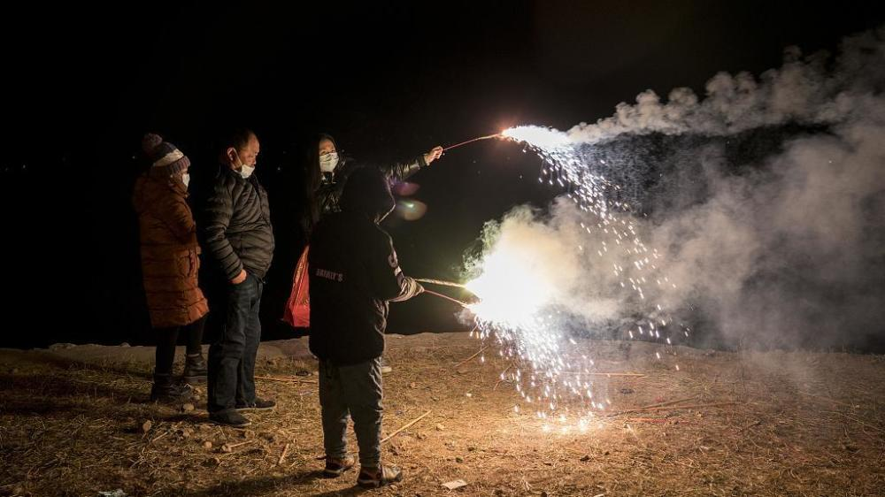

# 再添一城除夕夜不禁烟花，多部门近年引导各地避免禁放一刀切

据辽宁盘锦市政府网站1月8日消息，盘锦市政府当天作出《关于2023年春节期间烟花爆竹燃放管理的通告》称，2023年春节期间全市域范围内实行烟花爆竹限时燃放。

盘锦市规定，1月14日(腊月二十三)、1月21日（除夕）至26日（正月初五）、2月5日、6日（正月十五、十六），每日7时至23时（除夕夜不限时），可以燃放烟花爆竹。其他时间禁止任何单位和个人燃放烟花爆竹。

对于小区烟花爆竹燃放的管理，盘锦市政府规定，由物业服务企业或社区划定小区内烟花爆竹燃放区域。烟花爆竹燃放期间做好巡查值守、安全防火工作，及时劝阻和制止业主不规范燃放行为。节日期间，物业服务企业做好清扫保洁，烟花爆竹燃放遗留物在消除复燃起火隐患后，及时收集由环卫部门进行集中转运处理。

此前，2022年12月30日，辽宁大连市政府发布《关于做好2023年烟花爆竹燃放管控工作的通告》：控制燃放区域允许燃放时间为2023年1月14日（腊月二十三）、2023年1月21日（除夕）至2023年1月28日（正月初七）、2023年2月5日（正月十五）,每日7时至23时；控制燃放区域之外的地区允许燃放时间为2023年1月14日（腊月二十三）至2023年2月5日（正月十五），每日7时至23时。控制燃放区域有：中山区、西岗区、沙河口区、甘井子区、高新园区全域，其他区市县（先导区）建成区为控制燃放区域。其他时间，禁止一切单位和个人燃放烟花爆竹。

除辽宁盘锦、大连外，山东东营、滨州等地明确春节期间在部分区域和个别时间段可以燃放烟花爆竹。

根据《东营市烟花爆竹燃放管理暂行办法》，在全市禁燃禁放区域内， 可以燃放烟花爆竹的时间分别是农历腊月二十三、除夕至正月初五，以及正月十五。

据滨州市政府官网发布的《滨州市烟花爆竹燃放管理办法》，在滨州市主城区（东、西、南、北外环路以内），县（市、区）城区建成区限制燃放，
即自除夕至正月初五、正月十五可以燃放，其他时段不得燃放。

春节临近，是否燃放烟花爆竹的话题引发热议。

据人民政协网1月9日报道，宁波市政协十六届二次会议上，市政协委员屠嫩斐呼吁协调环保、安全和年俗仪式感之间的平衡，将宁波市烟花爆竹“禁燃令”改为“限燃令”，找回更多“年味儿”。

屠嫩斐建议，在年味、安全和污染之间找到平衡，尽快推进烟花爆竹依法规范、依法管理，启动《烟花爆竹安全管理条例》的修订工作，将燃放烟花爆竹对空气质量以及安全的影响控制在最低限度。

据中国新闻周刊1月7日报道，目前，《烟花爆竹安全管理条例》仍在修订中。澎湃新闻注意到，《烟花爆竹安全管理条例》的修订工作，涉及避免“禁放”一刀切全面（全区域、全时段）禁放烟花爆竹等内容。

应急管理部网站2019年12月13日公布对全国政协委员诸葛彩华《关于合理引导和规范烟花爆竹生产经营燃放，促进产业良性发展的提案》的答复称，2013年以来，烟花爆竹安全监管部际联席会议多次专题研究了《条例》修订工作，应急管理部会同公安部等有关部门深入研究诸葛彩华和相关人大代表、政协委员及相关单位、个人提出的意见建议，在修订《条例》工作中，对相关原则性规定予以细化，充分听取相关企业和行业协会商会的意见。应急管理部、公安部等有关部门积极引导各地方政府权衡利弊、科学评估、听取群众意见，综合考虑大气环境容量、传统习俗等因素，合理制定本地区烟花爆竹禁限放政策，科学规划烟花爆竹禁限放区域、时段，
**避免“禁放”一刀切全面（全区域、全时段）禁放烟花爆竹**
，鼓励地方政府、企事业单位、社会团体在春节、元宵节、中秋节等重大传统节日期间和庆典活动中组织专业燃放。2018年，应急管理部、公安部、交通运输部、市场监管总局《关于做好烟花爆竹旺季安全监管工作的通知》，再次明确地方人民政府要科学合理制定烟花爆竹禁放、限放政策，引导有燃放意愿的人民群众依法、安全、文明燃放烟花爆竹。

应急管理部在这份答复中表示，目前，全国烟花爆竹标准化技术委员会正在组织修订《烟花爆竹安全与质量》、研究制定《烟花爆竹环保性能评价方法》，将对个人燃放类烟花爆竹进行细分，明确安全环保技术指标，对烟花爆竹环保性能进行分级评价，考虑制订安全系数高、环境影响小、适宜于大部分区域燃放的烟花爆竹产品级别类别标准，以及适宜城市燃放的城市烟花标准，为地方政府因地制宜制定烟花爆竹燃放政策提供技术依据，为消费者选择适用的烟花爆竹产品提供指引，为烟花爆竹行业转型升级营造积极稳定的环境。

