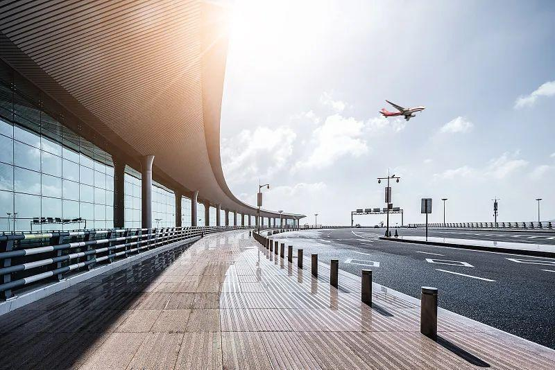
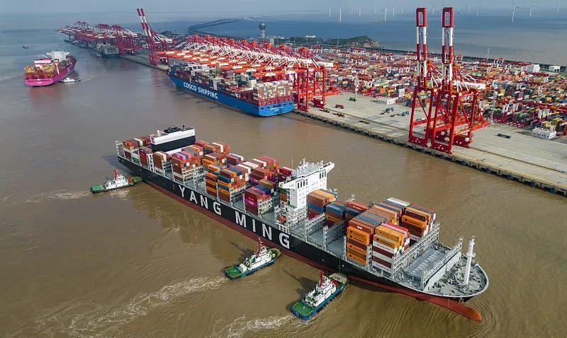
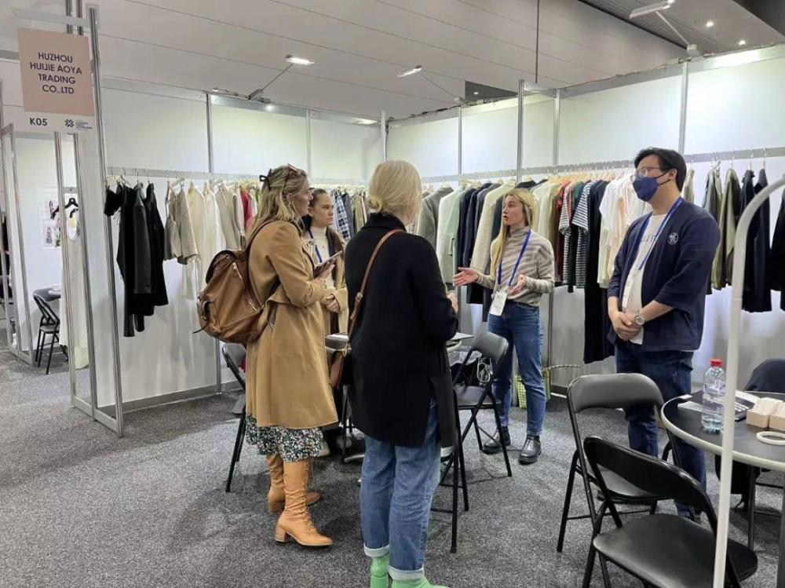
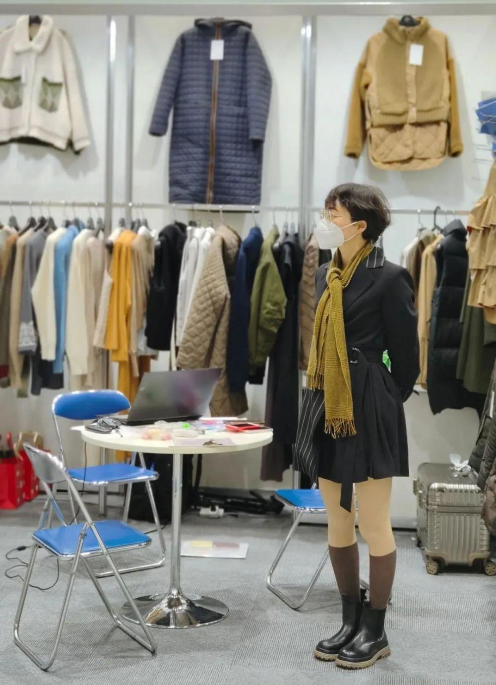

# 包机出国抢单，中国商人回到水域：寻回错过的订单、“失去的三年”

**文｜** 林松果

**编辑｜** 姚璐

**图｜** 受访者提供

**一趟酝酿了半年的航班**

2022年12月4日，中午时分，东京成田机场，一架来自中国杭州的航班降落。这是一架引人注目的航班——人坐得特别满，行李也尤其多，是寻常航班的两倍，落地出关，很多人脸上都有一种纾解的愉快感。

这架航班的乘客手持的登机牌，也不是常规的登机牌，是一张特殊的纸，上面注明了“包机”。一位乘客去免税店，店员没见过这种登机牌，小心翼翼地问他：“请问，是您的私人飞机吗？”

这是浙江嘉兴市政府组织的包机。这趟航班的96位乘客，大多是嘉兴、杭州等地纺织行业的从业者，另外就是来自嘉兴商务局、外事办、卫健委的工作人员。他们此行，是要参加缺席三年的亚洲纺织成衣展（AFF展），这是亚洲纺织行业的一个大展。另外，他们还要拜访阔别已久的客户，寻回错过的订单、“失去的三年”。

落地东京，48岁的纺织商人徐益红体会到的，首先是一种陌生感。她从事对日贸易接近20年，去过日本无数次，但在三年的隔绝之后，重新与人面对面说起日语，她“有种不习惯的感觉”。她去参加展会，老客户去看她，在她摊位前站了很久，太久不见，她已认不出对方，心想“这个人怎么这么奇怪，一直站在这里”，最后才有些窘迫地把他们迎了进来。

对徐益红的同行、另一家纺织企业的经理华一帆来说，三年后再到日本，他经历了一番庄重的准备，他带上了锦鲤形状的绿豆糕，为每个客户准备了伴手礼——他们公司生产的运动内衣。两天时间，他去了三个城市，见了五家客户。他想告诉老客户，他们还在扩展新产品；也拜访了只在网上聊过天的新客户，对方下过一些小订单，但始终没有给出核心订单，而见面会带来信任，这像金子一样珍贵。

还有人准备的东西之多，装满了十几个30寸的行李箱。航班特地增加了一辆行李车。有人准备了喜糖、相框和耳塞，这都是给日本客户的礼物。

一个月前，浙江打出“千团万企拓市场抢订单”的口号，由商务部门带队、包机，带领外贸企业出国寻找订单。根据官方披露的数据，参与的企业接近10000家。而嘉兴市政府的这趟包机，是其中规模最大、人数最多的之一。

这趟航班并非临时起意——包机回国之后，我们去到嘉兴，见到了带队出国的嘉兴市商务局外贸处处长陆建良，他告诉我们，这次出行，从2022年6月就开始酝酿，经过反复、犹豫、审时度势，终于在12月起飞。

他们决心要出去，这是一种本能，“浙江人有一个特点，我们对世界的气候很敏感，气候变化了，我们会捕捉到，我们也必须顺应这种气候”。

在长久的隔绝之后，外贸商人终于再次与世界汇流。去往不同国家的他们，也首先捕捉到了世界的变化。住在东京池袋附近，华一帆发现街道似乎比三年前萧条了一些，城市里的店铺和灯光，熄灭得更早了；去往澳大利亚的纺织商人马杰的感觉是，通货膨胀明显影响到了日常生活，原来他在墨尔本租车一周，大概花费两三千人民币，这次再去，价格翻番了；而去往迪拜参会的宁波商人李启涵，也感受到了开拓新市场的难，但他很高兴的是，他去的时候正是世界杯时间，和当地人一起喝酒看球，他感受到了久违的自由和快乐。

不管水温是高是低，至少此刻，他们回到了这一片水域。

_浙江嘉兴市政府组织包机参加缺席三年的亚洲纺织成衣展（AFF展）图源嘉兴发布公众号_

**“失去的三年”**

为什么包机自浙江始，为什么嘉兴等地的筹划会这么早，到了当地，这些答案都会变得清晰——在嘉兴城里逛一圈，肉眼可见的，这片土地与世界的交集如此之深。

嘉兴平湖是一座纺织大城，箱包的王国，城区随处可见高楼和纺织城，都以“国际箱包城”命名。在平湖经济开发区，可以看到写着英文、日文和韩文的厂房，有许多日本电器企业、韩国食品企业。工厂巨大的管道穿过街道上空，来往的卡车发出轰鸣。在大工厂附近，还存在着无数小工厂、小作坊，它们遍布城郊与村庄，是附生在大树阴影下的蕨类和苔藓，也是国际化链条中微小但重要的一环。

乘坐包机去往日本的徐益红、华一帆，他们都来自这样的小微企业，全公司不过十几人。过去三年，新冠疫情、防控政策以及国际局势，都切实地影响着他们的生计，制造了清晰的痛感。

说是失去的三年，或许还不太严谨——徐益红和华一帆都觉得，在2020年和2021年上半年，他们的订单量减少得不算多，有的企业甚至还承担了额外的订单——当时东南亚疫情相对严重，生产不稳定，订单回流到了中国，这是一波“意外的红利”。在嘉兴，很多老板为了把这些多出来的订单“吃下去”，甚至临时在安徽、山东、河南等地开厂，招当地人，订单做完了，就直接把厂关掉。

但到了2022年春天，情况变得有些糟糕。湖州纺织商人马杰，对此感受最直接。他今年40多岁，拥有一家商贸一体的公司，有30多位员工，主要做出口澳大利亚的高端女装。之前两年，虽然外销受影响、订单减少、海运费直接翻番，但他还能勉强保本，不赚钱，但仍在勉力支撑。2022年上半年，上海封城，他的产业链，无论是客户、货运还是生产，几乎都在江浙沪，每个环节都瘫痪了，就这三个月，一百多万亏光了。

上海港作为世界上最大的集装箱港口，一年的吞吐量已经超过4700万标准箱，一直是全球保供的重要环节。当时有一位专家断言，“如果我们这个城市停下来，东海上就会多出很多漂在海上的国际货轮”。马杰的遭遇，是当时许多中国外贸商人的缩影。

_满载集装箱的集装箱货轮驶离上海洋山深水港区码头。图源视觉中国_

也是因为这个原因，整个2022年，许多外贸企业都需要向外国客户证明，他们可以保交付。

徐益红当时也接到了一个订单，几千件衣服，是个珍贵的大单，但日本客户其实很犹豫，“你怎么确定一个月后可以交？如果封控了怎么办？”徐益红提出的办法是，把这个订单分拆给两个工厂，她信任江浙沪的管理水平，所以两个工厂都在江浙沪，但保险起见，它们在不同省份。她说自己没办法向对方解释，“不管怎么说，都太苍白”，但最后很幸运，订单准时完成了。

制造业就是这样，劳动密集，利润微薄。而外向型的行业，还会受到更多因素的影响，不管是遥远的、可见或不可见的战争，还是别国的政局……社会气候的微小变化，都牵动着无数人、无数家庭的生计。

比如2022年的日元贬值，徐益红和日本客户交易用的是美金，但同样数额的美金，最夸张时，比起以前，日本客户要支付多40%的日币。对方只能砍价，但这行本身就是微利，徐益红也无法大幅让步。日本客户只能去往越南，寻找能提供更低价格的人。艰难时世中，价格就是命脉。

甚至还有一年，徐益红接过法国的一个订单，但那年法国遭遇恐袭，客户因此受到影响，中止了订单，但徐益红已经垫资生产，那一单，她就亏损了几十万。

再比如几年前开始的中美贸易战。宁波的一家服装公司，过去十年里一直为美国的CK、Ralph
Lauren等大型服装企业提供辅料，但这两三年，来自美国的订单减少了40%。公司老板李启涵告诉我们，这些订单大多转移到了越南和印尼。2020、2021两年，他每年的亏损在2000万左右，公司也从原来的50人，裁到只剩20多人。

老用户流失了，必然要去拓展新用户。但服装行业是非常传统的行业，商人们依靠全世界的大型展会，依靠面对面沟通，依靠勤勤恳恳的一次次打样、小单到大单，开拓新的市场。国境锁闭，让过去的这种交流方式变得不现实。

难捱的2022年春天，徐益红爱上了钓鱼——这是她解压的方式。她只有初中学历，从工厂流水线女工做起，又自学日语，30多岁开了这家公司，很辛苦地经营了十几年。你可以想象，她是那种不会停下来的人。但在2022年春天，真的是生死存亡的时刻了，她能做的事情又太少。每天早上6点，她就出门，在河边钓到上午10点，才有勇气回到办公室，面对一屋子员工，大家“你看看我，我看看你”，实在没事做了，她就让大家做点样衣，给客户寄过去，有些心理安慰。

最难过的时候，几乎每家公司的老板都想过出国去找客户，但困难相当多：办不下来的签证、动辄几万的机票、长达14天的入境隔离……直到2022年9月的一天，徐益红收到了朋友发来的消息，嘉兴市要包机带大家去日本，参展、见客户。她马上报了名。

那时局势还不明朗，一些人担心会感染，但徐益红不怕，她“就盼着（出国的）这一天”。后来到了日本，见到老客户，她跟他们开玩笑说，必须要来，“不是我死就是公司死”，她笑，“那还是我死比较好”。

_马杰在展会上和客户交流_

**与世界合流，作为一种本能**

2022年12月29日，我见到了嘉兴商务局外贸处的处长陆建良，日本之行的策划者之一。陆建良有一头显眼的白发，说话有吴语口音，条理清晰，语速很快。疫情正在嘉兴过峰，在空荡荡的办公室里，我们各自戴着口罩，隔着好几米，聊了聊这次的日本之行。

陆建良说，他们这次出行，最根本的动力是企业的呼声。这三年，嘉兴的传统行业过得不容易。

嘉兴是典型的外向型经济，GDP六成是由外贸行业贡献的。嘉兴外贸的整体数据这三年依然是正增长，但行业已经出现巨大分野——大的新能源、光伏、电子科技企业，大幅拉高了整体增速，而像纺织这样的传统行业，总量一直在下降，“在走下坡路，艰难为生”。

纺织业曾是嘉兴的支柱产业，改革开放后，这里诞生过国内最大的绢丝企业。嘉兴的海宁、平湖，都是全国知名的纺织基地。嘉兴城区甚至有一条主干道就叫“纺工路”。它给嘉兴人带来过巨大的财富，但最近这些年，受产业转移、劳动力成本上升、贸易摩擦等因素影响，“寒流”已经出现。疫情三年，更加剧了这种寒冷。

陆建良第一次注意到企业想往外走的声音，是2021年秋天，当时世界从疫情海啸中逐渐恢复，停摆了一年多的展会陆续恢复。

全世界都没放开的时候，大家心态还好，可以想别的办法，比如线上办展。但现在展会开了，中国商人出不去，本来属于中国的场地和市场，你要不去，别人就拿走了。也有人会想办法，比如在展会当地请人布展，这叫“代参展”，但这也有问题，比如请的当地人不熟悉纺织行业，最多能报报价，谈不了细节，效果自然打折扣。

陆建良记得，大概就是从那时起，不仅是嘉兴，其实整个浙江政府都在想，怎么把企业带出去——世界的气候变了，最能捕捉世界气候的浙江人，必须与这种变化合流。

2022年，浙江许多城市都开始出台政策，鼓励企业出国参展，机票和展位费政府报销一半。包机的想法，也很早就出现了。

2022年6月，嘉兴商务局开始酝酿包机。包机解决的问题有三：首先是出国机票太贵，包机更便宜；二是当时国际航班经常熔断，出去了可能回不来，包机更有确定性；第三，包机是统一行动，政府工作人员跟随，做好服务，企业没有后顾之忧；再有一点，政府带队，做好榜样，大家会更有底气和信心。

当时嘉兴商务局征求意见，询问大家是否愿意包机去日本，报名的企业并不多。那时日本每天新增25万病例，一些人还是有顾虑。在当时的背景下，航班和签证办理也变得更困难。

但就在同一时间，浙江宁波，第一架飞机已经准备起飞。宁波在6月13日召开会议，探索包机的可行性，市政府、商务、交通、外办等部门联动，7月12日，飞机就出了国。《宁波日报》描述了这次包机的意义——飞机上的企业，体量不算大，但背后是宁波2.4万家中小外贸企业的缩影，也关系着近10万家制造业工厂。宁波是一座号称“每四个人里就有一人从事外贸行业”的城市，这是经济的“根脉”。

宁波这次出行，也有一个寻回订单的典型故事——宁波一家门窗公司有个波兰老客户，订单量大且稳定，能占公司订单的四成，但就在2022年春天，订单慢慢消失了。公司老板丁言东发现，客户被收购了，素未谋面的新老板希望换掉他们。上飞机前，丁言东复盘了这家客户此前多年的需求，想到对方曾提到一个工艺，当时自己觉得达不到，拒绝了，但这次他们赶出了一个可行性方案，带着方案到了波兰，拿回了百万美元的订单。结束所有拜访时，为了庆祝，他没有坐火车，而是打车回到了驻地，花了190多欧元。

宁波、海宁……包机的城市越来越多。2022年9月，嘉兴商务局再次广泛征求意见，决定组织纺织企业去日本参展。10月开始筹备，联系航空公司招标，最后由首都航空以140万的价格中标，负责这次出行。机组成员飞到日本，再空机回国隔离，七天后再飞到东京，接大家回国。

包机的费用，嘉兴市政府补贴了一半，乘客支付一半，机票每人7500元。回国隔离同样也打了五折。

包机出发的12月4日，国内还未完全开放，有几位不幸运的乘客，起飞前小区被封控，最后没能成行。

_华一帆的同事在日本展会现场_

**自愈的信心**

2022年12月末，在嘉兴秀洲区的办公楼里，我也见到了华一帆。他刚结束隔离不久，回到公司上班。他们公司不大，十张左右的办公桌，随处堆着各种布料和服装样品，角落里放着人体模特和缝纫机。那天华一帆很忙，一直在和客户沟通各种信息。

这次去日本的大多数人，拿到的成绩都还不错。华一帆出发时，想的是日本经济也不太景气，能有两三百万美金的订单已经很好，但他最后拿到的订单，超出了这个数额。不过日本市场也在变，现在消费者追求性价比更高、更有风格的产品，这意味着订单也会更碎片化，他们要更辛苦一些。

徐益红也是相似的情况，以前她发展新客户，靠的是老客户的推荐。这是她第一次参加展会，认识了十几家有意向的新客户，从邮件往来，到报价、洽谈、做样衣，订单是可期的。

但在他们回国后，又发生了另一件想不到的事情——国内疫情防控措施调整，短时间内，各地都在经历疫情高峰。好不容易有了订单，但遇上工人生病，生产线环环相扣，联系相当紧密，一环停摆，全线也随之瘫痪——制造业是如此深地被现实影响。

华一帆举了个例子，他们正在给日本客户做一款两件套的风衣，这是2023年春天的款式。面料染色和裁剪已经完成，但负责缝制环节的安徽工厂停工了——工人有的是自己发烧，有的担心家里的老人，早早放假回了老家。这个订单就停在这里，虽然有一部分衣服已经完成，但因为尺码不全，也无法在日本上架。好不容易抢来的订单，华一帆现在或许要退掉一些。

不过，对于乐观坚韧的中国商人们来说，这或许是暂时的烦恼、甜蜜的负担。更多的人已经不在意政府是否包机，补贴有多少，不管机票多贵，他们也在这个冬天走出了国门。

宁波的服装商人马杰，就是自费买了机票，坐上了去澳大利亚的飞机。这次参展，他拿到了50多张名片，其中有17家客户，双方都觉得合适，正在谈合作。12月初落地澳洲，他印象最深的只不过是，不用再扫码，走进餐厅就有服务员来点餐，他还想着要在墨尔本看一场正在巡演的音乐剧《汉密尔顿》，这是疫情前最普通、最正当的生活。

同样是宁波的服装公司，宁波索科公司的董事长李启涵去往阿联酋寻找新客户的同时，他的同事去到了美国，去见不再给他们订单的老客户。到了美国，真的见了面，好像事情比想象中简单——订单很容易就拿回来了一部分。合作多年，情谊还在，所谓“见面三分情”。

_李启涵公司的展位_

我们也和每位采访对象都谈起了同一个话题：国门开放了，他们怎么看待制造业向东南亚的转移，这是否会威胁到他们的生计？

大家表达的是相似的态度：中国依然有它不可替代的地方，比如产业链完整、品质高、交期快。从纱线变成面料，面料变成衣服，这个过程在中国大陆，甚至是在浙江一个省就可以完成。从一针、一线、一个纽扣、一条拉链，到一台缝纫机、一位工人，这个链条十分完整，这是改革开放几十年攒下来的家底。

除此之外，徐益红说，她之所以有信心，是因为她相信浙江的务实和开放。而马杰觉得，中国企业的韧性是第一位的，无法被剥夺的。

也就是在他们回国后不久，风向变得更加明确。12月15日的中央经济工作会议，强调“坚持推进高水平对外开放”，“要继续发挥出口对经济的支撑作用”。

12月26日，嘉兴出台新政，2023年一季度去境外参展的企业，都会获得50%的机票补助、全额的摊位费补助。这是更进一步的鼓励。

但在采访的最后，马杰也反复向我厘清一个概念，他不认为中国企业现在做的事情，是在“抢单”——出国见客户、参加展会，这是外贸人正常的生活，他们只是获得了曾经失去的东西。

“就像一条街上本来有很多家面馆，但是有一家关门了一段时间，现在又开了，开始正常做生意，这不是在抢。”他说，“这是我们正常工作的一部分。”

他们期待的是秩序恢复，重新与世界并轨。接下来，或许不再需要政府包机，也不需要鼓励和补贴——航线会增多，机票价格会降下来，商人们会没有阻碍地走出去。

2023年，新的春天很快就要来，华一帆和徐益红都在规划日本的行程，而李启涵说，他也要去美国会会老朋友，还想去东南亚看看新的市场是什么样子，要知己知彼，看能不能找到更多的机会。

他们对未来的预期，不是百分百的乐观，但也不坏。就像马杰在电话里跟我们说的那样：“市场有市场该有的样子，优胜劣汰，一些不太好的企业是会倒下，但是还有新兴的企业会站起来。就像会有人去世，会有婴儿出生。社会受到的创伤，就像手刮开了一道伤口，但也不用着急，随着时间会慢慢自愈。”

_国外的展会中心_

