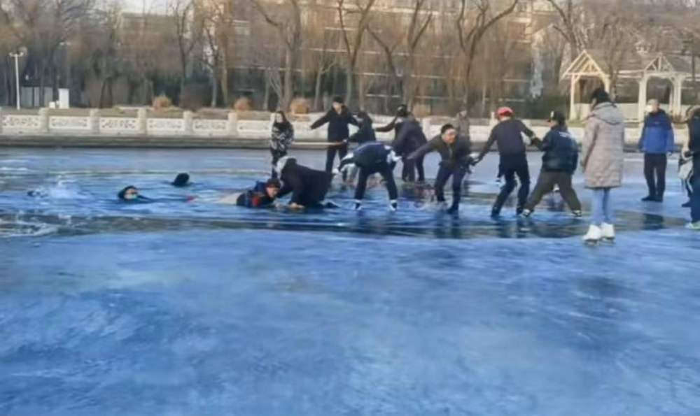

# 北京展览馆后湖多人滑野冰落水，记者探访：仍有人在冰上玩耍

新京报讯（记者
薄其雨）1月7日，北京展览馆后湖多人在湖面上滑野冰时落水，一则救助者手拉手形成“人墙”接力拉出落水人员的视频引发关注。然而，1月8日下午，新京报记者探访事发水域发现，在当日最高气温可达12℃的情况下，仍然有不少群众在野冰上玩耍，“水深冰薄，禁止滑冰”的警示条幅并未起到劝阻效果。

1月7日，北京展览馆后湖多人在湖面上滑野冰时落水，救助者组成“人墙”接力拉出落水人员。视频截图

事发当日的现场视频显示，冰面破裂后，有至少四名穿深黑色棉服的游玩者落入水中，不断有水从冰沿处逐渐往冰上漫延，周围多名救助者快速组成一道道“人墙”，并找来绳索和扫把等工具，通过手拉手的方式慢慢向落水者靠近，等落水者抓住绳索后，再合力将其从水中拉回冰面上。记者注意到，在破裂冰面附近的围观者中，还有多名少儿。

据了解，事发水域水深两至五米，该起事故的落水者被全部成功营救上岸，无人员伤亡。对于此次群众自发的冰面救援行动，北京密云区消防救援支队溪翁庄消防救援站指导员李磊表示，在冰面救助落水者时，利用绳索或扫把等工具的方式是值得肯定的，然而利用“人墙”接力的方式存在很大风险。

“冰面已经出现大面积破裂，如果人们并列站在破裂冰面附近，冰面的受力面积小且集中，很容易再次造成冰面断裂，引发更多人落水。救援的原则就是‘岸上救援优于冰上救援、器材救援优于徒手救援、联合救援优于个人救援，救援时间越短越好‘。”李磊进一步解释道。

据李磊介绍，北京存在城市热岛效应，空气流动慢，因此，包括北京展览馆后湖在内的城区水系结冰情况也往往比郊区的薄。另外，看上去“足够结实且能承载多人玩耍”的冰面，实际暗藏危险，冰面在冰刀、冰车、冰撬以及人的磨损、挤压和破坏下，会受力不均，“可能今天还没事，明天就会出现裂痕，再加上这几天气温并不低，湖面还留有多处因钓鱼而凿破的冰窟窿，冰面厚薄不一，因此，滑野冰极易发生意外。”

1月8日下午3点，新京报记者前往北京展览馆后湖探访，发现在阳光的照射下，部分冰面已经出现融化迹象，此外，部分水域并未形成冰层，而前一日的事发地点离冰缘并不远。尽管如此，仍有不少群众在周围冰面上玩耍，其中还有多名儿童。多名游玩者告诉记者，他们并不知道前一日的事故情况。

记者注意到，该野冰场没有管理人员，岸边贴有“水深冰薄，禁止滑冰”“湖面危险，请勿上冰”“岛内施工尚未结束，为了您的安全请勿进入”等警示横幅。一些游玩者表示，尽管注意到了相关提示语，但觉得“这么多人在这里玩，不会出事的”。

“近几日天气好，的确有不少人想要带孩子一起出门游玩，晒晒太阳。”李磊认为，这样的想法可以理解，但请家长务必不要将孩子带到野冰上游玩，一旦发生意外，后果不堪设想。李磊提示，远离野冰，如有游玩需求建议前往正规冰场。

校对 贾宁

