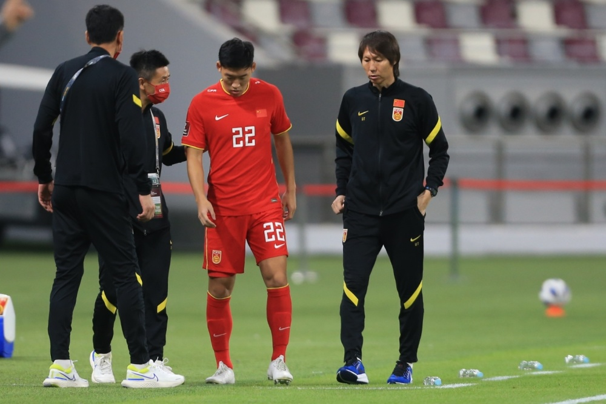
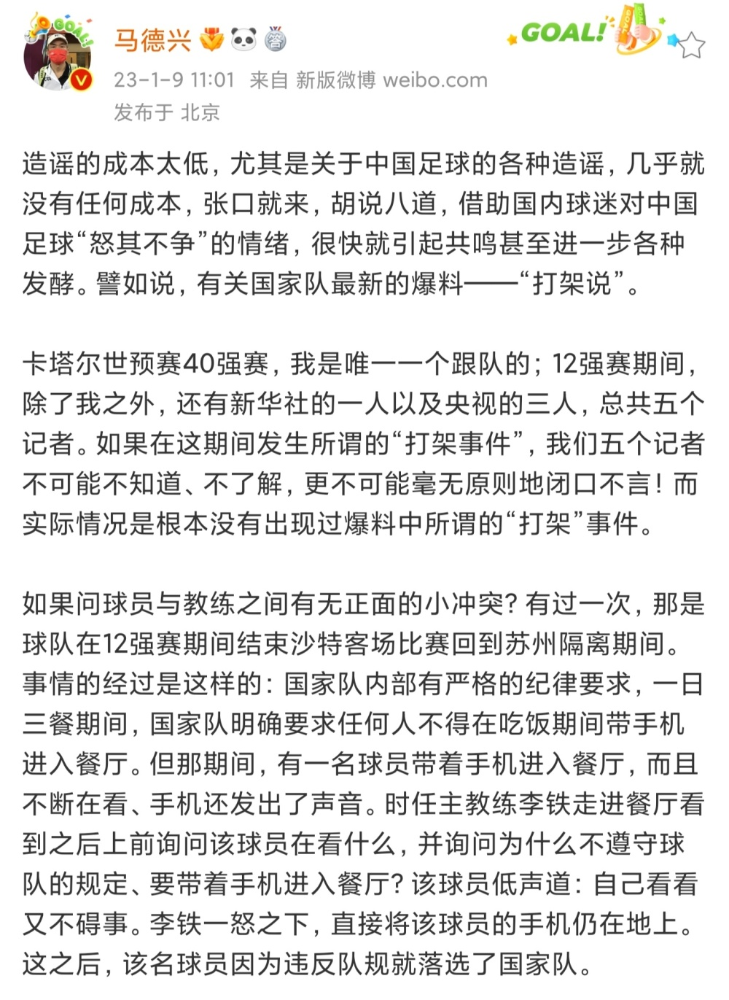
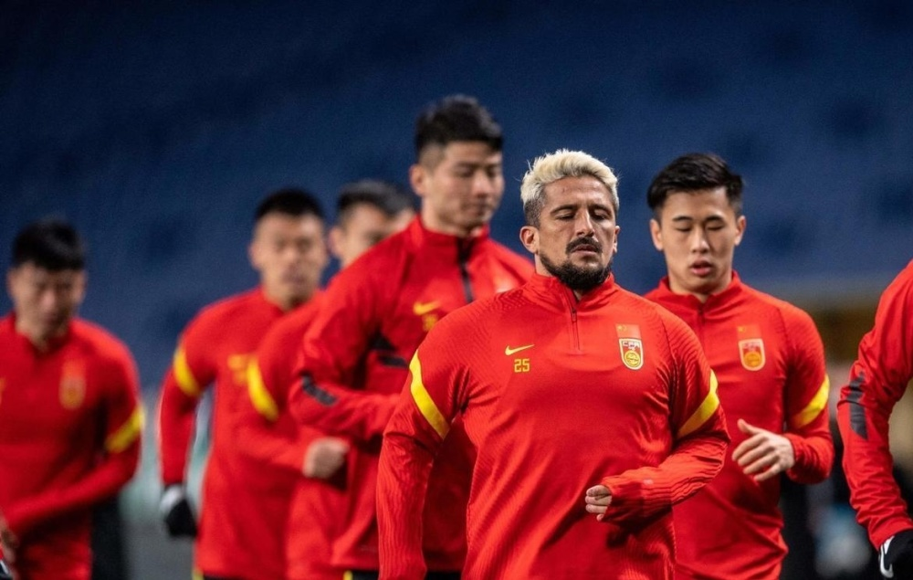

# 名记辟谣：国足没有打架！只有1次小冲突 李铁怒摔年轻国脚手机

近日，有国内记者爆料称，12强赛期间，国足有球员跟教练组在餐厅打架，而且不止出现过一次！然而，著名记者马德兴发文，对此进行了辟谣。

马德兴是世预赛40强赛唯一一个跟队的记者，也是12强赛期间跟队的5个记者之一，他表示：“如果在这期间发生所谓的打架事件，我们五个记者不可能不知道、不了解，更不可能毫无原则地闭口不言！而实际情况是根本没有出现过爆料中所谓的“打架”事件。”

不过，马德兴也披露，球员和教练确实有一次小冲突，那是12强赛期间，国足结束沙特客场比赛回到苏州，按照规定，一日三餐期间，明确要求任何人不得在吃饭期间带手机进入餐厅。

但是，有一名球员带着手机进入餐厅，而且不断在看、手机还发出了声音。时任主帅李铁看到之后上前询问：为什么不遵守球队的规定、要带着手机进入餐厅？

该球员低声道：自己看看又不碍事。李铁一怒之下，直接将该球员的手机仍在地上。之后，该名球员因为违反队规就落选了国家队。

不过马德兴指出，从保护球员的角度，此事没有公开，毕竟球员还年轻，而且确认其落选时，对外还以该球员“家庭原因”为由，不想让该球员陷入“因为不遵守队规而离队”的风波之中。

