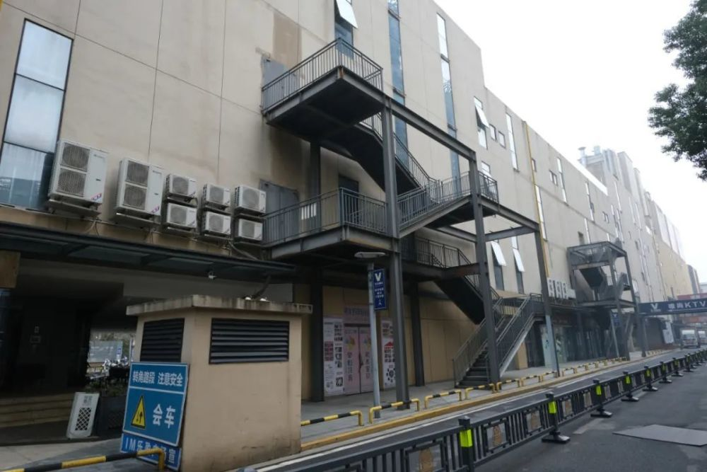
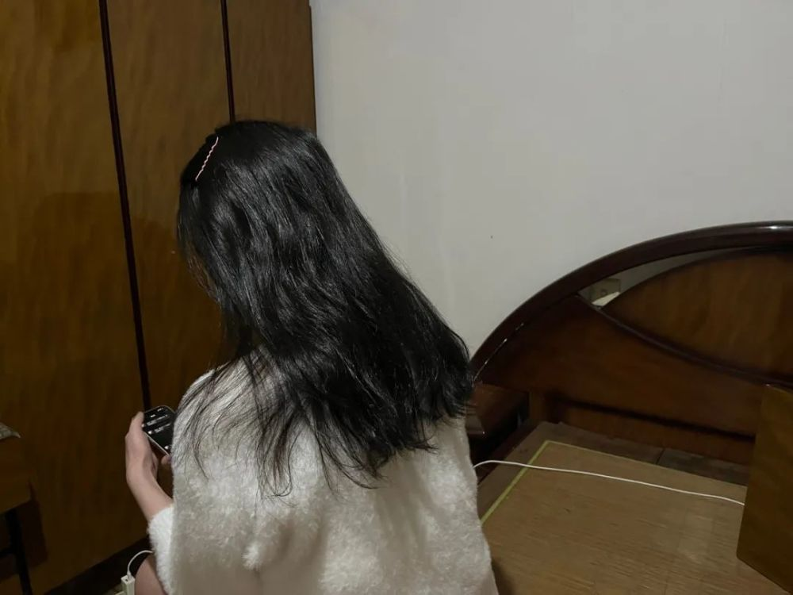
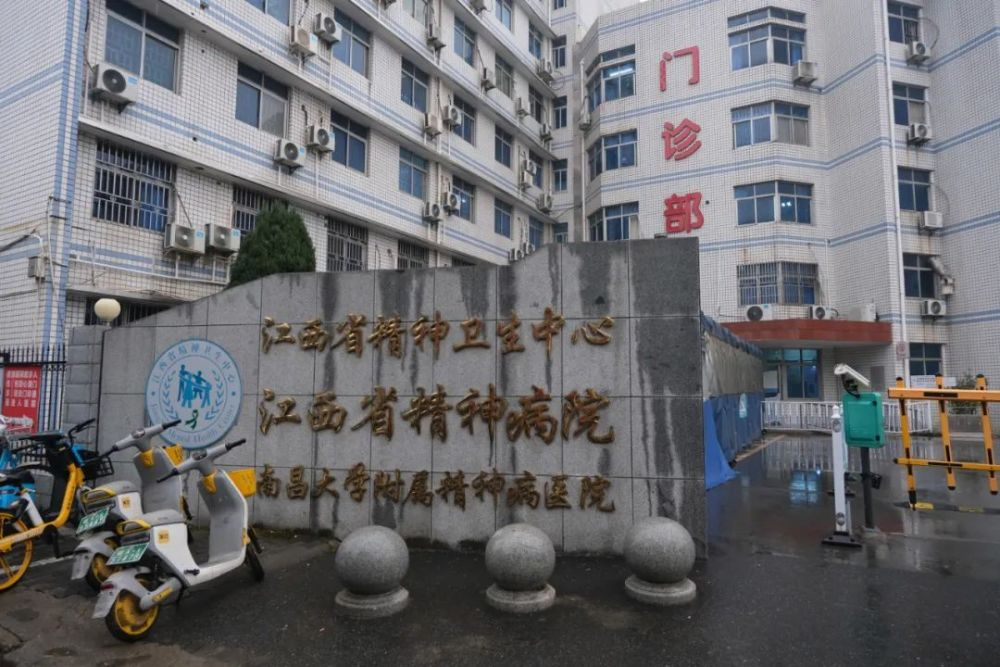

# 声称被辅警威胁后，南昌女子被送精神病院，该院曾因强制他人入院败诉

这几天，李宜雪讲了很多遍她被送入精神病院的经过。她的表情往往看不出太大波澜，语气平静，回答提问时习惯分点叙述，说到气愤时也不会提高太多音量，“我不想在别人面前表现得情绪激动，会显得我好像真的不太正常。我尽量让自己保持一个冷静理智的状态”。

2022年4月22日凌晨，李宜雪被南昌市公安局西湖分局丁公路派出所送到江西省精神病院，住院56天。李宜雪称，被送到精神病院之前，她曾向丁公路派出所告发辅警赖某吉猥亵自己。

李宜雪将这段在精神病院的经历视作迄今人生遇到最大的坎儿。出院后不到一个月，李宜雪以医疗损害责任纠纷为由起诉江西省精神病院，随后开始在网上曝光她的遭遇。2022年12月6日，该案一审开庭，但尚未宣判。

_2022年4月21日，李宜雪在商场的室外楼梯“散心”，随后被丁公路派出所带到江西省精神病院。拍摄：张馨予_

随着公众对这起事件的关注不断升温，2022年12月21日，南昌市公安局西湖分局发布通报。根据通报，警方认定赖某吉不存在猥亵行为，鉴于李宜雪先后4次在公共场所扬言自杀，并称自己患有抑郁症、晚上睡不着觉，丁公路派出所出于对李宜雪的人身安全考虑，依法将其送江西省精神病院，经医院精神障碍诊断后收治入院。

李宜雪不认可警方通报中的多处说法。她对《中国新闻周刊》说，在诉江西省精神病院的民事诉讼一审宣判后，她还将分别向江西省精神病院和丁公路派出所提起刑事诉讼。

**不予立案的猥亵事件**

李宜雪被送入精神病院的开端，是一件各执一词的猥亵事件。

在李宜雪的讲述中，猥亵事件的发生始于赖某吉的主动接近。2022年3月中旬，因一起民事纠纷，李宜雪到丁公路派出所报警，派出所不予立案，接下来的一段时间里，李宜雪为这起纠纷多次来到丁公路派出所。到了4月14日，李宜雪再一次来到丁公路派出所询问案件进展，第一次见到辅警赖某吉。“4月15日，赖主动电话联系了我，说这起案子他可以帮我忙，要见面聊。”

李宜雪说，当时由于南昌疫情严重，所在小区处于封控状态，她没有办出入证，所以住在家附近的酒店。接到赖某吉的电话后，李宜雪提议在酒店大堂见面，“但是他说酒店离西湖分局太近了，在大堂容易碰见熟人，还是在房间聊比较方便。”西湖分局距该酒店仅250米，步行时间少于5分钟。李宜雪称，4月15日下午5点多，赖某吉来到她住的房间，穿着便装，没有佩戴执法记录仪。

“进了房间，他先是搬了一把椅子坐在床边，我坐在床上，和我交流案情。”李宜雪记得，聊了10多分钟，赖某吉话锋一转，说“如果你是我女朋友，我明天就能帮你平了这件事”，之后就起身亲她摸她。李宜雪开始反抗，声称要报警，“说了这句话，他就停止了行为。”李宜雪说，赖某吉随后开始道歉，甚至下跪扇自己巴掌，请求她不要到派出所告发他。

李宜雪回忆，赖某吉直到4月16日早上6点才离开，两人一夜未眠，赖某吉“一直在跟我诉苦，道歉，打感情牌”，并在当天晚些时候发短信道歉。4月17日，赖某吉再次约她见面，两人这次约在酒店大堂一侧的餐厅，“他还是那些话，说他这两天上班心神不宁，然后直接在大厅跪下来了。”因为动静太大，酒店前台一位工作人员上前询问，赖某吉随后离开酒店。李宜雪说这是两人最后一次见面。

_李宜雪。拍摄：张馨予_

直到在2022年4月22日被送到精神病院，李宜雪都没有想到调取酒店大堂的监控录像。从精神病院出院的第二天，李宜雪联系酒店，希望调取监控录像，作为证据，但酒店告知监控录像已经过期，无法查询。

2022年12月29日，《中国新闻周刊》来到李宜雪与赖某吉见面的酒店，前台工作人员称酒店的监控录像只保存一个月，并且2022年4月17日值班的工作人员早已离职。

赖某吉的讲述与李宜雪截然不同。南昌市公安局西湖分局拒绝了《中国新闻周刊》的采访请求，记者未能联系到赖某吉。而赖某吉之前在接受媒体采访时表示，2022年4月15日李宜雪两次拨打其电话，邀约他到酒店见面，中途曾打算离开，后被李宜雪电话叫回。赖某吉还放出了部分当晚与李宜雪的对话录音，他在录音中说“你不要叫我来酒店”以及“我又没办事”。

赖某吉说，他从未对李宜雪有过猥亵行为，并表示李宜雪在房间内精神状态有异样，行为让他感到害怕，“打开门进去之后，就看到卫生间从走廊那个门到房间里面，地上都是水，床上也是湿的。”

对于赖某吉的说法，李宜雪称其放出的录音经过剪辑，非完整录音，并说“如果他没上床，怎么会知道床是湿的？”

根据南昌市公安局西湖分局于2022年12月21日发布的通报，经调取李、赖双方笔录，收集李宜雪入住酒店工作人员以及商场保安、邻居、家属证言，查看李、赖双方通话记录、现场录音等材料，认定赖某吉不存在猥亵行为，公安机关已依法作出不予立案决定。

由于辅警赖某吉私自会见纠纷当事人，违反工作纪律，丁公路派出所对其作出通报批评并予以停职。因该违纪行为，赖某吉未能通过员额制辅警过渡政审，遂于2022年9月5日离职。

**收治入院前的三小时**

李宜雪被送到精神病院，发生于猥亵事件的一个星期后。

“那件事发生之后，我就有了失眠的症状。”2022年4月21日晚，睡不着的李宜雪想出门散心，走到酒店附近的一家商场。商场停车场旁有一处三层高的室外楼梯，李宜雪在晚上10点左右走到室外楼梯上，“想吹吹风静一下。”李宜雪补充说，她那天没有轻生意图。

由于当时南昌部分区域执行封控管控措施，商场周边街道几乎没有行人，李宜雪独自站在室外楼梯，引起了保安的注意。李宜雪称保安让她下楼，她不愿意，两人发生口角，保安随后报警，称李宜雪要跳楼。

李宜雪回忆，保安报警后没过多久，开来一辆警车，车上是4名她之前在丁公路派出所见过的民警。过了10分钟左右，又来了一辆警车，一共来了8名民警，加上商场保安共有9人。李宜雪说，双方当时僵持了一会儿，然后她说出了赖某吉猥亵的事情，“我一说这件事，一个民警就关掉了执法记录仪，支走了保安，然后他们就沉默了十几秒。”在李宜雪没有注意时，一位民警上了楼梯，随后“把我拽到一楼，然后把我塞进警车，开到丁公路派出所门口”。

在丁公路派出所门口，李宜雪没有下警车。她回忆说，“一位姓赵的民警进到派出所，差不多10分钟后出来，手上拿了一沓纸质材料，然后警车直接就开到了江西省精神病院。”

_江西省精神病院。拍摄：张馨予_

2022年12月29日，《中国新闻周刊》记者向商场一位陈姓保安主管求证2022年4月21日晚的情况，该主管称除非有公安机关介入，否则拒绝采访。丁公路派出所王所长此前接受媒体采访时表示，李宜雪在2022年4月21日当晚未提起赖某吉猥亵一事，并表示这已经不是李宜雪第一次在该广场实施轻生行为。在警方通报中，南昌市公安局西湖分局也称李宜雪先后4次在公共场合扬言自杀，依法将李某雪送江西省精神病院。

根据《中华人民共和国精神卫生法(2018修正)》（以下简称《精神卫生法》）第二十八条，疑似精神障碍患者发生伤害自身、危害他人安全的行为，或者有伤害自身、危害他人安全的危险的，其近亲属、所在单位、当地公安机关应当立即采取措施予以制止，并将其送往医疗机构进行精神障碍诊断。

中国政法大学刑事司法学院副教授陈碧对《中国新闻周刊》说，如果当事人确实存在自杀、自伤的危险，公安机关有权决定是否需要将其送往医疗机构进行精神障碍诊断。否则，该处理而未处理就可能造成严重后果，当事人及其家属可以提起行政不作为之诉。

不过，陈碧补充说，《中华人民共和国警察法》第十四条规定，需要送往指定的单位、场所加以监护的，应当报请县级以上人民政府公安机关批准，并及时通知监护人，“这个案件，还需要核实警方是否履行了上述义务”。

**入院治疗程序是否合法？**

李宜雪被丁公路派出所民警送往江西省精神病院的时间，是在2022年4月22日凌晨1点左右。两个小时后，她作为患者住进江西省精神病院，在里面接受近两个月的治疗。

根据李宜雪的出院记录，江西省精神病院对她的入院诊断是“人格障碍”，入院情况写道她“反复发脾气、人际关系不稳十余年、表现偏执敏感、以自我为中心、记仇易报复”。

但李宜雪对江西省精神病院的诊断存在质疑。她说面诊时，医生只问了她两个问题，一个是“你是不是经常心情不好”，另一个是“你是不是经常容易为一些事纠结，导致失眠”。她对这两个问题都给出了肯定的答案。李宜雪说，面诊过程中，民警出具了一张肇事肇祸证明。随后她被带出房间，一位民警与医生进行了交流。等李宜雪再被叫进房间时，住院手续已经办好了。

2022年12月28日，《中国新闻周刊》记者来到江西省精神病院，希望了解医院对李宜雪的诊断依据和诊断过程。江西省精神病院拒绝接受《中国新闻周刊》的采访。

在李宜雪诉江西省精神病院案中，江西省精神病院在提交的答辩状中表示：“原告李宜雪因肇事肇祸被丁公路派出所民警强制带入我院，经门诊医师评估，当日按肇事肇祸程序收入我院。”

警方通报中，丁公路派出所将李宜雪送江西省精神病院收治的法律依据包括《精神卫生法》和《江西省肇事肇祸精神病人收治管理实施办法》。

根据2007年出台的《江西省肇事肇祸精神病人收治管理实施办法》，不能辨认或不能控制自己行为，发生以下肇事肇祸行为之一的精神病人应予以收治监护，包括杀人、伤害等严重侵害他人人身权利的；放火、爆炸、投毒、破坏等严重危害公共安全的；抢夺、损毁公私财物的；严重扰乱国家机关、企事业单位正常工作、生产秩序的；扰乱社会秩序，造成严重后果的。

陈碧认为，《江西省肇事肇祸精神病人收治管理实施办法》对于收治对象的限定明显小于《精神卫生法》。至于李宜雪是否符合应予以收治监护的对象，陈碧说“哪条可以用在李宜雪身上？我没看出来”。

另外，根据《江西省肇事肇祸精神病人收治管理实施办法》，“经鉴定确认发生肇事肇祸行为或有肇事肇祸倾向的精神病人，公安派出所应强制送精神病院治疗，同时逐级上报，并由设区市公安机关签发《收治肇事肇祸精神病人入院通知书》，交由精神病院治疗。”陈碧认为，这条规定有可能被扩大适用，侵犯相对人的人身权益，并且和上位法发生了冲突，“各地行政法规应当与上位法《精神卫生法》相符合”。

2010年前后，国内曾频频发生“被精神病”事件，在各方推动下，中国首部保障精神障碍患者权益的法律于2013年5月1日起正式施行。

《精神卫生法》明确，精神障碍的住院治疗实行自愿原则。根据《精神卫生法》第三十条，诊断结论、病情评估表明，就诊者为严重精神障碍患者并有下列两种情形之一的，才应当对其实施住院治疗：（1）已经发生伤害自身的行为，或者有伤害自身的危险的；（2）已经发生危害他人安全的行为，或者有危害他人安全的危险的。

如果是第一类情形，经监护人同意，医疗机构应当对患者实施住院治疗，但监护人不同意的，医疗机构不得对患者实施住院治疗，而是由监护人对其做好看护管理。如果是第二类情形，国家可以实施强制收治，但患者或者监护人如果对诊断结论有异议，可以要求再次诊断和鉴定。

陈碧说，当事人的监护人可以起到保护其合法权益的作用，如果当事人属于自杀自伤的情形，监护人可以拒绝住院治疗；如果当事人属于伤人的情形，可以要求再次诊断；还不满意的，可以再要求司法精神障碍鉴定。

而在李宜雪被江西省精神病院收治入院的当晚，其监护人并未签字同意李宜雪住院治疗。李宜雪回忆，当晚是由丁公路派出所民警在入院通知书上签字，随后她就被带到了住院病区。根据警方通报，李宜雪入院当日，“民警将李宜雪入院治疗情况告知了其家属”。

李宜雪的爷爷对《中国新闻周刊》表示，2022年4月22日李宜雪入院当日，没有任何家属在通知书上签字，到了早上，才有人通知李宜雪父亲，她已被强制送到精神病院。

李宜雪认为，她诉江西省精神病院，重点就在于该院的强制住院治疗程序是否合法。

在江西省精神病院，因肇事肇祸程序强制住院治疗的患者不在少数。

曾茵于2022年5月底被家人送到江西省精神病院，被诊断患有双向情感障碍后住院治疗近两个月。曾茵回忆，同一层有不少是通过肇事肇祸程序被警察送进精神病院的，其中有人已经住院治疗超过一年。曾茵说，有些肇事肇祸病人确实比较暴力，会攻击人，“感觉真的有病”，但还有一些肇事肇祸病人相处起来看不出症状。

根据《江西省肇事肇祸精神病人收治管理实施办法》，对公安机关强制送治的肇事肇祸精神病人，精神医学鉴定费用、基本治疗用药费用由财政给予报销，住院床位费减半。另外，上述办法指出，按每强制收治一名肇事肇祸精神病人补助100元的标准，适当增加公安部门强制收治管理专项经费。

南昌市财政局曾于2014年4月和2015年4月，两次公开市财政拨付收治肇事肇祸精神病人治疗补助经费情况。根据披露，2013年3月至2013年11月，江西省精神病院共收治出院肇事肇祸精神病人308名，南昌市财政局拨付补助经费91万元。2014年7月至2014年12月，江西省精神病院共收治出院肇事肇祸精神病人310名，南昌市财政局拨付补助经费91万元。

《中国新闻周刊》联系了南昌市财政局社保科，了解最近几年江西省精神病院收治肇事肇祸精神病人数量，以及市财政拨付收治肇事肇祸精神病人治疗补助经费的情况，未获得回复。

**“我不是精神病人”**

“我选择先告精神病院，是因为我想通过告赢精神病院证明我是一个正常人，之后才好继续告派出所，否则别人会拿我是一个精神病人说事。”李宜雪说，她对江西省精神病院的起诉，是她维权的第一步。

从得知要住院治疗的那刻开始，李宜雪就开始了“我不是精神病人”的自证。

大多数时候，李宜雪的自证是通过吵闹，极力否认自己是精神病人。一进住院病区，她就开始大叫，说她不是精神病人，凭什么住精神病院？她说，“护士告诉我，你不要情绪这么激动，你越哭越叫，就越像个精神病，你就越出不去。”

但李宜雪很难压抑自己的情绪。刚住院的几天，她拒绝服用医院开出的奥氮平、曲舍林等药物，“护士就会用约束带把我绑在床上，把药灌进去。”李宜雪说，一旦被绑在床上，就不会被轻易解开，她曾被绑过七天七夜。后来案件开庭时，李宜雪看到医院提供的材料中有厚厚一沓约束单。

李宜雪说，住院到一个月左右时，因为她情绪崩溃，产生了轻生的意图，“出院之后我爸爸才告诉我，当时医生就想对我使用电击疗法。因为电击疗法需要全身麻醉，要家属签字，我爸爸不同意，所以没有采用。”

李宜雪的爷爷告诉《中国新闻周刊》，李宜雪住院治疗后，其父曾多次想把女儿接回来，但都被医院拒绝了，“不要说接回来，去看她都不允许”。

后来，李宜雪逐渐接受在精神病院住院的事实。她会在每天早上6点起床，7点吃早餐，10点半吃午餐，下午4点半吃晚餐，其余时间都和其他约60位病人一起在活动室活动。在活动室，有人会不停地走圈圈，有些人会坐着一言不发，还有很多人会聊天，彼此交流为什么会住进医院。

在入院时，江西省精神病院对李宜雪的诊断是“人格障碍”，出院时又多了一个“强迫性障碍”。这是江西省精神病院根据李宜雪在医院的行为作出的诊断。李宜雪说，她喜欢反复地洗手，有时一天要洗三次澡。而在医院里，三五天乃至一星期才能洗一次澡，这让她难以忍受。正因如此，每次洗澡，李宜雪都会洗40分钟左右，“所以经常会被骂，也会因为这个被别人认为不正常。”

在对江西省精神病院的起诉书中，李宜雪的诉求包括确认医院在整个收治、治疗、护理过程中存在医疗过错行为，以及重新进行司法鉴定，证明自己精神一切正常，并要求江西省精神病院承诺今后永不收治她。

李宜雪向法院申请精神司法鉴定的过程并不顺利。李宜雪说，南昌市能够做这类精神司法鉴定的只有三家机构，其中一家是江西省精神病院，另外两家是江西求实司法鉴定中心和江西神州司法鉴定中心，它们分别以“只接受颅脑受重创的精神鉴定”和“提交材料不足”退回了李宜雪的申请。

2022年11月27日，李宜雪到一家三甲医院进行鉴定，根据面诊、脑CT以及一些量表，医院给出“无抑郁症状、无焦虑症状”的参考诊断，李宜雪将其作为证据递交给了法院。李宜雪说，后续如果要再进行精神司法鉴定，也不会在江西省内做，而是会选择北京、上海等城市。

对李宜雪而言，有一个让她心生希望的消息——曾有一位试图摘掉精神分裂症帽子的人，在对江西省精神病院的官司中胜诉。

南昌男子万友生在2008年12月7日被他人强制送入江西省精神病院，第二天在其母亲等人的强烈要求下离开医院。在出院小结中，医院诊断万友生患有“精神分裂症”，万友生之后将江西省精神病院告上法庭。

在案件历经一审、重审、二审后，南昌市中级人民法院认定江西省精神病院在收治万友生住院时不符合规范，但未认定“精神分裂症”的诊断是否合规。万友生提出申诉。2018年8月2日，江西省高院作出判决，认定江西省精神病院在未对万友生进行必要的检查亦未进行任何治疗的情况下，在出院小结中诊断其患有精神分裂症，“明显缺乏依据，不符合诊疗规范”。

（文中曾茵为化名）

记者：张馨予

