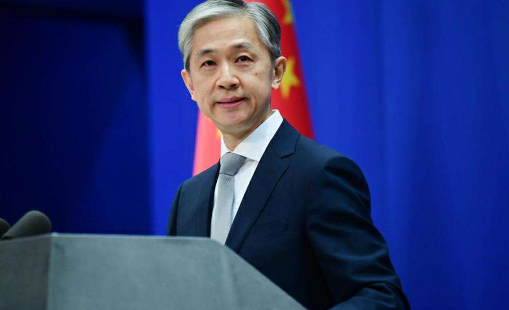

# 巴拉圭总统候选人称若赢得大选就同台当局“断交”，中方回应

1月9日，外交部发言人汪文斌主持例行记者会。

有记者提问，据报道，巴拉圭总统候选人埃弗拉因·阿莱格雷近日称，如果反对党赢得今年4月举行的大选，巴拉圭将同台湾当局“断交”，并同中国建交。中方对此有何评论？

_图源：外交部_

汪文斌表示，坚持一个中国原则是国际大义、人心所向、大势所趋。我们相信有关国家迟早会认清国际大势，作出符合历史潮流的正确决定。

来源 北京日报客户端

记者 刘晓琰

编辑 郭涛

流程编辑 刘伟利

