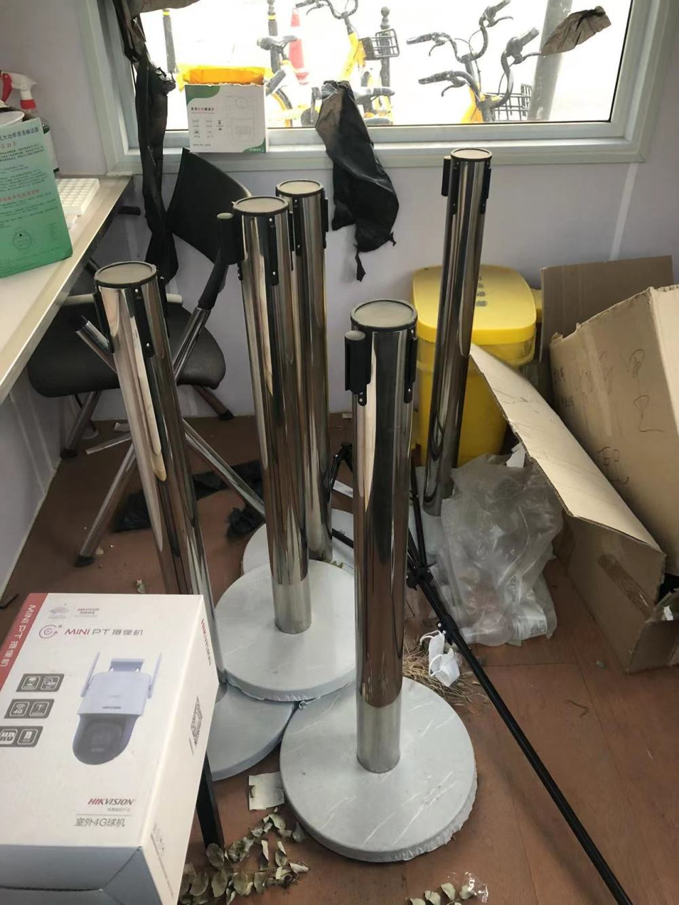
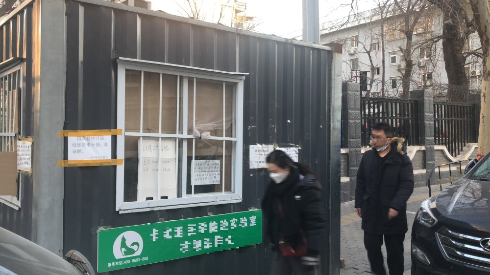
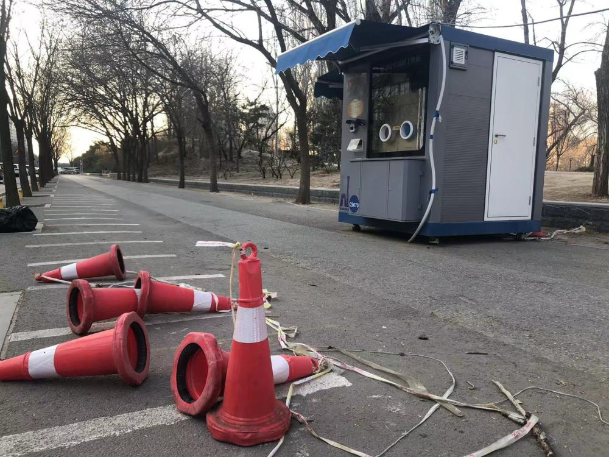
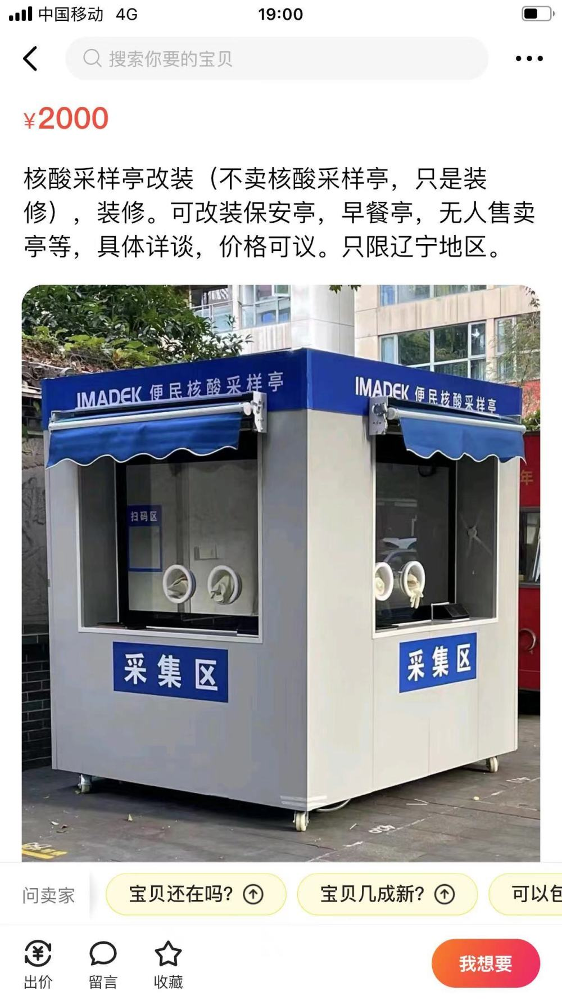

# 民生调查｜检测需求变小，大量核酸采样亭街头废弃

北京日报客户端 | 记者 景一鸣

1月6日，《北京市新型冠状病毒感染防治工作总方案》发布，其中提到鼓励医院和第三方核酸检测机构在各街（镇）设置3至5个便民核酸检测点。关于核酸检测点的具体设置办法，1月8日，在国务院联防联控机制新闻发布会上，中国疾控中心传防处研究员常昭瑞表示，要求社区要保留足够的便民检测点，保证居民“愿检尽检”的需求，各地要基于人口基数、疫情发展形势和居民检测意愿等因素，合理设置社区检测点，满足居民检测需求。

目前，各街（镇）辖区的核酸检测点已经大幅减少，可街头仍有不少之前遗留下来的核酸检测亭。最近，不少市民拨打12345市民服务热线或向本报反映，有些检测亭的弃用时间甚至达到半年，有的挤占道路、小区广场等空间，有些疏于管理甚至有安全隐患，市民呼吁尽快撤走弃用的检测亭。

市民反映的问题是否具有普遍性？待处理的核酸检测亭有多少？长时间不挪走可能出现哪些问题？记者展开调查走访。

**呼声**

**市民诉求出现“反转”**

1月5日，安定门外大街东侧便道上，记者看到两个孩子正在玩“击剑游戏”，仔细分辨，手上的“武器”竟然是核酸采样时所用的长柄棉棒。记者问孩子们棉棒是从哪儿找来的，他们指向了百步之外的核酸检测亭。这座亭子显然已有一段时间不提供服务了，里面凌乱地堆放着物品，采样台上还摆着酒精喷壶、棉棒等物资，窗口大敞着，里面的物品轻易就能拿到。这个亭子弃用了多久？飘进亭子里的垃圾给出了答案——进入深冬，行道树上早已不见树叶，可检测亭里却堆积着不少干透的落叶。

_安定门外大街上，一座早已不用的核酸检测亭里物品堆放凌乱。_

走在街头巷尾，核酸检测亭随处可见，但大多数都贴上了“设备维修”的通知。从这些通知上的时间判断，核酸检测亭停用短则1个月长则半年。在市民眼里，这些检测亭成了特殊时期那段特殊记忆的谈资，但也引发了疑问——这些如今已经用不着的检测亭，什么时候能撤走呢？

梳理12345市民服务热线收到的与核酸检测亭相关问题的投诉，在2022年12月出现了一个特殊的现象，即投诉内容“180度反转”。在12月7日以前，大部分投诉反映核酸检测点数量不够，或不再提供服务等问题；而此后，相关问题投诉陆续减少。到12月下旬，市民投诉几乎全指向了核酸检测亭应该撤走的问题：南三环中路15号院外的过街天桥下，核酸检测亭弃用时间不短了；建材城西路上，核酸检测亭拆除后，固定亭子用的铆钉还在便道上“支棱”着；鲁谷地区居民反映辖区内弃用的核酸检测亭较多，希望合理规划……近期，来自本市各区的相关问题反映逐渐增多。

其实，市民诉求的“反转”与本市疫情防控措施优化调整的节奏是吻合的。12月7日起，随着“新十条”陆续落地，核酸检测阴性证明逐渐远离了市民的工作和生活，当下群众对恢复正常生活充满期待，“撤亭”成为大多数市民的愿望。

**探访一**

**弃用的检测亭占道又危险**

市民为何盼着弃用的核酸检测亭赶紧撤掉？记者走访发现，闲置的核酸检测亭不仅占用城市道路等公共空间，而且还存在用电、消防安全隐患问题。

在东城区交东小区有一条进出车辆、行人的主干道，名为交东小区西路，其东侧便道上设置了一座核酸检测亭。记者在现场看到，这座亭子严丝合缝地占据了全幅便道，居民经过这里都得从机动车道绕行。核酸检测亭墙面上早在2022年11月20日便贴出了“因故暂停开放”的告知，在2022年12月23日，又追加了一份“设备维修”的详细说明，同时给居民指引了周边邻近的核酸检测点。

_交东小区西路停用的核酸检测亭占据道路，居民只好绕行。_

居民王先生说，回想去年，大家齐心抗疫，核酸检测亭虽然设置在便道上占了路，但大家都能理解。可眼下核酸检测的需求不再迫切，周边也有正常提供服务的核酸检测点，这座占路的亭子可以撤掉了。“便道连接着小区出入口，是车流相对密集的区域，检测亭遮蔽视线，老人孩子途经这里很不安全。”

还有居民提到，有的核酸检测亭不再用了，可里面还堆放着大量的纸箱、酒精或消毒液，亭子连接着临时线缆，长期无人看管，担心有用电、消防等安全隐患。记者注意到，交东小区西路便道上的核酸检测亭电闸箱门大敞，钥匙还在上面插着。

西城区乐城小区里的核酸检测亭也被居民投诉了。该小区居民楼以高层为主，住户多、空间局促，路侧区域几乎都设置了停车位，由于电动自行车禁止入楼，小区里又增加了充电车棚，供居民休闲健身的地方只剩下了一个小广场。居民说，这个广场已经很“袖珍”了，“广场上的核酸检测亭要是不用，就别再跟老人和孩子抢地方了。”小广场上的核酸检测亭靠近健身器材区域，居民锻炼身体几乎都得朝着亭子“面壁”；有人想打羽毛球，空中老有一条连接检测亭的线缆得躲；孩子练轮滑、老人跳
广场舞，检测亭也非常碍事。

_乐城小区广场上停用的核酸检测亭挤占了居民的休闲健身空间。_

居民张先生说，在去年疫情防控形势吃紧的阶段，小广场设置核酸检测点满足了居民的需求，居民不出小区就能做核酸检测，确实是件大好事儿。但现在疫情防控已经转段，大家不需要频繁测核酸了，检测亭也停用超过了一个月，希望尽快把亭子撤走，把活动空间还给居民。

**探访二**

**“愿检尽检”遭遇“迷魂阵”**

1月8日起，本市疫情防控正式实施“乙类乙管”，《北京市新型冠状病毒感染防治工作总方案》明确提出了调整人群检测策略，按照“愿检尽检”原则，核酸检测实行单人单管，取消混管检测，同时不再开展全员核酸筛查。

“到底哪个点儿还开，哪个点儿剩下空亭子，能不能有个准信儿？”在12345市民服务热线来电中，仍有核酸检测需求的市民提出，由于大量核酸检测亭已经弃用，当前常态化核酸检测点运营情况无从查询，找核酸检测点就像走进了“迷魂阵”。比如市民张女士说，看到马路对面有个核酸检测亭，爬完过街天桥气喘吁吁来到亭子跟前，却发现亭子早就“废了”。

1月6日下午，市民吴先生新冠感染康复后，想做一次核酸检测，于是沿着健安东路一路前行，从樱花园西街路口走到安定路路口，全程大约850米，沿途曾经有不少核酸检测点。可吴先生一路走下来，却发现检测点都关闭了。“我这一路走啊，就想着关了一个点儿不是还有下一个么，结果都关了。我想反映的问题不是点位太少不够用，而是既然点位都关了，亭子还杵在那儿，让人真真假假看得迷糊。”

_健安东路上的核酸检测亭已经闲置。_

吴先生走的这段路上，共有4个核酸检测亭，目前都已弃用，最早弃用的一个可追溯到2022年6月。回到樱花园西街东侧便道上，吴先生终于找到了正常提供服务的核酸检测点。

按照吴先生的行动轨迹，记者打开了多个运营方的核酸检测地图，对比发现各张地图对于已经弃用的4个亭子显示情况不一，而对于樱花园西街正在提供服务的点位，各地图却“异口同声”地显示已关闭。

2022年，在核酸检测点位布局优化调整的过程中，本报一直关注核酸检测地图为民服务的情况。记者注意到，当前查询多个运营方的核酸检测地图，显示信息早已过时。对于同一点位，各地图给出的信息不尽相同，有的显示营业，有的显示休息，还有的已不再显示，核酸地图的参考价值不高。

**难题**

**“撤亭”谁负责，点位咋优化**

目前，不少市民通过12345市民服务热线建议加速处理街头早已弃用的核酸检测亭。问题在于，这些核酸检测亭该由谁负责撤走？各街道辖区待处理的检测亭有多少？

走访中记者发现，街头核酸检测亭的样式类别挺多，一些核酸检测亭是检测机构的标准化产品；还有一些明确标注了是由某些爱心企业捐助的；部分点位的核酸检测亭看着相对简陋，属于集装箱房改造，这些集装箱房有明确的租赁方；在2022年，为方便居民就近检测，部分街道还出资投放了一批迷你核酸检测亭，以适应小区狭小的公共空间。

根据《北京市新型冠状病毒感染防治工作总方案》的要求，鼓励医院和第三方检测机构，在各街（镇）设置3至5个便民核酸检测点。而在2022年疫情防控形势吃紧的阶段，各街道在辖区内设置了十几到几十个核酸检测点。例如丰台区某街道当时的常态化核酸检测点就有19个，加上医院和为重点人群单独开辟的核酸检测点，总点位数达到21个，如今辖区内保留的便民核酸检测点为3个。从两位数变成个位数，各街道待处理的弃用检测亭数量都不少。

对于该由谁负责撤走弃用的核酸检测亭，记者询问了几个区的多个街道，得到的答复差不多——首先要明确这些亭子的产权方，街道、社区会积极协调产权方处理。但截至记者发稿时，不少街道也表示，对于居民强烈反映占用公共空间、有安全隐患的点位，属地正在协调相关各方积极处理，但大规模“撤亭”的工作，各街道还要等待区里的明确指示。

与此同时，市民还建议各街道对仍在提供服务的核酸检测点实施进一步优化调整，并向市民清晰公布点位的具体位置，让“愿检尽检”人群少跑冤枉路。从1月5日到1月7日记者在走访过程中统计，当前一些核酸检测点每日采样人员在50人左右，而个别检测点每日采样人员已不足10人。建议合并相邻点位，或者调整到辖区内的地标性区域，方便“愿检尽检”人群找起来更准更快。

**提醒**

**避免相关工作滞后引发新乱象**

“二手核酸检测亭，一口价！”记者发现在某二手物品交易平台上，近期出现了大量出售核酸检测亭的现象。根据核酸检测亭的新旧、样式的区别，价位从几百元到一万多元不等。卖家描述，购买核酸检测亭后，可改装为电话亭、办公舱、书报亭、甜品店、保安亭等等。由此也萌生了更多相关“业务”，一些卖家专门做起了核酸检测亭改造的生意。

_各地开始衍生与核酸检测亭售卖、改装相关的网络平台交易。_

记者与一位卖家交流，对方不愿透露身份，但明确说，现在全国各座城市核酸检测需求都变小了，无论是核酸检测亭的生产厂家还是核酸检测机构，可能都有积压的问题。街上停用的核酸检测亭该怎么办，也没有明确的说法。所以才急着走二手物品交易平台售卖。

按照地区梳理卖家的信息，记者发现目前涉及北京地区的相关交易还很少，仍处在“萌芽”状态。由此也提醒相关部门尽快制定弃用核酸检测亭的清撤、回收等细则，避免因为相关工作滞后引发新的乱象。

**记者手记**

**城市恢复活力，服务举措更应“举一反三”**

疫情防控措施不断优化调整以来，本报持续关注市民回归正常生活、各行各业复工复产过程中因“旧规未改”带来的不便。因疫情被迫封闭的小区大门是不是该开了？公共场所形同虚设的测温仪是不是该收起来了？弃用的核酸检测亭是不是可以撤了？

整座城市正在有序恢复活力，各相关部门的工作思路更应“举一反三”。记者在走访中发现，各小区都有社区的宣传展板，别小看这块展板，它是政府与市民之间的沟通桥梁。现阶段仍有不少宣传展板还保留着早已过时的疫情防控要求提示，这同样该换新了，是时候通过这个小窗口和百姓共同展望新的一年了。

在新的一年里，让整座城市快速恢复活力，不仅依赖各相关部门对疫情防控要求各阶段变化的精准把握，更期待各相关部门能够跟上节拍，快速调整工作重心。城市运转犹如生态系统，只有新陈代谢正常才能维持机体健康。街头废弃设施及时清理，废水废气达标排放，私搭乱建依法拆除，交通拥堵逐步缓解，老旧小区合理改造……只有这样，一座城市才能更快“康复”，焕发活力。

