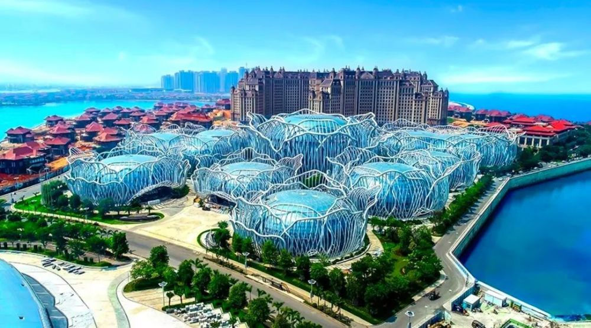

# 许家印，柯鹏，回不去的海花岛

海花岛的今天，或许就是恒大的明天。

**文/任雪芸**

**编辑/王芳洁**

过去不长的一段时间里，许家印被传出过两次出事，一次是说他跳楼了，一次是说他被警察带走。但事实上，当下，他仍在广州恒大中心43层办公，和他一起共用这宽阔顶楼的还有现任恒大集团行政总裁肖恩。

以前，和许家印同层办公的人是原恒大集团行政总裁夏海钧，只是2022年年中，夏海钧以处理境外债务为由，前往香港。
**此后，他行踪成谜，可能在香港，也可能在加拿大，又或者地球上的任何一个角落。**

当然，对于恒大来说，夏海钧的去向似乎也已经不那么重要了，2022年7月，因挪用恒大物业134亿元，夏海钧已经辞职。与夏海钧一起“被辞职”的还有原恒大集团执行总裁柯鹏等五人。

一位接近恒大人士告诉《最话》， **此前传许老板被警察带走，其实带走的另有其人，就是柯鹏。**

据上述人士了解的信息，柯鹏所涉之事与勾地有关，可能涉及到严重的职业操守问题。

这位职业经理人原为《上海证券报》记者，2008年，恒大第一次发生重大危机时，柯鹏正是跟踪该新闻的记者。同年，在专访许家印后不久，柯鹏应邀加入恒大。从此，一家公司获得了人才，一名记者实现了转型，一些新闻就此湮灭了。

而在加入恒大后，柯鹏从中台职能部门成功转型成为业务骨干，一度负责整个恒大的地产业务，要知道，柯鹏今年不过43岁，而恒大地产的销售规模一度突破7000亿。

哪怕只是几年前，许家印恐怕做梦都想不到，自己一手提拔起来的亲信，竟有不为人知的一面。他应该也不想到恒大，会告别深圳湾，重回广州旧地。那时的他，肯定还想不到，有一天，自己的一封内部信，会在不花一分钱的前提下，传播的街知巷闻。

都回不去了，柯鹏回不去了，许家印回不去了，恒大也回不去了。

在上述今年元旦发出的许家印的内部信中，他主动提到了海花岛项目。“海花岛稳步运营，累计接待游客760万人次。”

2022年，和恒大的情况一样，海花岛项目也曾命悬一线。去年1月份，恒大海花岛39栋楼，因项目属于违法取得的规划许可证，导致被撤销，被要求限期10日内拆除。

按照拆除方案，恒大拆除39栋楼将带来约77亿元（按当时新房销售均价18000元/平方米、总建筑面积约43万平方米估算）的直接损失。

但到了去年的11月初，海花岛项目终于出现了转机。

儋州市人民政府发布关于《儋州海花岛控制性详细规划优化调整》显示，在复议机关就海花岛39栋楼行政复议案，依法作出变更原拆除为没收。海花岛2-14-1地块39栋楼被改变了商品属性，调整后，已建未售楼栋全部由住宅调整为旅馆、商务金融、零售商业、餐饮用地混合经营。

从拆除到没收，海花岛最后的命运走向似乎并不太坏。但是，这个闯关拿到的，违规建设的岛屿，它的未来还会和恒大绑在一起吗？

大概率不会了。某种程度上，海花岛就像这家公司的一个侧写，起笔恢弘，落笔潦草。

13年前，许家印曾经当着儋州官员的面许愿，说自己 **“后半辈子就要住在海花岛了”** ，他应该也回不去了。

01 海花岛往事

2019年9月，海南省委原常委、海口市委原书记张琦落马，海花岛的内幕逐步被揭露。

根据《中国纪检监察报》的刊文，张琦曾利用担任儋州市委书记职位之便，违规推动了海花岛项目。其中，涉及填海的总面积达到783公顷，原本并不过关的项目得以推进，结果造成了大面积珊瑚礁和白蝶贝被永久破坏。

由此，中央将张琦的行为定性成了“鼓了钱袋、毁了生态”，后来，张琦被判无期。

时间回到2009年，恒大地产在香港上市，发行价3.5港元，挂牌当天股价涨幅高达35%。

当日收盘市值达到了705亿港元，恒大地产成为了于香港上市的最大内地民营房企。同时，恒大地产董事局主席许家印的资产达到了422亿元人民币，一越成为了中国内地新首富。

历时13年，地产霸主初现，恒大的成功上市由此激发了许家印的野心，他开始将目光看向更多领域，试图将商业触角扩张到了体育、新能源车、旅游等。

恰逢其时，在恒大上市后的第二个月，国务院印发了《关于加快发展旅游业的意见》，对旅游业提出了全新的定位，指出把旅游业培育成国民经济的战略性支柱产业。

许家印看到了这个机会，他带领了恒大的高管团队考察过迪拜棕榈岛、荷兰弗莱福兰岛等全球著名填海项目，试图通过填海造地的方式，在国内打造一个“中国版棕榈岛”。

而另一个重要的推力是，早在2005年，恒大就曾拿下江苏启东的一片滨海区域，建设“海上威尼斯项目”，在2012年开盘，首日销售高达2500套，金额达20亿。当恒大于香港上市时，启东这块荒地的估值已经超过了340亿元。

低成本撬动高估值，尝到了甜头的许家印又打算大干一场。于是，2010年10月14日，儋州市政府与恒大集团签订了《海南省儋州市白马井填海项目投资开发框架协议》，
**三个岛填海总面积高达783公顷，总建筑面积达1600万平米。**

依旧是故技重施，此前为了躲避审查，恒大曾将启东地块的9000亩海边滩涂地分成了13块，每块小于50公顷，并成立了13个项目公司进行开发。

而根据《海南省实施

然而，这个原本便是建立在违规操作之上的项目，最终还是反噬了恒大。

2017年，中央第四环境保护督察组在海南省开展了环境保护督察，对于儋州市政府及海洋部门违规审批海花岛填海项目，且项目导致大面积珊瑚礁和白蝶贝受损一事进行了通报。2018年，儋州市政府表示对全部违法违规填海项目实施“双暂停”。

然而，许家印并未停下脚步，公开资料显示，尽管海花岛在2018年初曾因违法违规填海而被暂停建设和营业，但随后复工，因为恒大与儋州市政府达成协议，即2018年-2020年这，恒大每年需投入不少于1亿元用于生态修复，累计不少于3亿元。

02 野心与失落

在去年1月回应“拆楼”风波时，恒大方面指出，“2017年以来，我司根据环保、海洋督察对海花岛提出的海洋生态修复、涵管桥整改等要求，正在坚定不移、不折不扣地积极整改。”

据统计， **迄今为止，恒大在海花岛上投入的资金已经超过了900亿元**
。一位知情人告诉我们，其实被没收的39栋楼只是整个海花岛项目的冰山一角，实际上，这个岛屿的大部分仍在恒大的掌控之中。

其实，当命运经历了大转弯之后，海花岛还是迎来了光明的前途。

2021年年底，海南决定推动儋洋一体化发展，划定环新英湾地区为儋洋经济圈发展核心区。2022年12月2日，儋州环新英湾地区国土空间规划(2021-2035年)出炉，在这份规划中，环新英湾地区被定位为“国家高水平开放的先行示范区、国家西部陆海新通道国际航运枢纽、海南高质量发展第三极(区域中心城市)、海南临港经济引领区”。

而海花岛即被划到了环新英湾地区范围内，在上述规划当中，整个湾区的重点规划项目包括新建 **海花岛国际邮轮港** 。

但时至今日，恒大已经无力再做投入。于是，在违规、停工、复工、再停工的反复中，这个诞生于恒大辉煌时期的项目，最终还是没有托起许家印的野心。

上述人士认为， **对于许家印来说，卖掉海花岛的相关权益，几乎是最好的选择。而当他在内部信中珍而重之的提及海花岛时，本质上就是一种待价而沽。**

而海花岛只是许家印“多元化”版图中一角。

除了恒大所涉足的房地产开发业务、新能源汽车业务、物业管理业务，分别被打包到中国恒、恒大汽车、恒大物业这三家港股上市公司中。

此外，恒大同时还拥有着房地产综合交易服务、文旅、高科技及投资、消费及零售、金融等细分业务，曾经探索了房车宝、恒大童世界、恒大养生谷、恒大创投、恒大冰泉、恒大人寿保险等平台。

甚至，许家印还曾通过投资中国儒意涉足过影视院线业务，但在债务危机爆发后，恒大只能“卖股回血”，于2021年11月清仓了对中国儒意的持股。

2014年8月份，在恒大的中期业绩发布会上，许家印公开表示了其多元化的决心，“我们专门研究后发现，世界500强企业中绝大部分发展到一定程度和规模后，都会选择多元化战略，对恒大也是这样。恒大的规模、团队、品牌，如果不走多元化战略，会失掉很多发展机会。”

但在多元化经营过程中，延续房地产业务的模式，各项的成本费用支出高企，再加上多元化布局的节奏过快，导致恒大各个投资项目进入持续的亏损状态。

**恒大汽车从创立至今，累计亏损已经超过了170亿元，而据恒大新能源以往披露过的投资项目，对其累计的投资高达近500亿元。去年12月31日，恒大汽车在港交所发布公告称恒驰5正在量产，但看向数据，在两个月的时间内，仅仅交付了324辆。**

而恒大物业一度被视为恒大旗下为数不多的优质资产之一。但2022年3月，恒大物业也因134亿元人民币的存款被银行强制执行而开始停牌。

在央行金融市场司司长邹澜对恒大债务风险的表述中也提到，恒大集团资产总规模超过2万亿元，其中房地产开发项目约占60%，涉及到1000多家作为独立法人的项目子公司。未能根据市场形势变化审慎经营，反而盲目多元化扩张，最终风险爆发。

03 终局

或许就像海花岛的命运那样，恒大的结局也早已注定。

在许家印发出的这封“家书”中，他对外界关注的四大业务板块都有简要提及，包括恒大地产、恒驰汽车、恒大物业、恒大海花岛项目。

就恒大地产，许家印表示，过去一年，在各级政府和合作伙伴的大力帮助下，恒大地产实现了732个保交楼项目全面复工，全年累计交楼30.1万套。今年，恒大把主要精力放到了“保交楼”上，原本定下的2022年目标是，全年力争完成30万套的交楼。

根据恒大去年12月20日在港交所发布的公告显示，通过努力争取多家建筑公司和建筑材料供应商的支持，631个已售和未交付项目基本复工。2022年1月至11月，中国恒大累计交付约25.6万套房屋，总建筑面积约2871万平方米。

不过，至于恒大还有多少套房子待交付，官方并未给出过相关数据。

但在2022年初，许家印提出60万套保交楼目标时，曾表示“这一目标相当于恒大集团所有保交楼项目中的近50%。”
**《最话》据此推算，截至到2022年完成30万套交付的目标后，恒大仍有超过90万套的房源待交付。**

就恒大物业，许家印对它的总结也只有一句话：恒大物业尽心尽力服务超千万业主。

截至2022年8月31日，恒大物业在管面积约4.8亿平方米，管理项目2541个。其中，2022年度新拓展第三方开发商开发的物业项目255个，合约面积约2400万平方米，在管面积约1600万平方米。

至于恒大物业134亿存款质押担保独立调查，中国恒大在去年12月的公告中指出，独立调查已接近完成阶段，将在切实可行情况下尽快发布有关恒大物业质押担保的独立调查结果。

就海花岛项目，许家印则称海花岛目前稳步运营，累计接待游客760万人次。

就恒驰汽车，许家印则提到：“恒驰汽车三年磨一剑，实现了恒驰5的量产和交付”。公开数据显示，恒驰5在2022年9月16日正式量产，首批量产车已于2022年10月29日开始交付，目前已经向客户交付了324辆。

但是，根据恒驰汽车官方声明，恒驰汽车一共有着3.7万辆恒驰5的订单， **若以此为交付速度，完成现有订单，恒驰需要将近20年的时间。**

与此同时，去年11月底，恒驰5正式交付仅1个月之后，恒驰汽车便传出了裁员60%的消息。此后有恒驰汽车内部员工对外透露，恒驰汽车本次优化淘汰整体比例为10%，部分业务条线或高于此数，另有25%员工停薪留职1至3个月。

至于备受关注的境外债务重组，许家印在“家书”中却并未提及。

2021年12月，恒大便宣布了要推出境外债券重组方案，到了今年7月又改口将这一推出时间拖到了“2022年年内”。至今未有进展。

不过，据恒大12月20日的公告，其正与财务及法律顾问积极推进境外债务重组工作，并与若干境外债券持有人及其顾问进行沟通与接洽，以推动经各方同意境外债务重组方案的制订。

彼时中国恒大还表示，其债务负担沉重，经营仍面临较大挑战，偿债资源是否能产生预期价值存在较大不确定性。下一步，也将继续与有关境外债权人开展对话，保持相向而行的良好势头，以期尽快在重组方案条款方面达成一致意见。

在延期后，恒大境外债务重组方案能否在2023年公布，或许依旧是外界最关注的问题。

2021年下半年以来，恒大及许家印个人持续低价出售土地和股权资产。公开资料显示，从2021年7月1日至2021年11月16日，许家印个人已经拿出70亿现金支持恒大渡危机，包括个人抵押的股票、卖出或抵押的别墅、艺术品、私人飞机等。

但尽管如此，恒大和许家印2023年的主旋律依旧是“还债”和“保交楼”，对于身处这场漩涡中的债券人和持有恒大房产的消费者而言，他们的期待或许只有一个——“让恒大继续活下去”。

至于恒大还是不是许家印的，大部分人并不关心。

其实，按照一位恒大内部人士的说法，许家印并非那种铁血的老板。曾经有核心高管犯过重要错误，一度被边缘化。但当他在老板面前痛彻前非之后，便轻易的获得了原谅，并在不久后重获重用。

这种“高高举起，轻轻落下”的管理风格背后，是一个比较大的容错空间。的确，对于曾经的恒大和许家印来说，速度足以与错误对冲。

但今天，被查的柯鹏显然面临的不是那个环境了。说到底，还是命运把恒大和许家印逼到了墙角。

 

