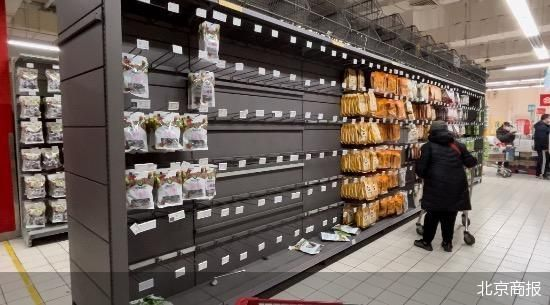
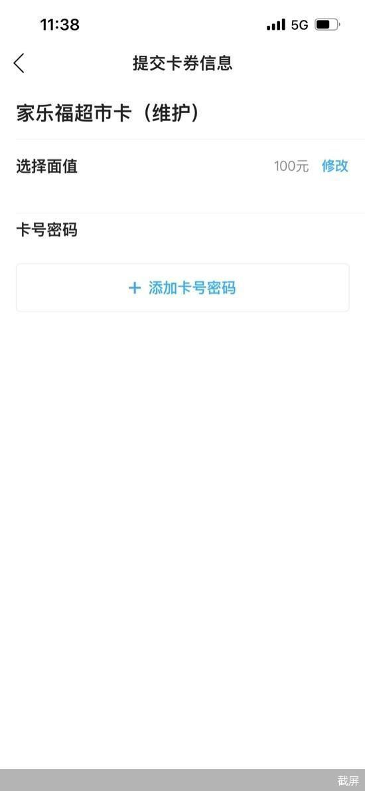
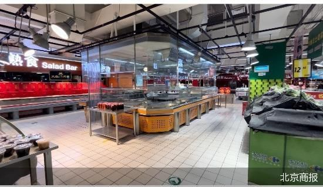

# 货架空置、供应商追债、限制购物卡消费，家乐福一脚迈进深渊

**近期报道**

购物卡消费受限引猜测，家乐福最新回应

购物卡遭黄牛拒收！前三季度家乐福闭店54家多城市已无家乐福

1月8日的北京家乐福卖场，有空空的货架、长长的结账队伍，没有置办年货的热闹，更像是“再不买就要关店了”扫货。北京商报记者走访北京家乐福卖场发现，一件商品被大面积摆放在货架上，大部分商品不能使用家乐福自营的购物卡结算商品。这些经营细节透露着家乐福的运营困境，商品能否继续使用购物卡结算，需要家乐福与品牌供应商进行博弈。年关在即，留给家乐福找方向的时间已经不多了。

购物卡结账受限，关店预警？

“这是今天买的第二车东西，购物卡只能买这些，这趟队估计得排至少25分钟了”，8日一早，张先生及家人进入家乐福凯德Mall大峡谷店，抢购一批可以用购物卡结算的商品，张先生一家一次结账排队等待约15分钟。

“媒体报道北京家乐福卖场很多商品不能用购物卡结算，我们赶来把购物卡余额消费完”，与张先生有同样想法的消费者不在少数，凯德Mall大峡谷一层干果商户表示，从1月7日起，家乐福超市的人就突然变多了，每个人都大量购买商品。

对于消费者关心的购物卡等问题，北京商报记者联系到北京家乐福，相关负责人回复称，前期购物卡系统升级是有商品使用受到限制，目前已经恢复正常。不过，北京商报记者走访中发现，家乐福卖场内的大部分商品仍无法使用购物卡结算。

问及到店消费者，抢购的原因多在于“家乐福卖场是否会关店”。消费者的顾虑也源于家乐福近两年来的“不景气”。去年7月，家乐福方庄店暂停营业，对外告示成“即将升级改造”。不过，彼时方庄店的工作人员在关店前夕也提到，“家乐福不会在这里了”。

家乐福超市的离场不再是个例。苏宁易购2022年三季报显示，前三季度，家乐福无新开门店，闭店数量达到54家，门店数量从2021年底的205家减少到151家，门店数量骤减26%。2021年，门店数量净减少23家，2020年净减少5家。随着关店节奏的加快，目前杭州、成都、福州、济南、南昌等一二线市场已无家乐福身影。苏宁易购表示，公司净利润亏损很大原因是受家乐福的拖累，其下滑的业绩难以分摊较高的固定租金成本。为缓解亏损，公司正在全面开展家乐福业务调整，关闭部分区域门店。

家乐福中国关店速度也在加快。家乐福中国2020年门店数减少5家，2021年门店数量净减少23家。在2022年三季度现有门店对比其中报数据，3个月中门店数减少了30家，关店速度远超上半年。

对于门店未来运营，北京家乐福相关负责人表示，不会退出北京市场。

SKU骤减、联营撤店，供应链危机？

在家乐福卖场内，与消费者抢购形成鲜明对比的是场内逐渐空荡的货架。一款干果果脯商品被大面积摆放在货架上、生鲜销售区少有散售蔬菜、冷鲜肉及现场制售区域已经空置......商品的供应也困扰着家乐福。此前家乐福在宣传中提到，商品总SKU多达5万个，相比之下，家乐福没了往日的供应链优势。

另外，2021年，在首家会员店开业时，家乐福与竞品、供应商之间的闹剧展开。彼时，家乐福会员店开业首日发博表示，有竞争对手施压供应商回购买空相关商品，使得不少消费者无法购买。同时，家乐福已针对上述“二选一”行为向相关部门举报。

在商超发展的黄金年代，家乐福曾被康师傅、中粮集团等供应商指责收费过高问题。如今，家乐福因拖欠货款陷入法律纠纷中。

天眼查App显示，近日，尤妮佳生活用品（中国）有限公司与家乐福（上海）供应链管理有限公司仲裁程序中的一审非诉保全审查裁定书公开。文书显示，申请人尤妮佳公司要求冻结被申请人家乐福公司银行存款1389万余元，不足之数查封扣押其相应价值财产。法院认为，尤妮佳公司该申请符合相关法律规定，裁定执行。

尤妮佳为日用品企业，旗下有尤妮佳纸尿裤和苏菲等品牌。

2022年以来，家乐福被供应商追收货款的事件频繁被曝光。此前，西南地区供应商透露，2022年下半年起，家乐福超市频繁拖欠货款。据悉，在这位供应商暂时中止与家乐福合作时，家乐福欠该供应商的未结货款金额约240多万元。

无论这场实体零售行业中的“二选一”是否坐实，供应链都成为摆在家乐福眼前的难题。

行业内卷加剧，亟待转型输血

家乐福曾被视为“大卖场”业态的先行者，之后伴随国内连锁超市崛起以及行业的深度转型，家乐福遭遇打击，运营中的绝对优势不再。2019年，家乐福中国80%股份由苏宁国际完成了收购。这场收购本该是电商向实体商业的赋能，但家乐福却没有走出业绩下滑的阴霾。

值得关注的是，作为家乐福中国的大股东，苏宁易购收购家乐福中国80%股份。而苏宁易购自身也笼罩在债务危机下，无暇向家乐福中国输血。

与此同时，错过电商布局最佳时机的家乐福，发展也重重受困。连锁产业专家文志宏表示，由于互联网、电商的发展，大型超市一站式购物的优势消失了，如今超市正处在一个谋求转型的背景下。他认为，全渠道或许是转型的一个思路，线上线下融合发展。此外，超市本身业态调整也是一个方向，如社区超市、会员制超市等。超市转型的方向还需要一个探索的过程，需要各零售企业有更多的投入与试错。

眼下，昔日的大卖场们纷纷转型，经历阵痛、探索仓储店和社区店，家乐福也需要在成倍的压力下，快速找到转型的方向。

北京商报记者 王维祎

