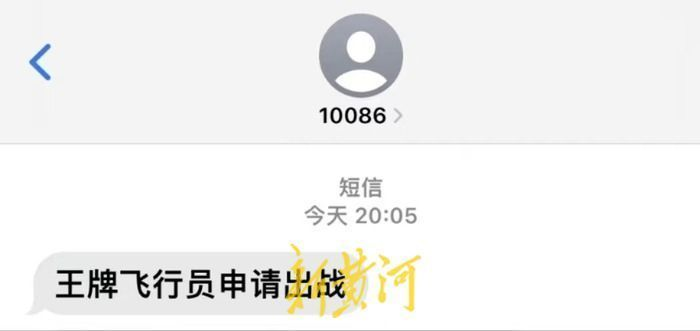
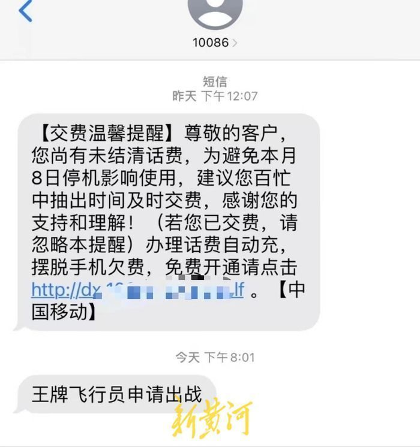
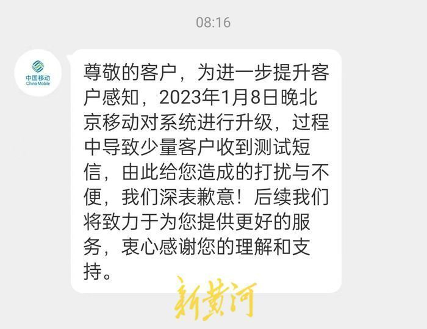

# 部分用户收到“王牌飞行员申请出战”的短信，北京移动回应

1月8日晚8时左右，有些北京移动的用户反映，收到了“王牌飞行员申请出战”的奇怪短信，在社交平台上引发讨论。

新黄河记者注意到，收到“王牌飞行员申请出战”短信的均为北京移动用户，但有的用户有收到，有的没有收到，“王牌飞行员申请出战”这句话则为网络热梗。当晚，记者也以用户身份咨询北京移动10086客服，工作人员表示没有发送上述信息的提示。有网友表示因为担心诈骗短信，收到短信后立即致电了10086客服后，工作人员同样表示并没有发送该信息。

1月8日晚，新黄河记者以用户身份私信反映上述奇怪短信问题。1月9日上午8时16分，北京移动10086热线微博私信回应，“为进一步提升客户感知，2023年1月8日晚北京移动对系统进行升级，过程中导致少量客户收到测试短信，由此给您造成的打扰与不便，我们深表歉意！”目前，北京移动尚未对此事进行公开回应。

新黄河客户端记者：李运恒 编辑：孙菲菲

