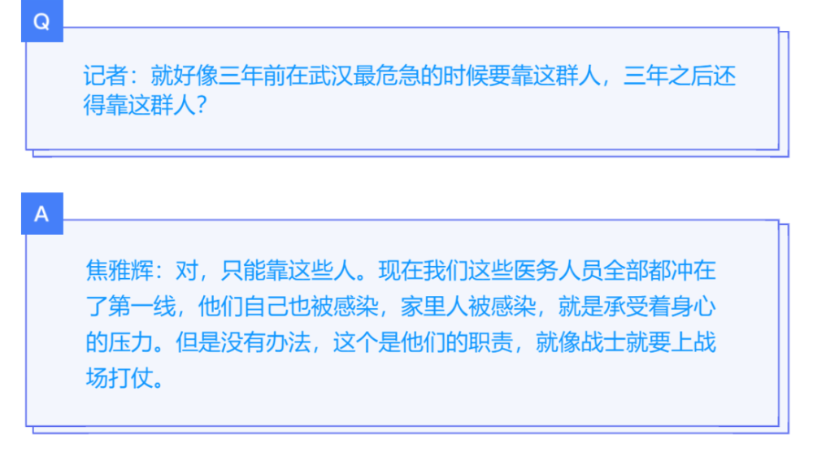

# 重症高峰下的医院：老大爷住进妇产科，骨科医生临时学药品说明书

骨科主任戴上了听诊器，牙科医生拿小本记录呼吸机用法，甲乳外科医生研读内科用药说明书，儿科医生教800个月大的“宝宝”咳痰……这不是段子，这样的场景每天都在众多医院真实地发生着。

近一个月以来，面对感染高峰和重症高峰，面对急需救治的新冠患者潮，许多公立医院勇于打破“专病专科专治”传统模式，打破科室限制，全院打通全面接诊新冠患者，最大限度保障急危重症患者的救治。

很多患者发现，坐在对面为自己诊治的医生也咳喘连连，是尚未完全康复的新冠患者。他们极度疲惫，他们咬牙支撑，毫不夸张地说，为了扛住疫情的冲击，中国1400万医疗卫生工作者在拼尽全力。

河北一家三甲医院医务处处长告诉健康界，根据当地医保部门要求，在内科医生带组的情况下，各个专科都可以收治新冠病人。

伴随着疫情高峰和季节性因素，新冠感染合并基础病的患者日渐增多，床位成为最宝贵的资源。四川省人民医院推行“1123”模式，全力扩大床位规模。

**其中“3”是指三个打破：**

打破内外科界限，建立内科外科科间协作模式，所有的内科专业转化为新冠收治床位，将整形外科、小儿外科、妇产科、乳腺科、耳鼻喉科、康复科等外科片区也拿出一定床位收治新冠患者；

打破医生专业界限，实行混合编组组成救治小组；

打破院区界限。

**“2”是指两个调整：**

调整空间布局，将日间手术病房转化为新冠收治病区，启用草堂老年医学中心，将眼科、老年ICU等科室调整搬离本部，腾出的空间用于患者收治；

调整收治病种，在保证重点病种收治的同时，调整优化收治疾病结构，保证新冠患者的收治。

“急诊、发热门诊病人必须24小时收治清零！全院所有院区、病区开放收治感染新冠病毒患者！”2022年12月30日，华中科技大学同济医院院长刘继红到一线查房后作出部署。

2022年12月，在医护减员的情况下，同济医院三院区扛住了数次就诊高峰，然而随着重症高峰的来临，重症床位和人力资源显得尤为紧张，为扩容重症救治能力，同济医院重症病床数由原先546张，扩增近一倍至1041张，其中呼吸专业重症床位数630张，占比超60%。

同济医院院级专家组根据国家相关指南，发布了《新型冠状病毒肺炎诊疗标准化指引建议》，将新冠救治方案简化，帮助非呼吸科、重症专科医务人员可视化判断指标。在简化版指南中，治疗方案均以条目式、数字化呈现，非专科医生们可快速判断并积极给予专业治疗，大大提高救治效率和救治水平。

同济医院重症医学科房明浩主任医师分析：“比起2020年武汉疫情，此轮疫情导致医务人员大量感染、减员，且没有外省医务人员支援，医疗救治面临更多挑战。有利的是，此轮感染患者危重症大多进程更缓慢，主要以呼吸系统疾病为主，治疗方案容易统一规范。”

国家卫生健康委医政司司长焦雅辉在接受中央电视台《面对面》节目专访时，曾这么说——

近日，健康界与河南、江苏、四川、上海等地的多名一线医务人员聊了聊他们最近支援呼吸科的经历。面对感染高峰和重症高峰，他们和千千万万中国医生、中国护士、中国药师等一样，在超出自身生理和精神极限的状态下，扛过了这一个月。

**骨科医生：**

**脊柱外科病区牌子被换成呼吸科**

我叫李凡，是河南省漯河市第一人民医院骨科主治医师。我前几天发了个抖音视频，拍的是一夜之间，我们脊柱外科病房的牌子被摘，换成了呼吸与危重症医学科九病区。视频获得了3000多点赞，一条点赞最高的评论是“不仅是家没了，人也被征用了”。

是的，我就是那个被征用的人，我现在应该叫“呼吸骨科医生”。不光被征用，工作量也是成倍增加。我过去在病区只管8到10名患者，现在我一个人就要负责25个病人，最多的时候要管30个人。

每天不停地下医嘱，忙到忘记吃饭，只能随便拿起一盒奶或是一根香蕉垫一下，经常一个白天也只能吃这些东西。

现在必须全力保障新冠肺炎病人的救治工作，我们最擅长的椎间盘突出手术都要择期，让患者过段时间再来，科室只预留了一少部分病床，用来抢救急危重症的骨科病人。

网上那种“骨科医生找出内科教材现查”是段子，因为我们大学时候学的书本知识都是最基础的，比较笼统，没有可操作性，而且对于新冠肺炎的救治，内科教材上也没有。我们要做的是在工作和吃饭间隙熟读国家的诊疗方案，了解对新冠肺炎的临床分型，不同的病人需要做哪些处理。

我们医院每天都会收治大量新冠肺炎病人，在急诊科会做好分诊，轻症病人分给我们骨科和其他科室，随时有死亡风险的重症病人会分到呼吸科病房和重症病房，这些地方都有呼吸机，也有ICU医生「坐镇」。

我现在每天的工作重心已经转移到内科疾病的治疗上。病人大部分是老年人，他们中有的患有慢性支气管炎，或者有心脏病、脑梗、糖尿病等基础病，合并肺炎之后，基础病会加重。

在病例上，后面补充诊断经常有七八个，所以管理上不仅要治肺炎，还要把血压和血糖调整好。现在感觉还是我们骨科疾病简单，治好之后诊疗流程就结束，大多数时候不需要过多干预。

外科医生更擅长做手术，内科用药方面我就感到很复杂，要把药品说明书里的禁忌症和功能都学习一遍，一点不能出错。

现在大家都在跨专业执业，风险很大，目前也没有什么规避风险的有效措施。我们能做的只有两点：

第一，即使加班也要把病例写好，不能有瑕疵；

第二是让病情稳定的病人尽快出院，毕竟住的时间越长，风险就越大。

新的一年，在工作上我有两个愿望：

一是希望病人都能平平安安的，那些轻症病人在医生要求下能尽快出院，把有限的床位留给更重的病人；

二是我们脊柱外科的牌子能尽快挂回来，现在摘牌是为了方便患者找到病区的临时操作。有了脊柱外科的牌子，我在病区工作才有归属感。

**男妇产科主任：**

**从没想到有一天**

**会有老大爷住进我们病房**

我是省级三甲医院的一名妇产科主任，男，叫我老张就行。

我干了几十年妇产科，天天跟准妈妈和新生儿打交道，我从来没想到有一天，自己管理的科室住满咳声一片的新冠病人。在这些病人里，有不少是男性，他们应该也算拥有了一生中唯一一次住进妇产科病房的经历。

我们医院几乎所有科室原来的工作都停摆了，全部收治新冠肺炎病人。妇产科和肾内科是全院最后被「攻陷」的科室，因为要收治产妇和需要定期做透析的病人，这是刚需。我们这两个科室还是保留了固定数量的床位收治常规病人，其他大部分床位给了新冠患者。

我们妇产科总共有50多张床，现在全住满了，今天有40位是亚重症新冠病人。没办法，我这个妇产科医生也得上。

但毕竟是跨科收治，一开始我心里也没底，很多内科知识已经还给老师了。好在我们医院成立了新冠巡视小组，小组成员都是呼吸与危重症科医生，他们经常会来指导工作，遇到搞不定的患者，我们也会请求会诊。

对于新冠病人，一些基本的操作我们妇产科医生是没问题的。我们主要做的是祛痰、营养支持、消炎等帮助改善病人生理状态的工作，医院都有操作规范流程。

只要病人不从轻症发展成亚重症，不从亚重症发展成重症，我就很知足了。因为病人一旦发展成重症，我们就要叫呼吸科和ICU的兄弟们来处理，但是我知道，他们现在也忙得分身乏术。

现在择期手术全部延期，人们近期的生育意愿也不高，这让我们妇产科自己的病人少了很多。

作为科主任，绩效让我感到有些焦虑。不过现在我也没空思考这个问题了，先把眼前的这些新冠病人处理好再说。我们医院前段时间发了抗疫津贴，具体每人多少钱，就不说了吧。

其实现在回想起来，即使到了2022年11月份，我们也从来没想过医院会有如今铺天盖地的新冠肺炎病人，但我想真正的重症高峰期还没到来，等春节期间人员流动加大的时候，那些现在尚未感染的老人会受到冲击，他们真的很可怜。

要在如今的医疗条件下生孩子，我也挺心疼那些产妇。我们在分别给新冠病人和产妇查房时防护级别都不一样，我能做的就是带领妇产科的同事们保护好产妇，帮助她们顺利生下宝宝，毕竟孩子是每个家庭未来的希望。

**眼科医生：**

**支援呼吸科就像生二胎**

**复习一下就行**

我是东部地区一家三级医院的眼科主治医师。2022年12月开始，我们医院各个科室都开始收治新冠患者。我们眼科总共30多名医生，除了自身要接收新冠患者以外，还抽调了包括我在内的5人支援呼吸科。

网上有很多其他专科医生学习内科学知识的段子，其实这些内科知识都是我们在大学期间学过的，我本人曾经在呼吸科轮转过，这次也是协助呼吸科医生处理病人。只是像女性相隔多年又生了二胎一样，带大过一个小婴儿再带一个不在话下，很多内容在实际操作中需要重新捡起来，复习一下就行。

我们眼科过去很少遇到会去世的病人，但是我承认，在呼吸科工作这段日子，时常会有患者去世，我的心理也承受了很大冲击。

刚来呼吸科不久，我就遇到一位老奶奶带着她90多岁的老伴来到医院。当时正处在疫情最紧张的几天，老人全身情况很不好，没来得及上呼吸机就走了，留下老奶奶一个人不知所措。两位老人没有子女，老奶奶那种无助的样子让我很难过。我们帮她办理了相关手续，过后我又跟上级医师和同事聊了聊天，才从当时那种失落的情绪中走出来。

之后我们还接诊了一位从农村转诊过来的50多岁的男士。这位病人虽然年龄不大，但是有肾衰合并高钾血症和糖尿病等基础疾病，到来之后我们赶快帮他做透析，但是当天晚上血氧饱和度一直往下掉，发生休克上了呼吸机。我们抢救一夜没能留住他，第二天他就去世了。

这几天我已经慢慢接受了新冠会带走有基础疾病的老年人和体弱患者的事实，但是在最初的几天，我的确感觉压力很大，下了班会去健身房跑步或者撸铁，让锻炼去缓解压力和保证自身免疫力的强大，有时间也会跟同事和上级领导交流沟通，这样从生理和心理上释放压力。

网上有段子说，遇到其他专科医生的新冠病人相当于挂一个号看了两个病。这可不是段子，因为新冠病毒容易引起免疫力下降，导致结膜炎或者视网膜病变，我们收治的一部分感染者就出现了相关的眼部问题，哪怕没有严重的眼部疾病，只是结膜炎，我们也会帮病人处理。每到这个时候，都是我在治疗过程中感觉最轻松的时刻，毕竟遇到了自己本专业的疾病。

社会层面对新冠放开之后，好像外面都在歌舞升平，但是如果你来医院看看，就能看到另一番景象。这里每天上演着生离死别，医护人员也无时无刻都在经受着严峻的考验，我希望医患之间在这个特殊的阶段能够互相理解，共同把这道坎迈过去。

我很珍惜支援呼吸科的这段经历，我相信这是我在专业上提高自己的机会，让我巩固抢救病人的技能，而不是像过去那样只关注眼部疾病。同时这段经历也磨练了我的心态，让我更明白医务工作者的使命和责任，以及当医生的意义。

**神经外科护士：**

**照顾新冠老人比过去的工作容易些**

我叫张红，是上海冬雷脑科医院一名护士。从2022年12月底开始，我就被派驻到一家医养结合的医院友情支援，因为这家医院里感染的老人和医护人员太多。当时我刚感染没多久，院领导找我谈话，征求我的意见。

因为我一直工作在脑科医院，我所负责的病区大部分是刚刚经历开颅手术的病人，甚至有一些是在其他医院开颅之后感染或是出现并发症，再来我们医院二次开颅的患者，所以护理难度很大，对护理工作的专业要求极高，丝毫不能马虎。

来到这家医院，护理的大部分是有高血压、心脏病和糖尿病等基础病的老年人，虽然他们都阳着，但是相比过去，护理工作还是更容易一些。

我跟这边的护士姐妹们一起负责一个有21位老人的病区，有的老人在用心电监护仪监测，有人已经上了呼吸机。他们都是60岁以上的老人，年龄最大的90多岁。

跟我过去护理的术后病人不同，这里的病人尽管年龄比较大，但他们大部分意识清醒，可以交流。比如排痰困难的，我教他们排痰，他们也愿意配合。

但他们毕竟都是耄耋老人，听力和理解能力都有限。有一次，我去给一位老人皮下注射胸腺肽，本来是个很简单的操作，但是我用了快20分钟，因为老人穿了很厚的衣服，又几乎听不清我说的话，没办法配合，我就只能帮他先脱掉衣服，操作之后再慢慢帮他穿好衣服。不过病人们对我都礼貌，看我走过来总会远远地打招呼。

虽然在这里工作难度不大，但我还是感觉挺累的，因为我感染之后至今没有彻底康复，会咳痰，鼻涕中带血。其他同事们跟我的情况也都差不多，大家都在努力坚持。

我们医院护理部主任经常会给我打电话，关心我的工作和生活。其实对我们这些从事护理的人来说，只要工作不出差错，每天下班时也会感到开心。

我很想念我的同事们，希望疫情赶快过去，大家都健健康康的，待到春暖花开的时候，我能回到熟悉的病区，跟他们并肩工作。

健康界出品，未经授权禁止转载。

若违规转载，必追究法律责任！

作者|李子君

监制|章北海

