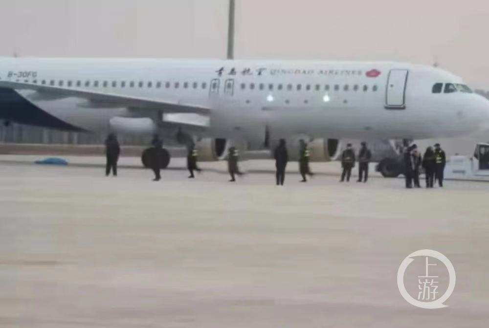

# 青岛一机场机务人员被碾压身亡：未带对讲机，俯身捡工卡遭主轮碾压

2022年1月24日上午6点，山东青岛胶东机场内发生一起意外事故：一架由青岛航空管理并使用的空中客车B-30FG飞机在机场内拖移时，将一名随同飞机移动的机务工程人员碾压，造成该人员死亡。上游新闻事发后第一时间对事件进行了完整客观报道，引发舆论强烈关注。

_▲青岛胶东机场碾压事故现场。图片来源/资料图片_

民航监管机构认为，青岛航空这起地面不安全事件构成了一起人为原因民用航空器地面一般事故，青岛航空公司安全管理存在缺失是事故发生的次要原因。监管机构已经针对调查中发现的问题，对青岛航空、青岛胶东机场提出了安全建议。

上游新闻早前报道《牵引飞机时出意外，青岛航空一客机拖移时1名机务遭碾压致死》显示，青岛航空股份有限公司在2014年3月获得民航局颁发的《公共航空运输企业经营许可证》，随后获得运行合格证书，事发前从事公共航空运输已有九年之久。涉事飞机2020年7月底加入青岛航空机队，事发前B-30FG飞机最后一次执行民航航班任务是在2022年1月23日，当天23点34分完成长春——青岛的飞行任务后，落地青岛胶东机场进行维护。

调查报告显示，2022年1月24日，青岛航空B-30FG号机在青岛胶东机场维修坪610机位执行完A检维修工作后，准备实施从610机位到501机位拖机作业。根据牵引车行车记录录像，在生产准备阶段，拖机指挥员领取相关拖机工具，却并未借用对讲机、声光报警器等。

当天6点18分，飞机从610机位推出，牵引车牵引飞机沿P滑行道向南行进，指挥员位于拖车右后方约半米处伴随拖车行进。6点22分，指挥员耳机线在行进中被拖车右后轮压住后绷断，此时指挥员用左手拍打牵引车并向前跑动，但未到达牵引车前部，继续伴随牵引车前进。

监控视频显示，6点23分57秒，在飞机行进至605机位附近时，指挥员随身携带的《牵引飞机检查单》散落到机坪地面上，于是指挥员背对飞机、弯腰持下蹲姿势尝试捡拾检查单。6点24分03秒，指挥员在被飞机右内侧主轮碾轧，不幸身亡。7秒后，被拖行的飞机停住。

此前2020年9月29日，东方航空也曾发生一起地面机务工程人员被飞机牵引车碾压身亡事故，航空公司后续通报证实了事件的发生，并将其定性为“地面交通事故”。民航华东局没有公开对于此事的详细调查结果。

对于青岛航空这起机务被飞机碾压致死事件，调查报告查明，遇难的地面指挥员在连接飞机的耳机线被碾断以后，由于未与牵引车司机建立及时有效的联络，也未能采取有效措施指挥停止拖机作业，指挥员在行进中整理耳机线，中间还有间断性小跑，增加了随身携带的检查单掉落的可能性。在三张检查单散落在地面后，指挥员立即弯腰捡拾，此时指挥员背对飞机主轮单膝跪地姿势拾取检查单，正处于飞机右主轮移动路径上，情景意识不足，未能发觉飞机移动所带来的风险，最终被右侧主轮碾轧致死。

_▲青岛航空曾规定，所有人员应与起落架保持三米以上距离。
图片来源/受访者供图_

对于事件发生原因，调查认为拖移事发飞机的小组负责人未对工具借用情况进行核实和有效管控，牵引车司机虽然向指挥员询问了对讲机和声光报警装置的情况，但在没有对讲机和未使用声光报警装置的情况下，仍然实施拖机作业。指挥员在牵引车右后方约半米处步行跟随，不符合作业规范中“指挥员应与牵引车、牵引杆、前起落架保持3米的距离”的要求。

调查组根据查明的事实认为，青岛航空在隐患排查治理以及对外委单位和人员培训管理等方面存在缺失。此次事件造成1名人员死亡，构成了一起人为原因民用航空器地面一般事故，青岛航空公司安全管理存在缺失为次要原因。

针对调查中发现的问题，调查组对涉事青岛航空提出了加强安全风险管理与隐患排查，完善外委项目管理，全面梳理、完善和优化工作程序，加强作风建设，提升岗位胜任能力等4条安全建议。除了涉事航空公司，青岛机场也被要求优化机坪运行管控方案，牵头驻场有关单位针对推拖航空器等开展风险管理，加强从业人员安全培训，提高相关人员业务能力及风险意识，消除安全隐患。

上游新闻记者 胡磊 实习生 陈彦羲

编辑 杨波

责编 范永松 官毅

审核 冯飞

