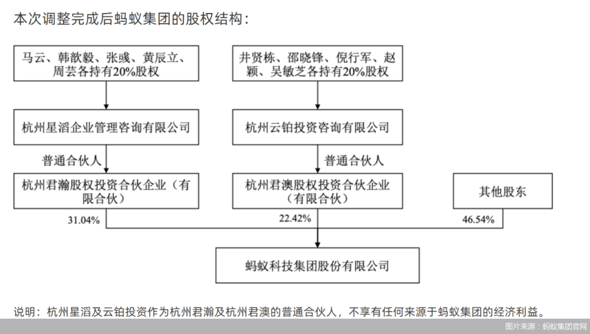

# 马云退出实控人，蚂蚁谋上市？蚂蚁回应：专注整改，未启动上市计划

新年伊始，蚂蚁集团又刷屏了，这次是因为股东投票权调整。

根据蚂蚁集团最新官宣来看，本次调整的核心变化是：马云及其一致行动人的投票权由此前的53.46%，调整为包括马云、蚂蚁高管、员工代表等在内的10名自然人分别独立行使股份表决权。通过这一调整，马云的表决权下降到了6.208%。

这也是市场最关注的点，因此调整，马云不再拥有蚂蚁集团的实际控制权，如今，蚂蚁集团也不再有实际控制人。除此之外，蚂蚁集团在董事会和股东层面还有一系列升级举措，包括引入第五名独立董事，强化与股东阿里巴巴集团的隔离等。蚂蚁集团称，这些调整将进一步提升公司治理的透明度和有效性，有利于公司行稳致远。

然而，市场热议不仅于此。有业内人士指出，从近年来的系列整改和调整来看，蚂蚁集团正在为重启IPO铺路，“进化”后的蚂蚁，上市只是时间问题。

不过，对于上市，1月8日，北京商报记者独家了解到，蚂蚁有关人士回应，目前蚂蚁仍专注于整改和业务升级，没有启动上市的计划。

**一、调整：再无实际控制人**

1月7日，蚂蚁集团一则关于持续完善公司治理的公告让大半个金融市场炸开了锅。

重磅关注点主要在股东层面。蚂蚁集团主要股东及相关受益人拟对蚂蚁集团股东上层结构进行调整，最大的变化是不再有单一控制 “联合体
”。此前，马云及井贤栋、胡晓明、蒋芳等一致行动人共同行使股份表决权，马云能够实际支配云铂投资股东会、行使蚂蚁集团股东权利相关事项的表决结果，进而间接控制蚂蚁集团53.46%股份的表决权。

而调整后，一致行动协议终止，蚂蚁集团各主要股东彼此独立行使股份表决权，且无一致行动关系。北京商报记者根据调整完成后蚂蚁集团的股权结构计算，马云表决权由53.46%降为6.2%，亦不再为蚂蚁集团实控人。

另在董事会方面，蚂蚁集团目前董事会八名董事中已经包含四名独立董事（达到半数），并在此基础上计划继续引入第五名独立董事，实现董事会中独立董事过半数。根据蚂蚁官网披露，目前其董事会成员包括董事长井贤栋、执行董事倪行军、非执行董事蔡崇信、程立，另外四名独立董事则为郝荃、黄益平、杨小蕾和史美伦。

同时，蚂蚁集团相关管理层成员不再担任阿里巴巴合伙人，此举也再次强化了与股东阿里巴巴集团的隔离。

对于此次调整，蚂蚁集团表示，“主要是为进一步适应现代公司治理体系的要求，推动股东投票权与其经济利益相匹配”。

“蚂蚁集团原有股权架构是早年为实现员工持股所做的阶段性安排，本次调整也符合公司决策管理的实际情况。”蚂蚁集团称，调整完成后，将不再存在任何直接或间接股东单一或共同控制蚂蚁集团的情形，蚂蚁集团的股份表决权将更加透明且分散，另外，本次调整不会对蚂蚁集团及下属公司的日常经营造成影响。

北京商报记者从知情人士处了解到，马云多年来其实一直在考虑通过降低投票权放弃对蚂蚁集团的控制权，但这一计划一直没有实施，主要是不希望相关变化影响蚂蚁集团上市，而遇上“蚂蚁上市暂缓事件”后，也得以契机进行相应调整。

“此次股权调整是程序上的补充，”
浙江大学国际联合商学院数字经济与金融创新研究中心联席主任、研究员盘和林同样告诉北京商报记者，马云早已公开宣布退休，如果相关的控制权不变更，那么蚂蚁集团在经营过程中就会出现群龙无首的局面，或者内部管理系统会出现混乱。所以此次只是程序上的补充，一方面落实马云退休这个既成事实，另一方面是理顺蚂蚁集团的股权属性，让股权结构更加清晰。

在盘和林看来，马云原先控制蚂蚁集团的方式并非股权控制，而是表决权控制，或者说蚂蚁集团是同股不同权的企业，马云虽然有控制权，但控制权中占比较大的是表决权。此类企业理顺控制权其实非常简单，只要收回表决权授权，取消一致行动人，调整控股合伙企业控制权结构即可以实现，所以此次控制权调整对马云和蚂蚁集团来说都影响甚微，马云退休后，蚂蚁集团控制权得以平稳过渡。

易观分析金融行业高级咨询顾问苏筱芮同样指出，蚂蚁集团这一系列调整是近年来国内龙头企业持续优化公司治理，在组织结构上顺势调整的一个缩影。一方面看，马云退出实控人与其近期辞任各类“头衔”的举动具有一定的连贯性，另一方面看，股权架构调整后的公司经营将更加透明，且经营管理层的独立性有所增强。

**二、回应：没有启动上市计划**

对于蚂蚁集团此次调整，引发市场更为关注的点是，是否在为重启上市做准备？

自2020年11月上市前夕临门生变后，蚂蚁集团不管是业务层面还是人员层面就开启了一系列浩浩荡荡的调整动作，包括动刀“花借”进行品牌隔离、关闭互助平台“相互宝”、支付宝与网商银行进行切割、成立蚂蚁消费金融大举增资等。

另外蚂蚁集团人员也在逐渐从阿里脱钩，除此前宣布退休的部分成员外，来自蚂蚁集团管理层的相关成员中，包括井贤栋、倪行军、曾松柏、彭翼捷等也不再担任阿里巴巴合伙人，强化了与股东阿里巴巴集团的隔离。

尤其是现任港交所主席的金融圈“铁娘子”史美伦加持后，一度让业内解读为推动蚂蚁集团重启IPO的重要信号，有人甚至认为，史美伦出任蚂蚁集团独董，也意味着香港极有可能成为蚂蚁集团IPO的目的地之一。

不过，这些猜测都曾在2022年6月遭到证监会和蚂蚁集团的双双否认。当时，针对网络传言中国证监会成立工作组评估蚂蚁集团重启上市一事，证监会辟谣称，“没有进行这方面的评估和研究工作，但支持符合条件的平台企业在境内外上市”。

与此同时，蚂蚁集团亦发布公告称，正在监管部门的指导下专注落实整改工作，没有启动IPO的计划。

时隔半年，蚂蚁集团重大调整再次引发业内对其重启上市的猜测。1月8日，对于这一问题，蚂蚁有关人士独家向北京商报记者给出了回应，仍是“目前蚂蚁仍专注于整改和业务升级，没有启动上市的计划”。

未启动上市计划或主要因为相应整改和规则限制。北京商报记者多方了解到，根据各大交易所相关上市规则，发行人申报时需满足实际控制人在对应年限内未发生变更的硬性条件（A股主板需要三年，A股科创板、创业板为两年，港股为一年）。

也就是说，若计算蚂蚁集团的上市时间表，最早也要在一年时间以后。

不过，上海久诚律师事务所律师许峰指出，“虽然实控人变更对上市会有重大影响，但是否可能通过一定渠道走特批值得关注，很多问题是可以通过解释来解决的，可以重点关注蚂蚁后续的解释以及监管如何批准的问题”。

**三、整改：业内预测下步将申请金控**

在业内看来，蚂蚁上市，剩下的只是时间问题。不过，一大必要条件就是完成整改。

“考虑国际形势和近期监管表态，除了国内市场外，也不完全排除蚂蚁集团海外上市的可能，不过，从时间点来看，今年上市尤其是近期重启上市确实不太可能。”
博通咨询首席分析师王蓬博指出，蚂蚁集团近期多个举动更应该是整改的一部分，从公司治理的角度来看也是和国际接轨的体现，多投票权的公司结构实际上更加稳定，将有利于蚂蚁集团的长期发展。

在调整股东投票权前不久，北京商报记者注意到，作为蚂蚁集团整改的重要环节，蚂蚁消费金融增资扩股方案历时一年尘埃落定。根据重庆银保监局官网近日发布的批复，同意蚂蚁消费金融将注册资本由80亿元人民币增加至185亿元人民币。同时该批复还表示，同意杭州金投数字科技集团有限公司、浙江舜宇光学有限公司、传化智联股份有限公司投资入股蚂蚁消费金融。

除了蚂蚁层面的动作外，最新监管层面亦有新动态。根据新华社1月7日消息，人民银行党委书记、银保监会主席郭树清表示，14家平台企业金融业务专项整改已经基本完成，少数遗留问题也正在抓紧解决。后续将实行常态化监管，鼓励平台企业合规经营，在引领发展、创造就业、国际竞争中大显身手。

另证监会层面也在不久前提出，要推动企业境外上市制度改革落地实施，加快平台企业境外上市“绿灯”案例落地。

在零壹研究院院长于百程看来，上市对于蚂蚁集团的持续健康发展和提升国际竞争力非常重要，重启上市还有赖于其整改的彻底完成和自身业务的稳定表现，以及市场的契机等。

结合目前整改来看，蚂蚁集团在金融与科技业务的梳理、金融业务持牌经营、公司治理、支付等业务回归本源等方面，都取得关键进展，“接下来的重要一步可能是申请成立金融控股公司”，于百程说道。

除了金控外，蚂蚁多个整改项中还有悬而未定的征信牌照。北京商报记者注意到，自2021年11月央行宣布受理钱塘征信有限公司（筹）（以下简称“钱塘征信”）的个人征信业务申请后，至今已经1年有余，但未再有进一步进展。

“虽然14家平台整改进入尾声，但还需要一个扫尾的过程。蚂蚁集团整改也是，除了推进公司治理，后续金控、个人征信等牌照落定也仍需时间。”王蓬博指出。

苏筱芮认为，蚂蚁集团的整改仍在进行当中，待整改基本完成，再结合近期监管提及的涉及平台型企业的“绿灯”举措，预计届时有望重启上市。

“目前这一系列股权结构大调整，是蚂蚁集团真正走向股份制公司的一个核心步骤，推动海内外上市对蚂蚁集团来说有其必要性。”在允泰资本创始合伙人、首席经济学家付立春看来，系列整改为蚂蚁集团后续上市提供了更大的可能性，但上市仍需要一个过程，要符合各个市场的规则，不可能一蹴而就，但整体来看前景可期，蚂蚁集团以后能走的路将会更宽。

**四、马云后撤，蚂蚁向前**

蚂蚁长大，马云身退，留给市场的悬念正在一一揭晓。

观察蚂蚁集团后续业务发展，从过去一年公开动作来看，除了推进现有金融业务风险管理和合规整改外，探索数字技术与实体产业的融合，提升服务业数字化、数字科技和国际化业务份额，应是蚂蚁集团未来的发展重心。盘和林认为，后马云时代，蚂蚁集团及其支付宝工具将成为中国经济的基础设施，蚂蚁集团将更好地平衡好盈利和公共利益之间的关系。

“当前支付宝等支付工具在中国宏观经济层面的影响力越来越大，所以要避免少数人控制这些关系国计民生命脉的关键金融工具，未来蚂蚁集团不会单纯以盈利为目的。”但盘和林同样认为，未来蚂蚁集团也可能进行IPO上市，上市公司中很多企业都存在无实际控制人的情况，在他看来，无实际控制人的情况适合企业稳定运行，也能在企业内部形成相互制衡和相互监督，有利于企业长期稳定发展，而这些制衡对消费者、对公共利益来说也有好处。

不管何时上市，可以确定的是，后续，凡是金融则归金融，科技归科技，蚂蚁集团发布的ESG可持续发展报告同样梳理了这五大业务主线：数字支付开放平台、数字金融开放平台、服务业数字化经营开放平台、数字科技服务、国际跨境支付服务。

值得一提的是，蚂蚁集团的命运，于整个互联网行业而言，亦是最关键的监管风向标。

“总体来看，在数字经济持续发展的背景下，科技的赛道会很长，经过两年多的整改，业务健康度上升，平台经济受到政策支持，蚂蚁集团的未来也会逐渐明确。”于百程如是说道。

北京商报记者 刘四红

