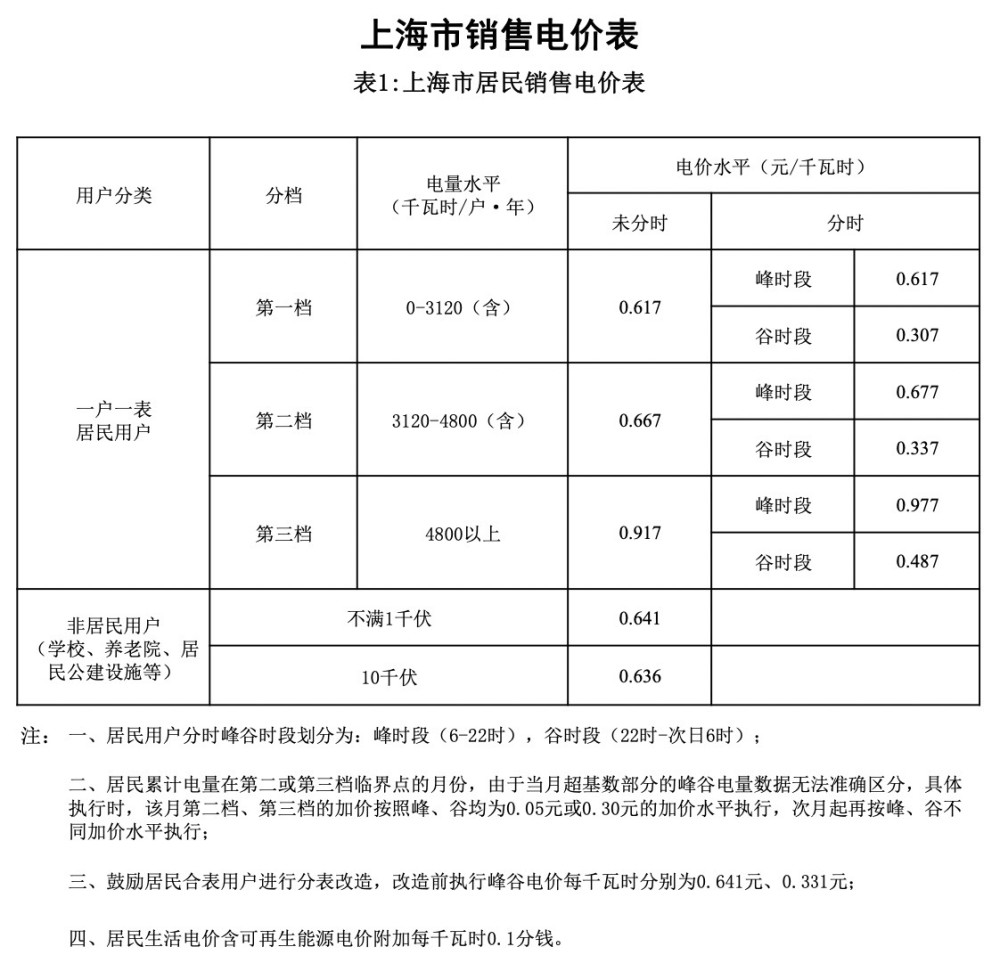
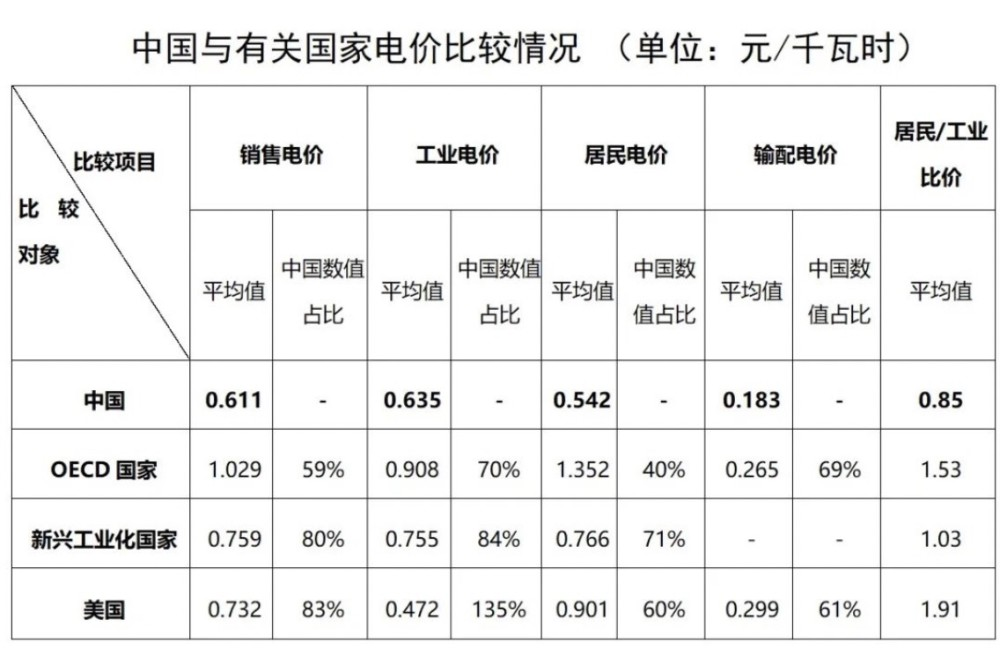
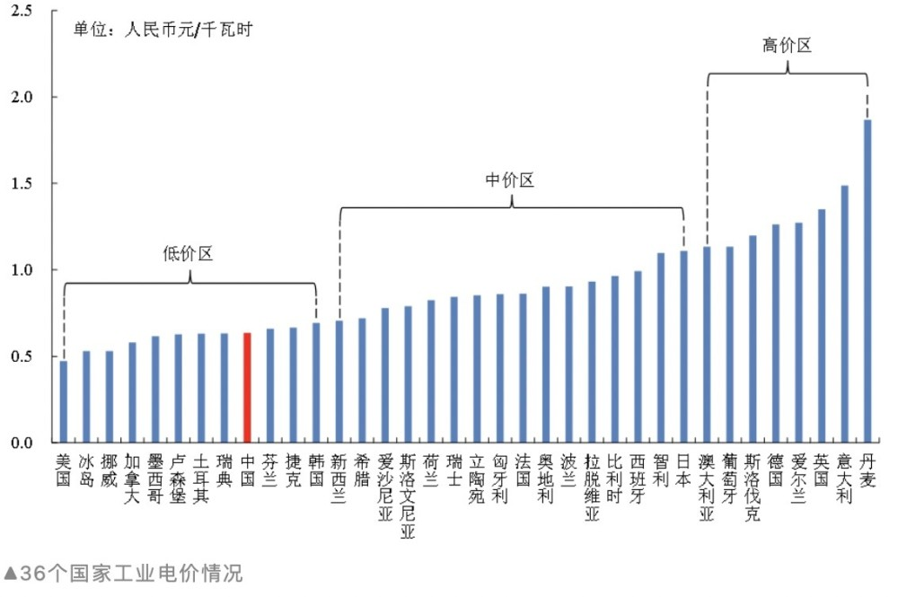
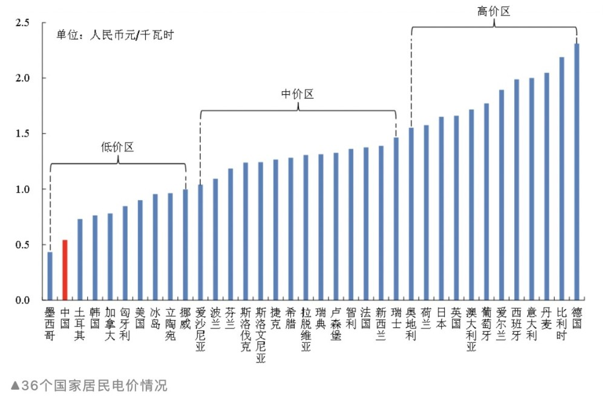
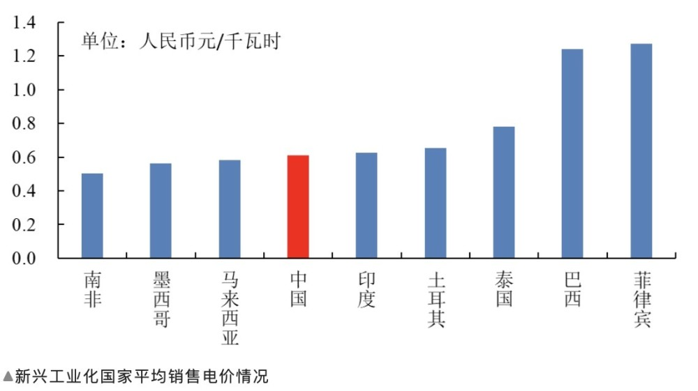

# 12月电费为何同比环比都“特别贵”？中国电价高不高？

小寒时节，多地网友晒出账单，热议“12月电费特别贵”。连日来，尽管各地发改部门和供电公司作出回应解释，仍有很多网友“不买账”，声称遭遇了“电费刺客”。真相究竟如何？

据澎湃新闻观察，参与该话题讨论的网友们的疑虑主要集中在以下几点：自家2022年12月产生的电费，为何比夏季高温月份、2021年12月、2022年11月的电费都要更高？多个省份自去年底以来调整一般工商业及大工业分时电价政策，是否意味着居民电价也随之同比例上浮？本文将针对上述问题，掰开揉碎地逐一进行分析。

同样的房子、同样是12月份，为什么2022年12月比2021年12月更贵？

近日，一张“上海电费涨价了吗”的截屏在网络传播。发帖者言之凿凿，“上海电费涨价了”，还表示居民电费涨价已从去年12月开始执行。几乎同时，“上海电费”冲上热搜。

上海市发展改革委对此回应，网传消息不实。目前，国家和上海都未调整居民电价水平，上海市居民用户继续执行2012年颁布实施的居民目录电价。国网上海市电力公司也表示，经核查，网传截屏中的描述与实际严重不符。同时，国网上海市电力公司近期也没有收到政府部门关于居民电价调整的相关通知。

争议并未就此止歇。除了上海，多个省份的网友加入了12月份电费支出上涨的讨论。那么，我们先从上海说起，其他地区以此类推。

为什么同样的房子、同样是12月份，2022年12月的电费要比2021年12月高出不少？居家因素我们将在下一章节中着重讨论，先说一个更容易被忽视的原因——计价周期调整，或者说，2021年12月其实是个不能横向对比的“特殊月”。

细心的网友可能会发现，在2022年之前，每个月的电费账单，其实是为上个月的用电量付费，比如抬头为2021年7月的账单，实际结算周期是2021年6月1日至30日。这种结算方法在去年12月时发生了变化，根据国家发改委和上海市发改委要求，自2022年1月起，上海电力用户每月收到的电费账单与实际用电月份一致，也即购售同期。居民阶梯电量计算周期的起讫点，从前一年的12月1日至当年11月30日（跨度12个月），改为当年1月1日至当年12月31日（跨度仍为12个月），实现了和“自然年”的完全一致。

我国自2011年起推行居民阶梯电价，并由各地根据实际情况，合理设置分档电量标准，保证满足居民基本用电需求的电量价格平稳。

阶梯电价按电量分段定价，以目前上海市居民电价表为例，一户一表居民用户按照阶梯递增，其中第一档（年累计用电量不超过3120度）未分时电价为每度0.617元，分时电价为峰时段每度0.617元，谷时段每度0.307元；第二档（年累计用电量大于3120度且不超过4800度）的未分时电价为每度0.667元，分时电价为峰时段每度0.677元，谷时段每度0.337元；第三档（4800度以上）的未分时电价为每度0.917元，分时电价为峰时段每度0.977元，谷时段每度0.487元。上文所指的峰时段为6-22时，谷时段为22时-次日6时。

_图1：上海市居民用电电价表_

回到前文的“2021年12月”。由于2021年12月正处于政策调整档口，它既不属于2021年的周期，也不在2022年的周期。当时采取的方法是，参考用户当月的用电量，只要不超过3120度的第一档用电量，就按照第一档的计费标准收费。

所以，绝大多数上海居民家庭那个月的电费是按照最便宜的那档电价来收的。

这也正是大家对2022年12月电费的感知度较往年格外突出的原因——此前，计费周期从每年的12月1日到次年的11月30日，所以气温下降的12月电费已进入新一轮周期的第一档，单价最低；调整后，计费周期和自然年一致，为每年的1月1日到12月31日，到了12月的电费很可能不是第一档，成了全年单价最高的月份。

综上所述，12月和12月是不一样的，很多居民家庭前后两个12月很可能对应的是阶梯电价的不同单价档位。即使是长期居家办公的网友、同月份用电习惯不变，也会因为以上因素收到总额完全不同的电费账单。

如果是国家电网经营区的电力用户，可通过网上国网APP查询电量电费、月度电费、日用电量了解明细，也可通过用能分析等功能查询用电情况与趋势。

和2022年11月相比，我家12月的用电量为何翻倍？

先说结论，许多网友之所以会发现家中去年12月的电费是11月的三四倍，大概率是量价齐升（当月用电量、换挡后单价变高）的结果。

还是先以上海为例，2022年，居家时间比往年要长。去年3-5月，封控时间至少六十多天；家有学子的，网课时间超过三个月。12月，疫情防控措施调整以后，不少人不幸中招，开启“居家”模式。叠加气温陡降创新低，为了保暖，家中取暖设备开足马力，增加了电量的消耗。

澎湃新闻经简单随机抽样调查发现，这些因素导致了许多居民比往年更早、更多地进入第二、三档电价区间。

撇开上海上半年疫情封控、年末居家时间更长的原因，澎湃新闻注意到，近日不少杭州居民也反映12月份家里的电费增幅较大，甚至有的比11月份翻了好几倍。对此，杭州市发改委联合供电公司1月6日作出解释：部分家庭开始使用第三阶梯电价、居家导致用电设备增多、气温低导致电器用电量增加等原因导致了上述结果。

有没有什么办法能减少电费支出呢？一是调整用电习惯，比如空调设置温度每下降 1 度、可节能
7-10%。此外如果家里开通了峰谷电，可在低谷时间定时开启部分家用电器。

根据经验，气温是电网用电负荷曲线的重要决定因素。

以去年夏季为例。中电联数据显示，2022年前三季度城乡居民生活用电量1.03万亿千瓦时，同比增长13.5%。其中，一、二、三季度同比分别增长11.8%、7.0%和19.8%。去年8月，全国平均气温达到1961年以来历史同期最高水平，拉动空调降温负荷快速增长，当月居民生活用电量增速高达33.5%，其中，重庆、湖北、四川、浙江、陕西、江西增速均超过50%。

澎湃新闻以公开信息粗略统计，2022年12月上海有两波寒潮，平均气温约6.4摄氏度，有20天最高温度低于10度，好几天低于5度。与11月相比，12月的平均气温降低了10度左右。

在此，再援引上海中心气象台公布的“2022年上海市十大天气气候事件”中的两组数据：

“2022年上海市日最高气温≥35℃的高温日数达50天，较常年偏多29天，居历史同期次多；日最高气温≥37℃的高温日数达31天，较常年偏多24天，居历史同期次多；日最高气温≥40℃高温日数达7天，创历史最多纪录，且7月10日创日最高气温≥40℃历史最早纪录；日极端最高气温为40.9℃，平历史最高纪录（2017年）。综合高温日数、持续时间和极端最高气温，2022年高温达历史最强。”

“2022年11月30-12月2日受强冷空气影响，本市出现剧烈降温。期间市区24小时降温幅度达6.2℃，极端最低气温为3.0℃，出现在12月1日；市区日平均气温仅为4.9℃，较常年同期（11.1℃）偏低6.2℃，为1991年以来最低。11月30日-12月4日市区连续5天日平均气温＜10℃，上海正式入冬，11月30日为今年入冬日。”

过冷和过热，都会导致空调及同类型设备的用电负荷节节攀升。2022年夏季，我国出现了近几十年来持续时间最长、影响范围最广的极端高温天气，叠加经济恢复增长，拉动用电负荷快速增长，全国有21个省级电网用电负荷创新历史新高。

以去年夏天最受关注的四川为例：据国网四川电力融媒体中心，夏天会出现电力负荷高峰，最重要的原因就是由于空调降温负荷的影响。据测算，去年四川夏季空调降温负荷近1800万千瓦，超过全省用电负荷的1/3。在成都，高峰期空调用电负荷一度占到成都市电力负荷40一50%。

而到了冬季，按照空调运行原理和室内外温差，制热的耗电量通常要比制冷更大。此外，冬季制热设备中，存在不少看似个头不大，实为“隐形能耗大户”的电暖设备。

“没有开空调，只有小型电取暖设备，怎么会用这么多电，是不是电表跑快了？”这是每到冬季经常出现的疑问。红星新闻曾报道，线上购物平台存在大量标榜“7天只需1度电”“全屋半度电”等电取暖设备，其实很多只是“数据游戏”。家用取暖电器1小时耗电量多在1至2度，造成耗电陡增的往往是小型电暖设备。消费者可以通过电器标称功率简单计算每小时耗电量。

需要强调的是，如果对比下来，有网友发现家中电费差异大到离谱，可以拨打电力热线95598，申请第三方校验电表，或者12345市民热线投诉。

居民电价会随工商业分时电价上浮吗？中国电价水平到底高不高？

电费话题冲上热搜后，不少人关注到另一则官方消息。

上海市发改委去年12月中旬发布《关于进一步完善我市分时电价机制有关事项的通知》称，为充分发挥分时电价信号作用，更好引导用户削峰填谷，促进新能源消纳，保障电力系统安全稳定经济运行，将进一步完善分时电价机制。其中，一般工商业及其他两部制、大工业两部制用电夏季（7、8、9月）和冬季（1、12月）高峰时段电价在平段电价基础上上浮80%，低谷时段电价在平段电价基础上下浮60%，尖峰时段电价在高峰电价的基础上上浮25%。

其实，该通知中已明确说明“居民生活用电、农业生产用电分时电价政策不变，仍按原政策执行。”也就是说居民用电价格机制没有变化。

分时电价机制基于电能时间价值设计。据澎湃新闻不完全统计，去年12月开始，多个省份开始执行新的分时电价政策，相关政策主要针对的是工商业电力用户或大工业用户。

之所以要采取这些措施，是因为随着电力消费结构变化、极端天气频发等原因，电力系统的负荷峰谷差发生了显著变化。

国家发改委曾对此作出解释：“近年来，我国能源消费结构快速变化，用电负荷对气温变化更加敏感，电力系统负荷夏、冬两季尖峰化特征日益突出。据统计，各地夏季最热、冬季最冷时段的全年累计时间普遍低于60个小时，但对应的尖峰电力需求可较平时高出1亿千瓦以上，保障电力系统安全稳定运行面临更大挑战，2020年以来部分地方已不得不实施有序用电。进一步完善分时电价机制，特别是优化峰谷电价机制、出台尖峰电价机制，有利于充分发挥电价信号作用，引导用户错峰用电，尽可能少地启动有序用电，保障电力系统安全稳定运行，降低经济社会运行成本。”

国家发改委还称，“此次进一步完善分时电价机制，继续坚持了一项基本原则，即保持电网企业的销售电价总水平基本稳定。也就是说，进一步完善分时电价机制，对社会总体用电成本影响较小，电网企业不会因此‘多收钱’。”

我国电价在国际上究竟处于什么水平？对各国销售电价水平进行国际分析比较，有助于对我国电价水平在国际上的排名有更为清晰的定位与直观的认识。

我国的电价体系主要分为上网电价、输配电价、线损折价和政府基金及附加，这些价格的加总即为终端销售电价。

中国拥有极其复杂的电价体系，与国外相比，最大的区别在于国外通常是工业电价低于居民电价，中国则反之。长期以来，我国试行较低的居民用电价格，居民电价较大幅度低于供电成本，是因为工商用户承担了相应的交叉补贴。与国际上其他国家相比，我国居民电价偏低，工商业电价偏高。

在用户类别结构上看，以美国为例，作为典型发达国家，美国居民用电占比大、价格高，工业用电占比小、价格低。而由于我国长期实行工业电价补贴居民电价的交叉补贴制度，表现为工业用电占比大、价格高，居民农业用电占比小、价格低。

国家电网公司此前刊文称，在国际上，与35个经济合作与发展组织（OECD）成员国相比较，与新兴经济体国家相比较，与美国相比较，我国电价均处于较低水平。以2019年数据计算，国际电价比较见下图：

_图2：中国与有关国家电价比较【注：本组图片中，数据为2019年统计数据。经济合作与发展组织（OECD）是由38个欧美主要国家、大洋洲、亚洲的日本与韩国以及墨西哥和智利等中南美国家组成的政府间国际经济组织，以下电价数据包含除以色列、哥伦比亚、哥斯达黎加以外的35个OECD国家与中国。新兴工业化国家一般被认为包括中国、印度、泰国、马来西亚、菲律宾、土耳其、南非、巴西、墨西哥等9个国家。】_

_图3：36个国家工业电价比较_

_图4：36个国家居民电价比较_

_图5：新兴工业化国家平均销售电价比较_

