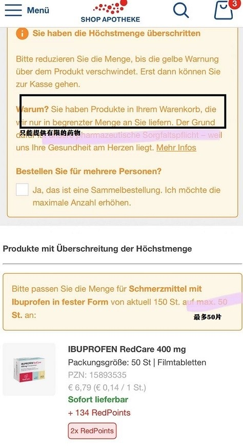
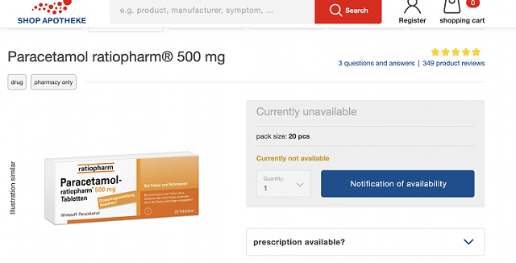

# “三重感染”袭击下欧洲闹药荒！扑热息痛等多种药品短缺

在流感、呼吸道合胞病毒（RSV）、新冠这“三重感染”袭击下，欧洲也闹起了药荒。

在德国一家小型药房工作的药剂师露丝对第一财经记者表示：“
**缺货很厉害。主要缺扑热息痛、阿莫西林、盘尼西林和抗生素。目前糖尿病的药也开始紧缺，胰岛素7月底到11月才可以供货。”**

根据露丝的统计，每两个来她所在药店买药的客人中，就有一个无法买到想要的药物，得建议他们去大药店碰碰运气。

近来，英国的药剂师也频频发出警告，称感冒和流感药物短缺，加之初冬呼吸道感染激增，制造商难以满足需求，一些药店已经发现很难订到止咳糖浆和止痛药等药品。

**“三重感染”下欧洲多种药物短缺**

欧美疾控中心一直在警示，今冬欧美会出现“三重感染”，对医护将产生巨大的压力。

“三重感染”中的RSV通常会引起轻微的类似感冒的症状，但会导致老年人和婴儿患上严重的疾病。欧洲疾病预防和控制中心（ECDC）针对15个欧洲国家的历史性监测数据显示，通常RSV流行的季节中位数开始时间是12月初，且会在第二年的1月底左右达到峰值，不过ECDC专家也指出，今年感染时间比以往要提前半个月。

以英国威尔士地区的数据为例，截至2022年11月27日的一周内，每10万名五岁以下儿童中有111.6例确诊了
RSV。对比历史数据，在2018~2019年和2019~2020年期间，相同参数下的确诊病例均低于50。而在2020~2022年的疫情期间，即使是在该病达峰期间，确诊病例也低于50。

与此同时，入冬之后，欧洲整体新冠确诊病例有所增加。根据ECDC的数据，截至去年12月18日的一周内，欧洲病例比前一周增加了7%，而欧洲地区的流感潮从2022年11月的第二周开始了。

在此背景下，欧洲各国的药品监管机构和药剂师协会等纷纷发声，警示“药荒”。

法国的药品监管机构ANSM就表示，儿童最常用的阿莫西林版本存在“严重的供应紧张”，并警告称这种情况可能会持续到
3月。法国家庭的另一个主要担忧是难以找到扑热息痛，尤其是儿童版本。西班牙和德国的药品管理局也表示，阿莫西林和其他抗生素在内的一系列药物可能出现短缺。

去年12月中旬，英国暴发A型链球菌疫情，导致19名儿童死亡。通常青霉素可治疗A型链球菌感染，然而由于病例激增导致英国药物短缺，不少英国患儿家长奔走寻药。最终英国政府针对青霉素发布“严重短缺协议”，根据“严重短缺协议”，药剂师可在没有指定药物时，直接开具替代药物。

德国也正在经历严重的药品短缺。儿童类含有扑热息痛或布洛芬的甜味止痛药和退烧药的需求很大，但目前药房的存货非常低。如果浏览社交媒体，可以看到大量德国父母在上面的相关发帖。不过最终唯一的选择还是去医院人满为患的急诊室开药。

生活在德国汉堡的莉莉安最近在网上购买布洛芬的时候，发现布洛芬有货但是限购，最多一次购买50粒（一盒），“我查了一下，这是从疫情初期开始就限购了”。

莉莉安对第一财经记者表示，在德国她认识的人之中，如得了新冠，基本上在吃布洛芬，包括她认识的医生也是如此，这可能是布洛芬在德国紧俏的原因。同时，她说：“最近听朋友讨论药品的时候听说两个案例，一个是治心脏病的药买不到，一个是小孩子的药不好买。”

“许多客户不能理解我们有这样的问题（缺药）。”露丝对第一财经记者表示，“一切都会好起来的，但（目前）的担忧也是非常大的。”

露丝观察到的数据同德国联邦药品和医疗器械研究所（BfArM）的统计数据相吻合。根据BfArM的数据，目前在德国短缺的药物包括抗生素（阿莫西林、苯氧甲基青霉素）、糖尿病药物（门冬胰岛素、赖脯胰岛素）、抗癌症药物（含枸橼酸他莫昔芬的乳腺癌药物）、抗高血压药物（盐酸喹那普利、米诺地尔等）和止痛药（布洛芬等），在缺药高峰时期BfArM曾经列出过299种存在交货瓶颈问题的药品。

**成本飙升、供应链告急**

根据当地媒体报道，欧洲闹“药荒”的基本原因是供应链、成本和需求激增。以扑热息痛为例，扑热息痛原料药价格在2022年上涨了 70%，此前在疫情初期更是暴涨。

雪上加霜的是，能源危机让欧洲电价暴涨。2022年9月末，仿制药行业游说组织“欧洲药物”（Medicines for
Europe）发布数据，显示当时欧洲多家制药厂电价上涨10倍，原材料价格飙升50%~160%，运输费用暴增500%。多家仿制药制造商称考虑停止生产部分药品。

该组织当时就向欧盟呼吁，将仿制药企业纳入欧盟能源保供计划中，改革药品定价方式，保证药品供应。不过截至目前为止，欧盟层面在此事上也未做出更多协调工作。

还是以扑热息痛为例，在德国，该药物价格10年中未大幅上涨，20粒一盒该药在3欧以内就可以买到，但这一价格让仍在欧洲的制药企业承压。Teva及其药品品牌Ratiopharm是德国最后一家主要的液体扑热息痛供应商。

在2022年5月一家制造商停产后，目前Ratiopharm必须满足德国90%的液体扑热息痛需求，但Teva方面认为，这是不可行的。“快速上涨的原料药活性成分和生产价格使扑热息痛等药物的生产变成了亏损业务。”
Teva总经理伯克哈特（Andreas
Burkhardt）说，“从长远来看，没有一家公司能够维持这种状况。”其实12年前，欧洲还有11家液体扑热息痛供应商。

第一财经记者在线查询了Ratiopharm品牌的扑热息痛，不仅液体扑热息痛没货，片剂的也没货了。

BfArM也在近期的一份新闻稿中承认，所有东西都被买光了，“药品的可用性明显下降。与此同时，购买量的急剧增加导致了地区失衡和库存”。

德国儿科医生和青少年医生专业协会主席费石巴赫（Thomas
Fischbach）表示，因为德国的固定价格监管导致生产都转移到了亚洲，而目前亚洲也存在供应链问题。

上个世纪90年代前，欧洲原料药生产端领先于全球。此后，因生产成本上涨和环保等因素，欧洲原料药生产供应外迁至亚太地区。

