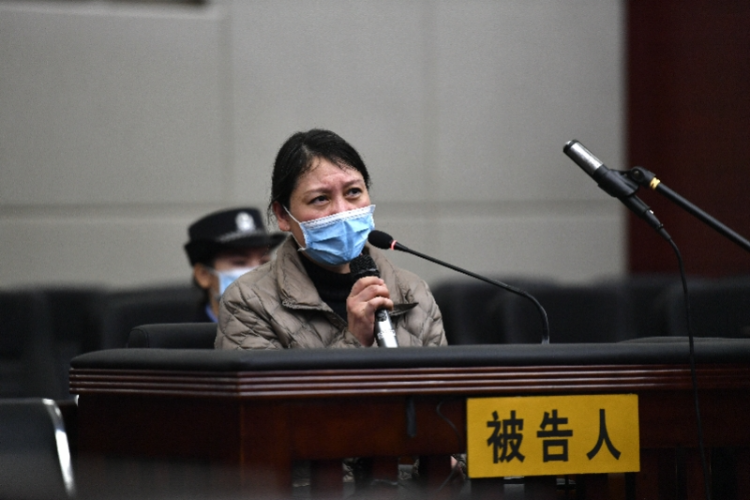

# 劳荣枝案入选法院年度十大案件，死刑判决正报请最高法核准

南都记者注意到，1月7日上午，江西省高级人民法院公众号发布消息，劳荣枝案入选法院年度十大案件，并披露了案件进展，该案死刑判决正报请最高法核准。

江西高院披露，近日，人民法院报评选出2022年度人民法院十大案件，劳荣枝案入选。

在江西高院公众号发布的上述文章中，法学教授点评了劳荣枝案判决死刑但没有立即执行的详情。西北政法大学教授王政勋点评该案提到，江西高院二审维持了南昌中院对劳荣枝以故意杀人罪、抢劫罪、绑架罪数罪并罚，决定执行死刑的一审判决。该案正在报请最高人民法院核准。

王政勋点评称，我国的死刑制度包括死刑立即执行和死刑缓期二年执行，客观之罪（罪行极其严重）决定着是否应当适用死刑，主观之罪的轻重决定着是适用死刑立即执行还是死刑缓期二年执行：虽然行为人的罪行极其严重，但如果犯罪时主观恶性较小、人身危险性不大、有可宽恕之处，就可以对其适用死刑缓期执行。从实践中看，对于有法定从轻、减轻情节的案件，因婚姻家庭、邻里纠纷等民间矛盾激化引发的案件，因被害人的重大过错引发的案件，犯罪后自首、真诚悔罪、积极赔偿被害人经济损失的案件等，一般不适用死刑立即执行。

王政勋认为，劳荣枝的行为属于“罪行极其严重”，但并不属于“不是必须立即执行的”情形。劳荣枝在犯罪过程中积极实施物色、诱骗、捆绑、看管、威胁被害人，踩点、取款、购买作案工具等行为，与法子英分工明确，相互配合，且独立性较强，作用明显；在案发后她改名换姓、整容，潜逃长达20年时间，这些都充分说明其主观之罪也达到了极其严重的程度。江西高院认定劳荣枝“主观恶性深，社会危害性大”，兼顾了客观之罪与主观之罪，符合我国法律规定。

南都此前报道，南昌中院一审认定，1996年至1999年，由劳荣枝从事陪侍服务物色作案对象，法子英实施暴力，二人先后在江西南昌、浙江温州、江苏常州、安徽合肥实施犯罪，致7人死亡。后劳荣枝使用化名长期潜逃。法院认定劳荣枝犯故意杀人罪、抢劫罪、绑架罪，数罪并罚，决定执行死刑，剥夺政治权利终身，并处没收个人全部财产。

2022年11月30日，江西高院二审裁定维持一审判决。判决后，劳荣枝家属表示，劳荣枝提出申诉，该案正处于死刑复核阶段。

采写：南都记者 黄驰波

