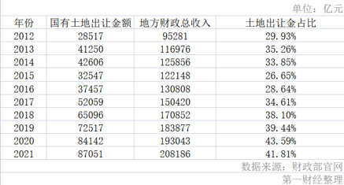

# 去年卖地收入减少约3万亿！2023年“土地财政”将去往何处？

  * _1_ 2022年土地出让金收入下滑，全国土地市场成交建筑面积、成交金额，较2021年同期分别下降了37%、31%，土地出让金从高峰的8.7万亿下降了约3万亿规模；
  * _2_ 除部分特别优质的地块以外，土地市场底价成交、城投托底成为常态，不少城市城投拿地金额占比超过5成；
  * _3_ 未来土地使用权出让金逐渐减少已成为不争的事实，财政收入长期对土地出让金的依赖，也将难以维，寻找新的财政收入增长点已经成为当前迫在眉睫的问题。

多年来，“土地财政”一直是热议的经济话题，今年也不例外。近期，第三方机构克而瑞统计的数据显示，2022年，随着我国房地产销售端疲软，土地出让金收入下滑，全国土地市场成交建筑面积为14.44亿平方米，成交金额4.73万亿，较2021年同期分别下降了37%、31%，土地出让金从高峰的8.7万亿下降了约3万亿规模。

“土地财政”，顾名思义，指的是地方政府依靠出让土地使用权的收入来维持地方财政支出，政府财政收入包括一般公共预算收入、政府性基金预算收入、国有资本经营预算收入，其中，国有土地使用权出让收入属于地方政府性基金预算收入，因不用上缴中央，土地出让收入是1994年分税制改革以来，地方财政的主要收入来源之一。

实际上，经历了二十多年的快速增长，随着我国房地产市场需求见顶，土地出让金的增速明显放缓，长期来看，地方政府高度依赖的“土地财政”将难以为继，如何弥补土地出让金下滑带来的财政资金缺口，成为地方政府不得不面对的问题，那么，2023年，甚至更远的将来，“土地财政”又将去往何处？

**“土地财政”依赖程度越来越高**

我国国有土地使用权公开拍卖始于1987年12月1日，彼时，深圳会堂座无虚席，经过17分钟的轮番叫价，深圳经济特区房地产公司以525万元拿下了这块8588平方米的住宅用地，敲响了建国以来国有土地使用权拍卖的“第一槌”。

根据《中国土地年鉴1996》的数据，1995年，全国通过出让方式提供用地43403公顷，出让金总额为420亿元。1998年，我国正式开启住房市场化改革，此后，随着房地产行业的快速发展，该数据一路上涨，2007年，首次突破1万亿元，直到2020年，我国国有土地使用权出让金额已经升至8.4万亿元，是1998年的200倍。

根据财政部官网公布的数据，仔细观察可以发现，2017年开始，我国土地出让金的增长开始变得很有规律，连续四年，每年的增长金额都在1万亿左右，直到2021年，国有土地出让金的增长速度开始放缓，仅增长3000亿元左右。

土地出让金快速增长的同时，地方财政对土地使用权出让金的依赖程度也越来越大。根据第一财经测算，2017年开始，我国土地出让金占地方财政总收入的比例（土地使用权出让收入/地方政府一般公共财政预算收入+地方政府性基金预算收入+地方国有资本经营预算收入）连续5年超过三成，2020年占比达到43.59%，2021年下降至41.81%，仍在4成以上。

分区域来看，粤开证券研究院统计的数据显示，我国东部地区经济发达、人口持续流入、土地市场需求旺盛，土地出让收入在地方综合财力中的占比（土地财政依赖度）较高；而西部和东北地区土地市场不够活跃，土地出让收入相对较低，更依赖中央转移支付。例如，2020年，浙江、江苏、福建、山东、广东、重庆6个省市的土地财政依赖度高于30%，分别达到51.9%、46.9%、40.3%、38.7%、33.8%和32.0%；而新疆、宁夏、青海、黑龙江、西藏5个省份对土地财政的依赖度偏低，均低于10%。

分城市来看，粤开证券研究院统计的数据显示，2020年，广州、长春、杭州、福州、南宁、海口、贵阳、西安、徐州、扬州、温州、金华、襄阳、南充，这些城市对土地财政的依赖度都较高，政府性基金收入与一般公共预算收入的比值均达到1.5倍，甚至更高；牡丹江、深圳、锦州等地对土地出让金收入依赖度相对偏低，其政府性基金收入与一般公共预算收入的比值分别为0.3倍、0.3倍和0.4倍。

**土地出让金下滑**

然而，在土地财政依赖程度越来越高的同时，我国的土地使用权出让金却面临下滑的事实。2022年，随着我国房地产销售端疲软，土地使用权出让金收入再次下滑。

此前，财政部发布的《2022年前三季度财政收支情况》显示，今年前三季度，我国的地方一般公共预算收入83217亿元，按自然口径计算下降4.9%。地方政府性基金预算本级收入42588亿元，比上年同期下降26.4%，其中，国有土地使用权出让收入38507亿元，比上年同期下降28.3%。

近期，房地产研究机构克而瑞统计的数据显示，2022年，我国商品房销售面积为13.6亿平方米，销售额13.3万亿元，同比分别下降24%、27%，行业规模重回2015年。与此同时，全国土地市场成交建筑面积为14.44亿平方米，成交金额4.73万亿，较2021年同期分别下降了37%、31%。土地出让金从高峰的8.7万亿下降了约3万亿规模。

克而瑞地产研究院数据显示，从土地成交建筑面积TOP20的城市来看，有12个城市的成交量相比去年有所减少，平均降幅达35.7%，降幅超过30%的城市多达7个，其中降幅最突出的当属遵义，成交建面刚刚超过1000万平方米，同比降幅高达65%。

克而瑞地产研究院的研究报告显示，除部分特别优质的地块以外，土地市场底价成交、城投托底成为常态，不少城市城投拿地金额占比超过5成，沈阳、无锡城投托底拿地的比例甚至超过9成，市场低迷的城市城投拿地也尽显疲态，流拍率高企。

价格方面，克而瑞地产研究院数据显示，受一线城市供地质量提升的影响，2022年全国300城土地成交楼板价小幅上涨，增至3266元/平方米，再度创下历史新高。不过，由于新房市场仍处于低位，加之房企资金压力依然较大，房企拿地积极性仍处于低位，全年溢价率仅有3.7%，与去年同期相比，下降了7.9个百分点。从集中供地的22城来看，2022年有17个城市的地价下降。

那么，土地市场出让规模为何下降？房地产研究机构中指研究院土地事业部负责人张凯在接受第一财经采访时表示，与土地市场成交规模相关性最高的仍然是新房市场成交规模。今年以来，受期房烂尾担忧、房价上涨预期转弱、居民收入预期悲观三重因素影响，新房市场规模明显缩量，导致房企拿地积极性高开低走。他指出，上述影响新房市场的三个因素中，能在明年有显著缓解的恐怕只有期房烂尾担忧。而随着疫情管控放开和经济活动的逐步恢复，居民收入预期的转变或将需要更长的时间；在“房住不炒”的基本国策下，房价上涨预期转弱将不会有根本性的改变。因此短期的新房成交规模很难较今年发生显著好转，土地市场随之亦难有明显的变化。

张凯进一步表示，从长期来看，土地市场与人口数量变化息息相关，人口净流入的城市土地市场仍然能够维持一定热度，而人口净流出的城市土地财政或将难以为继。总体而言，我国城镇化率已经接近瓶颈，人口老龄化、少子化对于住房需求均产生负面影响，土地市场成交规模整体呈现逐步下降的趋势将是必然。

**硬币的正反面**

任何事物都具有两面性。“土地财政”二十多年，为我国城市的快速发展做出了巨大贡献，与此同时，也带来了一系列的问题。

国家统计局的数据显示，1999年，我国城市化水平为30.9%，比1995年提高1.9个百分点，城市化处于较低水平，而2021年，我国常住人口城镇化率已经达到64.72%，。

厦门大学教授赵燕菁在其出版的新书《大崛起：中国经济的增长与转型》中肯定了“土地财政”的价值，他表示，中国城市化伟大成就背后的重要原因，就是创造性地发展出了一套将土地作为信用基础的制度——“土地财政”。在他看来，相对于“征税”，通过“所出售土地的升值”来回收公共服务投入的效率是如此之高，以至于城市政府不仅可以为基础设施建设融资，甚至还可以以补贴的方式为能够带来持续性税收的项目融资。

与此同时，赵燕菁在其上述新书中也叙述了“土地财政”带来的问题：“土地财政”的本质是融资，使得不动产变成投资品，一旦房价暴跌，大规模的资产贬值将导致难以想象的金融海啸；“土地财政”不仅给地方政府带来巨大财富，同时也给企业和个人快速积累财富提供了通道，同时，没有机会投资城市不动产的居民与早期投资城市不动产的居民的贫富差距迅速拉开，房价上涨越快，贫富差距越大；另外，房地产市场发展“不协调、不平衡、不可持续”，还占用了大量应该用于其他发展项目的资源。

粤开证券研究院副院长、首席宏观分析师罗志恒也认为，一方面，土地出让收入为地方政府提供了大量财政收入来源，缓解了一般公共预算压力；推动了城镇化进程；形成了大量的基础设施建设，直接带动了经济发展；推动了房地产快速发展。另一方面，土地财政也让部分地区的高地价推动了高房价；间接推动了融资平台和政府债务；在土地财政快速发展过程中，出现了破坏耕地的行为；在征地过程中因简单粗暴执行和补偿问题引发了部分社会问题等。

土地出让规模急速扩张的同时，一些城市非理性供地为后期房地产市场转弱也埋下了伏笔。克而瑞研究中心的相关研究报告表明，目前，我国约8成的城市市场需求及购买力明显透支，近一半的城市土地供应过量，随着房地产市场步入调整周期，去化压力不断加剧。另外，不少城市因大力发展新区便将供地指标向新区倾斜，但因为市政配套尚未真正落地，人口导入情况自然不甚理想，致使外围区域供需周期性错配。

**资金缺口如何弥补？**

回顾过往，“土地财政”有功有过，向前看，未来土地使用权出让金逐渐减少已成为不争的事实，财政收入长期对土地出让金的依赖，也将难以维，寻找新的财政收入增长点已经成为当前迫在眉睫的问题。

对于上述问题，一部分观点认为，应该从税收方面着手。

赵燕菁表示，“土地财政”只是专门用来解决城市化启动阶段原始信用不足问题的一种特殊制度，随着原始资本积累的完成，“土地财政”也必然会逐渐退出，如何弥补放弃“土地财政”造成的损失？他指出，可以仿效发达国家，从“土地财政”转向“税收财政”，突破现有的以间接税为主的税收体制。赵燕菁也表示，贸然放弃“土地财政”，对还未完成城市化原始资本积累的城市来说，存在巨大风险，另外，以间接税为主转向以直接税为主的改革也并非易事。因此，城市新区则应维持高效率的“土地财政”积累模式，另外，可以把巨大的利益调整分解到数十年的城市化进程中，随着城市化水平的提高，逐渐演变为直接税与间接税并重，乃至以直接税为主的模式。

回溯“土地财政”形成的原因，不少观点认为，土地财政源于1994年开始的分税制，因为分税制改革导致地方收入占比低、支出占比高，这种资金缺口迫使地方政府不得不通过土地出让、城投平台等方式融资。对此，粤开证券首席宏观分析师罗志恒曾在公众号“粤开志恒宏观”上发文表示，分税制和住房市场化改革都只是“土地财政”的促成因素，以GDP为核心的政绩考核机制才是问题的关键，激励机制决定行为，引发了地方政府隐性债务和土地财政等连锁反应。如果没有分税制，只要存在GDP考核，仍会产生资金饥渴和不足。

罗志恒则表示，未来，无论是土地供给还是需求都将呈现下降趋势，这直接影响未来土地财政的可持续性，因此，未来构建地方稳定的财政来源极为重要，房地产税开征是大势所趋。同时，罗志恒也指出，房地产税的体量短期内难以取代土地财政。

也有观点认为，应该大力发展其他产业。万通集团创始人冯仑近期在其微信视频号“风马牛地产研究院”中表示，当房地产销售端出现下滑，不少城市都会开始出现土地财政的缺口，如何解决这些问题？这些城市应该大力发展房地产以外的其他产业，创造更好的营商环境，以此让税收增长的更快，来弥补卖地收入的缺口。

中泰证券首席经济学家李迅雷近期公开撰文表示，国企资产是当前政府部门除了国有土地资产之外的最大一块资产了，如果通过提质增效，若能够让300万亿元的国企总资产的回报率提高一个百分点，则就有3万亿元收益增加，基本可以弥补土地财政消减带来的收入缺口。“当然这不是短期就能提升一个百分点，但只要坚持不懈地盘活国有资产，推进国企改革，若干年后，应该会有成效。”李迅雷补充道。

张凯对第一财经表示，改革开放以来，基建投资引领的城镇化一直助推我国经济高速增长。近年来，受到经济下行的压力，基建投资再次成为拉动经济增长的引擎，而基建投资的成本依赖土地财政。此外，近期推出房产税，将对房地产市场造成冲击，从而进一步降低房企拿地意愿，对土地财政产生更大的压力。因此，短期来看，土地财政难以替代。

“长期来看，尽管我国经济发展对基建投资存在一定的路径依赖，但城镇化率、居民部门杠杆率即将达到增长瓶颈，基建投资+土地财政的经济发展闭环难以为继。”张凯认为，房地产税作为长期、稳定的税源，在近二十年房地产也高速发展的基础上也有足够的存量房屋可供征税，适合在未来长期替代土地财政补充财政缺口。

总的来看，上述不管是直接税的税收制度变革，征收房地产税，还是大力发展其他产业，或是盘活国有资产，都不是一蹴而就的事情，那么，短期，如何保障房地产市场的稳定发展，让地方财政平稳过度？克而瑞研究院提出，当前应该提振市场信心，完善保交楼、保就业、销售保价等兜底机制，缓解市场观望情绪，需求端全面放松限购、限贷、限售，取消“限跌令”，政府回购商品房，与此同时，适当缩减供地规模，优化调整供地结构，以此破局短期楼市的困境。

近期，国家统计局原局长邱晓华公开表示，为了改善房地产消费观，财政方面也应该发力。土地价格的高企是造成房价高的重要因素，因此，要适当降低城市土地出售价格，来促进开发商成本的下降，带来房价的下降。另外，目前在销售领域里的税费负担还是很重，应当适当降低，让老百姓感受到政府的温暖。同时，也应当降低金融机构的按揭抵押利率，目前的按揭抵押利率（4%）还是偏高的，应该降1到0.5个点。

