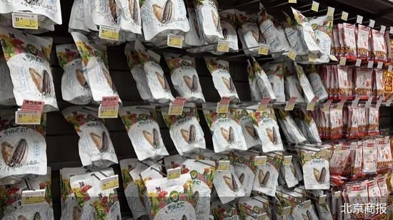
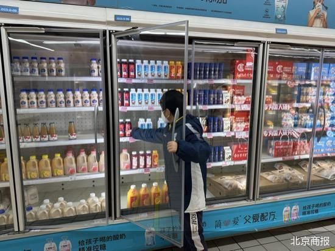
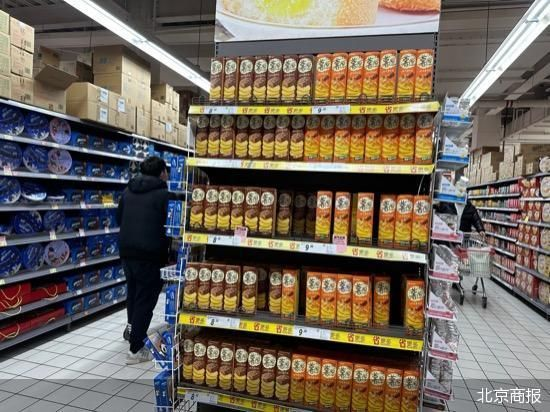

# 多地购物卡被曝使用受限、卖场缺货，家乐福还有生机吗

家乐福缺货、购物卡使用受限等情况仍未得到解决。近日来，家乐福购物卡使用时受限制一事不断发酵，北京商报记者发现在北京的家乐福也出现了购物卡使用受限的情况。这些经营细节透露着家乐福的困境。自去年起，家乐福超市关店加快，品牌供应商要求冻结家乐福银行存款的事情时有发生。在零售行业内卷、竞争下，大卖场们的一线生机在哪儿？

**购物卡使用受限制**

就在这几天，在消费者的眼中，家乐福超市的商品被分为“可以用购物卡”“不可用购物卡”两类。

北京商报记者实地走访了家乐福超市九棵树店，在年末年货销售旺季，很多礼盒、牛奶等商品堆头上贴上了“不可使用购物卡”的标签。同时，店内张贴了“由于系统升级，购物卡暂时不能结算”的通知。

在家乐福超市九棵树店内，仅少数商品价签旁摆放“此单品可以使用购物卡结算”的标签，同时，可以使用购物卡购买的商品占比居少数，例如饮料等，不过这些商品已被抢购一空。

对于上述情况，北京商报记者联系到北京家乐福相关负责人，截至发稿前，该负责人并未给出回应。

值得关注的是，无论是家乐福超市门店还是线上渠道，家乐福的购物卡在正常销售。

上述情况也蔓延到其他城市。北京商报记者在社交平台查询发现，昆明等地家乐福也存在购物卡购买商品受限制的情况。不久前，家乐福昆明正大风尚购物广场店在服务台和超市入口显眼位置，摆放着家乐福昆明官方此前发布的《关于家乐福正常经营的申明》，旁边还有另一个告示，内容为商家全新推出“福气心选”系列商品，该系列是家乐福新供应链模式商品池的商品，主打高性价比。因购物卡系统与新商品池系统对接开发周期问题，目前该系列商品仅支持支付宝、微信、云闪付、银行卡、现金等结算方式，暂不支持购物卡结算。

**千万存款遭冻结**

商品是否使用购物卡结算，或许还需要家乐福超市与品牌供应商进行博弈。货款回款问题盘旋在超市与品牌之间。

天眼查App显示，近日，尤妮佳生活用品（中国）有限公司与家乐福（上海）供应链管理有限公司仲裁程序中的一审非诉保全审查裁定书公开。文书显示，申请人尤妮佳公司要求冻结被申请人家乐福公司银行存款1389万余元，不足之数查封扣押其相应价值财产。法院认为，尤妮佳公司该申请符合相关法律规定，裁定执行。

尤妮佳为日用品企业，旗下有尤妮佳纸尿裤和苏菲等品牌。

2022年以来，家乐福被供应商追收货款的事件频繁被曝光。此前，西南地区供应商透露，2022年下半年起，家乐福超市频繁拖欠货款。在这位供应商暂时中止与家乐福合作时，家乐福欠该供应商的未结货款金额约240多万元。

**前三季度关店54家**

在国内消费习惯向即时配送倾斜，家乐福等大卖场电商化程度较低，其生存空间也被挤压。2019年，家乐福中国80%股份由苏宁国际完成了收购。但这并没能挽救家乐福，被收购后的两年中，家乐福中国门店的坪效持续下降，连续亏损。

苏宁易购2022年三季报显示，前三季度，家乐福无新开门店，闭店数量达到54家，门店数量从2021年底的205家减少到151家。2021年，门店数量净减少23家，2020年净减少5家。随着关店节奏的加快，目前杭州、成都、福州、济南、南昌等一二线市场已无家乐福身影。苏宁易购表示，公司净利润亏损很大原因是受家乐福的拖累，其下滑的业绩难以分摊较高的固定租金成本。为缓解亏损，公司正在全面开展家乐福业务调整，关闭部分区域门店。

尽管家乐福一直对外解释或者辟谣，却始终没有走出困境。关店速度也在加快。家乐福2020年门店数减少5家，2021年门店数量净减少23家。在2022年三季度现有门店对比其中报数据，三个月中门店数减少了30家，关店速度远超上半年。

**超市江湖“变天”**

对于超市行业而言，家乐福具有一定具象意义，它出现存在的回款拖延、加速关店等问题，反映出大卖场发展日渐式微的窘境，传统超市卖场行业的出路在哪里？

连锁产业专家文志宏表示，由于互联网、电商的发展，大型超市一站式购物的优势消失了，如今超市正处在一个谋求转型的背景下。他认为，全渠道或许是转型的一个思路，线上线下融合发展。此外，超市本身业态调整也是一个方向，如社区超市、会员制超市等。超市转型的方向还需要一个探索的过程，需要各零售企业有更多的投入与试错。

从零售企业先后发布的2022年三季度业绩数据来看，商超业整体呈现分化，企业营收逐渐回暖却也仍旧亏损。在当前关键节点下，企业仍在升级迭代中摸索前进。

在新的趋势之下，仓储会员店、生鲜电商、社区小店或是大卖场，需要不断进化、变革来适应消费者。线上与线下、传统与新兴在这个时代激烈碰撞、相互借鉴，商超也将迎来新的风口。

北京商报记者 王维祎

