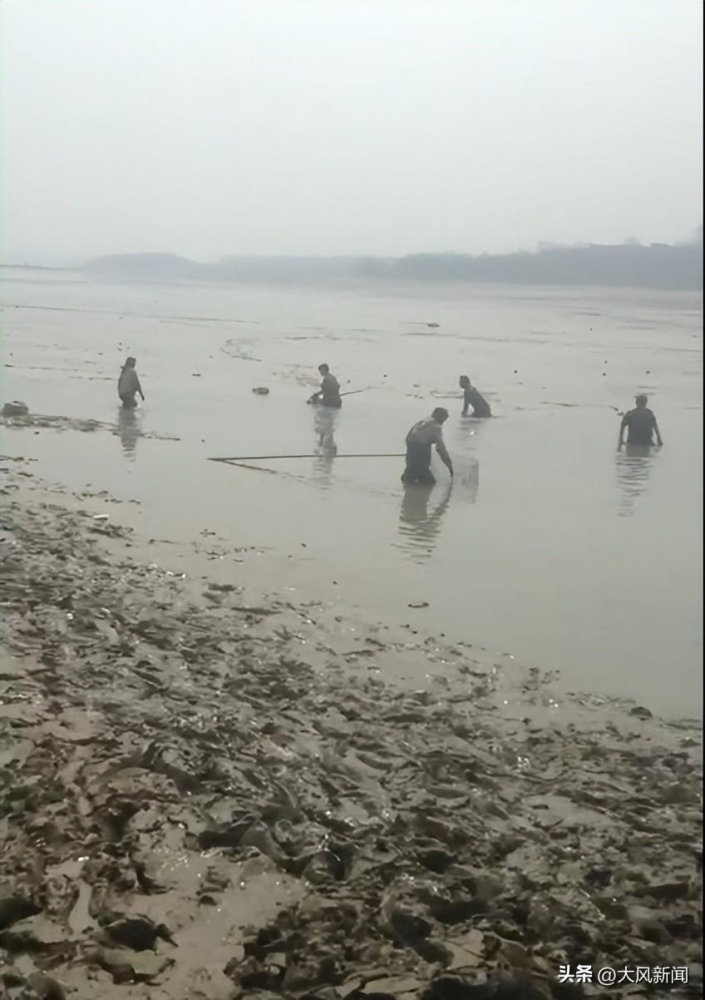
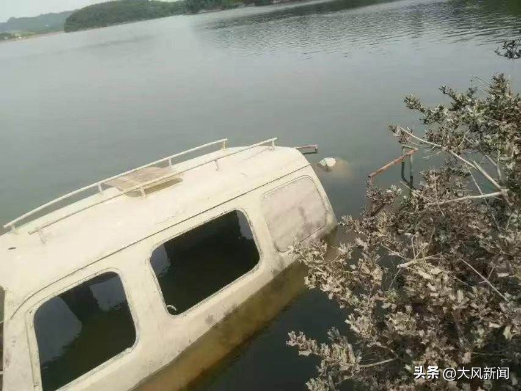
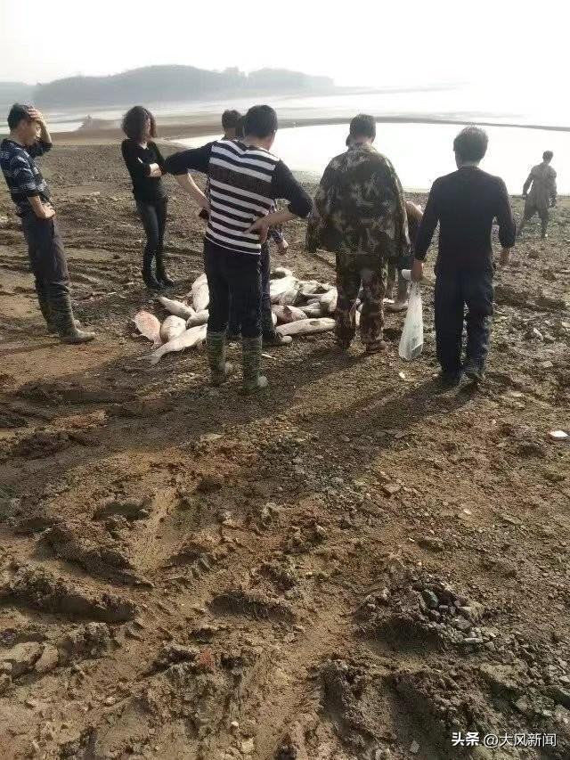

# 富翁回乡投资因纠纷遭羁押，无罪释放后病故，官方：去世与关押无直接关系

深圳闯荡20余年，打拼积累上千万财富后，他举家回乡本想带领村民共同致富回报养育之恩，没想到竟与人发生纠纷，人生再次起落。

**千万富翁被招商引资回乡创业**

他叫陈振武，出生于1968年，江西省九江市都昌县左里镇人。

儿子陈先生称，上世纪80年代初，父亲独闯深圳，曾从事过烧砖等工作，后来搞建筑承包掘到第一桶金，还与香港老板合伙做五金生意，并在深圳龙岗开有服装厂，“经过20多年打拼，我家积累起逾千万资产。”

陈先生回忆说，2007年都昌县到深圳招商引资，称想开发老家的团子口湖，希望他父亲回去投资搞养殖业。

“我父亲比较犹豫，毕竟他从来没有从事过养殖工作，母亲也坚决反对。”陈先生告诉记者，对方称他们的扶持力度较大，政策也很优惠，希望父亲返乡创业带领村民共同致富。

陈振武动摇了。

2007年8月份前后，他几次回乡考察后，把深圳的产业变卖掉，举家回到都昌县老家，成立了江西团子口实业发展有限公司。

记者检索发现，团子口湖湖面面积逾2000亩，属于都昌县左里镇政府和多宝乡政府所有。

**出资55万元签下5年承包协议**

2007年12月，陈振武和另外几名合伙人与左里镇和多宝乡签订“团子口水面使用权有偿转让合同书”，约定水面使用权有偿出让5年，合同价款是55万元。

都昌县招商引资工作领导小组2008年2月份出具的一份证明中称，“该公司系我县招商引资企业，落户在都昌县左里镇，请有关部门办理手续给予支持。”

陈先生说，刚开始他们搞得红红火火，在湖边修建了大型养猪场，每年出栏数千头猪，还在湖里养鱼，从事立体农业开发，公司被评为都昌县龙头综合农业企业，县电视台报道他父亲是养猪大户。

然而，5年租期一晃就到了。

这时，左里镇和多宝乡政府决定将湖面经营权公开招标，通过都昌县公共资源交易中心，将团子口堤坝水面养殖经营权公开竞价发包，竞标人晏某以254万元中标，租赁期限为6年。

标的额一下子提高了4倍多，陈振武竞标失败，但他心有不甘。

儿子陈先生告诉记者，5年来父亲和合伙人在湖里的投资超过500万元，加上养猪场的投资整体超过1000万，其间那些合伙人看到没有多少收益便撤资，竞标失败意味着这些投资和心血将打水漂。

后来，在相关部门协调下，晏某退出经营，但承包价仍是254万元，陈振武决定再找合作伙伴增加投资继续经营。

他说，父亲通过朋友介绍，认识了从事水产养殖的老板游某，打算与他合伙经营。

然而，左里镇政府相关人士则称，2013年3月5日，游某独自与他们镇和多宝乡政府签订租赁合同，以260万元的价格取得6年湖面经营权。

尽管如此，陈振武仍认为他和游某是合伙关系，但游某则认为自己是独立经营，两人为此发生纠纷闹上法庭，陈振武败诉。

**发生纠纷遭羁押234天无罪释放**

2016年1月25日，陈振武突然被都昌县公安局以涉嫌破坏生产经营罪刑拘，4天后被取保候审，同年2月3日又被刑拘，3月11日因涉嫌该罪名被都昌县检察院批准逮捕。

相关办案人员称，原来游某在承包团子口水域捕鱼期间，陈振武多次故意阻拦他捕鱼，早在同年1月7日，他对游某请来的卖鱼货车进行堵路，次日把游某捕鱼的竹排拖走，有一天还在游某开闸放水时，在出水口用网捕鱼卖给他人。

同年9月14日，都昌县检察院作出不起诉决定，称该院认为目前证据不能推翻陈振武与被害人游某有合作关系，如具有合作关系，该案就是民事纠纷，故认为都昌县公安局认定的犯罪事实不清、证据不足，不符合起诉条件，决定对他不起诉。

陈振武被羁押234天后释放回家，获得自由。

此时，遭受多重打击的他，身体开始愈来愈虚弱。

病历显示，2016年9月28日晚上7：30左右，他因身体不适到都昌县人民医院住院治疗，被诊断为扩张型心肌病，直至同年10月5日出院。

2018年7月5日，他病情进一步恶化，10天后不幸辞世，享年50岁。

**申请227万国家赔偿因过时效遭拒绝**

料理完父亲后事，儿子陈先生申请国家赔偿。

2018年10月，他向都昌县检察院提出国家赔偿申请，因超过国家赔偿申请时效，该院决定不予受理。

他不服，向九江市检察院申请复议，该院以相同理由回复他说“都昌县检察院不予受理的决定正确。”

随后，他向九江市中级法院提起国家赔偿，该院决定不予受理。

他又向江西省高院提出申诉，要求赔偿父亲因错误羁押产生的人身自由赔偿金、关押期间的生命健康赔偿金、关押期间的务工损失以及精神抚慰金等共计227万余元，同时要求为他父亲消除影响，恢复名誉等。

2019年8月28日，江西省高院驳回了他的申诉。

目前，他仍奔走在替父维权路上。

**官方回应：未发现去世与关押有直接原因**

陈先生将父亲的不幸遭遇反映给了江西省相关部门，引起高度重视。

2023年1月5日，都昌县优化营商环境中心相关人士告诉华商报大风新闻记者，2022年9月，他们接到上级转告后，联合县公安局和左里镇政府进行深入细致的调查。

调查称，陈振武承包团子口湖经营权为第三轮，是陈振武等5人合伙承包，并与左里镇政府、多宝乡政府签订了团子口水面使用权有偿转让合同书。陈振武被逮捕时为第四轮承包期内，承包人为游某。陈振武未与政府签订书面合同，不存在租赁关系。他与游某之间是否存在合作关系，县法院进行调查结论为证据不足无法判定。

判决书显示，陈振武称与游某之间存在合作关系，但仅提供一份合作协议的复印件，未提供其他有效的证据证明他与游某之间存在关于出资数额、盈余分配债务承担、入伙、退伙、合似终止等事项的约定。且游某也否认两人之间存在合作关系，更不存在合作协议，游某也未提供任何证据证明合作协议的原件仅保存在游某处，而都昌县检察院的不起诉决定书也只是秉承疑罪从无的精神对陈振武是否存在犯罪予以认定，而非对他与游某之间合作关系的认定，所以陈振武并无任何有效证据足以证明他与游某之间系合作关系。

调查说，陈振武涉嫌破坏生产经营一案， 由被害人游某于2016年1月25日报案至县公安局。该局经过侦查，对此案立案侦查，经依法侦查查明:
2016年游某在自己承包的团子口水域捕鱼期间，陈振武无故阻拦他捕鱼5次，都昌县公安局于2016年1月25日将陈振武刑拘，他到案后认错态度较好，且他的行为有可能判处有期徒刑以上刑罚，采取取保候审不致发生社会危害性，同年1月29日，根据相关规定对他采取取保候审措施，2月3日他再次阻止游某请来的捕捞队捕鱼，该局将他刑拘，3月11日，都昌县检察院对他批准逮捕。

陈振武去世后，儿子陈先生向检察院和法院提出国家赔偿申请，因已超过两年时效，被不予受理。

该调查还称，2018年陈振武患病在都昌县治疗无果，后转九江市治疗，经抢救无效死亡。他的死亡记录反映，他胸闷、气逼3年，自诉3年前反复出现胸闷、气逼情况，比关押时间2016年3月11日早，“未发现陈振武去世与关押有直接原因，直接死因是感染性休克。”

**死者家人称不知道有国家赔偿更不知道时效为两年**

作为商人的陈振武，具有相应的商战经验，养殖业本身就是长远行业，他为何只签订5年合同，当初他与游某之间的协议为什么没有原件，他去世后家人为何没有在规定时间内提起国家赔偿？

针对这些问题，儿子陈先生告诉记者，他父亲对养殖行业没有任何经验，当初招商引资时对相关领导表示先签5年合同，看能不能搞起来，如果搞不起来就不再搞，如果有起色届时再签约，相关领导表示同意，“前几年都是亏本，后面稍微有点起色了，陆陆续续有许多老板来商谈合作的事，政府开始运作将这个湖以高价公开招投标。”

他说，当初游某和他父亲通电话了解该团子口湖的现状，后来双方也谈好了相关的合作内容，对方提供了一个约定的合作模板给他父亲，他父亲看到后发现没有按事先口头约定的写，就把它重新改过来拿给对方，两份合作协议的金额不同，“我父亲太大意了，他只在自己改过的那一份协议上签了字，原件也没有拿走，后来对方只给了他一份复印件。”

陈先生说，他们不知道国家赔偿的事，更不知道它的追诉时效只有两年，“如果早知道有这个，我们肯定会去主张自己的权益。”

**律师说法：无罪释放可获国家赔偿时效两年**

四川法蜀律师事务所主任龚继承介绍说，国家赔偿法第17条第2项规定，对公民采取逮捕措施后，决定撤销案件、不起诉或者判决宣告无罪终止追究刑事责任的，当事人有权申请国家赔偿。就该案而言，赔偿义务机关为做出逮捕决定的都昌县检察院。

他说，国家赔偿法第39条还规定，赔偿请求人请求国家赔偿的时效为两年，自其知道或者应当知道国家机关及其工作人员行使职权时的行为侵犯其人身权、财产权之日起计算，但被羁押等限制人身自由期间不计算在内。赔偿请求人在赔偿请求时效的最后六个月内，因不可抗力或者其他障碍不能行使请求权的，时效中止。从中止时效的原因消除之日起，赔偿请求时效期间继续计算。该案申请时效应当从2016年9月14日都昌县检察院做出不起诉决定之日起计算至2018年9月13日止。2018年7月5日，陈振武因心源性休克住院，不能行使国家赔偿请求权，符合时效中止情形。

龚主任介绍说，国家赔偿法第6条第2款规定，受害的公民死亡，其继承人和其他有扶养关系的亲属有权要求赔偿。陈先生作为陈振武的继承人，有权申请国家赔偿。

他称，该案中陈振武的赔偿请求时效，在2018年7月5日因心源性休克住院而中止，一直到2018年7月15日去世。请求时效中止10天，时效截止日顺延至2018年9月23日。从2018年7月16日起，赔偿申请人由陈振武变更为其继承人，其继承人有权在2018年9月23日前申请国家赔偿。如果陈先生有证据证明其从2018年7月16日到2018年9月23日，因不可抗力或者其他障碍不能行使请求权的，请求时效仍然可以中止。

“该案的焦点在于陈振武请求时效中止的天数，以及儿子陈先生本人有无可以中止时效的情形。”龚主任告诉记者，陈振武因病住院（从发病到去世共计10天，请求时效中止10天），其请求时效中止情形符合法律规定，至于儿子陈先生是否有请求时效中止的情形，需要提交证据证明，都昌县检察院、九江市中级法院都认定他的赔偿申请超过法定期限，这是基于他关于时效中断的证据不充分。

**华商报大风新闻记者 黄平 编辑 杨德合**

