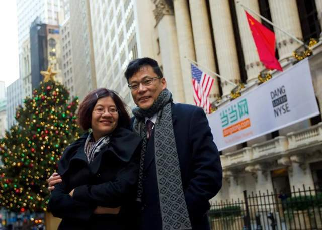

# 当当最终还是入驻了京东，一个时代就此落幕

**作者 |** 李丹

**编辑 |** 陈芳

当当最终还是选择入驻了京东。

1月10日，当当入驻京东的消息一经宣布，就引发业内巨大关注。熟悉两家历史的人知道，这两家公司曾经是“死对头”，并且早期京东在当当面前，是一个实足的小弟，当当才是图书线上交易市场的老大。2010年，深陷亏损困境的京东还在到处找钱融资时，当当就已凭借优势地位率先登上美国资本市场，次年市值冲高到30亿美元的最高点。

那时，如果有人说，未来京东会打败当当，估计没人会信。但放在历史的长河中，却成了分界岭，2010年和2011年的两场价格战，最终决定了两家公司的不同命运。

两次价格战均由京东发起，那时刘强东还活跃在微博上，2010年12月称京东的图书新业务惨遭当当“封杀”，由于业务量小，他毫不犹豫地挑起价格战，率先降价促销。作为老大，面对小弟的挑衅，当当选择了跟进，这场价格战以主管部门的介入而终止。2011年3月，京东掀起了第二轮价格战，刘强东喊话称，不允许京东图书部门盈利，当当进行了报复性还击，后果是当当三年内亏损了近10亿元。

这场价格战重创了当当，此后当当一年不如一年，2016年当当选择从纽交所私有化退市。反观京东，打赢图书之战后，越做越大，2014年上市至今，股价翻了无数倍，市值最高超1500亿美元。

后来，当当认命了，为了流量，开始入驻天猫、拼多多，但“死对头”京东却是它的底线，一直没有妥协，而今随着当当入驻京东，一个时代最终落幕了。

当当还是入驻了京东

1月10日，当当最终还是选择与京东握手言和，与京东签订战略合作协议，当当官方旗舰店在京东全面上线运营。京东图书与当当网表示，双方将以此为起点，在货品融通、客户服务、整合营销、供应链协作等领域持续深化合作，为消费者带来更多平价好书。

市界在京东上搜索发现，当当京东官方旗舰店已开业，标上上新两个字，还搞起了开业庆典，全场满99减20，店铺上线后立即有几千人关注，并且包括《跟着课文写汉字》《变量》等在内的书籍已经有人下单。

_（图源/京东截图）_

京东其实是横亘在当当喉咙里的一根刺，毕竟当当没落的导火索就是京东掀起的两轮价格战，这种简单粗暴的手法，在商战中很有用，但能打赢却要比拼资金实力，看谁能烧得起。没上市的京东自然比已经上市的当当更舍得花钱，况且拿自己的弱势品类去攻击行业老大的优势品类，相当于花小钱办大事。

这场价格战决定了两家公司的不同命运，输了价格战的当当是一年不如一年，它的流量与综合电商无法比，很多人在综合电商平台上买东西，顺道就把书买了，很少有人专门跑去当当上买书。

缺少流量的当当，想到的第一个盟友是天猫，所谓敌人的敌人就是朋友。2012年10月30日，当当把店开进了天猫，紧接着又把自家80多万种图书和30多万种百货商品搬进了天猫旗舰店。这些年来，当当也着实享受到了综合电商带来的流量红利，截至1月10日，当当网天猫官方旗舰店共有1193万粉丝。

知道垂直电商大势已去，流量越来越少，又享受到了天猫带来的流量红利，当当又在2018年国庆前夕，选择入驻了拼多多。那时，拼多多算得上是后起之秀，靠着微信，从下沉市场打入五环内，拥有一批拥趸者。但由于拼多多上的商品大多是没有牌子的“山寨”货，为了甩掉这一标签，拼多多想了很多办法，
引入当当就是其中之一，毕竟后者手里的优质图书不少。

尽管为了流量，当当先后跑去天猫、拼多多上开店，但一个事实是，当当在选取入驻平台时，或多或少是绕开了京东的，因为京东是它的“死对头”，绝不能妥协。

以2018年京东和拼多多的经营情况为例，当年，京东全年净收入4260亿元，GMV更是创新高，而同年拼多多的营业收入只有131亿元。但当当最终入驻的是拼多多，而非京东。

当当绕京东而行，一部分是历史纠葛所致。2010年到2011年，当当和京东曾两度围绕图书品类上演价格战。刘强东放狠话“五年内不允许京东图书部门盈利”，李国庆接过话头称“当当网全场满200返100”，战火在两人的一来二去间升级。

对于京东坚持价格战的原因，外界猜测各异，总结起来就两点：其一，京东要通过价格战极速提高市场占有率；其二，京东需要获得资本青睐，甚至为赴美上市做铺垫。从结果来看，京东也算达成所愿了。

但对于当当而言，价格战不仅拉低了毛利率，还一度将其带进了亏损的泥沼。

2010年12月上市时还盈利的当当，半年后便陷入了亏损。直到2012年入驻天猫时，当当仅单季的亏损就达到了1.22亿元。

自此之后，刘强东和李国庆的梁子算是结下了。直到2022年4月，李国庆还在直播中揶揄刘强东，后者则一遍遍在总结京东发展史时提到，“打赢当当，关键因素是价格”。

_（图源：网络截图）_

除历史渊源外，当当之所以一直不入驻京东，也和两者用户重合度高，且京东图书品类发展势头猛相关。换句话说，当当入驻京东，需要面临用户被稀释、自有品牌被削弱等诸多风险。

早在2012年，时任当当高级总监郭鹤曾给出一组数据。彼时，当当和天猫的用户重合度不到三成，但和京东的用户重合度在50%以上。郭鹤表示，用户重合度不高是当当敢去入驻天猫的最大原因。言下之意，用户重合度高的京东并非入驻优选

而过去多年，京东和当当一直在围绕“图书行业老大”明争暗斗。ss但时至今日，京东图书业务已经长成了参天大树。2022年“双11”，京东图书不仅在众多品类上实现高增长，部分品类的新用户数量增幅更是达到210%。京东和当当的故事走向，也以双方牵手告终。

向流量平台妥协

当当为何要向“死对头”低头，入驻京东？

业内人士分析说，当当选择抛开过往的芥蒂，在“死对头”京东上开店，是因为现如今的流量几乎都掌握在综合电商平台手里，属于当当等垂直电商的时代早已远去，在商言商，哪里有流量就去哪里。

早年入驻天猫时，李国庆便公开表示，入驻事宜是他提出来的，“只要有好的流量，倒扣流水也比广告费便宜得多”。紧接着，李国庆又抛出个形象的比方：人家在人流热闹的商业街上搞一个商业地产，当当就是卖商品的，当然要入驻了，再说租金也不贵。

甚至于，李国庆“向流量低头”的言论不止于公开场合，在更加“私人”的微博平台，其发言也颇为一致，“从了。谁让人家流量大呢。”“假牛X害死人，此一时彼一时。”

一个细节是，当当当年入驻天猫的时间节点比较巧妙。彼时有知情人士指出，一方面，11月将会是电商2012年最后一场硬仗；另一方面，当当本身也即将举行为期30天的店庆月。两方面因素叠加，极可能出现购物井喷。

事实也的确如此。2013年4月，郭鹤公开称，“当当入驻天猫，很快赶上店庆，当时销售是日破千万”。与此同时，郭鹤还表示，入驻天猫，不仅让当当得到了销售额，还“每个月收获到几万新客”。

看起来，这像是一个“识时务者为俊杰”的故事。但在业内人士看来，当当牵手天猫，更像是公司战略偏差后急于求成的一步棋。

得知当当入驻天猫后，互联网分析师葛甲曾直言“被气糊涂了”，随后，他罗列出当当的一系列失误和动机，直指当当“起大早赶晚集”“既不舍得烧钱谋转型，也不敢重建利益结构”“不升级技术平台，不提升用户体验，顾此失彼”。

早年间，当当是带着主角光环出场的。故事的开始是，李国庆和妻子俞渝共同创立当当网，凭借对出版和图书行业的熟稔，迅速做大。2010年赴美上市时，当当是中国最大的网上书店，年销售额过100亿元，且占据国内网上图书零售市场份额的50%以上。

（图源：视觉中国）

但故事后续走岔了。一方面，由于内部决策问题，当当一度“避着资本走”，既不敢坚定拓品类，也不愿意烧钱自建物流，结果便是，当当被困在了图书这个细分品类里；另一方面，即便在图书领域，当当也因为错过数字阅读风口、网络文学大潮，没搭上兴趣电商快车等原因，不得已面临玩家增多、自身地盘缩小、对书商约束力下降等困境。

以此为背景，向流量巨头折腰，便成了当当看似低成本获客、拓展渠道的最佳方式。只不过，这种“折腰”可能是以牺牲品牌价值为代价的。

2022年初，当当外卖场运营中心负责人傅玄公开表示，随着天猫大促频次的减少以及促销力度的削弱，市场回归理性，这就需要当当和供应商重视每一天、每一品的日常销售。

一年后，当当的“折腰”对象换成了京东。这背后的核心因素，当然还是看中京东的流量。截至2022年9月底，京东过去12个月的活跃购买用户数达5.883亿，同比增长6.5%，环比增加超750万。

业内人士分析说，入驻京东，哪怕新增几万个新客，对于当当而言，都是一个巨大的增量，因为京东用户的购买力，在所有电商平台中属于佼佼者，长期在京东上购物的，都是家庭收入比较不错的。并且京东一直是把图书当作核心品类发展，一些爱阅读的人士也习惯了在京东上买书，这些只要稍微外溢一点，当当的业绩增速都会有大幅提高。

市界发现，短短几个小时，当当京东官方旗舰店的粉丝数，就翻了个倍，已经有上万人关注，这也表明，京东用户对当当的接受度很高。

不过，京东和当当之间的合作最终能起多大效果，还有待进一步观察。

一个时代的落幕

随着当当入驻京东，人们不得不感慨，一个时代终究是落幕了。

曾经的垂直电商有多绚丽多彩，如今就有多黯然神伤。高开低走的商业故事，并不只是当当一家，在当当之前，有无数先烈已经轰然倒下，与之相比当当还活着，这已经是一种幸事了。

2022年7月15日，昔日中国电商老大易趣网，因一则倒闭消息最后一次走进公众视野。

作为中国电商的鼻祖之一，易趣网早期比阿里巴巴风光得多，成立两个月网上交易额就突破1000万元，成立三个月获得美国三家风投的注资，诞生次年就成为中国第一大电商网站，2003年易趣网登上了最顶峰，在中国电商市场所占的份额高达80%，目之所及，没有一个竞争对手。

如今问消费者，很少有人知道易趣网，更别说去易趣网上购物了。去年7月，在倒闭消息发布之后，市界曾打开易趣官网，发现上面的商品种类少得可怜，零零散散的商品链接全都无法打开。在易趣网将停运关闭的热搜下，排名第一的评论是：“很多年前就有人预测易趣网不行了。”该评论下面有人留言：“我以为它早倒闭了。”而一位80后网友则感慨：“这个网站我都没有听说过。”

不止易趣网，在初代电商中，除了阿里巴巴和京东外，绝大部分玩家最终都以惨败告终。

雷军2000年创办的卓越网，早在2004年就以7500万美元的价格卖给了亚马逊，最后一步步在市场消失，如今连亚马逊都败走了中国。

王峻涛1999年创立的B2C电子商务8848网站消失得更早，在计划赴美上市的过程中，资本逐渐架空王峻涛，他手中的股权逐渐降低，失去了公司的决策权，随着2000年的纳斯达克泡沫破裂，8848上市失败，公司也逐渐销声匿迹。

同样成立于1999年的当当，则在经历价格战、夫妻内斗、错失一系列风口后，最终选择妥协。电商分析师庄帅告诉市界，业内对于当当的感慨，早在2012年就抒发完了。“当当和京东打的不仅仅是价格战，还有品类战、流量战、人才战，零售的战争是综合战争。”很显然，当当全方位输了。

不光第一代电商网站陨落，包括聚美优品、凡客诚品、寺库、蜜芽等在内，无数成立于2010年前后的第二代电商，如今也全都没了踪影。

2020年4月，聚美优品完成私有化，正式从纽交所退市。这家因为“我为自己代言”而红极一时，后来头顶“中国美妆电商第一股”桂冠的电商，股价曾从20多美元一度冲高到近400美元，但最终还是衰败了。退市时，聚美优品股价只剩7美元/股，投资人朱啸虎给聚美优品创始人陈欧冠上了“陈七块”的外号。

_（图源：视觉中国）_

2022年7月，母婴电商独角兽蜜芽宣布关停APP，创始人刘楠转换赛道做自有品牌。至此，许久无人问津的母婴电商行业，算是彻底以败局告终了。随后，刘楠在接受采访时不无感慨，与综合类电商相比，垂直电商的种种局限性注定了它只能是电商在特定历史环境下的阶段性产物。

垂直电商和综合电商之争，这构成了前两代电商发展的关键词。到最后，均以垂直电商战败，淘宝、京东等综合电商愈发恒强而告终。

“想跑赢综合电商巨头，必须保证超高速增长，头两年增速要在1000%到2000%，第三年得保证200%，之后几年不能低于60%到70%。”庄帅告诉市界，综合电商的最大优势在于完整的生态壁垒，垂直电商的宿命，要么是跑快点变成综合电商，要么就心甘情愿做供应链公司，继而去各个平台开店。

至于一批批崛起又倒下的电商，庄帅则坦言，商业的世界不谈情怀，“可以怀念艺术家、发明家，但企业不需要怀念，没落就是没落了”。

如今从某种程度上看，当当牵手“宿敌”，更像是代表着一个时代结束了。“现在的时代，是大综合电商和直播电商的天下了”。电商分析师鲁振旺如是感慨。

