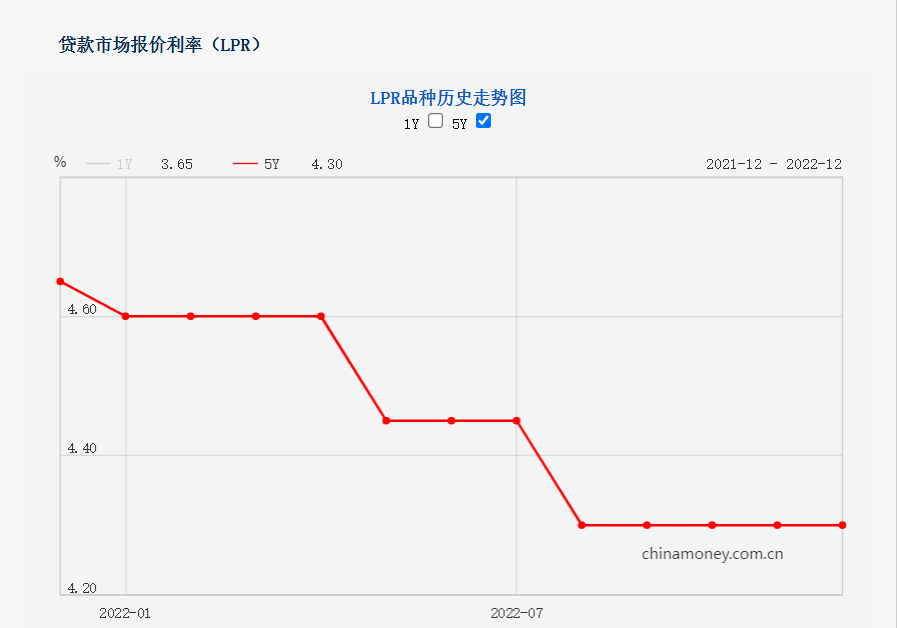
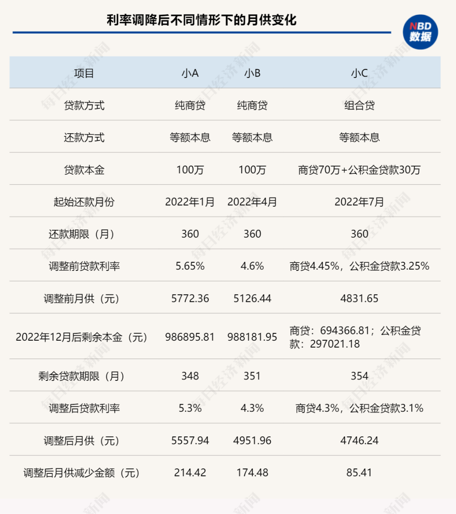
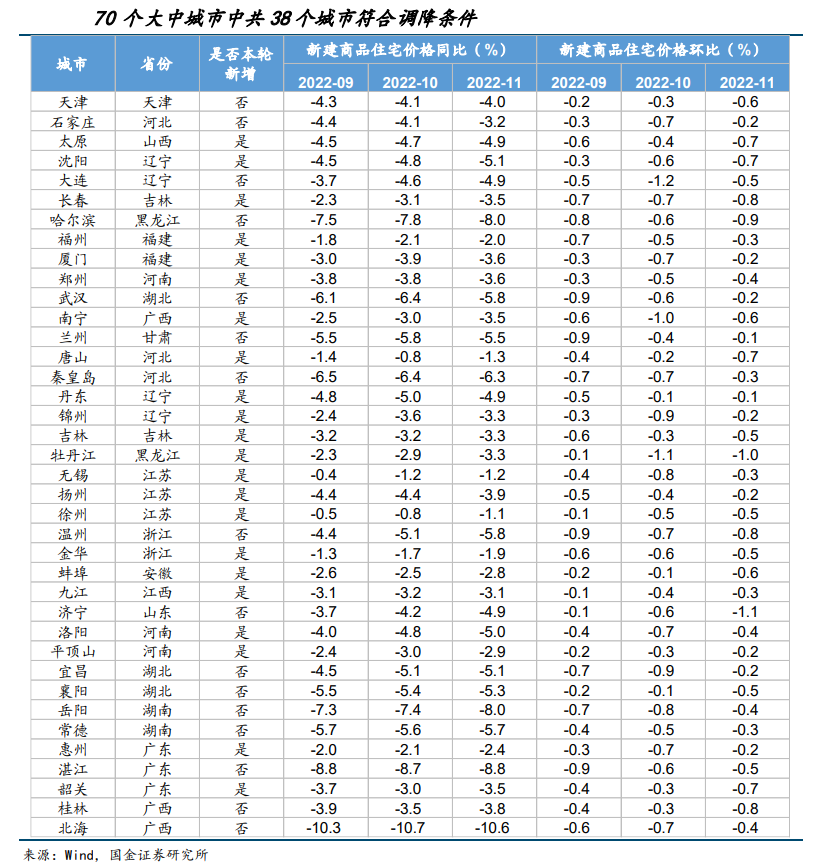

# 房贷利率重定价，100万贷款月供减少上百元！有人1月份还款不降反升，银行回应来了……

每经记者：刘嘉魁 每经编辑：廖丹

“元旦过后我的房贷月供少了89，每个月可以多吃一顿火锅了！”林立开心地说。

房贷月供是许多购房者每月最“豪横”的一笔支出，“能省则省”是大家共同的期盼。

对背负贷款的购房人来讲，每年有两个值得关注的重要日子。

一个是每月20号，这天公布的最新LPR报价，决定着未来的月供是升还是降。

另一个则是每年的房贷利率重定价日，一般为1月1日或者贷款发放日。

如果你的房贷利率已转为LPR浮动利率，且重定价日是1月1日的话，那么元旦过后，都将迎来一次存量利率普降！

与此同时，不少购房者也表示自己的房贷利率尚未下调，甚至1月月供不降反增，这是怎么回事？

LPR和公积金贷款利率“双降”，带动月供减少

由于贷款办理较早，林立享受了利率打折，“我的房贷利率在2023年1月1日重新定价了，调整后利率降到了3.66%，比LPR还低64个点。”林立告诉记者，他的同事月供也少了106，“都是这个月调整的。”

和林立一样，不少购房者发现，新年过后，房贷月供有不同程度的下降。这一好消息源自5年期以上LPR利率的下降。

2022年，LPR报价经历了降幅最大的一年。5年期以上LPR共下降三次，分别是在1月20日，从4.65%降至4.6%；5月20日，从4.6%降至4.45%；8月22日，从4.45%降至4.3%。经过三次下降，5年期以上LPR累计下降了35个基点。随后LPR一直“按兵不动”，2022年12月公布的5年期以上LPR报价依然为4.3%。

_2022年LPR三次调降
图片来源：央行官网_

LPR的调整如何影响房贷？按照央行现行政策，新发放商业性个人住房贷款利率以最近一个月相应期限的贷款市场报价利率（LPR）为定价基准加点形成，也就是房贷利率=LPR+固定基点。由此可见，LPR的变化直接影响着月供金额。

上述政策自2019年10月起施行，自此之后的“新购房人”，房贷利率中LPR的报价以最近一个月为准。

但对于此前的存量贷款客户，如果选择的是固定利率，剩余贷款期限内的利率不会随着LPR的变化而变化；若选择了锚定LPR的非固定利率，且重新定价日是在1月1日，则贷款利率会在每年元旦过后按照上年12月的LPR加点重新计算。

也就是说，房贷利率由LPR为定价基准加点形成的这部分购房者，今年的房贷利率将随着LPR下调35个基点，每月实际月供相应减少。

同时，公积金贷款的月供，今年也同样可以省一笔了。

2022年9月30日，人民银行决定，自2022年10月1日起，下调首套个人住房公积金贷款利率0.15个百分点，5年以下（含5年）和5年以上利率分别调整为2.6%和3.1%。第二套个人住房公积金贷款利率政策保持不变。

此次公积金贷款利率为7年来首次调整。2023年1月1日过后，个人住房公积金存量贷款正式“刷新”。

月供没变？查查自己的利率重定价日和固定基点

不过，在大家纷纷查收“新年礼物”时，部分购房者也表达了疑问。

“我的利率从6.1%只降到5.7%，为什么不是4.3%啊？”“我的利率为什么还和去年一样，一点都没变？”林立告诉记者，近日来经常在业主群里看到这样的讨论。

需要注意的是，房贷利率是签贷款合同时点的LPR和固定基点共同组成，调整时间以贷款合同为准。

可以理解为，在“房贷利率=LPR+固定基点”这个公式中，LPR是变量，每月公布一次，而“固定基点”则是定量，不会随着LPR的调整而变化。

举例来说，如果贷款时LPR报价为4.65%，在此基础上上浮118个BP，即最终利率为5.83%，那么在新年过后，LPR降为4.3%，但加点部分不会变化，仍为118个BP，最终利率会降为5.48%，而不是4.3%。这使得部分购房者产生了房贷利率仍然“高位站岗”的疑惑。

只有在贷款时利率没有固定加点部分，其利率才会与LPR完全相同。

此外，并非所有购房者的利率“刷新”时间都是每年1月1日，还有一部分购房者的利率重定价日期是贷款发放日，即起息日（还款日），此后在次年对应的日期调整房贷利率，具体约定以合同为准。

月供未减少的购房者，可以通过贷款银行的APP或者贷款合同，查询利率重定价日期。购房人小飞表示，他在去年7月18日办理了按揭贷款，根据合同约定，贷款利率于每年7月18日调整，那么他将于半年后收到这份“迟来的礼物”。

通过手机银行APP查询是最为直接简便的方式。以工行APP为例，在首页点击“贷款”，进入“我的贷款”模块，在“我的住房贷款”项下即可查询利率变动方式，获知重定价日具体信息。

以上是房贷利率重定价之后遇到的主要问题。在实践中，大家的购房贷款具体情况各有不同，有纯商贷，也有组合贷，月供的调减具体怎么计算呢？

以下面3位购房者为例，均为首套房，购房当月开始还贷，选择30年等额本息还款，每月1日归还贷款，利率重定价日为每年1月1日：

**小A，2022年1月购房，商贷100万，利率为LPR（4.65%）+100BP=5.65%，月供5772.36元；**

**小B，2022年4月购房，商贷100万，利率为LPR（4.6%）+0BP=4.6%，月供5126.44元；**

**小C，2022年7月购房，选择组合贷方式，其中商贷70万，公积金贷款30万，商贷利率为LPR（4.45%）+0BP＝4.45%，公积金贷款利率为3.25%，月供4831.65元。**

那么，元旦过后，他们的最新利率及月供是多少？相比去年省了多少钱？

**小A，房贷利率调整为LPR（4.3%）+100BP＝5.3%，月供5557.94元，省214.42元。**

**小B，房贷利率调整为LPR（4.3%）+0BP＝4.3%，月供4951.96元，省174.48元。**

**小C，商贷利率调整为LPR（4.3%）+0BP＝4.3%，公积金利率调整为3.1%，月供4746.24元，省85.41元。**

总体看来，3位购房者一年可省月供1000余元至2000余元不等，这个“新年礼物”还是很给力的。

利率下调1月还款额反而略增？银行解释来了

“我利率已经下调了，但短信提示这个月的月供怎么反而比上个月多了？”记者注意到，不少网友表示不理解为何利率降低后，当月还款额反而出现了增长。

对此情况，某城商行人士对记者表示，“1月份存在房贷新老利率过渡期，因本月需要分段计息及天数倒推，所以2023年1月还款金额比之前反而增多，
**从2023年2月起，每月还款金额随之减少** 。客户可登录手机银行，或者借款人本人持身份证前往银行网点，查询打印详细的剩余还款计划。”

根据银行的解释，按住建部规定，房贷利率调整后需对分期还款额进行重新核定，由于利率降低，每期还款本金会增加，
**第1期需要采用分段计息，1月份的月还款金额为计划调整后的本金金额加上分段计息后的利息金额。**

由于
**新计划的还款本金相较之前计划的本金略有上浮，若分段计息时新利率的执行天数较少，可能会导致利率调整后第1期的还款金额略多一些，多出来的部分是本金金额，2月份之后每月的月还款额都会低于之前的月还款额。**

举例来说，小D的房贷还款日是每月10号，那么2023年1月10日扣的是2022年12月10日至2023年1月9日之间的产生的贷款本息。那么分段来看，2022年12月10日至2022年12月31日之间，执行的是“老”利率，而2023年1月1日至2023年1月9日之间，执行的才是“新”利率。

也就是说，要全额吃到利率“红包”，要等到2月份。

而需要注意的是，很多等额本息还款客户习惯于每月偿还固定金额，可能会忽略1月份还款额或略有上升的情况。可前往手机银行查看1月份具体还款金额，及时足额偿还，以免还款额不够，影响个人征信。

LPR有望进一步下行，至少38城可放宽首套房贷利率下限

2022年，LPR历经难得的“三连降”，加之限购松绑等因素，为购房者带来了便利，降低了购房门槛和压力。进入2023年，5年期以上LPR是否有继续下调的可能？虽然2022年12月公布的LPR与前期持平，但市场预期，今年5年期以上LPR存在进一步下降的空间和可能。

《每日经济新闻》记者注意到，央行公布的《2022年11月金融统计数据报告》显示，11月份人民币贷款增加1.21万亿元，同比少增596亿元。分部门看，住户贷款增加2627亿元，其中，短期贷款增加525亿元，中长期贷款增加2103亿元。

而2021年同期数据显示，当年11月人民币贷款中住户贷款增加7337亿元，其中，短期贷款增加1517亿元，中长期贷款增加5821亿元。

由此可见，住户贷款特别是住户中长期贷款增长相对乏力，反映出居民消费意愿和能力仍相对不足。

新年伊始，房贷政策就迎来了重磅利好。据央行官网1月5日消息，人民银行、银保监会发布通知，决定建立首套住房贷款利率政策动态调整机制。新建商品住宅销售价格环比和同比连续3个月均下降的城市，可阶段性维持、下调或取消当地首套住房贷款利率政策下限。

央行表示，住房贷款利率政策与新建住房价格走势挂钩、动态调整，有利于支持城市政府科学评估当地商品住宅销售价格变化情况，“因城施策”用足用好政策工具箱，更好地支持刚性住房需求，形成支持房地产市场平稳健康运行的长效机制。

具体来看，自2022年第四季度起，各城市政府可于每季度末月，以上季度末月至本季度第二个月为评估期，对当地新建商品住宅销售价格变化情况进行动态评估。

对于评估期内新建商品住宅销售价格环比和同比连续3个月均下降的城市，阶段性放宽首套住房商业性个人住房贷款利率下限。

根据易居研究院智库中心提供的数据，国家统计局全国70个大中城市房价指数显示，最近3个月房价持续下降的城市共有38个，包括：大连、福州、哈尔滨、兰州、南宁、厦门、沈阳、石家庄、太原、天津、武汉、长春、郑州、蚌埠、北海、常德、丹东、桂林、惠州、吉林、济宁、金华、锦州、九江、洛阳、牡丹江、平顶山、秦皇岛、韶关、唐山、温州、无锡、襄阳、徐州、扬州、宜昌、岳阳、湛江。

这也意味着，至少38城可放宽首套房贷利率下限。同时需要注意的是，上述政策的覆盖面并非只有70个大中城市，因此实际符合政策条件的城市或有更多，有助于提振购房者信心。

每日经济新闻

