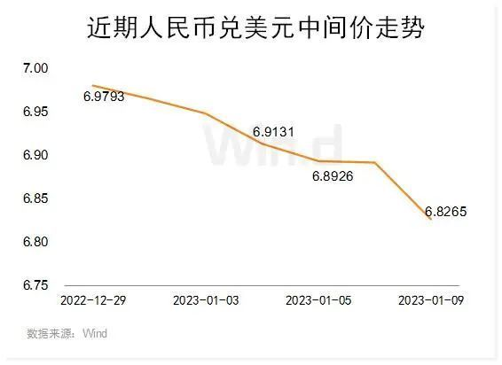
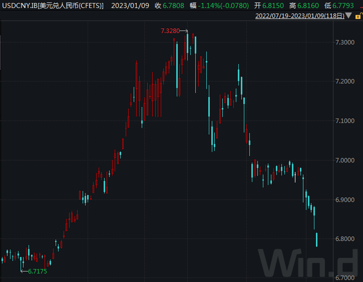

# 新年以来人民币兑美元中间价调升超1300个基点，有何影响？

新年第二周人民币升值继续在强劲演绎，1月9日，人民币兑美元中间价报6.8265，调升647个基点。Wind数据显示，今年以来，短短5个交易日最新人民币兑美元中间价已较去年底调升了1381个基点，涨幅较快。

另外本周一在岸人民币兑美元也是大幅上涨，截至1月9日14:00点，最新报收在6.7808，高开高走，一举突破6.8关口。再创4个多月新高，这也是自11月1日以来的两个多月持续走高。自低点以来，人民币兑美元已大幅升值超5400个基点，短期升值势头强劲，阶段新高不断。

近日，人民银行党委书记、银保监会主席郭树清表示，去年底以来，人民币汇率大幅反弹，境外资本流入持续增长，充分反映了国际金融市场坚定看好我国经济发展，对物价等经济基本面充满信心。中长期看，人民币汇率会保持双向波动，但总体上将持续走强。

**2023年人民币如何走？**

展望2023年，中国民生银行首席经济学家温彬认为，
2023年中国经济基本面持续修复和温和通胀，整体上将有利于人民币汇率保持稳定。综合经济基本面与国际收支面考虑，预计2023年人民币汇率整体将呈现双向波动、温和回升、逐步趋近长期合理区间的走势。

中银证券全球首席经济学家管涛表示，美联储紧缩货币政策对我国的外溢效应将进一步显现，人民币汇率有可能会经历后三个场景/阶段。继续深化汇率市场化改革，保持汇率灵活性，是新征程上我国有效应对内外部冲击，着力推动高质量发展、高水平开放的重要保障。

**持续升值有何影响？**

仲量联行大中华区首席经济学家兼研究部总监庞溟表示，人民币兑美元汇率持续上涨，对航空等美元负债比重较高的行业来说有望带来较为可观的汇兑收益，对某些以美元计价进口原材料敞口较大的行业来说，也能降低部分进口购置成本。不过，若人民币汇率出现过快上涨，可能会使企业在使用美元资金和汇兑转化的过程中面临汇率风险，可能会给出口型外贸企业带来较大压力。

他建议，在人民币汇率上涨周期，出口型外贸企业可以考虑采用期权或远期锁汇等衍生产品管理汇率风险，也可以考虑通过以人民币作为结算方式来规避汇率风险。对于企业尤其是外币收入比重较大、外币负债较多的企业而言，应积极适应人民币汇率双向波动的弹性和幅度加大的新常态，牢固树立汇率风险中性的理念，加强风险防范意识和能力。

