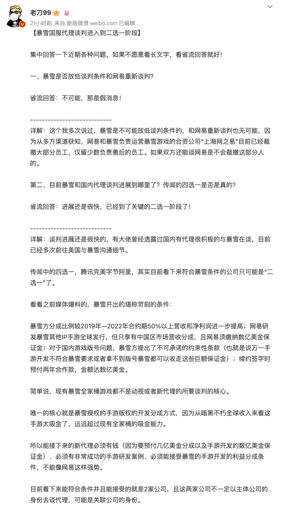

# 曝暴雪游戏正在找国服新代理 谈判已进入“二选一”阶段

由于暴雪与网易的授权协议到期，《魔兽世界》《炉石传说》《暗黑破坏神3》《守望先锋：归来》等暴雪知名游戏将于1月24日后在国内停服。

今日，《魔兽世界》消息爆料人、行业从业人员“老刀99”发文称， **目前暴雪和国内代理谈判进展迅速，已经进入"二选一"阶段，**
有大佬曾经透露过，国内有代理很积极的与暴雪在谈，目前已经多次前往美国与暴雪沟通细节。另外，传闻中的四选一，腾讯完美字节阿里，其实目前看下来符合暴雪条件的公司只可能是“二选一”了。

值得注意的是，爆料称，现有暴雪全家桶游戏都不是动视或者新代理的所要谈判的核心。 **唯一的核心就是暴雪授权的手游版权的开发分成方式，**
因为从《暗黑不朽》全球收入来看这手游太吸金了，远远超过现有全家桶的吸金能力。

该爆料人指出，
**所以能接下来的新代理必须有钱（因为要预付几亿美金分成以及手游开发的数亿美金保证金）、必须有非常成功的手游研发案例、必须能接受暴雪的手游开发的利益分成条件，**
不能像网易这样强势。

最后就是大家关注的游戏版号问题，游戏内容网易时代已经审过了，游戏版号可以继续用，但运营主体信息需要变更。以下为全文内容：

