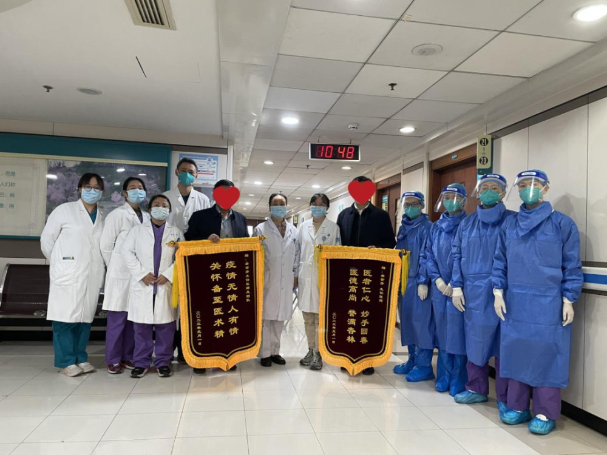

# 杭州47岁男子退烧第二天就返岗，就医时已接近“白肺”！阳后第2周，一定要做好这三件事

1张图纸、1支红笔、1支黑笔、1部手机……在浙大一院6号楼A区7楼病房，47岁的马先生（化名）以一通电话会议，打响了复工的“第一枪”。

好消息接踵而至，医生查房时告诉他，马上就可以出院了。

**杭州47岁设计师紧急就医，** **已接近“白肺”**

马先生从事建筑设计行业，2022年12月底从外省出差返杭后出现了发烧的情况，生性要强的他只吃了一颗退烧药，觉得自己烧退了、抵抗力好，第二天便返岗工作了。

不想接下来的几天，他出现了反复发烧、剧烈咳嗽、胸闷气急、头晕乏力等症状，体温最高至38.5℃，自行吃药仍无法缓解，便赶紧来到浙大一院就诊。

“就诊后发现他氧合指数一直往下降，CT显示两肺广泛渗出，已经快接近白肺，是严重的肺炎，立刻收治入院。”浙大一院感染病科主任盛吉芳教授介绍，马先生入院后立刻对他进行对症治疗，同时进行保护胃黏膜、营养支持等治疗。

“说实话，一听到住院心里乱成一团，一方面当时工作上确实有很多事等我处理，另一方面想着病情这么重，能不能治好也不知道。”马先生回忆，但他当时唯一能做的就是配合医生治疗。很快，病情就出现了转机，治疗三天后，马先生的体温开始下降并一直处于正常状态，胸闷气喘的情况也得到了较大改善，人也可以下床活动了。

_马先生送来的锦旗_

2023年1月1日，精神状态已经恢复到和生病前差不多的马先生准备了两面锦旗，送给了在他最危急关头给予他专业医疗救治的医护团队。1月3日，他又托同事向医护人员送上了两束鲜花。

事实上，最近这几天在浙大一院，每天都有像马先生这样肺部实变严重、经治疗后情况好转的患者陆续出院。

6号楼A区7楼，原本就是感染病病区，主要收治各类肝病以及其他感染性疾病患者。2022年12月18日，根据医院统一安排，整体调整为新冠患者收治病区。

“我们病区的患者，以老年人群为主，年龄最大的95岁。”盛吉芳主任介绍，治疗团队每天查房讨论制定个性化治疗方案，同时进行抗病毒和基础疾病治疗，总体疗效较为理想。

像设计师马先生这样的危险案例

并不止一个......

**外卖小哥阳康后，** **超负荷送餐致心脏骤停**

1月7日上午10点多，在湖南长沙市中医医院（长沙市第八医院）星沙本部有一名外卖小哥，因为忽视基础疾病，阳康后连续超负荷工作突发心脏骤停。

这名外卖小哥姓石，今年39岁，目前已被转入心血管重症监护室，暂时脱离生命危险。

据心血管内科副主任刘乐介绍，石先生原有冠心病，一直在医院门诊就诊，本打算行冠脉造影检查、支架植入术。

突发的疫情袭来，他去年12月16日也“阳”了，但一直坚持工作，经常给医院的医护人员送餐。7日上午10点多，他在送货途中，突发胸痛加重，大汗淋漓，立即拨打120急救电话。在救护车上，急救人员行心电图检查，并通知急诊科做好准备。

10点47分到达医院急诊大门，10点51分急诊医护人员接诊，10点52分突发心脏骤停，考虑急性心肌梗死所致，急诊科立即就地心肺复苏。幸运的是，心肺复苏术成功，心血管内科、介入科接力，立即行冠脉造影和支架植入术，术后转入心血管重症监护室继续诊疗。

感染后发烧、咳嗽……与病毒对抗的第一周很重要，熬过“艰难阶段”后，逐渐康复的第二周其实也非常关键。

**多位专家提醒，** **阳后第2周也非常重要**

**1.阳后有个“免疫紊乱期”，会持续1-2周**

上海交通大学医学院附属上海儿童医学中心呼吸科副主任张磊2022年12月23日在接受采访时表示，新冠康复者在1-2周内静养是有必要的。

张磊称，经历新冠病毒感染以后，人体免疫功能会出现较明显的紊乱表现，即淋巴细胞数值和功能会在感染急性期降低，后续随着疾病恢复，再缓慢恢复到正常状态。大多人这个“免疫紊乱期”会持续1~2周。期间其他病毒、细菌等都非常容易乘虚而入。

**2\. 一般在感染两周后，少数患者心肌会有一定的反应**

“新冠病毒感染大部分5至7天症状好转、逐步康复，但也有少数患者会累及心肌，一般发生在感染新冠两周以后。出现比如心电图发生一些变化，心动过速或过缓，有时候有胸痛、胸闷气短、心悸甚至晕厥等症状。”北京安贞医院常务副院长周玉杰2022年12月26日接受央视新闻采访时说，如果症状比较严重，要及时到医院查心肌酶是否有变化。如果发现心肌酶成倍增高，医生会根据其他相应的检查综合判断是否出现了心肌炎。出现心肌损伤，不要恐慌，可以通过健康的生活方式管理度过窗口期，从而逐渐修复。

**3\. 咳嗽超过2周且有加重，需进一步评估**

北京协和医院呼吸与危重症医学科副主任徐凯峰2022年12月26日在“协和医生说”刊文表示，新冠病毒感染后的咳嗽症状平均持续2周左右，有些患者咳嗽持续时间可长达4周。单纯气道炎症引起的咳嗽，一般会逐渐减轻。新冠病毒感染2周后如咳嗽症状有加重，或超过4周症状尚未缓解，需要到医院就诊，进一步评估可能的原因。

徐凯峰提醒，“阳康”之后咳嗽也会持续一段时间，咳嗽持续并不代表新冠病毒感染在加重。但如果咳嗽症状严重或持续不缓解，尤其在出现发热反复或发热持续不退、伴有低氧（氧饱和度下降）或憋气，以及活动后气短等症状，需要警惕新冠病毒导致的肺炎，及时到医院就诊和检查胸部CT。

**出现这几个症状，** **可能正在转重症**

多位临床医生表示，感染后不要以为一周过去就没事了，还需要调养监测两周，一些继发感染或并发症一段时间以后才会表现出来，对于有些病人，尤其是老人、有基础性疾病的人群，可能出现突发性肺炎或者心肌炎而转成重症。

上海市新型冠状病毒病临床救治专家组协同国家传染病医学中心编写的《2022版上海市新型冠状病毒感染诊治规范与分级诊疗流程》提醒，符合以下任意一项可判断为重型患者：

**成人符合以下任意一项：**

（1）出现气促，RR（呼吸频率）≥30次/分；

（2）在静息状态下，吸空气时指氧饱和度≤93%；

（3）动脉血氧分压（PaO2）/ 吸氧浓度（FiO2）≤300 毫米汞柱；

（4）肺部影像学检查显示24-48小时内病灶明显进展＞50%者。

**儿童符合以下任意一项：**

（1）超高热或持续高热超过3天；

（2）出现气促；

（3）静息状态下，吸空气时指氧饱和度≤93%；

（4）有辅助呼吸现象；

（4）出现嗜睡、惊厥；

（5）拒食或喂养困难，有脱水征。

北京清华长庚医院感染性疾病科主任林明贵2022年12月25日向人民日报健康客户端记者表示，重症出现的时间临床上有个体差异，可能与患者的感染病毒的数量、身体基础疾病情况、年龄、疫苗接种等情况有关。不要觉得症状好转了就万事大吉，病毒在体内可能还处于没有被完全清除的状态，在这一段时间里，一般来说我们患病的身体都是无法承受剧烈的活动与超负荷的工作强度的。

所以感染后，至少要给身体半个月到一个月的调养休整时间。“最重要的还是关注自己的身体症状，对于转向重症的迹象要早识别，早干预，这一点对于个人而言更有意义。”

**阳后第二周，** **一定要做好这3件事**

不少人经历一周的难受后，开始迈入康复期。结合《新型冠状病毒感染者恢复期健康管理专家指引（第一版）》及专家建议，康复期做好这3件事很重要！

**01.** **吃**

“阳康”之后胃口不好，或有味觉障碍者，建议少食多餐；

保持食物的多样化，注意荤素兼顾、粗细搭配；

多吃新鲜蔬菜、水果、大豆、奶类、谷类食物；

适量吃鱼、禽、蛋、瘦肉，优选鱼虾、禽肉和瘦肉，少吃肥肉；

饮食清淡不油腻，避免食用辛辣刺激性食物、油炸油腻食物；

保证饮水量，首选白开水，少喝或不喝含糖饮料。每天喝水1500-2000毫升。

合理运用药膳进行食养和食疗，结合冬季气候特点，推荐使用雪梨罗汉果水、玉米须橘皮水、白萝卜蜂蜜水、核桃葱白生姜汤、梨汤、山药冬瓜莲子粥、薏苡仁茯苓山药粥等。

“阳康”之后最好戒烟、限酒。

**康复期饮食的3个“保证”**

**01.**

**保证能量摄入：** 每餐都要吃一点主食，慢慢增加量。可以先从易消化的细粮开始，如粥、面条、面片，然后过渡到软一点的米粉、馒头、肠胃好了再增加点粗粮。

**02.**

**保证优质蛋白摄入：** 蛋白主要来源于牛奶、鸡蛋、瘦肉、鱼虾等动物类食物。先选择那些容易消化吸收的，如鸡蛋，然后再选择清蒸的鱼虾等。

**03.**

**补充微量元素：** 保证餐餐都有蔬菜，每天吃水果，有利于补充维生素和钾、钠等微量元素。

**注：**

对于肠胃功能恢复慢的人，特别是老年人，可以在三餐基础上，食用一些补充剂，比如复合型的微量营养素、肠内营养液、蛋白粉。

——北京协和医院临床营养科主任于康

**02.** **动**

从低强度活动开始，如散步、八段锦、简单日常家务等。适当把运动强度下降。一般运动强度下降到原来的三分之一左右。

如无明显不适，数周内可逐渐增加活动强度，如上下楼梯、快走、慢跑、骑自行车、游泳、跳舞直至恢复到患病前的正常活动状态。

如在运动过程中出现胸痛、心悸、头晕等不适症状应立即停止运动，必要时及时就医。

**康复期运动锻炼“5阶段”**

恢复期的康复锻炼可分为5个阶段逐渐进行，每个阶段至少保持7天，才能进入下一个阶段。

**第1阶段：** 为恢复锻炼做准备。例如：呼吸练习、温和的步行、拉伸和平衡练习。坐或站着时拉伸你的肌肉。每一次拉伸都应轻柔地进行、而且每一次都应保持1秒。

**第2阶段：** 低强度活动。例如：散步、轻微的家务/园艺工作。可以逐渐将每天的锻炼时间增加10-15分钟。

**第3阶段：** 中等强度的活动。例如：快走、上下楼梯、慢跑、引入倾斜度、阻力练习。

**第4阶段：** 具有协调和运动技巧的中等强度练习。例如：跑步、骑自行车、游泳和舞蹈课。

**第5阶段：** 回归到基线练习。恢复感染新冠之前的正常锻炼/体育运动/活动。

**注意：** 如果感到有困难或者症状出现倒退，可以退回原阶段。

**03.** **睡**

有些人在康复过程中可能出现入睡困难、睡眠时间短、眠浅、多梦等症状。建议：

多晒太阳、在身体吃得消的情况下进行一些低强度的运动，如散步等。特别是在每天午后，到户外接受半小时到1小时的光照，这是快速重建生物节律的重要方法。

尝试在睡前一小时停止使用手机和平板电脑等电子设备。

尽可能减少尼古丁（例如吸烟）、咖啡因和酒精的摄入。

尝试帮助入睡的放松技巧，例如冥想、正念减压疗法、意念或沐浴、芳香疗法、太极、瑜伽和音乐等。也可用中药泡洗等方法。

返岗工作之初，从较轻的工作开始。如有可能，可午休20-30分钟。

如果实在失眠严重，也可以借助安眠药，但建议在医师指导下使用。

来源：钱江晚报综合 浙大一院、政法频道、健康时报、杭州日报等

