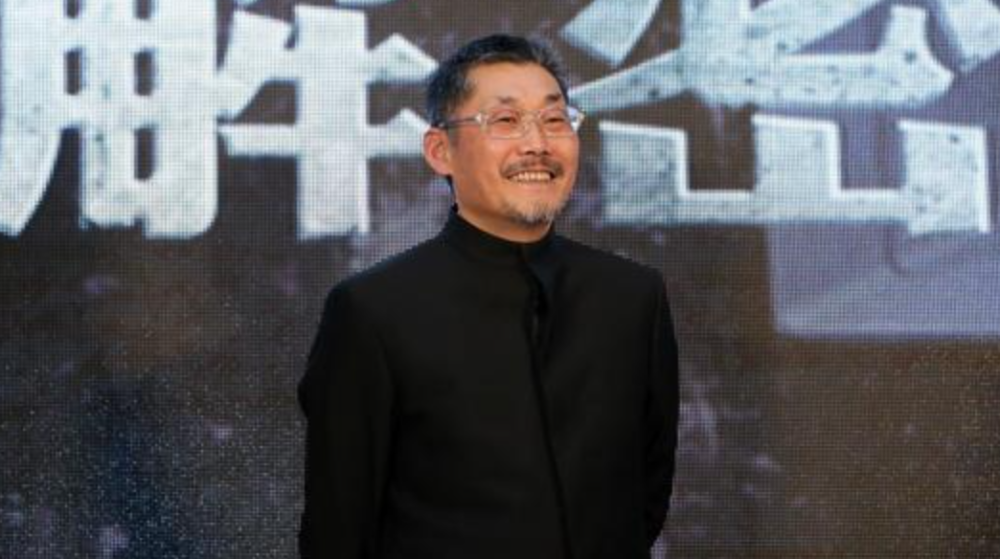
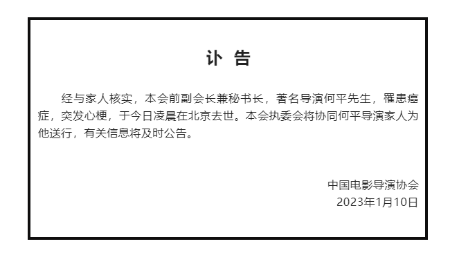
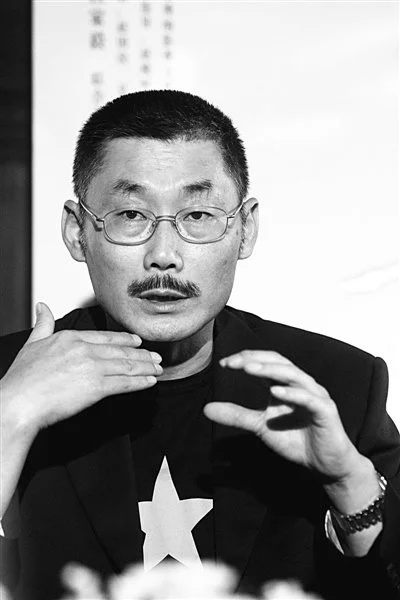

# 著名导演何平逝世，享年65岁，代表作《双旗镇刀客》等

1月10日，据中国电影导演协会，著名导演何平先生，罹患癌症，于今日凌晨在北京逝世。

何平，1957年10月出生于山西，中国内地导演、编剧、监制。

1979年，何平开始从事电影工作，并在剧情电影《竹》的摄制组中担任场记。1982年，担任剧情电影《初夏的风》的副导演。1984年，担任剧情电影《欧妹》的副导演。1988年，执导个人首部电影《我们是世界》。1989年，执导传记电影《川岛芳子》。1991年，执导武侠电影《双旗镇刀客》。1994年，执导的剧情电影《炮打双灯》在西班牙上映。1995年，执导的剧情电影《日光峡谷》入围第46届柏林国际电影节主竞赛单元。2003年，凭借动作电影《天地英雄》入围第10届中国电影华表奖优秀导演奖。2009年，自编自导剧情电影《麦田》。2015年10月27日，自编自导的爱情电影《回到被爱的每一天》在中国大陆上映。何平也在业内担任策划、监制等工作，担任《甲方乙方》《不见不散》等片监制；曾出演《大腕》等电影。

2023年1月10日，因病去世，享年65岁。

（中国电影导演协会）

编辑：赵珊珊

