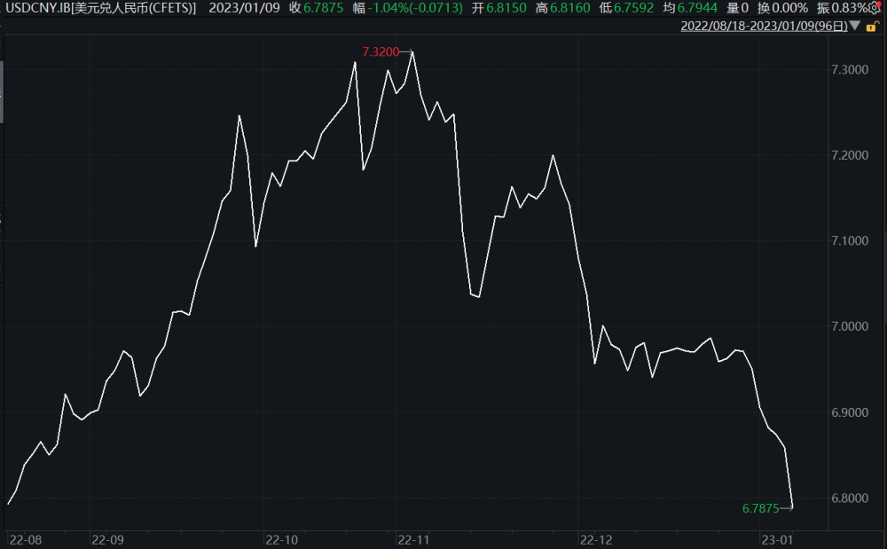
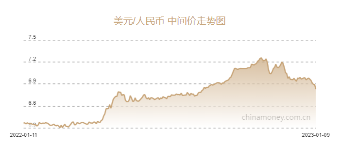
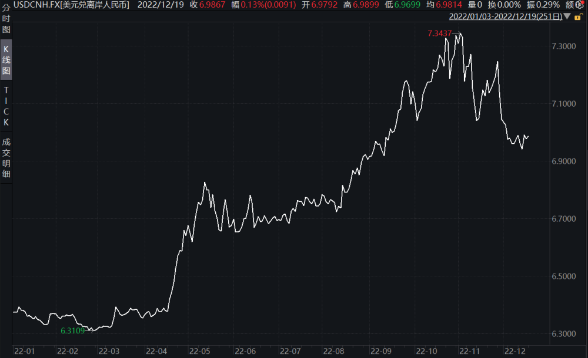

# 连续多日升值！在岸、离岸人民币今日双双升破6.8关口

每经记者：赵景致 每经编辑：廖丹

近期，人民币对美元大幅升值。

目前，人民币对美元已连续7个交易日升值，9日早间，在岸人民币对美元突破6.8关口，离岸人民币方面，同样已经突破6.8，均为2022年8月以来首次。

“近期人民币对美元走势确实有点快，意味着近期市场整体倾向抛美元、购人民币。”光大银行金融市场部宏观研究员周茂华指出。

民生银行首席经济学家温彬表示，预计2023年人民币汇率整体将呈现双向波动、温和回升、逐步趋近长期合理区间的走势。

人民币升破6.80关口

自2022年12月29日至今，人民币对美元连续多日上涨。1月9日上午，人民币汇率盘中升破6.80元关口，最高涨至6.7592。

_在岸人民币对美元走势
图片来源：Wind_

同时，截至发稿，更多反应国际投资者预期的离岸人民币对美元汇率日内最高报6.7664，这是继上个交易日离岸人民币对美元大涨超600基点后的再次冲高。

人民币中间价方面，外汇交易中心数据显示，1月9日，人民币对美元中间价调升647个基点，报6.8265，创2022年8月22日以来新高。

_人民币对美元中间价走势
图片来源：外汇交易中心_

此轮人民币对美元升值始于2022年11月。Wind数据显示，11月份离岸人民币对美元升值2909点，12月份升值1248点。今年开年以来的几个交易日内，离岸人民币对美元已升值超1200点。

“近期人民币对美元走势确实有点快，意味着近期市场整体倾向抛美元、购人民币。”周茂华指出。

周茂华表示人民币升值有三个比较确定的原因。

**一是市场对经济前景的预期更加乐观。**
“主要是因为国内持续优化防疫措施，经济活动回暖，还有国内支持实体经济政策力度持续加大，一揽子纾困稳增长的政策落地见效，经济稳步复苏。”周茂华指出。

**二是美元的高位回落**
。周茂华认为主要是美联储加息进入尾声，市场担忧美国经济衰退，以及欧央行追赶加息，支撑欧元。“欧元和美元存在一定的跷跷板关系，美元走弱带动非美货币反弹。”

周茂华认为，从美元面临的内外环境来看，美元上行空间受到抑制。一方面，美联储加息接近尾声；另一方面，美联储激进加息对经济的滞后影响会逐步显现。此外，美国此前强劲的财政刺激效果可能退坡，市场对衰退的担忧情绪在上升。

**三是近期市场回暖，带动部分资金趋势流入。**

专家：2023年人民币有望在均衡水平附近运行

据记者观察，离岸人民币方面，2022年2月25日对美元汇率最高，收于6.3109；2022年11月2日最低，收于7.3437。波动区间超过一万点。

_2022年以来离岸人民币对美元走势
图片来源：Wind_

“2022年人民币汇率双向波动幅度明显加大，走势呈现‘稳—贬—稳’的格局，全年对美元贬值约8.6%，CFETS指数贬值约3.8%。”民生银行首席经济学家温彬表示。

经过跌宕起伏的2022年，2023年人民币汇率行情如何？

周茂华指出， **2023年整体环境对人民币比较友好。人民币有可能还是处于均衡水平附近运行，上下波动。**
这主要是国内经济前景持续改善，国内经济长期向好的基本面没有改变，就没必要对人民币更悲观。

目前，国内的资本市场被看好，此外，国内的外贸虽然前景面临压力，但整体保持韧性。这种情况下国际收支有望保持基本平衡。

“从国国际收支看，一方面是人民币资产吸引力持续增强，资本项目下的资本流呈流入趋势；另一方面我国外贸保足韧性，国际收支有望保持基本平衡。”周茂华表示，这种情况下，人民币有望保持在均衡水平附近运行。

周茂华强调，“目前全球不确定性仍然不少，地缘政治、欧美通胀政策走向、经济走向，这种情况下，外汇市场的波动肯定不会小，对企业来说，还是要回归汇率中性，需要加强外汇市场波动风险管理，对风险进行对冲。”

温彬表示，2023年，中国经济将以“修复性复苏”为主基调，而全球经济则将以“通胀降温下的浅衰退”为主基调，我国国际收支将继续保持基本平衡格局，经常账户压力与金融账户改善并存，为人民币汇率保持稳定提供重要支撑。

“ **预计2023年人民币汇率整体将呈现双向波动、温和回升、逐步趋近长期合理区间的走势。**
一季度人民币汇率或双向波动明显，并在关键点位继续拉锯；二季度随着我国内需复苏和美联储加息临近尾声，汇率或在波动中有所升值；三季度季节性压力或使汇率面临回调；四季度美国衰退风险加大，汇率有望重回温和升值趋势。”温彬认为。

温彬指出，涉外企业应树立汇率“风险中性”理念，可选择合适的外汇产品开展汇率避险。金融机构则需要进一步丰富代客外汇产品，提升服务质量；同时加强自身外汇敞口管理，做好汇率风险预案。

