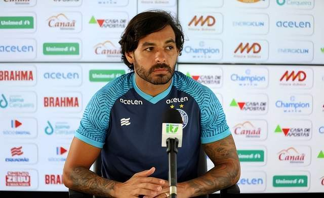

# 高拉特正在恢复巴西国籍，其余归化球员效力国足前景不明

北京时间1月10日，从巴西传来消息，现年31岁的入籍球员高拉特已与巴西巴伊亚竞技俱乐部续约，而在双方续约的新闻发布会上，高拉特确认，自己正在恢复巴西国籍。这意味着高拉特将彻底无缘代表中国队参加比赛。由于目前中国队新帅人选尚未确定，其他几位入籍球员能否继续代表国足效力，也都是未知数。

去年7月中旬，高拉特向巴甲老牌劲旅桑托斯俱乐部正式道别，随后他以自由球员身份加盟巴乙球会巴伊亚竞技。尽管在随后半年不到时间里，高拉特的状态起起伏伏，但巴伊亚队能够最终以巴乙联赛第3名身份升入巴甲联赛，高拉特还是起到了应有的作用。这也为他与俱乐部续约奠定了良好基础。

当地时间1月9日，巴伊亚竞技俱乐部召开新闻发布会，宣布与高拉特续约。而现场媒体记者还将有关“变更国籍”的问题抛给了他。高拉特对此的回答是：“我得问问事情进展得如何了，我对恢复巴西国籍的前景感到乐观，此事由相关的团队进行处理。”

2020年，高拉特为了能够代表中国队参赛，放弃了巴西国籍，从而成为中国公民。有报道显示，为了促成高拉特、艾克森、阿兰等球员入籍，广州（恒大）足球俱乐部已累计投入10亿元，其中就包括相关球员的签字费及安家费等费用。但令人遗憾的是，受国际足联球员身份规则的限制，高拉特最终未能获得代表国足出战的资格。

返回巴西职业足坛后，高拉特不得不以外援身份报名参赛。不过随着年龄增大，并确认继续留在巴西职业俱乐部效力，高拉特最终选择恢复巴西国籍。

那么，余下几名入籍球员能否继续代表国足出战，参加诸如2023年亚洲杯及2026年世预赛？目前还没有确切信息。截止到现在，中国队由谁来带队都还没有明确答案，而球员的选用、去留，很大程度上取决于教练组，特别是主教练的意见。在已经入选过国足的几名入籍球员中，除蒋光太效力于上海海港俱乐部外，其余几人或在巴西联赛踢球，或杳无音信。相对来说，蒋光太继续为国足效力的几率最大。

文/北青体育 肖赧

