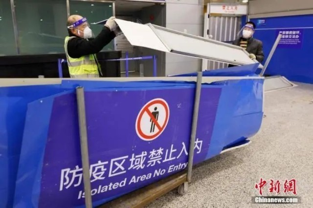
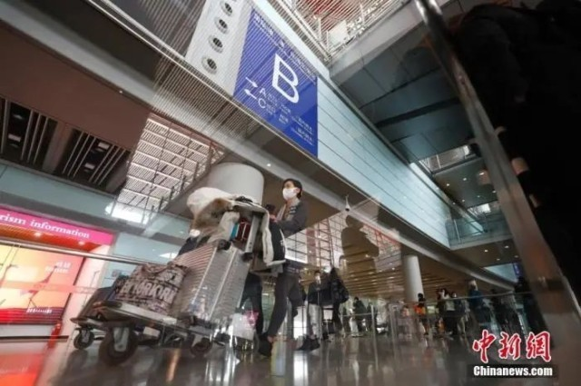

# 健康码还有存在的必要吗？专家回应

我国对新冠病毒感染已正式实施“乙类乙管”。7日，最高法、最高检等五部门合联合出台《关于适应新阶段疫情防控政策调整依法妥善办理相关刑事案件的通知》，对涉疫刑事案件办理调整进一步细化。有关专家表示，这更有利于符合新规所代表的现时的社会评价，实现法律效果与社会效果统一。

_1月8日，中国边境城市——广西东兴活力逐渐恢复
翟李强 摄_

这些人可解除羁押

1月7日，最高人民法院、最高人民检察院、公安部、司法部、海关总署联合出台《关于适应新阶段疫情防控政策调整依法妥善办理相关刑事案件的通知》(下称《通知》)。

《通知》明确，自2023年1月8日对新型冠状病毒感染实施“乙类乙管”、不再纳入检疫传染病管理之日起，对违反新型冠状病毒感染疫情预防、控制措施和国境卫生检疫规定的行为，不再以刑法第三百三十条妨害传染病防治罪、第三百三十二条妨害国境卫生检疫罪定罪处罚。

目前正在办理的相关案件，依照我国刑法、刑事诉讼法相关规定，及时妥善处理。犯罪嫌疑人、被告人处于被羁押状态的，各办案机关应当依法及时解除羁押强制措施；涉案财物被查封、扣押、冻结的，应当依法及时解除。

《通知》强调，要全面准确贯彻宽严相济刑事政策。对侵犯医务人员人身安全、扰乱正常医疗秩序和严重妨害养老机构、社会福利机构等重点机构防控秩序，对涉疫药品、检测试剂等制假售假、走私贩私、哄抬物价等危害严重、性质恶劣等犯罪行为，依法从严惩治，坚决维护国家安全和社会稳定。对涉疫轻微刑事案件，重在疏导和化解矛盾，统筹落实少捕慎诉慎押刑事司法政策，把注重溯源治理、恢复社会秩序、促进社会和谐稳定融入司法办案。

_1月7日晚，上海浦东国际机场T2航站楼国际到达层连夜拆除入境旅客闭环转运防疫围挡
殷立勤 摄_

专家：刑法适用的基本原则是从旧兼从轻

上海交通大学凯原法学院教授郑戈向中新网介绍，刑法适用的基本原则是“从旧兼从轻”。

郑戈解释，从旧兼从轻原则是刑法和行政处罚法等涉及禁止和处罚某些行为的法律领域所通用的法律适用原则，从旧原则所贯彻的是法无明文规定不处罚的理念，如果某种行为是被行为发生后的新法规定为具有可罚性，则应当按照行为时的旧法不予处罚；从轻原则是对从旧原则的补充，如果行为发生时的旧法规定该行为违法并应予处罚，但新法免除了该行为的处罚或规定了较轻的处罚，则适用新法。

“涉疫刑事案件办理调整是新法轻于旧法时，从轻原则适用的进一步体现。”他说。

北京大学医学人文学院医学伦理与法律系教授王岳认为，“乙类乙管”的实施，意味着刑法随着行政前置法的修改而对涉及新冠感染的行为的法律认定发生了变化。

王岳表示，《通知》对相关人员的解除羁押更符合处罚与违法行为相适应的原则，更有利于符合新规所代表的现时的社会评价，实现判决的法律效果与社会效果的统一。

他向中新网解释，其中的法理在于，对于新冠病毒感染的乙类甲管措施已经实际解除，且“每个人是自己健康的第一责任人”观念不断深入人心，在这一背景之下，人们刻意违反新冠防疫规定的现实可能性和危险性都已经下降，原有可能涉及刑事犯罪的行为已经不足以构成对社会秩序以及公众健康这两个法益的威胁，法律对该行为的社会危害性的评价已发生变化。

_“乙类乙管”实施首日的首都国际机场
中新社记者 富田 摄_

还有这些法律问题待明确

1月8日起，我国对新冠病毒感染正式实施“乙类乙管”。除了刑案办理模式以外，专家认为，还有一些法律问题需进一步明确。

王岳提到，对于因感染新冠无法到岗时，员工工资的发放；感染新冠病毒居家隔离期间，国家是否需要提供生活保障等问题待有关部门统一规定。

郑戈则表示，“乙类乙管”后的法律问题还有健康码、行程码所涉及的公民个人信息删除问题、“乙类甲管”期间违反防疫规定的行为的处罚问题等。

对于健康码是否还有存在的必要，郑戈认为，目前还有人有做核酸的需要，由于路径依赖，核酸检测结果与健康码是绑定的，查询起来比较方便，但健康码的公共用途已丧失。为此，他建议，核酸检测结果可另辟通道供个人查询。

来源：中国新闻网

