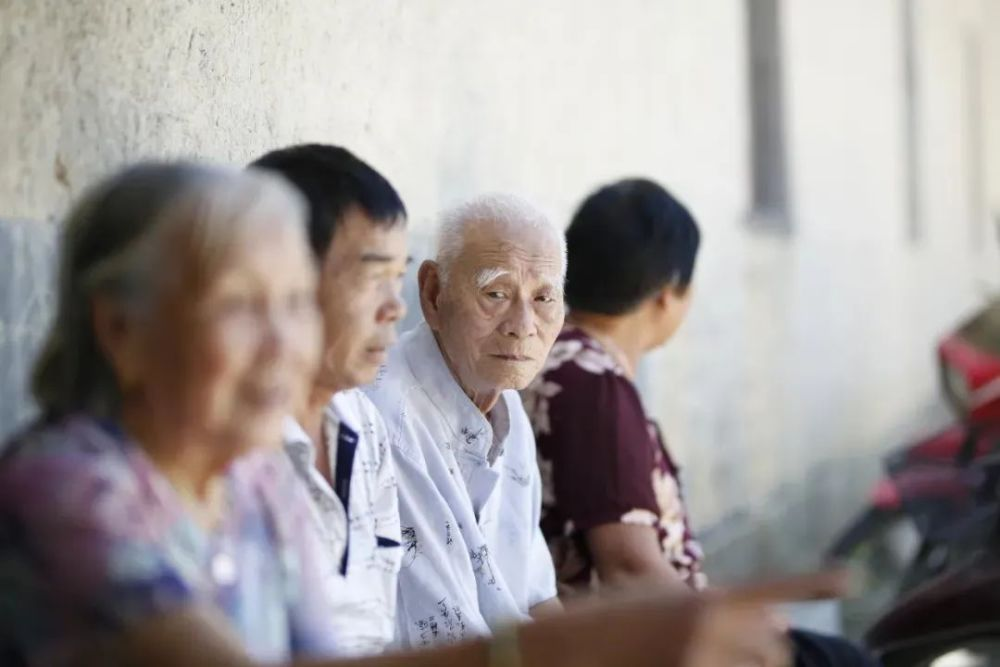

# 养老院：疫情风暴中的孤岛

当一家“与世隔绝”了68天的养老院突然发现一例阳性老人，世外桃源般的宁静瞬间消失

**文 | 《财经》记者 辛晓彤**

**编辑 | 余乐**

吕杰（化名）院长感到焦躁烦闷。他刚刚看了抗原试剂，两道红线，红得发黑。试剂毫不留情地告诉他自己已经“阳了”的事实。

这一天迟早会到来。他告诉自己。2022年12月21日，就在吕杰负责的这家民营养老院里，一位老人核酸结果呈阳性，着实让院内所有人吃了一惊。在这之前，这家位于山东某市的养老院已经连续封闭了68天，任何人不准进出，包括院内的医生、护士、护工、厨师甚至门卫。家属也不允许前来探望。

2022年12月7日，国务院联防联控机制综合组发布“新十条”，公共场所核酸检测基本取消，大多数区域进出自由，“外界”阳性病例越来越多。养老院仍然大门紧闭，成了“病毒真空区”。人们庆幸自己没被感染，以往积极要求解封的工作人员态度也开始转变。

街上的行人经历了短暂的狂欢，又自发地进入“非必要不聚集”阶段，空荡的街头隐约听到咳嗽声。在这种情况下，养老院成为真实意义上的世外桃源，老人们聚在一起打牌、下棋、聊天，时不时还有载歌载舞的小型庆祝活动。门外喧嚣也好寂静也好，都与己无关。

直到一位老人核酸检测呈阳性。

无孔不入的病毒

这是一家医养结合（有驻院医师或者有配套医院）的养老机构，陈小云（化名）是当天做核酸检测的护士。即便是“新十条”发布，市民政局仍然要求所有养老院继续每天核酸检测，检测试剂由民政局发放。陈小云记得当天早上徐阿姨有发烧症状，但所有人都没往新冠那个方向去想，冬天原本也是各类基础病的高发期。

“三混一”阳性结果出来后，陈小云穿上白色的防护服去给三位老人做单管检测。 **她还记得，房间门打开的那一瞬间，正在聊天的徐阿姨一下子怔住，面露惊恐。**
很长时间以来医护人员只是戴口罩。“大白”防护服重新出山，对他们而言并非好的预兆。

从世外桃源到重灾区，变化仅需一个上午。老人们当天就不允许离开自己的房间了，一切公共场所的娱乐活动暂停，医护人员在各处紧急消杀。

从当天的检测结果看，只有徐阿姨一人呈阳性，被送往五楼的空房间隔离。第二天，两名护工和一名医生阳了。第三天，三位老人检测出核酸呈阳性。第四天，两位老人、一名护士和一名护工阳了……之后的情况陈小云没有再记录。

截至接受采访的1月8日，该养老院的一百多位老人全部核酸结果呈阳性，部分已转阴，十一位老人永远地离开了；护士、医生（包括吕杰院长自己）和护工均被感染。

《财经》记者致电多家养老院了解情况：有人表示放开后组织老人接种疫苗，负责接种的医生后来查出阳性；有人表示医护人员外出采购药品，在医院感染了病毒。但更多的观点认为没有明确的起点，可能是老人在花园里散步，也可能只是开窗通风……

由于社会面的放开，即便养老院遵照上级民政部门严格落实院区封闭管理，做了一切疫情防控准备和应对，仍无法保证院里的老人不被感染。

打一场准备仓促的仗

自从院里出现阳性病例，吕杰就开始接到家属的“问责”电话，被问得最多的问题，就是院里大规模感染之后怎么办。

“我们有预案，但病毒没按预期的剧本来。”吕杰认为，他们所有人都低估了病毒的快速传播力，尤其在潜伏期内。针对性的隔离和消毒并没有将病毒扼杀，其传播速度之快也有些突破想象。

国家卫健委医疗应急司司长郭燕红在2022年12月8日的新闻发布会上，要求养老院、福利院等做到预防性措施的落实。9日，《新冠重点人群健康服务工作方案》印发，其中特别提出加强对养老院、儿童福利机构等重点机构的管理。

“ **文件下了一轮又一轮，基本都是叫你封闭。至于感染之后怎么办，这方面的建议很少。** ”吕杰说道。

低估“敌人”的后果就是准备不足。江兰（化名）在山东某县一家养老机构的配套医院负责药品采购，她眼睁睁看着一盒连花清瘟的进价从10元以下涨到30多元，而且已经买不到了。

江兰告诉《财经》记者，平时医院进药模式是跟十几家药商联系，询价购买。然而以往无比热情的药商，近日纷纷“失踪”，联系得上的也没有药品提供。“有一个药商，我给出单子要进上百种药，结果他家只有三种。还有一个药商，你买他的感冒药需要搭上别的药品，都是些不太给老人开的降压药，并且快过期了。”

更多的养老机构并非医养结合，基础药的进药基本通过药店。药店断供后，留给他们的空间就只有医院了。医院是按人次开药，且有些药品同样稀缺；另外，医院的急救和发热门诊也是人满为患，去医院开药也变相加大了感染风险。

除了药品之外，很多医疗用品也需要抢。崔海波在上海一家养老院工作，他们需要抢抗原试剂，且试剂的价格已经涨到8元-10元一份，超过了2022年上半年上海静默时期的价格。多数养老院都在承受着沉重的财务负担。

最惊险的还是去往医院的通路受到阻碍。护士小曾与陈小云就职于同一家养老院，她是整个护士站最后一个“阴性”的，“忙得脚不沾地”。小曾回忆道，2022年12月25日临近午夜，一位老人情况有些严重，小曾与其家属沟通后，拨打了120急救。然而，急救中心的接线员一直表示所有救护车都派出了，没有多余的车辆。家属也在动用私人关系，却无济于事。

直到两个多小时后，救护车才姗姗来迟。小曾记得，待到自己返回房间躺下时，时钟已经过了凌晨3点。早上一睁眼，浑身酸疼、感到寒冷的小曾意识到，自己“终于中招了”。

缺医少药的问题正在逐渐改善。邓珊珊（化名）是厦门市疾控中心的工作人员，她告诉《财经》记者，目前养老院的药品由卫健委协调保证，防护用品由民政局协调保障。“送医的话，市区卫健都有专门的人负责协调，基本重症都可以入院”。

但养老院“缺人”的情况并不是政府干预就可以改善的。在吕杰的养老院里，仍发烧的医护人员在房间休息，退烧的继续工作，基本上一个人要同时负担三四个人的工作量，核酸阳性还是阴性从来不是回归岗位的准绳。

出现第一例阳性病患后，原则上养老院仍处于封闭状态，但对家属放松了管控，可以入院探望。起初家属入院要看48小时核酸，如今也抽不出人力专门检查。如果家属将老人接回家，就不能再送回养老院，至少要等封院状态结束之后才行。

除了家属，养老院对医护人员仍按照封控要求管理，不允许自由出入（除非重症），护工感染后只能自行在房间里慢慢恢复。本来很多护工就对养老院的长期封闭怨声载道。
**吕杰担心，如果养老院放开，护工大概率返乡后就不再回来了，“到时候就真的没有人照顾老人了”。**

但是，陈小云表示，生病的医护人员根本没人照顾，甚至打饭都要自己走去食堂，有限的人力都被投入到工作中。“说实在的，有些护工的年龄也不小了。”陈小云本人今年58岁，在公立医院退休后被这家养老院返聘，几个医生也是返聘来的，都超过60岁。

“求求你了，就值一天班，真的一个护士都没有了。”陈小云记得院长打电话跟她说，那时她确诊第五天，刚刚退烧。

疫情下的孤岛

防疫政策放开之后，社会面对老人感染情况愈发关注。事实上，疫情三年，养老院一直都戴着“重点防护对象”这顶帽子，老人们并不容易。

一旦各地有零星疫情，养老院往往第一个做出反应。山东潍坊一家养老院，在2020年初武汉宣布封城的同时，就开始了封闭化管理。青岛市规定只要所在区有一例社会面病例，养老院就要禁止出入。王倩在苏州从事养老行业，她用一句话总结：“
**养老院抗疫是实打实的三年，且封控力度不断收紧。养老院永远是最早封闭、最晚解封的那个。** ”

违反规定对企业来说或许是致命的。2022年9月，青岛市市北区一家民办养老院在封闭期间检测出新冠阳性，该养老院被吊销执照，关门停业。院内二十多位老人，由家属自行联系转院。在这之后，民政局派专人驻扎在各个养老院，监督封控措施是否到位。“新十条”公布之后，专员才撤离。

厦门民政局、疾控中心联合街道办事处要求工作人员“包干制”，派专人负责一家养老机构，非封控期间每天都要去监督养老院防疫情况。

三年也是情感的考验。很多所谓的“探望”不过是隔着栅栏相拥、隔窗相望。崔海波记得，2022年4月，一位老人太过思念家人，几乎哭了一整天。“随着封控时间拉长，老人的情绪也越发不稳定。”

陈小云记得，2021年春节期间，院内有一位老人去世了，家属想要进院为老人做最后的梳洗换衣，让老人走得体面，却遭到当时的院长拼命阻拦，双方大打出手。那个时刻，养老院里没有一个人站出来支持院长，“我们知道她在严守防疫规定，但情感上谁不站在家属那边呢”？没过多久，那位院长便辞职了。

王倩告诉《财经》记者，疫情三年，养老院人才流失非常严重，原本这个领域专业的管理人才就稀缺，院长频频更换的现象非常普遍。

更严重的是护工的流失。尽管多数养老院都对护工管吃管住，但“住”和“封”完全是两个概念。大多数护工也有自己的家庭需要照顾，封闭期间很难兼顾。有的护工不得不带着孩子一起封闭在院里。封控时间久了，护工与领导、老人之间的矛盾也在不断激发，很多护工选择离职。留下的护工通常要承担比以往更多的工作，导致心态更加紧绷。

王倩介绍，正常情况下，国内机构护工对失能失智老人的照护比例在1∶2—1∶5之间，对自理型老人的比例多在1∶10左右。但在长期封控下，这两个数字已经下降到1:6和1:13甚至更低。这样一来，老年人的照护质量肯定大打折扣。

中国社科院社会政策中心秘书长唐钧认为，中国的商业化养老机构发展只走过短短九个年头，各地养老机构良莠不齐的情况普遍存在。在封闭状态下，防疫要求增加了工作量，员工却在持续流失，机构压力骤增，管理质量下降难以避免。

有些家属担心老人缺乏照顾，便跟随老人一同被封在养老院里。吕杰所在的养老院，有位病人家属退休没几年，同老母亲一同封控了三个多月。

但是有这样条件的家属太少了，多数老人的儿女都不在身边，甚至没有亲人。

陈小云对一对老年夫妇特别照顾，老先生94岁，有阿尔兹海默症；老奶奶87岁。他们没有儿女。此番夫妇二人都感染了病毒，老奶奶专门把陈小云叫到自己房间，说有东西给她。陈小云刚要拒绝，老奶奶告诉她，他们老两口在七十多岁的时候就签署了遗体捐献书，本都换了几次了，就放在床头的抽屉里。“老头子幸运的话应该走在我前面，但如果不幸我先走了，你记得把捐赠书拿出来给人家。”

最危急的时刻尚未到来

目前吕杰所在的养老院尚未收到解封命令，今年过年能否去看望老人或者接老人回家，仍是未知数。

在外地工作的刘林感觉，自己又经历了一次2020年初——犹豫过年回家要不要去养老院探望奶奶。去的话，担心病毒传染，即便刘林和奶奶都“阳康”了；不去的话，“年三十不跟奶奶在一起，怎么能叫过年呢”？

现阶段，吕杰所在的养老院很少有家属将老人带回家去。一来家属基本也都阳了，没有精力照顾；二来，在养老院，家属也认为老人及时得到救治的概率比在家大一些。

邓珊珊也观察到这一现象，但她认为，有条件的话还是将老人接回家比较稳妥。

“目前的一致观点在于——感染是防不住的，重点是防重症。”邓珊珊表示，“政府的介入也只能控制增速，避免大面积突然暴发，不要出现明显的医疗挤兑情况。”邓珊珊也指出很多养老院在政策执行上没有到位。

王倩表示，很多社区养老院设施老旧，在建设之初并没有考虑到新冠这种等级的传染病防治需要，难以配备独立通道、设备设施、物资和人员，有些甚至连隔离房间都空不出来。有些是旧楼改造，没有独立的通风系统。“（苏州）当地要求，缺少隔离缓冲区的养老机构需要在民政局的指导下租酒店房间隔离，但他们本身就缺乏资金，根本没办法落实到位。”

陕西省山阳县卫健局原副局长徐毓才认为，进入腊月以及即将到来的正月，才是感染风险最大的时候。“三年疫情防控，国家一直提倡外出务工子女能不回家就不回家，今年一定会迎来大批人员返乡，提高疫情传播风险。”

吕杰认为疫苗是防范老年人感染的有效手段。在“新十条”发布后至院内阳性病例出现之前，养老院一直在推进疫苗接种工作，民政局规定老人接种率超过90%才能解封。但劝说老人接种疫苗非常困难，多数家属都表示拒绝。此外长时间的封控也让人们低估了病毒的传播速度与力度。

“国家最初推行疫苗接种时，规定年龄是18岁-59岁，这在很大程度上给老百姓心目中留下‘老年人接种会有风险’的印象，直到现在也拒绝接种疫苗。”徐毓才解释道，实际上新冠疫苗早已将年龄限制定在3岁以上，而且老年人是接种疫苗的最优先人群之一，但由于各个层级的宣传工作不到位，导致目前人们仍有类似恐慌。

崔海波提出养老院要做好老人身体情况的监测工作，及时就医。2022年12月21日，国务院联防联控机制医疗救治组召开全国电视电话会议，明确二级以上医院与养老院对口协作关系，紧盯养老院等重点场所。

“养老院只能把该做的事情都做好，撑下去。” 吕杰说，

（应受访者需要，吕杰、陈小云、江兰、邓珊珊均为化名。《财经十一人》魏媛对本文亦有贡献。）

