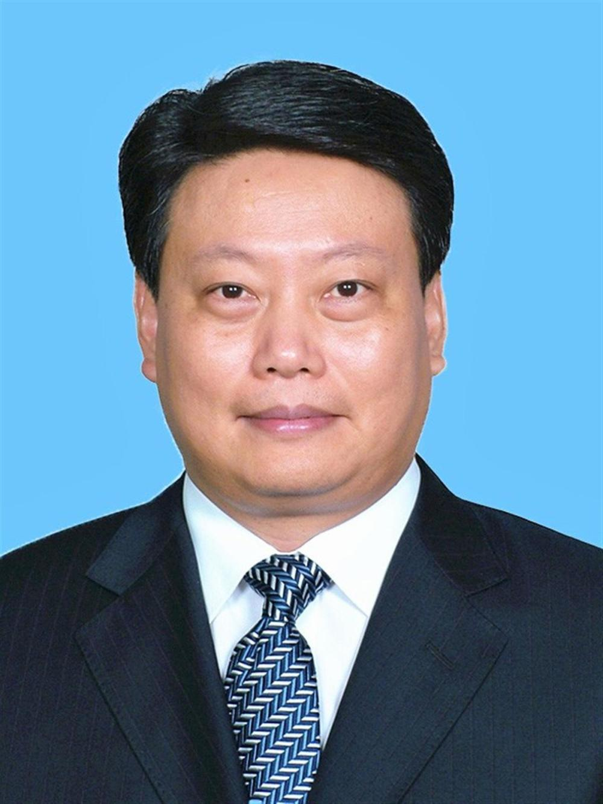

# 司法部部长唐一军任江西省政协党组书记，曾部署8个省份法治督察

极目新闻记者 李曼英

1月9日晚，江西卫视“江西新闻联播”消息，唐一军已任江西省政协党组书记。此前，据微信公众号“江西政协”1月8日消息，1月7日，省政协十二届常委会第二十五次会议在南昌召开，会议审议通过了十三届省政协委员名单。十三届江西省政协委员名单上共有595人，其中包括现任司法部部长唐一军。

极目新闻记者梳理发现，62岁的唐一军是山东莒县人，曾在浙江工作40年，系新司法部第二任部长。出任司法部书记、部长期间，唐一军曾以“中央依法治国办副主任”的身份，部署多个省份的法治督察，多位省部级率队赴地方明察暗访。

_唐一军（图片来源：司法部官网）_

**新司法部第二任部长**

公开资料显示，新司法部第二任部长，唐一军1961年3月出生，今年62岁。

据政知圈报道，唐一军1977年7月参加工作，从1977年到2017年在浙江工作整40年。在浙江，唐一军曾长期在宁波任职。2011年1月，唐一军出任宁波市政协主席、党组书记。因为宁波是副省级城市，彼时唐一军已经是副省部级干部。

2016年对唐一军来说是比较特别的一年。2016年2月，时任宁波市委书记刘奇调往江西。3月，时任宁波市长卢子跃落马被查。宁波党政一把手双空缺。4月，唐一军出任宁波市委副书记、代市长等职务，8月又出任浙江省委常委、宁波市委书记。

2017年，唐一军跨省前往辽宁成为省政府“一把手”。2020年4月底，唐一军调任司法部部长。

据了解，2018年3月，国家机构改革，司法部和国务院法制办公室的职责整合，重新组建司法部。唐一军是机构改革后新司法部第二任部长。

**部署8个省份法治督察**

据《北京青年报》报道，2018年，根据党和国家机构改革方案，组建了中央全面依法治国委员会，办公室设在司法部。2021年10月11日，中央依法治国办召开法治督察动员培训会议。司法部党组书记、部长唐一军以“中央依法治国办副主任”的身份出席会议并讲话。

在这次会议上，唐一军明确了督察重点。他说，要紧扣学习宣传贯彻习近平法治思想和中央全面依法治国工作会议精神这条主题主线，重点督察推进依法行政高标准、保障经济发展高质量、助推社会治理高效能、守护群众生活高品质等方面情况。实地督察的地方为北京、天津、吉林、安徽、湖南、广东、重庆和宁夏等8个省份。在他部署后，多位省部级率队赴地方。

_唐一军（图片来源：司法部官网）_

如何督察？唐一军说，要抓好点、线、面，用好谈、查、访，把好时、度、效，守好权、责、纪，扎实有序推进督察工作，确保高质量完成任务。

在以往的督察中，明察暗访是督察组的重要手段之一。比如，赴广西督察的陈晓华（全国政协农业和农村委员会副主任）就曾明察暗访广西法治建设工作。“疫情期间家里生意怎么样？市场有没有减租金？”在广西百色市的迎龙综合农贸市场，陈晓华通过和摊主“聊天”，了解当地落地惠民政策、依法保障营商环境的情况。“夜市晚上吵有人来管吗？”“你的案子多久有反馈的？”“有没有拖欠工资的情况？”“这里的企业好做吗？”督察组通过暗访等形式与群众交流。

被督察的地方党政一把手也陆续进行了表态。比如，面对督察组，时任湖南省委书记许达哲说，要以优良作风抓好督察反馈问题全面整改。针对自查报告和督察反映的问题及薄弱环节，拉条挂账、逐个销号，举一反三、建章立制，推动法治政府建设取得新突破。

**将行政复议作为化解行政争议主渠道**

据司法部官网2022年10月28日消息，《中华人民共和国行政复议法（修订草案）》（以下简称修订草案）2022年10月27日提请十三届全国人大常委会第三十七次会议审议。修订草案共7章86条。受国务院委托，司法部部长唐一军对修订草案作了说明。

行政复议是政府系统自我纠错的监督制度和解决“民告官”行政争议的救济制度，是推进法治政府建设的重要抓手，也是维护公民、法人和其他组织合法权益的重要渠道。

现行行政复议法于1999年施行，并于2009年和2017年分别对部分条款作了修改。截至2021年底，全国各级行政复议机关共办理行政复议案件295.3万件。其中，立案并审结244.4万件，纠正违法或不当行政行为35万件，纠错率14.3%，在维护群众合法权益、促进社会和谐稳定、加快建设法治政府方面发挥了重要作用。随着经济社会发展，行政复议制度也暴露出一些突出问题，包括吸纳行政争议的入口偏窄，部分行政争议无法进入行政复议渠道有效解决；案件管辖体制过于分散，群众难以找准行政复议机关，不利于将行政争议化解在基层和萌芽状态；案件审理机制不够健全，审理标准不统一，影响办案质量和效率。

党中央、国务院高度重视行政复议工作。中央全面依法治国委员会印发《行政复议体制改革方案》（以下简称《方案》），对构建统一、科学的行政复议体制作出部署，要求抓紧修订行政复议法，将改革方案转化为相应的法律制度，确保改革于法有据。修订草案全面贯彻落实《方案》，强化行政复议吸纳和化解行政争议的能力，坚持复议为民，提高行政复议公信力，努力将行政复议打造成为化解行政争议的主渠道。

**附：唐一军简历**

唐一军，男，汉族，1961年3月生，山东莒县人，1977年7月参加工作，1985年10月加入中国共产党，中央党校研究生。现任司法部党组书记、部长，中央全面依法治国委员会委员兼办公室副主任，中央教育工作领导小组成员，中央政法委员会委员，中央司法体制改革领导小组成员，国家应对气候变化及节能减排工作领导小组成员。第十九届中央候补委员。

曾任浙江省舟山市委秘书长，浙江省舟山市委常委、秘书长，浙江省纪委秘书长，浙江省纪委常委、秘书长，宁波市委副书记、市纪委书记，浙江省宁波市委副书记、政法委书记，浙江省宁波市政协主席，浙江省宁波市委副书记、代市长、市政协主席，浙江省委常委、宁波市委书记、代市长，浙江省委副书记、宁波市委书记，辽宁省委副书记、代省长、省长。

（来源：司法部官网）

（来源：极目新闻）

