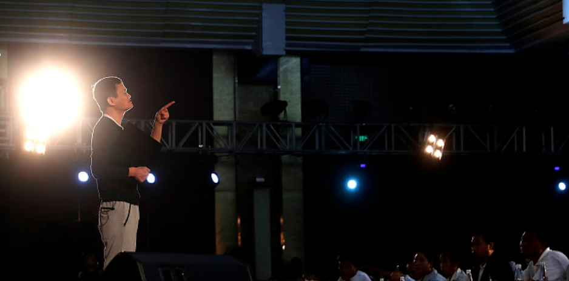
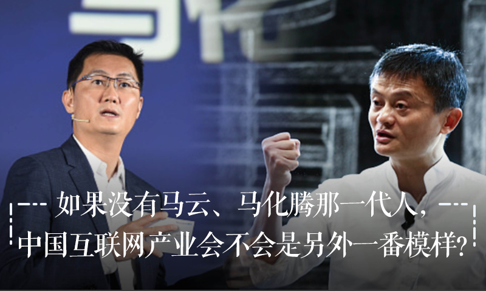
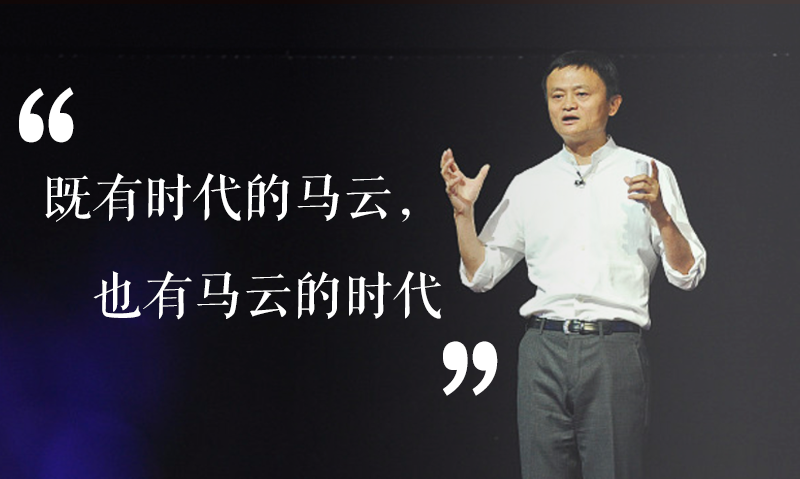

# 吴晓波：到底有没有“马云的时代”？

文 / 吴晓波（微信公众号：吴晓波频道）

**一**

理查德·泰德罗是哈佛大学商学院的商学史教授，他写过一本我非常喜欢的书——《影响历史的商业七巨头》。在这本文笔优雅的书里，他为安德鲁·卡内基、亨利·福特和山姆·沃尔顿等七个改变了美国商业的企业家撰写了小传，如果连在一起读，就几乎是美国百年商业变迁的简史。

在书里，泰德罗做了一个很有趣的穿越式描述：如果他们生活在意大利，或许会成为作曲家；如果生活在俄罗斯，或许他们会成为作家；如果生活在葡萄牙，或许会成为航海家；如果生活在古代罗马，他们会成为体操运动员……

然而，安德鲁们生活在十九世纪末到二十世纪中期的美国，他们创建了企业，从而改变了美国的历史，并成为那个时代最光彩熠熠的人物。

**在某种意义上，时代的机遇激励了他们，美国的制度给了他们极大的自由，同时，他们也塑造了美国的商业文明和美国精神。**

我之所以喜欢泰德罗的这本书，并经常向朋友们推荐，是因为在每一次的阅读中，我都能如此深切地产生跨时代的共鸣。在那些创世纪般的企业家故事里，我读到了当代中国企业家们的影子。

那天，突发奇想，如果有一天我去哈佛碰到泰德罗，跟他讨论一个话题：“你同不同意，只有时代的亨利·福特，没有亨利·福特的时代？”

我很好奇，他脸上的表情会是怎么样的。

**二**

**近些年，在我们的舆论界，就有一个这样的说法被时常提及，那就是——“只有时代的马云，没有马云的时代”。它听上去挺押韵和解气的，但是仔细琢磨和剖析，却可能是非常值得商榷的。**

记得很多年前，在商学院给EMBA们授课的时候，我会请大家辩论一个课题：一位企业家的存去，是不是企业战略和发展的一个决定性因素。

比如：如果没有亨利·福特，T型车会不会出现？如果乔布斯不去世，苹果公司会执行今天的战略吗？如果没有马斯克，全球新能源汽车的发展路径是否会改变？如果没有马云、马化腾那一代人，中国的互联网产业会不会是另外一番模样？

辩论的结果几乎是一边倒的：杰出企业家在这些公司和产业的发展及衍变中，扮演了改变路径和创造新模式、新规则的决定性作用。

所以如果你问我，评估一个国家商业进步的核心要素是什么，我的回答是三点：制度环境、技术变革和企业家精神。其最后一点，则集中地体现在那个时代若干个杰出人物的身上。

**三**

这一景象几乎出现在人类历史的所有断面和领域。

如果没有孔丘，就不会有系统化的儒家思想体系，“天不生仲尼，万古如长夜”的说法固然夸张了一点，但却是事实的一部分。在西方哲学史上，柏拉图、黑格尔和康德扮演了同样的角色。

如果没有汉武帝和乾隆，中国很可能有另外一张疆域版图。如果没有拿破仑，欧洲的国家格局一定是另外一种景象。如果没有牛顿和爱因斯坦，人类的科学世界将被重新叙述。

如果没有屈原、李白、王羲之和曹雪芹，中国古典文学一定会被彻底改写。如果没有莎士比亚，没有贝多芬和柴可夫斯基，没有达·芬奇、梵高和毕加索，西方的文学、音乐和绘画艺术就一定不会呈现为如今的面貌。

**如果我们承认，在思想领域有孔子的时代和柏拉图的时代，在政治领域有汉武帝的时代和拿破仑的时代，在科学领域有牛顿的时代，在文学领域有李白和莎士比亚的时代，在音乐领域有贝多芬的时代——那么，为什么在商业领域，没有亨利·福特的时代，没有乔布斯的时代，没有企业家的时代？**

**如果没有，要么是一种偏见，要么就是一种“身份羞辱”了。**

**四**

**相比于“只有时代的马云，没有马云的时代”的提法，我更倾向于认为——“既有时代的马云，也有马云的时代”。**

理由有三个。

**▶▷** 其一，每一个人都是时代的产物，他的思想、才华和行为受到时代的启迪和局限。他为人类进步所做出的贡献或破坏，都内生为历史叙事的一部分。

**▶▷**
其二，任何领域或产业的演进，既被客观的时代因素所牵引，但是，其模式和规则创新，则因某几个杰出人物而改变。这种改变构成为一个鲜明的革命性拐点，它也是“历史戏剧性”和“历史人格化”的一部分。

**▶▷** 其三，这些杰出人物的个人命运跌荡，他们被时代改造或惩罚的经历，同样构成为历史叙事的一部分，进而呈现为历史的复杂性。

如果回到传闻缠身的马云身上，他应该会感恩这个时代，没有波澜壮阔的改革开放，今天的马云很可能只是杭州某所中学的英语老师，业余喜欢哼点戏曲和打太极拳。

但是，如果没有马云，我不相信中国会有阿里巴巴式的电商模式，同时，很可能不会有支付宝这样的产品，当然也很可能没有给他带来了麻烦的蚂蚁金服。

**所谓的“马云的时代”，既指代的是以他为代表的中国互联网当代史，以及这一代创业者的某些共性及特征，更概括为他以及他所创办的商业事业的全部荣光和曲折。**

易卜生说：“每个人对于他所属的社会都负有责任，那个社会的弊病他也有一份。”这句话适用于你我，包括马老师和所有的中国民营企业家。

**本篇作者 |** 吴晓波 **| 当值编辑 |** 麻酱

**责任编辑 |** 何梦飞 **| 主编 |** 郑媛眉 **| 图源 |** VCG

