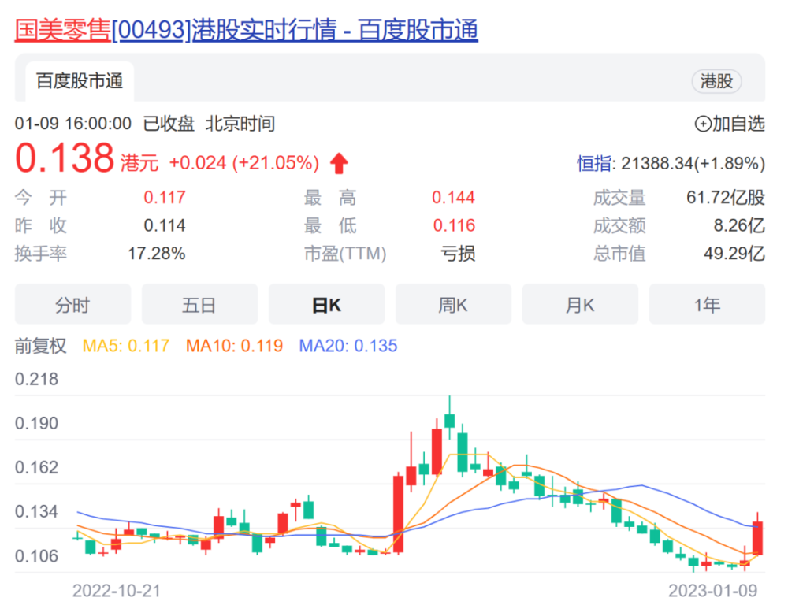
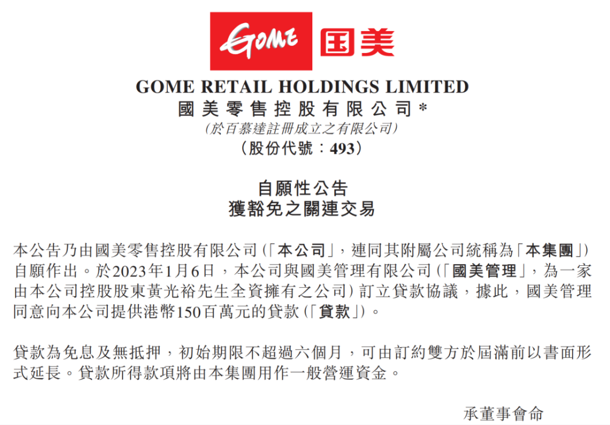
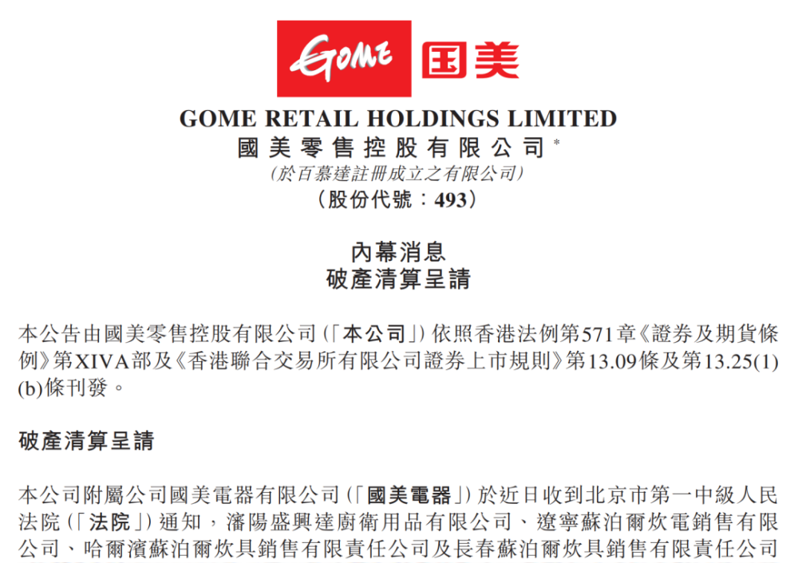

# 国美零售大涨21％！黄光裕五次出手，提供无息贷款7.8亿港元

1月9日，国美零售(00493.HK）股价大幅飙升。开盘小幅高开后持续上涨，盘中最高涨超26%，最终收盘涨21%，报收0.138港元，成交量也较往日明显加大，成交额8.26亿港元。

盘后数据显示，国美零售登上了当日港股通(沪)成交第三名，成交额5.7亿港元，但港股通(沪)净买额为-2681万港元。

从消息面看，近期国美零售再次获得大股东旗下公司1.5亿港元无息贷款，这也是黄光裕30天内第五次提供流动性支持，累计金额7.8亿港元。

对此，国美方面对证券时报·e公司记者表示，大股东本次提供的免息贷款与上次贷款用途一致，包括支持国美零售流动性，以及解决员工部分工资问题。“在解决员工工资方面，目前，一部分资金正在按照整体安排有序补发给已离职和在职员工。”

值得一提的是，对于目前流动性危机加剧的国美零售而言，近日还抛出了债转股计划，拟向债权人寰亚国际资本发行40.63亿股，来偿还未付广告费约4.16亿港元，这也将导致黄光裕及其一致行动人持股比例再次下降。

不过，在业内看来，国美零售的核心问题还是要通过改善持续经营能力来提升自身造血能力，此外，通过资产重组引入具有产业资本属性的战投或能帮助国美早日脱困。

**借款合计7.8亿港元**

1月6日，国美零售发布自愿性公告称，公司与国美管理有限公司（“国美管理”，为一家由公司控股股东黄光裕全资拥有之公司）订立贷款协议，据此，国美管理同意向公司提供1.5亿港元的免息、无抵押贷款，初始期限不超过六个月，可由订约双方于届满前以书面形式延长。贷款所得款项将由集团用作一般营运资金。

实际上，这已经是一个月内黄光裕的第五次出手，为上市公司流动性提供支持。

据国美零售此前公告，黄光裕旗下公司分别于12月8日、12月14日、12月22日、12月30日先后向国美零售提供了1.5亿港元、2亿港元、1.5亿港元、1.3亿港元的免息、无抵押贷款，若算上本次的1.5亿港元，国美零售已获黄光裕输血合计7.8亿港元。

从资金来源来源看，大部分资金为黄光裕以及一致性行动人减持上市公司股份所得，国美零售相关知情认为此前也曾对记者表示，贷款来来源大股东低价减持股票。

最新数据显示，近期，黄光裕继续减持国美零售，持股比例降至18.47%。据港交所权益披露数据显示，2022年12月29日，国美零售大股东黄光裕以每股0.1158港元的均价出售5.53亿股公司股票，涉资约6404万港元，持股比例从20.02%降至18.47%。

值得一提的是，流动性危机加剧的国美零售近期还抛出了债转股计划。1月2日晚间，国美零售与寰亚国际资本有限公司订立协议，将按每股0.1023港元向债权人发行资本化股份40.63亿股，以清偿结欠寰亚国际资本的广告费4.16亿港元。

国美零售表示，由于集团存在流动资金问题，本公司认为债务资本化将使集团能够清偿结欠债权人的未偿还债务，并让集团节省其现金资源作其他用途。

另一方面，若此次债转股完成，大股东黄光裕对国美零售的持股比例将再度减少。公告显示，此次债转股将使得国美零售股权结构发生变动，控股股东黄光裕及其一致行动方持有国美零售的股份从原有的21.53%降至19.33%，债权人持股比例从0%增至10.21%，或将成为国美零售的第三大股东。

浙江大学国际联合商学院数字经济与金融创新研究中心联席主任盘和林对e公司记者表示，国美的问题还是在于造血能力，但国美当前正在解决的不是造血能力，而是债务问题，债务问题解决后，才会考虑通过改善经营方式来提升造血能力。即便是当前债务问题顺利改善，当前国美转型也面临很大的阻力。

**转型效果有待观察**

实际上，从经营层面看，国美零售也在积极探索业务转型。11月24日，旗下国美电器宣布将以直播带货为重要发力点，在全国各地门店创新直播模式。此外，国美电器决定实施“瘦身转型”。

国美电器方面最新表示，将在全国30个分部里砍掉不盈利的小店。同时，放开加盟或者类加盟的形式吸引更广泛的“社会力量”，进一步降低风险，以激励的方式让更多的社会力量提升门店竞争力。

但目前看，国美零售转型效果还有待观察，其经营业绩的确难言乐观。2022年上半年，国美零售实现销售收入约为121.09亿元，同比下降53.5%；净利润约为亏损29.66亿元，去年同期亏损为19.74亿元，亏损持续扩大。

去年10月30日晚间，国美零售称，由于该公司所披露的不利经营状况，预计2022年全年归属于母公司拥有者应占经营亏损将比去年同期扩大35%至65%之间。此外，公告还指出，截至2022年9月30日，国美零售逾期贷款约为30亿元。

“当前线下电商由于渠道成本高企走向末路，而如果线下电商想要向线上走，线上线下定价就会产生冲突。且当前线上电商市场也趋于饱和。国美要摆脱困境，那就是被并购，如果互联网巨头里面需要线下业态，完善其线上线下，则有可能以并购的方式帮助国美脱困。”盘和林对记者表示。

**国美电器近期陷入风波**

债务问题也让国美零售旗下国美电器近期陷入了被申请破产清算的风波。

11月29日，认证名称为中城院要案中心的账户在微博发文称，国美电器有限公司因拖欠供应商数百万货款，经催要不能偿还，被向北京市第一中级人民法院破产法庭申请破产清算，法院已启动审查。随着该消息12月1日一度登上微博热搜，国美电器当日深夜在官方微博发文否认。

12月29日晚间，国美零售发布公告，回应市场关于公司被破产清算的疑问。

公告显示，国美零售旗下国美电器近日收到北京市第一中级人民法院通知，沈阳盛兴达厨卫用品有限公司、辽宁苏泊尔炊电销售有限公司、哈尔滨苏泊尔炊具销售有限责任公司、长春苏泊尔炊具销售有限责任公司（统称“申请人”）以国美电器不能清偿欠付货款为由，分别向法院提出对国美电器的破产清算呈请（简称“该呈请”）。

国美零售表示，经公司内部核实，上述申请人为公司多家附属公司的供应商，申请人主张前述附属公司欠付货款合计约470.6万元，但该等债权债务并未有生效法律文书予以确认。申请人与国美电器之间均没有直接的业务往来，国美电器不存在欠付申请人货款的情况。国美电器表示，将依据《企业破产法》第十条规定，依法对该呈请提出异议，法院将在异议期满后裁定是否受理该呈请。

不过，中城院要案中心12月30日发布消息，中心及协同律所今天已经协助四家申请人向北京市第一中级人民法院递交国美电器破产清算审查补充证据，证明四家国美附属公司为空壳公司，国美电器应当承担责任。

1月4日，中城院要案中心再次发声表示，已获悉北京市第一中级人民法院破产法庭近期将组织四家申请人与国美电器参加法庭谈话，以就国美电器破产清算审查案件作出裁定，申请人方面已收到法院通知。

