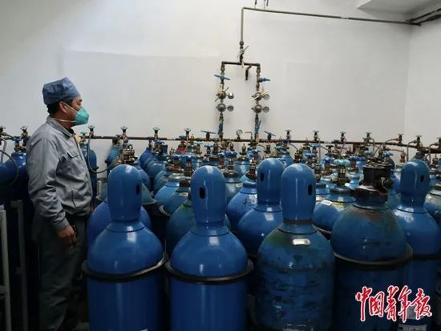
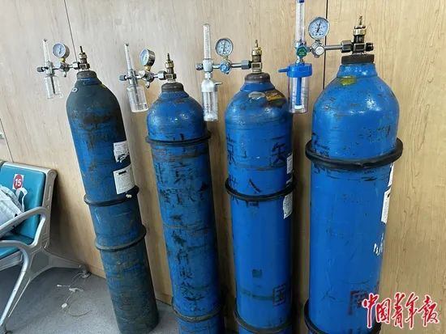

# 寻找氧气

_2022年12月28日上午，北京老年医院氧气站工作人员正在巡查氧气钢瓶。_

**作者 | 陈 晓 文并摄‍‍‍**

**编辑 | 秦珍子**

表盘上的黑色指针又向左偏了不少。

2022年12月28日早上，北京老年医院氧气站工作人员闫治忠照例检查设备，他看见，液氧罐储量表上，指针指向了0.4吨。前一天上午10点35分，这个数值还是6吨。

闫治忠立即打开备用液氧罐的阀门，以支撑当天在院患者对氧气的需求。一天5.6吨的氧气使用量，意味着医院剩余的氧气只能撑24小时。闫治忠立刻联系了供氧公司，下午，新一批液氧将被送进医院储罐。

这些高3.5米、直径2.5米的罐子保持着零下183摄氏度的低温，盛放着淡蓝色的、液体状的氧。经过汽化升温，它们会变成气态氧，成为维持人类生命的必需品。

刚刚过去的12月，随着奥密克戎变异株不断传播，中国各地新冠感染人数激增，医疗机构的氧气供给面临严峻挑战。国家卫健委于2023年1月5日印发的《新型冠状病毒感染诊疗方案（试行第十版）》中提到，重症患者多在发病5-7天后出现呼吸困难和（或）低氧血症，严重者可快速进展为急性呼吸窘迫综合征。人工给氧是改善缺氧状态、维持血氧饱和度、支撑生命的重要手段。

北京市卫健委发布的数据显示，2022年12月17日-28日，北京大学第三医院急诊接诊人数从626人增加到最高1176人，增长率为87.9%。12月19日，北京大学人民医院急诊接诊378人，急诊留观床位使用率为10%，而在30日，急诊接诊1356人，留观床位使用率100%。

大约就在这段时间，据杭州日报报道，12月26日，浙江大学医学院附属邵逸夫医院急诊总量达1552人次，12月19日-26日一周的时间里，两个院区的急诊人数分别增加了146%和61%。据《齐鲁晚报》报道，12月24日以来，山东省立第三医院急诊科接诊人数较去年同期增加四五倍，大部分都是新冠感染者，重症患者人数明显增多。

这一时期，医院对氧气的需求飙升，各电商平台的家用血氧仪、制氧机也出现断货情况，北京线下门店的氧气罐、氧气袋开始脱销。

北京一家氧气维保公司的负责人王方表示，“元旦前，北京很多医院都出现了需氧量急遽上升的情况，想马上改造设备和管道不现实，得赶紧做临时性补充。”他最近接到北京9家医院的供氧管道临时改造订单，这些医院分布在北京东城区、西城区、海淀区、朝阳区、大兴区。

_2022年12月30日，首都医科大学附属北京佑安医院急诊大厅，一组氧气瓶靠墙摆放。_

**“我从业9年了，从没经历过这种情况”**

“滴滴滴……”在北京某医院一间重症病房内，刘爱萍的心电监护仪红灯闪烁，屏幕上血氧饱和度一项，数值显示73%，远低于医学认定的成年人血氧饱和度的正常数值——95%。

85岁的刘爱萍和女儿女婿住在一起，是这个三口之家第一个新冠抗原检测呈阳性的人。高龄叠加了高血压、冠心病等基础疾病，她的病情发展迅速。

2022年12月23日，刘爱萍持续发热、呼吸不畅，女儿陈华打120得知，“至少需要等待（救护车）4小时”。她开车带母亲前往离家最近的三甲医院，途中，刘爱萍已呈现出缺氧的相关症状，口唇发紫，呼吸急促。

陈华记得，电子导航设备不止一次发出提示：“附近有救护车经过，请注意避让。”即将抵达时，她看见整条马路几乎塞满私家车，交警在医院门口指挥交通，5辆救护车正排队进入院门，行驶速度缓慢。

刘爱萍被急诊科接诊后，直接转入重症病房。老人吸了3小时氧，血氧饱和度升至85%。“医生说再来晚点，命可能就没了。”陈华感到后怕，说自己拿着医院单据的手一直在发抖。

北京大学第一医院急诊科医生陈凯告诉中青报·中青网记者：“老人抵抗力差，发烧温度没有年轻人高，再加上对缺氧反应迟钝，出现沉默性缺氧。送医时被诊断为重症、危重症的几率很高，第一时间给氧可以缓解缺氧症状，赢得最佳救治时间。”这位医生补充说，“不只是老人，青中年群体也会出现缺氧状况，大多数人感觉到缺氧就会立刻就医，医院的氧气供应就面临挑战。”

元旦前，12月30日，记者走访首都医科大学附属北京佑安医院，急诊大厅的椅子上还坐着几名中年人，他们正在一边输液，一边吸氧。

“那段时间，医院每天的用氧量都在5吨左右，达到日常用量峰值的两倍以上。储量6吨的液氧罐，以前供氧公司3天送一次就够用，那时要一天送一次。”北京老年医院总务处处长董文洲回忆，2022年12月17日前后，他已经感觉到医院用氧需求量特别大，总务处的日常工作之一就是负责医院氧气设备设施的运行和管理。

“一天用5.6吨的氧气，我从业9年了，从没经历过这种情况。”闫治忠说，北京老年医院氧气站的24小时值班人员从一个人增加到两个人。除了不定时巡查减压阀和管道氧压外，闫治忠和同事还要给急诊科运送氧气钢瓶。

12月30日上午8点半，记者在首都医科大学宣武医院看到，急诊大厅和走廊里挤满平车床、轮椅，输液的患者或躺或坐，走廊仅能容一人侧身通过。墙面临时贴了很多挂钩，每个挂钩上都挂着两到3个输液袋。有的患者通过床头墙体上的氧气口进行吸氧，有的患者则是自带氧气钢瓶，一边输液一边吸氧。

患者陶小英是在2022年12月24日上午到达宣武医院急诊科的。此前，这位感染新冠病毒的老人突然晕倒在卫生间，被家人送到医院。老人的外孙女记得，挂完号以后，护士说预计要排队两小时以上，等重症患者抢救完毕才能见到医生，当时，急诊大厅里找不到一张空椅子。

平车床和轮椅已经租不到了，租赁处围满了人。“我不知道设备什么时候还，也不知道有几个人能还。”工作人员正一遍遍地解释着。

5小时后，陶小英见到了医生。经测试，她的血氧饱和度为92%。她进行了肺部CT检查，查了血常规。医生判断，老人有沉默性缺氧，轻度肺炎。

陶小英还有高血压、冠心病和胃病，但当时医院已经没有病床可住，也没有吸氧位置和呼吸机可用了。医生建议老人回家吃药、吸氧、监测血氧饱和度，如果数值还掉，再送医院急诊。

陶小英回家了。她的外孙女打开手机地图，以“医疗器械”为关键词进行搜索，按显示结果依次打电话询问。晚上8点，这个姑娘终于买到一只10升装的氧气瓶。

“吸氧后姥姥血氧饱和度升到98%，我的心也落地了。”她说。

北京大学第一医院急诊科医生陈凯回忆，
“12月20日以来，急诊接诊的大部分病人都需要吸氧，医院的设备、呼吸机、氧气袋根本不够用。我建议他们去外面购买制氧机和氧气袋，但是线下药店抢不到货，网上有货发不出来，帮不上忙，我也觉得很崩溃。”

2022年12月26日，记者电话联系到位于北京西北旺一家医疗器械店的店主，他正在客户家里给氧气瓶补气，这个他头一天下午送过来的14升的氧气瓶已经空了。

“还剩两个氧气瓶，如果现在定，可以给你留一个，但不敢保证。”店主介绍，他的医疗器械店每天采购100个氧气瓶，一上午就基本卖完。

与此同时，在北京广安门的另一家医疗器械店里，氧气瓶已经卖完了。“早上一开门，人就到店里面抢，这个点啥也没了。我不知道明天能不能订到货，厂家也缺货啊，晚上再问库房那边能给我多少。”店主说。

12月26日，记者查看了各大电商平台制氧机的销售情况，多款制氧机都显示“缺货”状态。鱼跃京东自营旗舰店里的21款制氧机均显示无货，欧姆龙京东自营旗舰店里的23种制氧机均已售罄。同样地，淘宝平台的可孚医疗器械旗舰店中原本共有4款制氧机在售，但是26日上午10点，已经搜索不到制氧机相关产品。12月29日早上8点，记者走访了北京6家医疗器械售卖店，其中有5家店的血氧仪和制氧机均已出售一空。

有网友在社交平台上分享自己抢到制氧机的经验：“提前1天加入购物车，看准抢购时间，提前3分钟进入等候，距离开售时间还有1分钟时，反复进入付款页面，如果显示无货不断换地址刷新尝试。”也有网友发帖称自己连续抢购3天都没有抢到制氧机，只能购买氧气袋，到附近的药店充氧气后给家人使用。这些社交平台上也出现了很多求助帖，表示需要住院，询问哪家医院可以收治新冠病毒感染的老人，哪家医院的急诊可以吸上氧气。

_北京老年医院的部分供氧管道。_

**需要吸氧的患者增多，管道内的氧压可能达不到正常数值**

元旦前的一个上午，闫治忠拿着氧气站的扫帚，不断清扫两台“汽化器”管道上的冰凌子。液氧的汽化温度是零下183摄氏度，需要吸氧的患者多，大量低温液氧不停流入两台汽化器，管道结冰速度变得更快。闫治忠只有不断除冰，才能保证供氧设备的正常运转。

在北京老年医院西南角的这片空地上，伫立着两个容积为5立方米的液氧罐，液氧罐周边是硬邦结实的土路，四面都安装了铁栅栏。根据现行国家建筑设计防火规范，“液氧贮罐周围5米范围内不应有可燃物和设置沥青路面”。

以两个液氧罐为起点，延伸出8条管道，淡蓝色的液氧通过汽化器，以气态进入供氧主管道，再经过两级减压，抵达医院科室和病房的氧气出口。在终端，医护人员可根据患者的需要调节氧气流量。

总务处处长董文洲在医院微信工作群里发了一条倡议：医用氧气的使用量很大，需要吸氧的患者尽管吸，在确保治疗不受影响的前提下，可吸可不吸的患者就别浪费，紧着重症患者来。

北京老年医院的供氧系统是以液氧罐供应为主，氧气钢瓶供应为辅。董文洲介绍，北京大部分医院都采用相似的供氧系统。液氧供应系统由医用液氧罐、汽化器、减压装置组成。供氧公司通过液压槽车将液氧运输到医院，存放到医院的液氧罐中。液氧转化成气态后，通过氧气管道输送出去。

液氧罐中的氧是经过压缩的，汽化进入主管道后，氧气压力较高，需要用调压阀进行减压。董文洲进一步解释，液氧罐的压强是0.84兆帕，经过两层减压后，输送到病房的氧压通常在0.45兆帕左右。患者骤然增多后，吸氧量增大，分流的氧气口多了，管道内的氧压就达不到正常数值。“以前50个人需要吸氧，从液氧罐输出到各病房的氧压可达到0.4兆帕，现在是200个人需要吸氧，氧压可能掉到0.1兆帕，患者就吸不到足够的氧气了。”

2022年12月29日，北京一家氧气维保公司的负责人王方告诉记者，在北京使用液氧罐供氧的医院里，氧气是不缺的，他接触的医用氧供应商都在24小时不停工地生产。“一些医院面临的问题是氧气管道氧压不足，这算是历史遗留问题。”

记者了解到，液氧的生产原理是将空气分离成氧和氮。第一步，将空气冷却到大约零下200摄氏度，空气就会变成液体(空气中氮气含量78%，氧气含量21%，其他气体含量1%)。第二步，把液体升温至零下195摄氏度，液氮蒸发，剩余的就是纯度超过95%的液氧。液氧经过慢慢升温会分离出杂质，转变为可供临床医疗使用的医用氧气。

根据现行国家标准“医用气体工程技术规范GB
50751-2012”，医院供氧系统只要满足15%的在院患者吸氧就符合设计要求，以前需要吸氧的患者主要集中在急诊、病房和手术室。近期，多家医院需要吸氧治疗的患者比例远高于15%。此外，医院输送氧气的管道口径可能也满足不了这么高的需求。王方举例，“比如从液氧罐出来的氧压是0.8兆帕，供氧管道太细的情况下，到达病房时的氧压可能都不足0.2兆帕。”

王方公司的主营业务包括销售医疗器械和安装供氧系统。“近期北京很多医院都遇到了供氧需求大的挑战，想马上进行彻底大改造是不可能的，只能寄希望于临时性改造。”

此外，王方表示，每天要接五六十个电话，全是咨询氧气设备的，几天下来，自己“嗓子都冒烟了”。他说，跟厂家订购一台液氧罐的货期是1个月到45天，安装一台液氧罐又需要至少一周的时间。“液氧罐和氧气钢瓶等设备的生产厂家，因为员工相继感染后无法及时返岗复工，生产量和运力都很吃紧。”

据王方介绍，北京有一小部分医院依然采用变压吸附制氧机制氧。这种制氧机工作的基本原理是压缩空气、提取氧气，电耗较大，优点是随取随用。但是王方估计，使用这套设备的医院，缺氧情况会更加严重。

他解释，医院一般配备两台变压吸附式制氧机，每台制氧机最大输出量大约在每小时20-80立方之间。这样的输气量平时可以满足患者吸氧，一旦吸氧量增加，现有的制氧机设备满足不了患者需求，临时采购设备也来不及。“只能想办法增设液氧罐或氧气钢瓶，购买外供氧气。”

_北京老年医院液氧站里，两个容积为5立方米的液氧罐。_

**氧气系统的应急改造要根据医院的实际情况进行**

2022年9-11月，北京老年医院重新设计和铺设了氧气管道。董文洲说，医院上一次铺设氧气管道是在2003年，距今已有近20年时间。

“如果没有这次改造，我们可能也供不上氧了。”这位总务处长想起来有些后怕。“毕竟我们是一家老年医院，冬季又是老年病的高发期，这些老年病患更容易出现缺氧症状，对氧气的需求量更大。”

相较于以往一条管道供全院的供氧系统，北京老年医院现在是一栋楼使用一条管道，急诊、重症病房等重点科室的供氧管道更独立，由液氧站内分气缸处单独接出，确保供氧量和氧压力。

这家医院原计划在11月底前完成氧气管道的接驳，董文洲解释，此前医院执行严格的疫情防控措施，氧气维保公司的工人一直没能进院施工，因此只是铺设了管道，并没有和液氧站进行接驳输气。“新十条”发布后，他估计用氧“高峰”很快就会出现，“必须抓紧接驳”。

2022年12月25日，医院启用了备用氧源，暂停了液氧设备，全力接通新管道。早上10点到晚上10点，医院用光了预先准备好的300多只容量40升的氧气钢瓶。董文洲说，这次改造，使医院此后再没出现供氧紧张的情况。

“缺氧会死人的，万一送氧不及时，这是人命关天的大事。”据董文洲介绍，北京老年医院日常存放40个容量40升的氧气钢瓶，近期，这个数字临时改为80个。

“储存这么多氧气瓶是很危险的，氧气是强助燃剂，遇到明火可能会引起爆炸。”董文洲表示，增加储备是特殊时期的特殊办法。通过了解近期住院患者的情况，他担心没有备用氧气，无法应对突发状况，“只能让工人加紧巡防确保用氧安全”。

12月23日，68岁的北京市民张国华开始发高烧，体温降不下来。儿子把父亲背到医院，医生诊断后，让老人坐在输液室，用氧气钢瓶吸氧。父子俩看到，医院工作人员不断把蓝色钢瓶运进输液室走廊和大厅，周围每个患者都在吸氧，一只氧气钢瓶一般是两个人共用。

两天后，这家医院的氧气短缺了，张国华换了一家医院就诊，“这次没有椅子了”。儿子买来折叠行军床给父亲躺，自己靠在墙边站着陪护。

12月20日以来，王方已经完成了北京9家医院供氧管道的临时改造项目，这是他从业历史上从未有过的事。据他介绍，氧气系统的应急改造要根据医院的实际情况进行，有的是对供氧管道进行临时改造，有的是增加液氧罐或氧气钢瓶的存储量。

“到年底了，工人都奔着回家去了，留都留不住。”王方把公司其他几个跟氧气无关的项目都停了，凑出18个人。

“这些临时性改造主要集中在急诊和重症病房。”王方举例解释，临时改造的第一个办法是更换大流量调压阀，过去医院氧气管道最大输出量是每小时20-40立方，而近期，医院急诊的用量基本已达每小时80立方，更换大流量调压阀可以提高氧气管道的氧压，压力大了，让氧气输送量更大。

对更换大流量调压阀也无法满足患者吸氧需求的科室和病房，王方和工人设计了另一种方案，在走廊里增设几只高1.5米、容量175升的液氧罐，每只液氧罐储量200公斤。

“这样大小的液氧罐方便工人来回搬运。”王方说，利用液氧罐在病房供氧端口往氧气管道里面输送氧气，再加上液氧罐端口的氧气输送，这样的氧气输送量基本可以满足患者需求。

针对快速增多的住院患者，许多医院的病房都在临时增加床位，王方和工人还要为这些突然出现的床位增设临时性的吸氧装置。

“原来病房只放两张床，现在变成6张床，都需要吸氧，我们要把现有的氧气口一分为三。”王方和工人将“一分三氧气终端转换器”插入墙上原有的氧气口中，“原本只够1位患者吸氧的氧气口，现在可以实现3位患者同时吸氧。”

_2022年12月30日上午，首都医科大学宣武医院门口，救护车在等待进院。_

近期，还有一些医院为提升医院危急重症的救治能力、扩容医疗资源、满足患者的住院需求，会将神经内科等科室的病房改造成新冠重症病房。其中，有部分病房因为此前没有吸氧需求，往往并未接通供氧系统。王方会为其增设小型液氧罐汽化供氧系统，加装调压系统，安装临时管道，直接供氧气到病房。“这样的临时改造能让工作人员少推一些氧气钢瓶，也减少医护的工作量。”

王方称，最近，一家位于北京的医院联系他，表示变压吸附制氧机满足不了医院氧气的需求量，想买3只储量6吨的液氧罐。但液氧罐的生产周期太长，王方只能跟厂家协商，从别的买家手里高价抢到一只液氧罐现货，元旦前一天，液氧罐安装完工。

据王方介绍，这些应急改造，只是特殊时期的临时之举，待疫情结束、医疗业务恢复正常时，应对非常时期采取的临时改造会恢复原样。

2022年12月28日，北京市卫健委、北京市医疗保障局联合发布“关于进一步提升重症救治服务能力的通知”，要求各有关医疗机构组织对老年人等高风险人群发放血氧夹，鼓励各区在社区卫生服务机构为有需求的居民提供氧气灌装服务，方便居民居家氧疗。

12月30日，辗转不同医院吸氧的张国华，已经去离家最近的社区卫生服务中心吸氧。

针对当前的疫情形势，国家卫生健康委医政司司长焦雅辉在采访中表示，“从2022年12月起，全国发热门诊就诊量进入快速上升阶段。到12月下旬和2023年元旦时，急诊量进入高峰期，急诊高峰意味着重症救治的高峰也同步到来。春运之前，中小城市和农村地区，也已经迎来感染高峰。”

高峰之下，淡蓝色的液氧供不应求。近日，一志愿者团队发起了制氧机漂流计划，通过线上登记的方式，对接拥有闲置制氧机的人和急需吸氧的患者，把“氧”传给更急迫、更需要的人。

这几天，北京老年医院氧气站里，闫治忠的巡防工作还在继续。“确保用氧安全是我们每天都要做的事，但是现在压力已经缓解很多了，我心里不再那么紧张了，踏实多了。”

（文中陈凯、王方、刘爱萍、陈华、陶小英、张国华为化名）

**中国青年报·中国青年网出品**

