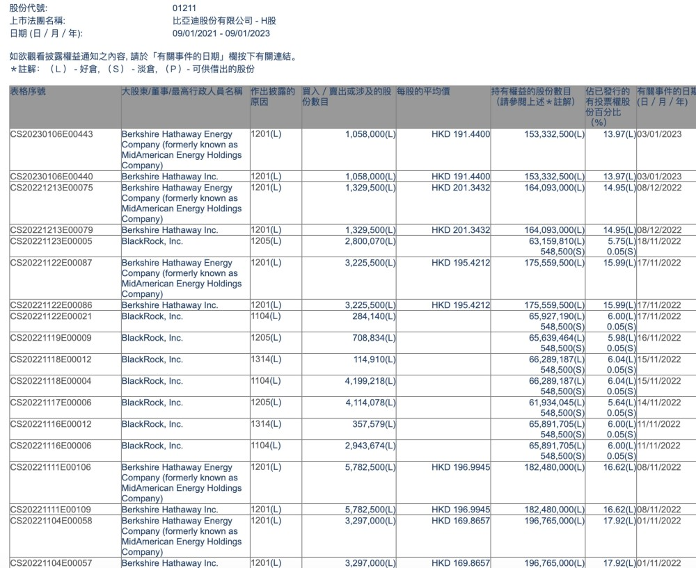

# 巴菲特再卖比亚迪，“股神”半年内套现约150亿港元

“股神”巴菲特投资比亚迪（002594.SZ，01211.HK）的成功早已传为佳话，14年时间实现了超过30倍的收益。

不过，过去两个多月港股反弹近7000点，巴菲特却继续套现比亚迪。

港交所权益披露信息显示，短短半年的时间内，巴菲特已经累计减持比亚迪超过7000万股，套现大约150亿港元。

在第一财经记者采访的市场人士看来，新能源板块估值过高，随着产品降价潮到来，竞争越来越激烈，再加上海外央行加息，这些高估值板块调整的压力加大；另一方面，电动车产业链在2022年上半年的融资高潮已经过去，相关企业也没有动力支撑股价。

**半年套现150亿港元**

港交所权益披露资料显示，巴菲特旗下的伯克希尔·哈撒韦于2023年1月3日以均价191.44港元再度减持105.8万股之后，持股已经降低到剩下1.533亿股，对比亚迪H股持股比例降低到13.97%。

相比2022年7月开始套现前持有的2.25亿股，过去不到半年的时间内，巴菲特已经减持了7170万股，持仓已经降低超过三成。如果按减持平均价大约200多港元保守计算，巴菲特套现金额大约是150亿港元。

早在比亚迪2.25亿股于2022年7月11日被转仓到花旗银行名下，当时市场人士就已经开始猜测巴菲特即将开始减持比亚迪。2022年8月24日港交所权益披露信息首次显示了伯克希尔开始减持比亚迪，当天以277港元减持133.1万股，持仓降低到2.188亿股，对H股持股比例变更为19.92%。考虑到变动每过一个整数百分点才需要披露减持操作，巴菲特开始减持的时间其实比8月24日更早。

不过巴菲特的大幅度减持并未动摇国内部分明星机构对比亚迪的持股信心。比亚迪2022年三季报显示，知名基金经理邓晓峰管理的“上海高毅资产管理合伙企业（有限合伙）——高毅晓峰2号致信基金”进入前十名股东名单，持有754万股，占总股本0.33%，其余多家公募基金也有大量产品继续增持比亚迪。

虽然恒生指数大幅反弹超过40%，但比亚迪较低点161.7港元累计反弹大约只有25%，1月9日报收201.4港元。第一财经记者梳理公开信息发现，比亚迪两次H股融资都是在市场正狂热的时候，两次增发价分别为225港元和276港元，目前比亚迪依然没有返回上述增发价。

一位高位套现了新能源产业链上游个股的私募人士向第一财经记者表示，2022年6月的时候多家电动车产业链企业密集融资（比亚迪这个阶段并没有股权融资），市场已经出现了热度过高，而主要融资项目完成后，这些企业已经没有什么动力稳住股价。基本面来看，产业链上中下游都走向成熟，未来受宏观经济环境影响将会不可避免。比亚迪的过去两次H股融资来看，其实行业正处于蓬勃发展期，股价反映了当时市场情绪的亢奋，能以较高的股价融资也是充分迎合了投资者追捧的心理。

2021年1月21日，比亚迪发布公告称配售1.33亿股H股，配售所得款项总额约300亿港元，此次配售H股每股配售价为225港元；2021年11月1日，比亚迪发布公告称，10月29日盘后，比亚迪成功完成5000万股新H股配售，配售价为每股276.0港元，此次138亿港币的H股闪电配售后，比亚迪2021年两次港股发行，合计募集资金约440亿港元。

**遭遇特斯拉降价挑战**

2023年随着主要竞争对手特斯拉大幅降价，比亚迪如何反击也成为了投资者的关注焦点。

继2022年10月24日降价后，新年伊始，特斯拉国产车型再次大幅降价，市场人士认为主要竞争对手之一的比亚迪将会受到一定影响，过去比亚迪产品涨价并未影响销量，未来则存在不确定因素。

1月6日，据特斯拉中国官网，特斯拉国产车型全系降价，其中Model 3起售价降为22.99万元，Model
Y起售价降为25.99万元，创下历史最低价格。特斯拉中国对外事务副总裁陶琳在微博上发帖称：“特斯拉的价格调整背后，涵盖了无数工程创新。坚持以成本定价，以实际行动响应国家号召，促进经济发展，释放消费潜力。”

1月7日第一财经记者在广州车展上看到，周六当天的人流情况远不如2021年11月的车展。记者跟多位参展销售人士交流得知，各大车企和销售机构尚未对特斯拉降价作出跟进降价的反应。此外，因为补贴和税收优惠在2022年底已经过去，部分消费者购车需求前置到2022年四季度，本届车展销售情况不如以往，一季度也不好预计。

玄甲基金CEO林佳义向第一财经记者表示，目前行业周期处于顶部，竞争激烈加速峰值到来，未来利润的下滑将导致量价齐跌，特斯拉行业竞争力依然比较强，将导致竞争对手订单的下滑。

2022年，比亚迪击败特斯拉夺回全球新能源汽车销冠，销量快报显示，2022年，比亚迪新能源乘用车销量为185.74万辆，其中纯电动车91.11万辆，插电混动车型94.62万辆。相比之下，特斯拉2022年全球销量则为131.39万辆。

特斯拉官宣降价前的1月5日，比亚迪却发布了全新高端汽车品牌“仰望”及其核心技术“易四方”，产品价格上百万元。

2022年多次产品涨价也并未影响比亚迪销量。国海证券分析师薛玉虎表示，2022年比亚迪超预期完成销量目标，将重点关注2023年“新品投放、产能扩张、高端品牌、海外市场、盈利优化”几大看点。虽然产品价格有所上涨，但一方面由于“锁单”推动消费者下订单，一方面由于比亚迪产品性价比仍然极具竞争力，因此产品依旧具有较强的竞争优势。目前，比亚迪新能源车足迹已遍布70多个国家和地区，伴随公司新能源乘用车出海计划的快速推进，海外市场有望成为销量提升的又一重要增长点。

