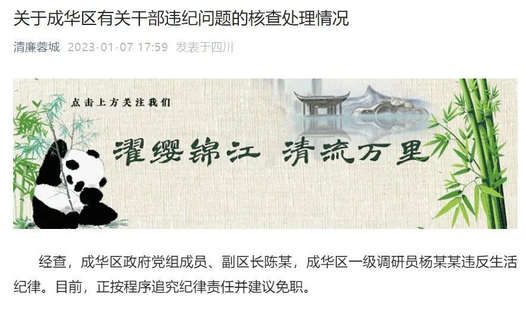
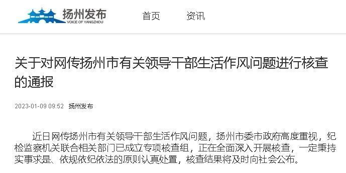

# 成都副区长违反生活纪律被处理，官员私生活不全是“私事”

最近几天，某些地方官员的生活作风问题，意外成为舆论关注的焦点。1月7日，此前网传的“不雅聊天记录”事件有了后续，当天，成都市纪委监委发布了《关于成华区有关干部违纪问题的核查处理情况》：经查，成华区政府党组成员、副区长陈某，成华区一级调研员杨某某违反生活纪律。目前，正按程序追究纪律责任并建议免职。成都市成华区人民政府网站1月8日前后更新显示，成都市成华区人民政府党组成员、副区长陈枢的简历已被撤下。此外，1月9日，江苏扬州就网传当地有关领导干部生活作风问题发布通报，称已成立专项核查组，正在全面深入开展核查。

这一前一后两起涉及领导干部生活作风的事件，一起已经“实锤”违纪，另一起则尚待调查，而其引发公众关注的由头，都是网上流传的“小道消息”。在判断官员是否存在违纪情节时，聊天记录、微信截图之类的“小道消息”，无疑不足以成为直接证据。但是，“小道消息”提示出的违纪线索，却应得到有关部门的充分重视。

在此类案件中，如果“小道消息”中的违纪情节确有其事，有关部门当然要依法依纪严格处理，以肃风气、以正视听。文章开头提到的陈枢违纪案，就是一起典型案例。反过来讲，如果网上的消息只是捕风捉影，甚至恶意造谣，有关部门也应及时澄清事实、追溯谣言来历，还当事干部一个清白。总而言之，此类消息一旦涉及官员，不论是真是假，都应受到严肃对待。

多数情况下，这种真伪莫辨、涉及生活作风的网络传言，往往被视为庸俗、低劣的存在，不值得认真看待。毕竟，在理想的社会风气中，舆论要严守边界，不能过度“窥私”，普通人也不该对别人的私生活有过多兴趣。然而，在这两起事件中，当事人不仅在党政机关担任公职，还是手握不小权力的领导干部。他们既有遵守党纪国法、在道德上以身作则的义务，也更有责任接受舆论的关注与质问。

官员在职场内或职场外的私生活，也不能简单等同于普通人的“私事”。有时，网民对官员私生活的关注，角度可能有些跑偏。但是，即便存在这种情况，受到指控的官员也应直面质疑、积极配合组织调查，使真相尽早大白于世。

_图片来源：视觉中国_

官员的生活作风受到党纪政纪的约束，他们遵守生活纪律的情况，也是其品行操守的间接体现。他们的具体行为，不仅反映着他们是怎样的人，也与他们能否用好手中权力息息相关。

不论古今中外，公众对于掌握权力的人，总是有更高的道德要求，这种现象背后，是一则久经验证的社会规律。一个人的私德与公德，虽然是两码事，但却具有强相关性。一个不能在私人领域约束好自己的人，很难让人对其有充分的信任。此前，许多落马官员的违纪违法情节都告诉我们：一个官员如果在“小事”上不能约束好自己，很容易发生思想滑坡，一路违法破纪，最终铸成大错。

撰文/杨鑫宇

编辑/白毅鹏

**中国青年报·中国青年网出品**

