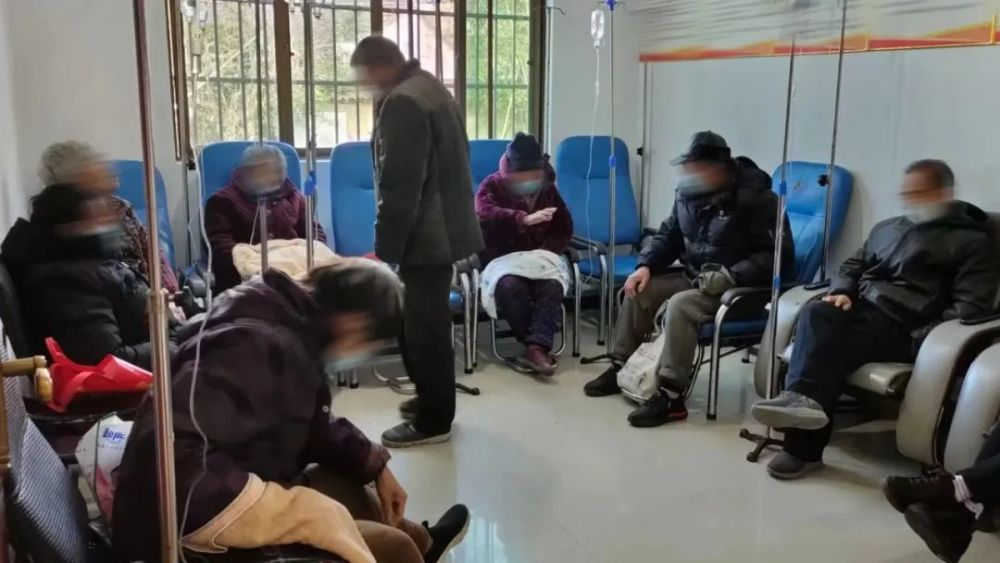
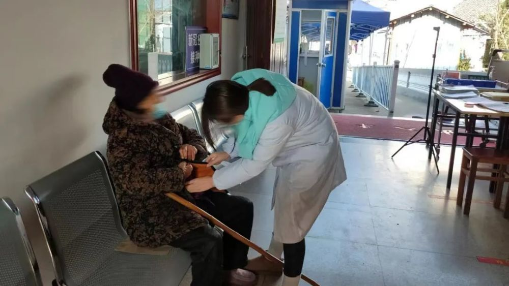
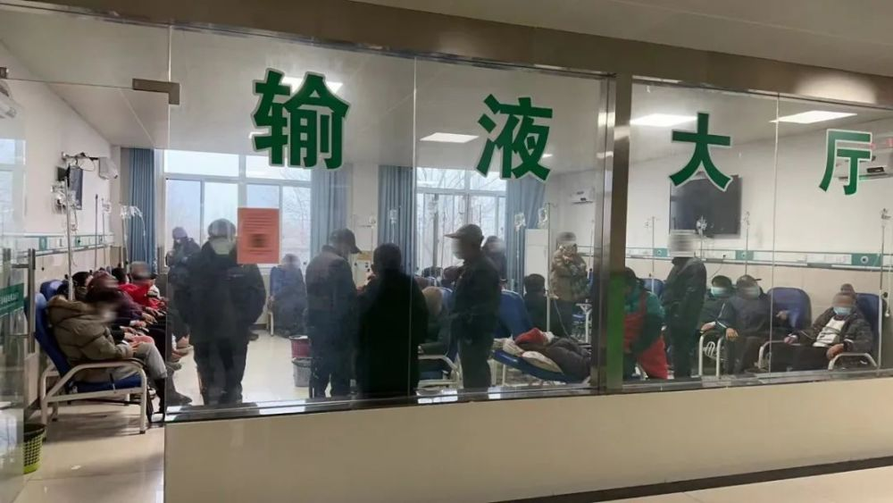
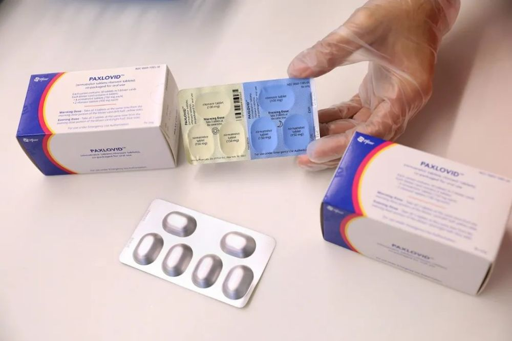

# 把新冠当成普通肺炎治，乡镇医院在沉默中过峰

作者：Acca

“最近十天，咱们县的感染潮正在过峰。之前看病的总是一老一小，现在儿童量明显下降，65
岁以上的老年人数量明显增多，刚才我从急诊过来，七八成的患者都是老年人。”江苏省某县医院医生印栋梁谈到这个变化，隐约中，他感受到重症潮已经出现势头。

老年患者量之所以增加，印栋梁估计跟返乡潮脱不开干系。老年人多是不愿意来医院的。现在来就诊的，一部分是返乡人员带家里老人看病的，一部分是已经在下面医院治疗但效果不好的。

回忆起门诊高峰，印栋梁坦言比想象中要好一些，重症情况也比预料平稳一些。处在县医院这一层，他自然而然想到这些患者被更基层的医疗机构“分流”。

这些天，身边总有声音谈论“抗病毒 + 抗生素 + 激素 +
退烧药”输液四件套，认为乡村医生靠治肺炎的乱拳打死老师傅。他对此难以简单地评价，但知道方案肯定有不科学的地方。

**面对疫情过峰，农村和乡镇的医疗机构以自己的方式接受考验。愈来愈多的老年人涌入基层医疗机构接受治疗，患者拥挤在输液大厅吊水、医院没有抗病毒药物、危重症病人转诊遇难的场景每天都在上演。**

看淡生死的农村里，有老人不知道“新冠”

江苏某卫生院医生李昀遇到的感染潮更迟一些。20 号开始发热病人开始增多，每天都有将近 150 位患者来看病，比过往增长了 5 倍。

“来卫生院的八成以上都是老人，但大部分是轻症，患者症状主要是发热、咳嗽、胃部不适、咽痛等等，严重的患者已经打 120
送到上级医院去，卫生院只遇到一两例严重的老年人，建议他们转到上级医院。”乡里老人大概在三千人左右，这几天已经有将近两三百位老人来到卫生院就诊。

李昀坦言，来到卫生院的老人应当只是少数，甚至一些老人没去过医院，在家里没能熬过这个冬天。
**“这里的人看淡了生老病死，不少老人靠身体在扛，实在受不了才来医院。”**

_图源：医生提供_

李昀所在的卫生院对老人几乎不谈“新冠病毒”。 **大部分老年人的主诉是不想吃饭，肠胃不舒服，连发烧也不会告诉李昀，自己更不会谈“阳”不“阳”的。**
李昀也不会告诉患者是否是新冠：一方面医院人手不足，医生也没时间指导老人使用抗原检测新冠，一般通过血象和拍片来判断肺部感染情况；另一方面，告诉患者新冠反而会把老人吓得不轻。

“我们这里很多老年人把新冠看成‘妖魔鬼怪’。”过去几年，乡里为了让老人意识到新冠的传染性，难免夸大新冠的影响，现在一下子让老人转变观念有些困难。李昀多是告诉这些老年人得了感冒，发热，或者是流感，气管炎，肺炎等等。

“跟患者不谈新冠，判断不查抗原”是部分基层医院的常态，但不同地区遇到的情况不同。

“我们这里忌讳谈‘新冠’。”山东某村卫生室医生孔凌聊到， **“在村子里得新冠是‘没面子’的事，马上也都传开了，大家也都离那个患者远远的。”**

孔凌这里就记阴历。他记得，阴历十一月二十三到十二月初二的那段时间是高峰，每天看病的都有将近 400
号人，基本上都是发热的症状。最忙的时候，孔凌忙到凌晨四点，休息了一个小时后早上六点又起床看病。他也不用抗原，因为手头根本没有。“和看病有关的东西都缺。”

安徽某县卫生院王京也遇到了抗原的暂时性缺货。但抗原补充后，实际中使用的也不多。
**“群众不愿意做，依从性不好。患者自述有症状了，再测抗原阳性与否无所谓，治疗也是按照感冒或者呼吸道感染治疗，没有什么实际意义，所以不愿意检测。”**
王京提到，他能做到的只是判断疑似新冠。

_图源：医生提供_

也有一些基层医生使用抗原检测。云南某县卫生院医生刘萍还是会用抗原检测发烧的病人，“主要是考虑用药治疗方面，还有对病人的预后有个了解。阳性的就要重点关注，有病情加重的话应该及时转院。患者知道自己的病情也可以提前防范。”

大多场景下，刘萍会问一嘴家里人是否有感染发烧或者阳性情况。在他这里，暂时还没有遇到老年人数量明显增多的情况，反倒是发热的中青年患者比较多。目前就诊的老年人多数由子女陪同，老人听孩子的话配合度也高；当地年轻人对新冠有些了解，家中会自行检测抗原，不少还会在就诊时主动要求。

十个病人，八个在输液大厅打“三素一汤”

吊水席卷了农村和乡镇的新冠战场。

孔凌所在的村卫生所不仅缺药，连输液用品都缺。“吊瓶，输液器，生理盐水，葡萄糖都缺。现在慢慢补上来了，但六号输液器还是很缺。”因为缺货，买药平台的价格也在飞涨，输液液体从
36 元涨到 90 元一箱只用了 2 天。

**他记得一天最多给 160 多名患者输液，兄弟诊所一天打三四百的也有，站不下人，竹竿、门框都是挂吊瓶的地方。**

“到处找关系弄，跑到三十多公里以外的地方去借！输液器，输液贴，只要是打听到有货的地方直接去抢，装车上以后再找老板算账。”孔凌聊到。

来看病的，发烧烧到 38.5℃ 以上的，孔凌就会给他们挂点滴，一般是萘普生和炎琥宁，或者是利巴韦林和维生素
C。低烧的患者就肌注安痛定用来退烧，布洛芬的库存只一天就没有了，孔凌就用安乃近。（注：安乃近片可能引起血液系统的严重不良反应，不作为首选用药，仅在病情急重且无其他有效药品治疗的情况下使用，禁用于
18 岁以下青少年儿童。）

江苏某卫生院医生李昀这边，看病的老人多数已经发热了三天，也有一些持续一周仍然发烧的情况。 **针对这些老年，尤其是 60
岁以上仍然有发热咳嗽的症状，李昀提供的治疗是经验治疗“三素一汤”：抗生素、维生素、激素再加上葡萄糖，症状稍重一点的以输液方式治疗，一般输液持续 3～5
天。**

“抗生素主要为头孢类抗菌药，激素主要是小剂量地塞米松，5mg
每天，如果是高烧患者则会额外配布洛芬、对乙酰氨基酚之类的的退烧药，另外使用一些有抗病毒效果的中成药。”李昀谈到。

这几天，打吊水的患者已经超过百人，数量上大概占当天门诊量的八成，输液大厅人满为患。“三素一汤”是治疗的基础，李昀也会综合考虑老年病人的既往用药史、基础疾病，结合目前症状、血象、胸片的肺部感染情况来加减用药。“肺部有小片状影的，或者肺纹理增多增粗的，我们会考虑加抗生素。”

_输液大厅人满为患
图源：医生提供_

药物使用是基层医院一直绕不开的话题。 **以抗生素为例，许多研究表明基层医生依靠经验使用抗生素，预防性使用抗生素的情况时有发生。** 2018
年一项单中心乡镇医院呼吸内科抗生素使用研究表示，输液使用抗生素主要是针对伴有高热的肺炎，但仍为经验性用药。另一项 2017
年山东村卫生室上呼吸道感染处方用药研究显示，抗菌药物的使用率呈下降趋势，但使用占比仍处于较高水平，且以广谱抗菌药物为主。

依据过往治疗感冒与肺炎的经验，李昀眼中的“三素一汤”实惠也有成效。“都是已经发烧两三天的老人，肺部细菌感染的情况是有，老年人也不像年轻人，凭自身去扛，肯定扛不了。
**打吊水一是便宜，医保后不过三四十块钱，二是见效快，三是我们也考虑到输液周期，会控制用小剂量激素，短期适当使用抗生素。** ”

老人对吊水的诉求也让李昀不得不选择输液。“老年人已经难受了几天，想要的不是开几盒药，劝也劝不了，经常投诉说医生态度不好。”
**李昀坦言，有医院在巡视时因为给患者打吊水受到罚款处罚，但没有办法只能继续。**

_图源：医生提供_

云南某县医院医生刘萍同样感受到患者侧给到的压力。尽管患者以中青年为主，但他们认为新冠是一种炎症，来医院的目的就是“消炎”，硬是要求医生输液，尤其得加上抗生素。

刘萍谈到，“我们有时会跟患者解释，这是病毒性感染，不是细菌性感染。如果没有细菌合并感染打再多的抗生素也没有什么用处，也会劝回去一些。”

尽管如此， **十个来看病的患者最后输液的就有八个，输液大厅挤不下的患者只能在门诊室打吊水。**
这些吊水基本都会添加抗生素和广谱抗病毒药物（利巴韦林）。刘萍主要依靠血常规和问诊来判断抗生素的使用。一般来说，遇到喉咙痛或水肿的患者都会考虑使用抗生素，刘萍也会参考血常规的白细胞、C
反应蛋白，和痰鸣音的情况来调整抗生素的使用。

在刘萍这里，由于平时就存在病毒性感冒情况，这类抗病毒、抗生素等药物先前就有储备，没有出现像发烧药一样的紧急缺货情况。

但是，卫生院并没有像阿兹夫定抗病毒类药物，许多医生也就只能使用广谱抗病毒药物，按照上呼吸道感染的方式去治。

刘萍不是没有关注过抗病毒药物。二十天前，他就在平台申请了抗病毒药物，但一直没有配送。李昀则没想过进新冠抗病毒药物。“老年人口袋里没多少钱。
**不夸张的讲，我们这边 65 岁以上的患者可能一时间凑不到一百元，也用不起这类药物。** 哪怕药物进来，也不可能去使用的。”

等不到“配额”，基层医生向患者买药

越从基层往上走，抗病毒药物短缺问题更复杂。

部分一线城市的社区医院、县级医院已经采购进阿兹夫定、Paxlovid（奈玛特韦/利托那韦，下文将简称为 P
药）等抗病毒药物，并对药物有严格的开设限制，如要求专家会诊后才可以开具 P 药。

根据上海发布，抗病毒药物（小分子药物）已经优先向上海的社区倾斜匹配，多家社区卫生服务中心已经配备 P 药。上海某社区医生常松表示，需要符合 65
岁以上，有基础病，且有发展重症趋势等标准，应用条件上则需要由家庭医生评估后提交会诊申请，并由专家会诊后才可以开具。

_图源：视觉中国_

河北省某县医院医生章强也提到，十多天前抗病毒药物缺货的情况已经缓解。目前，奈玛特韦需提供病例、相关辅助检查交由院方专家组审核决定，仅给予有可能进展为重症及重症患者使用。

**但对许多基层医疗机构来说，省内的抗病毒药物优先满足三级医院的需求，他们还在等待抗病毒药物的路上。**

河北某基层医院医生骆子涵提到，阿兹夫定上周还有货，反倒是最近断货一个礼拜，而 P
药一直进不来。“当时阿兹夫定进货了五百盒，两个礼拜就差不多用完了。附近的县医院也缺货，患者托人到我们医院来买也买不到。”

目前，骆子涵所在医院收治的普通型病人就有 40 个左右，阿兹夫定的药物缺口也比较大。没有办法，医院只能让患者自己想办法购买药物，院内指导使用抗病毒药物。
**骆子涵提到，有一位患者有囤药的习惯，恰好他自己只有轻微的咳嗽，院长便从患者那里买了三盒阿兹夫定，再卖给住院的重症患者。** “三盒药物也就维持三位患者
7 天的使用量。最后经过评估，刚好有三位患者还没有发展到危重症的重症患者，把药给了他们。”

东部沿海某县医院院长赵一鸣了解的情况是，当地三甲医院已经购入 P
药，但目前县医院仍没有药物，仍在积极争取。阿兹夫定之前也存在短暂性缺货的情况，但在十天前得到了缓解。

赵一鸣解释，目前的抗病毒药物以政府调控为主。
**“由相关部门牵头，向上争取药物分配到各个区域，分配标准比如说按照区域内三级医院的分布数量下放，不同医院有药品的配额。实际操作过程中，由于药物紧张，尽管医院理论上有配额，药物会优先满足有需要的医院。”**

政府调配能解决燃眉之急，但也无法立刻填补需求空缺。赵一鸣回忆起阿兹夫定的补货情况时，坦言当时第一批药物给到了医务人员，“当时院内确定有肺炎的医务就有百来例，阿兹夫定基本上属于刚到就用完的情况。”

当医药公司缓解药品生产压力后，院方会跟配送公司合作，维持抗病毒药物的供应。“医药公司平时合作主要有配送公司和厂家直供两种模式。目前主要跟两家配送公司合作，由他们统一和生产厂家进行对接。如果医院库存小于
200 就会联系配送公司送货，目前库存有千余盒。”

治疗方案被资源制约

如何让患者在基层接受合适的治疗引起重视。

近来，多家医院发布基层诊疗方案，对基层诊断、评估分类、转诊、治疗给到建议。协和新冠基层诊疗方案提到，对发热和呼吸道感染症状的居民、社区 65
岁及以上的老年人等人群建议使用抗原及核酸检测，出现氧饱和度 ≤93%、高热患者 ＞5 天等情况的患者建议立即转诊。
**同时，在用药上，不建议基层医生独立启动激素治疗，不提倡常规使用抗生素。**

**没有明确细菌感染诊断，并不适合直接辅以抗菌治疗，这个结论从新冠治疗指南中同样可以得出。**
《奥密克戎变异株所致重症新型冠状病毒感染临床救治专家推荐意见》明确指出：早期若无合并细菌感染证据，可不使用抗菌治疗。

国家传染病医学中心主任、复旦大学附属华山医院感染科主任张文宏教授提到，如果新冠病毒感染患者在“黄金 72
小时”之内，抗病毒药物一定要先用上。同时，他提到抗病毒治疗加上合理的激素治疗，72 小时内大多数病人的症状都能缓解。

**有效治疗应该扎根于科学的方案，但科学方案的落地需要有医疗资源的配套支持。**

孔凌所在的村卫生所，检查设备仅有体温表，血压表和听诊器。“凭我们个人的经验去判断患者的临床症状。”而在卫生院工作的李昀表示，他也清楚抗生素使用需要做药敏，但是卫生院实在没条件。

目前，不同地区对基层资源保障做出尝试。以上海为例，新冠抗病毒药物下沉社区，并在上海市、区专家组指导下干预使用。同时，通过专家下沉带教查房、线上查房等形式，提升社区病房救治能力。[9]江苏某卫生院医生李昀谈到最近正在补充物资。“指压式血氧仪已经配备，氧疗区域也在扩大，这几天每天都在培训，重点是重症病人的识别抢救。抗病毒药物目前依然是中成药。”

_村卫生所医生正在为患者开药 图源：视觉中国_

村镇缺药缺设备，县城缺的还有床位。骆子涵在一个礼拜前已经提前感受到重症高峰的过境：近 50 张床位全满，门诊还有大概 50
多个住不进来只能在门诊治疗的患者。他最近接收到一位血氧只有 86 的重症患者，本该转诊到上级医院，但三甲医院已经饱和。

骆子涵很心痛，他们医院只能提供对症支持，“
**村卫生室和卫生院都不敢收治这类病人，不给输液，只给开口服药。这类重型患者本应该给到呼吸机辅助呼吸，而且是否插管上呼吸机还是要看血气分析，我们这里也做不了。**
现在只能建议患者家属自己想办法去大医院。”他所在的医院，上个礼拜前才刚进了一台二手的无创呼吸机。

赵一鸣所在的医院正按照 4%
的总数扩建床位，但扩建的速度赶不上疫情过峰的速度，医院只好将除了儿科妇产科的其他科室都用来收治病人，由副高以上的医生组成医疗总值班把控住院名额，一边收治病人一边扩建床位。

面对即将到来的重症高峰，赵一鸣有些担心，“如果后面再多出来太多病人，肯定不够用。这不是哪一个医院的问题。”

药物紧缺也带来了麻烦。骆子涵提到因为之前缺少抗凝药物而导致肺衰塞患者病情恶化的。“尤其是前两天看到缺乏抗病毒药物保驾护航的激素治疗会使病情加重的观点，我们更担心了，现在对患者的复查更密切，但没有其他的办法。”

**现实条件制约下的治疗方式可能产生效果，但并不值得庆幸。**
在骆子涵、赵一鸣所处的医院，也接收过已经在卫生院输液好几天仍没有好转的老人，尽管数量不多，但都情况严重。“有几例患者的情况很复杂。好的是肺部没有出现感染灶，没有成为新冠肺炎，坏的是病情也很重。考虑到可能已经在其他地方应用了足疗程的抗生素，我们暂时没有给抗生素，过
3 天再复查下血，看看细菌相关的指标有没有变化。”骆子涵感慨。

**“在基层看病，不存在奇迹。** ”

策划：Acca｜监制：gyouza

文中 孔凌、李昀、刘萍、王京、骆子涵、印栋梁、赵一鸣、章强、常松 均系化名

题图来源：医生提供

