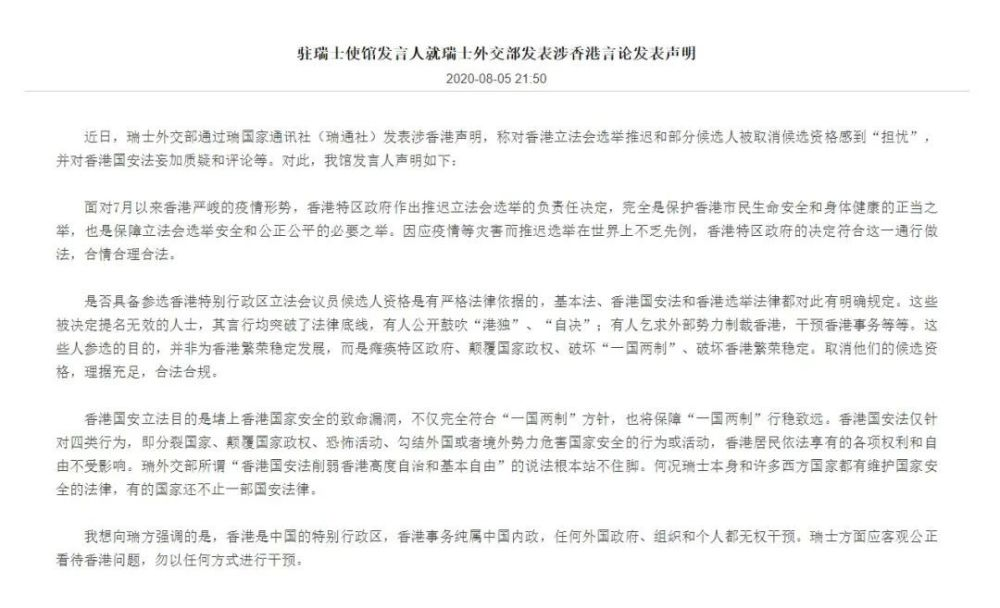
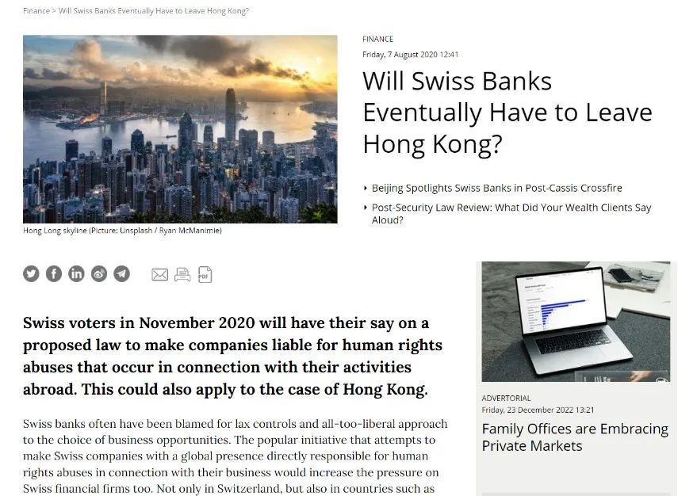
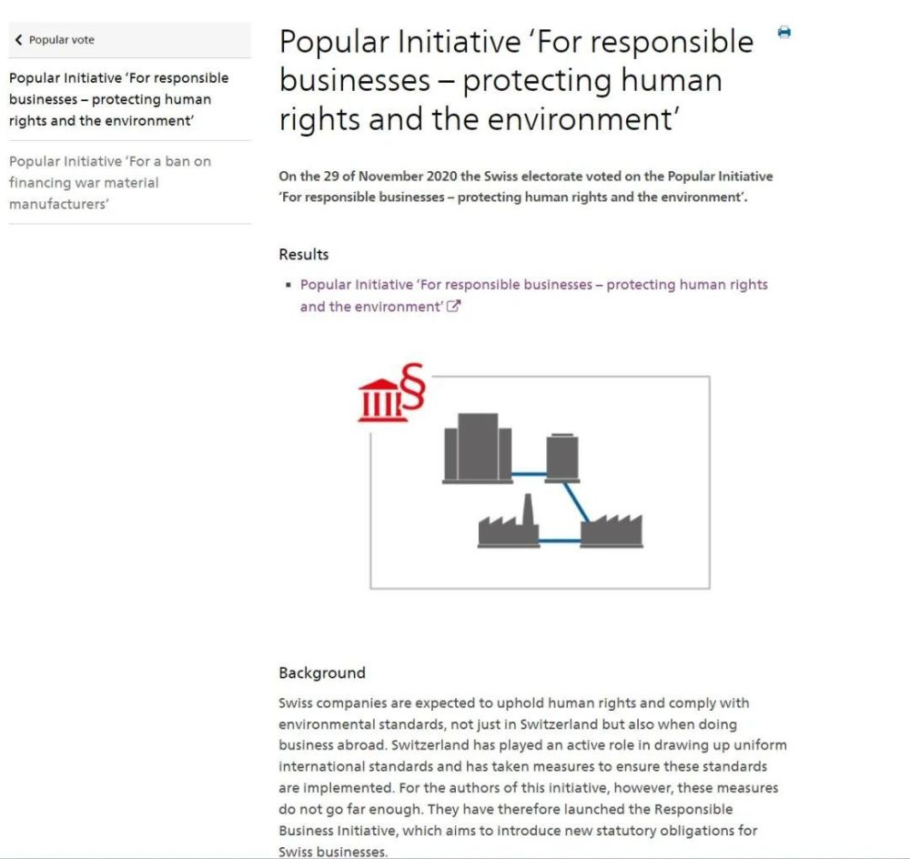
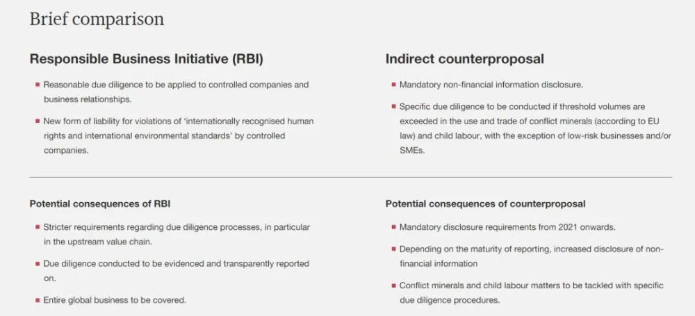
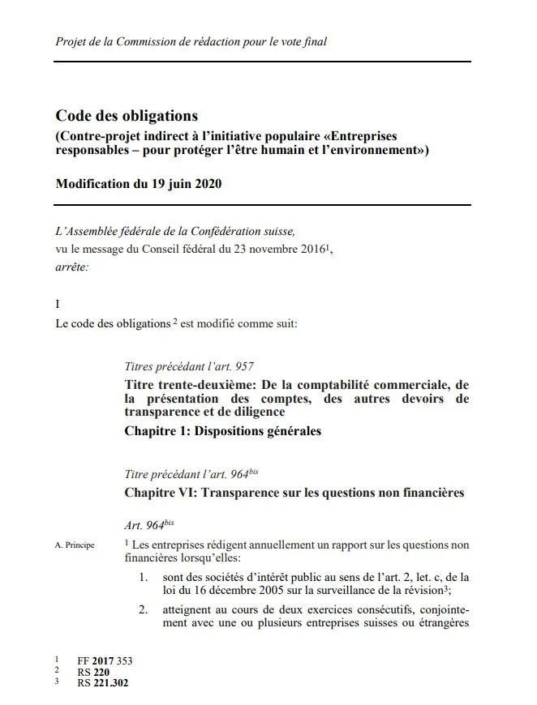

# 明查｜瑞士要冻结100名中国人在瑞士的7.8万亿元存款？

**速览**

瑞士金融网站finews.com于2020年8月发布文章将卡西斯采访与瑞士一项公投相联系，并表示该公投有可能影响瑞士银行在香港的发展。这项公投最终未能通过，且瑞士政府始终反对该提案，公投结果并没有显示出与“冻结存款”的直接关系。

100名中国人在瑞士有7.8万亿元资产的数据可能出自瑞银集团（UBS）联合普华永道发布的《2018年亿万富翁报告》，该报告称，截至2017年中国共有373名亿万富豪，他们拥有1.12万亿美元（当时折合人民币约7.8万亿元）的资产。而这份报告数据所指的也并非他们在瑞士银行的储蓄额。

**事件背景**

近日，推特有网友发布图片称，“瑞士外交部长凯西斯（卡西斯）表示：若中国坚持香港国安法，则将冻结100位中国人在瑞士存款7.8兆人民币，平均每人780亿人民币，还不包括保险箱里的黄金钻石。”该推文获得3000余点赞，近800转发。

**明查**

2020年6月30日，《中华人民共和国香港特别行政区维护国家安全法》经十三届全国人大常委会第二十次会议审议通过，并列入《中华人民共和国香港特别行政区基本法》附件三在香港特别行政区公布实施。围绕这一时间点并结合“瑞士外交部长”“香港国安法”等关键词在谷歌检索，相关说法可追溯至2020年8月1日来自瑞士周日报纸SonntagsBlick的报道。瑞士外交部长伊尼亚齐奥·卡西斯接受专访时表示，在与中国建交的70年中，法治和人权一直是对话的一部分，“瑞士必须更加有力地捍卫自身利益和价值观，例如加强国际法和多边体系。”同时，卡西斯在采访中宣称，“中国已经放弃了‘一国两制’方针，这会影响到很多在香港的瑞士公司。如果中国坚持‘新路线’，西方世界将做出更果断的反应。”

_SonntagsBlick
2020年8月对瑞士外交部长专访报道截图_

不过，原报道中并没有谈及冻结中国人存款一事。此外，瑞士《新苏黎世报》在同一日的报道中采访了瑞士联邦议会国民院议员罗兰·比歇尔，他表示，联邦委员会没有就此举行会议，因而卡西斯此番言论并没有联邦委员会给予的官方依据。

2020年8月5日，中华人民共和国驻瑞士联邦大使馆发表声明，回应了瑞士外交部“对香港国安法妄加质疑和评论”的行为，“香港国安立法目的是堵上香港国家安全的致命漏洞，不仅完全符合‘一国两制’方针，也将保障‘一国两制’行稳致远。香港国安法仅针对四类行为，即分裂国家、颠覆国家政权、恐怖活动、勾结外国或者境外势力危害国家安全的行为或活动，香港居民依法享有的各项权利和自由不受影响。”

_2020年驻瑞士使馆发言人就瑞士外交部发表涉香港言论发表声明截图_

**那么“卡西斯声称要冻结中国人存款”的说法又从何而来呢？**

进一步结合“瑞士银行”“存款”等关键词交叉检索，瑞士金融网站finews曾于2020年8月7日发表过相关文章，该文将卡西斯对香港国安法的评论与瑞士将于2020年11月举行公投的一项拟议法律相联系，表示“该法律规定公司将对其海外公司侵犯人权的行为负责，这也适用于香港的情况，如果民众公投赞成该法律，瑞士银行将重新检视他们在香港的运作”。根据该文说法，瑞士外交部长对香港局势的质疑已经显示出了“瑞士银行在中国发展战略”这一问题的敏感性，由于香港国安法规定银行不能与违反国安法的对象合作，瑞士这项拟议法律有可能会与香港国安法冲突。

而同一时段，则可核查到有多家中文网站将finews所述公投引向“冻结中国人资产”，还有自媒体声称该公投意味着瑞士银行将“不能与侵犯人权的对象合作”。

finews相关文章并未提及“冻结存款”，但是联结了卡西斯的言论、瑞士公投以及瑞士银行和金融业，并强调了该公投对香港可能产生影响。

**但这项公投是否真能造成网传后果？**

在瑞士政府官网核查，其公投档案中确实存在一项主旨为“瑞士的海外企业应维护人权”的提案，全称为“负责任的企业——保护人权和环境（For responsible
businesses - protecting human rights and the
environment）”，简称RBI。公投结果显示尽管普选赞成票多于反对票，为50.7%对49.3%，但由于州选票中反对票（14.5）比赞成票（8.5）多6票，该提案最终未能通过。

_瑞士联邦政府官网中RBI公投截图_

_瑞士德语广播网站SRF关于RBI的投票结果截图_

从时间上来看，RBI是由瑞士民间社会组织于2015年发起的倡议，旨在引入有效法律框架，让总部在瑞士的跨国公司为其（包括子公司、供应商以及业务合作伙伴）在海外犯下的侵犯人权和环境的行为负责，如果有海外合作方侵犯人权，该公司可在瑞士被直接起诉。该提案于2020年6月就确定了公投时间为2020年11月29日，与香港国安法并无直接联系。

从法案内容来说，根据瑞士国家广播电视集团旗下Swissinfo的报道，企业人士和民众对RBI的态度分歧主要存在于“实现方法”，因为RBI对企业监控其供应商和合作伙伴的力度要求极高，很容易影响企业对外经济活动。

瑞士政府始终反对该提案，并就此提出了“间接反提案（Indirect
counterproposal）”，作为RBI被否决后的施行法案。普华永道（PwC）曾对两项方案做过对比报告，相比于RBI，政府方案要求瑞士企业对其人权和环境的营运是否符合标准进行申报，并进行强制性的非财务信息公开，而企业只有在其涉及人权和环境的项目未经申报或申报出现问题时，才需要承担刑事责任。可以说“间接反提案”在法律执行层面留有余地且更温和，如果对可能出现的问题已经进行申报，则企业不会被起诉。

_普华永道对比报告摘要截图_

而瑞士政府公开的“间接反提案义务守则”中，主要强调了涉及矿石和金属的企业申报要求，并没有突出金融业或银行应做出的具体调整。因此该公投结果很难直接引申出“瑞士将冻结中国人财产”。

_瑞士政府公开的“间接反提案义务守则”截图_

**100名中国人平均每人在瑞士存款780亿人民币？**

这一说法曾多次以不同形式流传于中文网络中，2022年8月，“福建辟谣”官方账号曾对此进行核查。

2018年10月，总部位于瑞士苏黎世的瑞银集团（UBS）联合普华永道发布的《2018年亿万富翁报告》显示，2017年全球亿万富翁总财富增长19%，至8.9万亿美元。截至2017年的数据，中国共有373名亿万富豪。这些富豪们大多来自科技以及零售行业，并拥有1.12万亿美元的资产（当时折合人民币约7.8万亿元）。

2022年1月，“澎湃明查”的报道《明查｜瑞银公布中国贪官存款，遭警告“谨慎公开客户财政信息”？》就涉及瑞银集团这一报告。核查结果表明，该报告使用的分析数据来自包括“转变中的家族商业”（Transforming
family businesses）、“普华永道下一代研究2017”（PwC Next Gen Study
2017）、“第21届年度全球CEO调查”（21th Annual Global CEO Survey）等出版物，普华永道内部数据库，MSCI
AC世界指数，以及世界银行全球经济展望（Global Economic
Prospects）等数据库。这说明780亿元的数据所指并非瑞士银行储蓄额，网传说法系谣传。

综上所述，网传说法可能源自2020年8月瑞士媒体SonntagsBlick对瑞士外交部长卡西斯的采访，但原报道中仅涵盖卡西斯对香港国安法的评论，并不涉及“冻结存款”。瑞士金融网站finews.com于2020年8月发布文章将卡西斯采访与瑞士一项公投相联系，并表示该公投有可能影响瑞士银行在香港的发展。但这项公投最终未能通过，且瑞士政府始终反对该提案，公投结果并没有与“冻结存款”的直接关系。100名中国人在瑞士有7.8万亿元资产的数据可能出自瑞银集团（UBS）联合普华永道发布的《2018年亿万富翁报告》，该报告称，截至2017年中国共有373名亿万富豪，他们拥有1.12万亿美元（当时折合人民币约7.8万亿元）的资产。而这份报告数据所指的也并非他们在瑞士银行的储蓄额。

